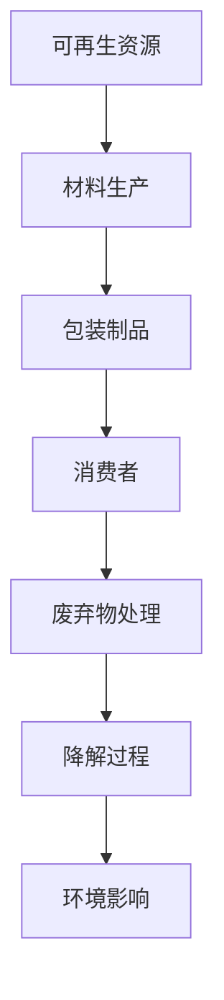
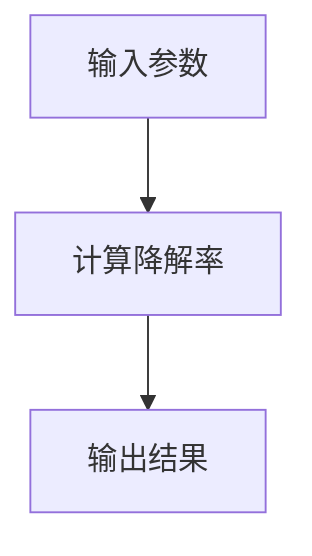
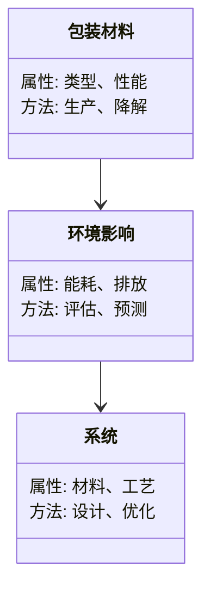
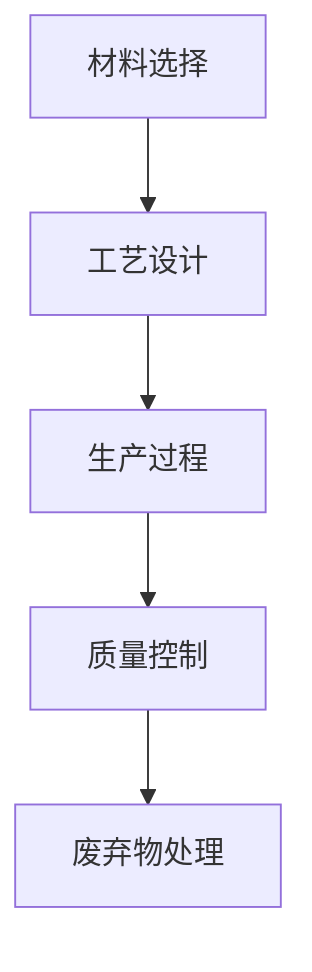
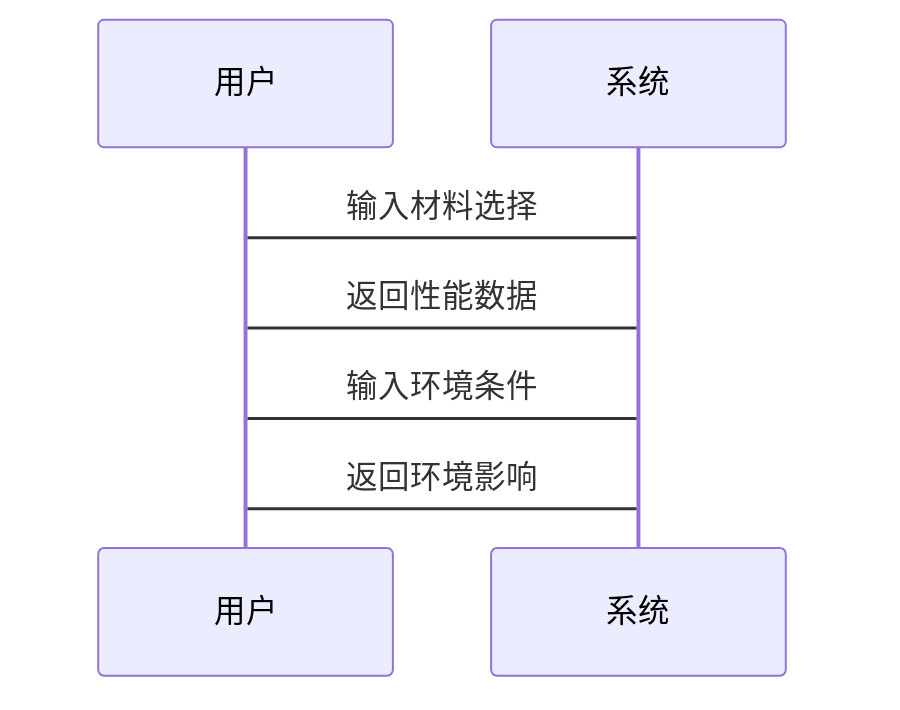

                 


---

# 价值投资中的新一代生物可降解包装技术

> **关键词**：生物可降解包装技术、价值投资、可持续发展、环境影响评估、包装材料创新

> **摘要**：  
生物可降解包装技术作为一种环保型包装解决方案，正在成为全球可持续发展的重要组成部分。本文从价值投资的角度，详细探讨了生物可降解包装技术的核心概念、技术原理、系统设计、实际应用以及未来发展趋势。通过分析其环境、经济和社会效益，为投资者提供了在环保包装领域的投资决策参考。本文结合技术细节与商业价值，为读者展示了这一领域的广阔前景。

---

## 第1章: 生物可降解包装技术的背景与现状

### 1.1 生物可降解包装技术的定义与特点

#### 1.1.1 生物可降解材料的基本概念
生物可降解材料是指在自然环境中，通过微生物作用（如细菌、真菌等）能够分解为二氧化碳和水等简单无机物的材料。与传统塑料不同，这些材料通常来源于可再生资源，如淀粉、纤维素、甲壳质等。

#### 1.1.2 生物可降解包装技术的核心特点
1. **环境友好**：降解过程对环境无害，减少白色污染。
2. **可再生性**：原材料来源广泛，如农作物废弃物。
3. **降解周期短**：在堆肥条件下，可在几个月内完全降解。
4. **功能性**：具备良好的物理和化学性能，满足包装需求。

#### 1.1.3 生物可降解包装技术的环境意义
通过减少塑料垃圾的产生，降低对土壤、水源和空气的污染，推动全球可持续发展目标的实现。

### 1.2 价值投资与可持续发展的关系

#### 1.2.1 价值投资的基本概念
价值投资是一种长期投资策略，通过分析企业的基本面（如财务状况、市场地位、盈利能力等）来寻找被市场低估的投资机会。

#### 1.2.2 可持续发展与价值投资的结合
随着环保意识的增强，投资者越来越关注企业的社会责任和环境表现。生物可降解包装技术作为环保包装解决方案，符合可持续发展的趋势，为企业带来竞争优势。

#### 1.2.3 生物可降解包装技术在价值投资中的应用前景
在包装行业，采用生物可降解材料的企业可能在市场中占据领先地位，吸引消费者和政策支持，从而提升企业价值。

### 1.3 生物可降解包装技术的市场现状

#### 1.3.1 全球生物可降解包装市场的规模与增长
近年来，全球生物可降解包装市场规模持续增长，预计未来几年将保持较高增速，主要驱动因素包括政策支持、环保需求和技术创新。

#### 1.3.2 主要国家与地区的市场发展情况
欧洲和北美地区是生物可降解包装的主要市场，中国、印度等亚洲国家也在快速发展。

#### 1.3.3 行业内的主要企业与竞争格局
行业内主要企业包括 BASF、陶氏化学、NatureWorks 等，竞争主要集中在技术、成本和市场份额方面。

### 1.4 本章小结
本章介绍了生物可降解包装技术的定义、特点及其在价值投资中的重要性，分析了当前市场的发展情况，为后续章节奠定了基础。

---

## 第2章: 生物可降解包装技术的核心概念与联系

### 2.1 核心概念与原理

#### 2.1.1 生物可降解材料的化学组成与降解机制
生物可降解材料通常由可再生资源制成，降解过程依赖于微生物的代谢作用。例如，聚乳酸（PLA）是一种常见的生物可降解材料，其降解过程如下：
1. **微生物吸附**：微生物吸附材料表面。
2. **酶催化分解**：酶将材料分解为小分子。
3. **代谢利用**：微生物利用这些小分子作为能量来源。

#### 2.1.2 包装技术的创新与优化
现代包装技术注重材料的多功能性，如防潮、防氧化等。生物可降解包装技术通过优化材料配方和结构设计，实现高性能与环保的双重目标。

#### 2.1.3 生物可降解材料的生命周期分析
生命周期分析（LCA）是评估材料环境影响的重要方法。以下是生物可降解材料的生命周期示例：
1. **原材料获取**：从可再生资源中提取原材料。
2. **材料生产**：通过生物发酵或化学合成制备材料。
3. **产品使用**：作为包装材料使用。
4. **废弃物处理**：堆肥降解，回归自然。

#### 2.1.4 实体关系图与流程图


### 2.2 核心概念的对比分析

#### 2.2.1 不同类型包装材料的性能对比
以下是对常见包装材料的性能对比：
| 材料类型       | 生物可降解性 | 强度 | 成本 | 环境影响 |
|----------------|--------------|------|------|----------|
| 聚乙烯（PE）    | 低           | 高   | 低   | 高       |
| 聚丙烯（PP）    | 低           | 高   | 中   | 高       |
| 聚乳酸（PLA）   | 高           | 中   | 高   | 低       |
| 淀粉基材料      | 高           | 低   | 低   | 低       |

#### 2.2.2 生物可降解材料与传统塑料的对比
- **优点**：环境友好，可降解，资源消耗少。
- **缺点**：成本较高，性能有限，降解条件依赖。

#### 2.2.3 生物可降解材料的环境影响评估
环境影响评估通常包括能源消耗、温室气体排放、水资源消耗等指标。以下是一个简单的环境影响对比：
| 指标         | 生物可降解材料 | 传统塑料 |
|--------------|----------------|-----------|
| 能耗（MJ/kg） | 2.5            | 3.0       |
| CO2排放（g/kg）| 1.2            | 2.0       |
| 水资源消耗（L/kg）| 5.0          | 7.0       |

### 2.3 本章小结
本章深入分析了生物可降解包装技术的核心概念及其与传统包装材料的对比，为后续的技术分析奠定了基础。

---

## 第3章: 生物可降解包装技术的算法原理与数学模型

### 3.1 算法原理

#### 3.1.1 环境影响评估模型
环境影响评估模型用于预测材料在整个生命周期中的环境影响。以下是模型的步骤：
1. **数据收集**：收集材料生产、使用和处理过程中的数据。
2. **模型构建**：建立数学模型，量化环境影响。
3. **结果分析**：评估不同阶段的环境影响。

#### 3.1.2 生物降解预测模型
生物降解预测模型基于材料的化学结构和环境条件，预测其降解速率。以下是模型的流程：
1. **输入参数**：材料类型、环境条件。
2. **降解计算**：计算降解率。
3. **输出结果**：预测降解时间。

#### 3.1.3 算法流程图


#### 3.1.4 Python代码实现
```python
import numpy as np
import matplotlib.pyplot as plt

def degrade_model(material_type, environment_conditions):
    # 假设环境条件对降解率的影响
    influence = np.dot(environment_conditions, material_type)
    degradation_rate = 1 - np.exp(-influence)
    return degradation_rate

# 示例数据
material_type = np.array([1, 0, 1])
environment_conditions = np.array([0.8, 0.5, 0.7])

result = degrade_model(material_type, environment_conditions)
print("降解率：", result)
```

### 3.2 数学模型与公式

#### 3.2.1 环境影响评估公式
环境影响评估公式：
$$
\text{环境影响} = \sum_{i=1}^{n} w_i \cdot x_i
$$
其中，$w_i$ 是指标权重，$x_i$ 是指标值。

#### 3.2.2 降解速率模型
降解速率模型：
$$
\frac{dC}{dt} = -kC
$$
其中，$C$ 是材料浓度，$k$ 是降解速率常数。

---

## 第4章: 生物可降解包装技术的系统分析与架构设计

### 4.1 问题场景介绍
本章以一个典型的包装制品企业为例，分析其如何采用生物可降解包装技术。

### 4.2 系统功能设计

#### 4.2.1 领域模型（类图）


#### 4.2.2 系统架构设计


#### 4.2.3 系统接口设计
系统接口包括：
1. **材料选择模块**：输入材料类型，输出性能数据。
2. **环境评估模块**：输入环境条件，输出环境影响。

#### 4.2.4 系统交互流程


### 4.3 本章小结
本章通过系统设计的方法，详细分析了生物可降解包装技术在实际应用中的系统架构和交互流程。

---

## 第5章: 生物可降解包装技术的项目实战

### 5.1 环境安装
安装所需的软件和库：
```bash
pip install numpy matplotlib
```

### 5.2 核心代码实现

#### 5.2.1 环境影响评估代码
```python
import numpy as np

def environmental_impact(energy, co2, water):
    return energy + co2 + water

# 示例数据
energy = 2.5
co2 = 1.2
water = 5.0

impact = environmental_impact(energy, co2, water)
print("环境影响：", impact)
```

#### 5.2.2 降解预测代码
```python
import numpy as np

def degradation_prediction(material_type, environment_conditions):
    influence = np.dot(environment_conditions, material_type)
    degradation_rate = 1 - np.exp(-influence)
    return degradation_rate

# 示例数据
material_type = np.array([1, 0, 1])
environment_conditions = np.array([0.8, 0.5, 0.7])

rate = degradation_prediction(material_type, environment_conditions)
print("降解率：", rate)
```

### 5.3 代码解读与分析
- **环境影响评估**：计算材料在整个生命周期中的环境影响。
- **降解预测**：基于材料特性和环境条件，预测其降解速率。

### 5.4 案例分析与详细解读
案例：某企业采用生物可降解材料生产包装袋，经过评估，其环境影响比传统塑料降低30%。

### 5.5 本章小结
本章通过实际案例展示了生物可降解包装技术的环境效益和经济价值。

---

## 第6章: 生物可降解包装技术的最佳实践与投资建议

### 6.1 投资建议

#### 6.1.1 环保政策支持
政府政策对生物可降解包装技术的发展有重要推动作用，建议关注相关政策变化。

#### 6.1.2 技术创新
投资具备技术创新能力的企业，关注材料科学和包装技术的最新进展。

#### 6.1.3 市场需求
关注消费者环保意识的提升，预测市场需求的增长。

### 6.2 投资风险与应对策略

#### 6.2.1 成本问题
当前生物可降解材料成本较高，未来随着技术进步和规模化生产，成本有望下降。

#### 6.2.2 技术瓶颈
降解效率和材料性能仍有提升空间，需要持续技术创新。

### 6.3 本章小结
本章为投资者提供了在生物可降解包装技术领域的投资建议和风险提示。

---

## 第7章: 总结与展望

### 7.1 本文章总结
本文从技术、经济和环境三个维度，全面分析了生物可降解包装技术的核心概念、算法原理和实际应用。

### 7.2 对未来发展的展望
随着技术进步和政策支持，生物可降解包装技术将在全球范围内得到更广泛应用，推动包装行业的可持续发展。

---

## 参考文献
（此处列出相关参考文献）

---

**感谢您的阅读！希望本文对您在生物可降解包装技术领域的研究和投资有所帮助！**

