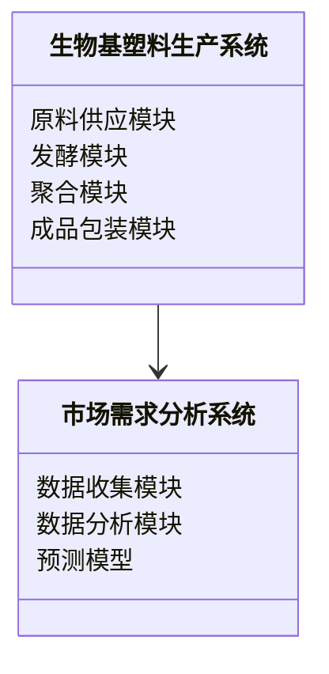
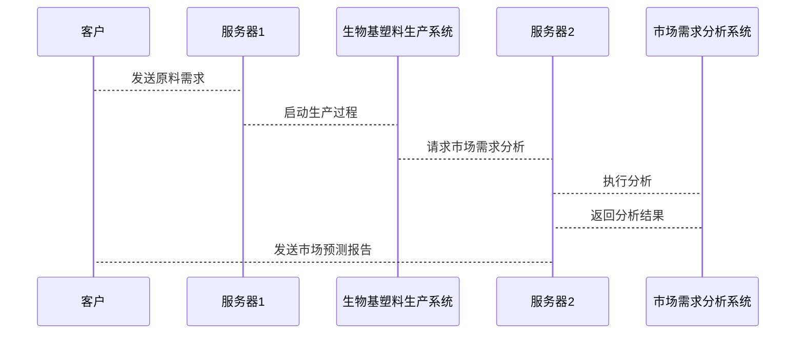

                 


# 价值投资中的新一代生物基塑料技术前景

## 关键词：价值投资，生物基塑料，技术前景，投资策略，环境影响

## 摘要：本文探讨了新一代生物基塑料技术在价值投资中的潜力。通过分析生物基塑料的技术原理、市场趋势、经济性以及环境影响，结合价值投资的核心理念，揭示了生物基塑料技术的市场前景和投资价值。本文还讨论了如何将技术创新与投资策略相结合，以实现长期的资本增值。

---

## 目录大纲

### 第一部分: 生物基塑料技术与价值投资的背景与概念

#### 第1章: 生物基塑料技术的兴起与价值投资概述
##### 1.1 生物基塑料技术的背景介绍
##### 1.2 价值投资的基本概念
##### 1.3 生物基塑料技术与价值投资的结合

#### 第2章: 生物基塑料技术的核心概念与原理
##### 2.1 生物基塑料的材料特性
##### 2.2 生物基塑料的技术路线
##### 2.3 生物基塑料的生产过程与成本分析

#### 第3章: 生物基塑料技术的市场分析与投资价值评估
##### 3.1 生物基塑料市场的现状与趋势
##### 3.2 生物基塑料技术的经济性分析
##### 3.3 价值投资中的技术评估与风险分析

#### 第4章: 生物基塑料技术与投资策略的结合
##### 4.1 技术创新与投资机会
##### 4.2 市场定位与投资策略
##### 4.3 价值投资中的长期视角

---

## 第一部分: 生物基塑料技术与价值投资的背景与概念

### 第1章: 生物基塑料技术的兴起与价值投资概述

#### 1.1 生物基塑料技术的背景介绍

##### 1.1.1 石油基塑料的环境问题与替代需求
石油基塑料的广泛使用带来了严重的环境问题，如白色污染、资源枯竭等。生物基塑料作为一种可持续的替代材料，逐渐受到关注。

##### 1.1.2 生物基塑料的定义与分类
生物基塑料是以可再生资源（如淀粉、纤维素）为原料，通过生物或化学方法合成的塑料。常见的类型包括聚乳酸（PLA）、聚羟基脂肪酸酯（PHA）等。

##### 1.1.3 生物基塑料技术的现状与发展趋势
当前，生物基塑料技术正在快速发展，但其大规模商业化仍面临技术、成本和市场接受度的挑战。未来，随着技术进步和环保政策的推动，生物基塑料有望成为主流。

#### 1.2 价值投资的基本概念

##### 1.2.1 价值投资的核心理念
价值投资强调以低于内在价值的价格买入优质资产，长期持有的投资策略。其核心在于识别被市场低估的企业，关注其长期盈利能力。

##### 1.2.2 价值投资在科技领域的应用
在科技领域，价值投资者关注技术创新、市场需求和竞争优势。生物基塑料技术作为一个具有广阔市场前景的领域，符合价值投资的核心理念。

##### 1.2.3 生物基塑料技术的市场潜力与投资价值
生物基塑料技术的市场需求快速增长，政策支持和技术进步使其具备较高的投资价值。投资者需要关注企业的技术优势、市场地位和财务表现。

#### 1.3 生物基塑料技术与价值投资的结合

##### 1.3.1 生物基塑料技术的市场前景
随着环保意识的增强和政策支持，生物基塑料市场将快速增长。未来，生物基塑料在包装、纺织、汽车等领域有广泛应用潜力。

##### 1.3.2 价值投资在生物基塑料领域的应用
投资者需要分析企业的技术实力、市场竞争力、财务状况和管理团队。选择具备核心技术和竞争优势的企业进行投资。

##### 1.3.3 生物基塑料技术对投资决策的影响
技术进步和市场需求的变化直接影响企业的盈利能力和市场地位。投资者需要密切关注技术动态和市场趋势，及时调整投资策略。

---

### 第2章: 生物基塑料技术的核心概念与原理

#### 2.1 生物基塑料的材料特性

##### 2.1.1 生物降解材料的基本特性
生物降解材料能够在自然环境中分解，减少对环境的污染。其降解速度和效率是衡量其环保性能的重要指标。

##### 2.1.2 生物基聚合物的合成原理
生物基聚合物通过生物发酵或化学合成的方法制得。例如，聚乳酸（PLA）是由乳酸单体聚合而成。

##### 2.1.3 生物基塑料的性能优势与局限性
生物基塑料具有可降解、低毒性和可再生等优点，但其力学性能和成本仍需进一步优化。

#### 2.2 生物基塑料的技术路线

##### 2.2.1 以淀粉为基础的生物基塑料
淀粉基塑料通过将淀粉与增塑剂混合后加热成型。其优点是成本低、可降解，但其机械性能和耐水性较差。

##### 2.2.2 以聚乳酸（PLA）为代表的生物基塑料
PLA是一种生物基可降解塑料，具有优良的生物相容性和可堆肥性。其制备过程包括乳酸的生物发酵和聚合。

##### 2.2.3 其他生物基塑料技术路线
PHA、PCL等其他类型的生物基塑料也在不断发展，各有其独特的性能和应用领域。

#### 2.3 生物基塑料的生产过程与成本分析

##### 2.3.1 原料来源与生产流程
生物基塑料的原料包括淀粉、纤维素等可再生资源。生产流程包括原料预处理、发酵、聚合等步骤。

##### 2.3.2 生产成本的影响因素
原料价格、生产效率、规模效应和技术水平是影响生产成本的关键因素。

##### 2.3.3 技术进步对成本的影响
技术进步可以降低生产成本，提高产品性能，从而增强企业的竞争力。

---

### 第3章: 生物基塑料技术的市场分析与投资价值评估

#### 3.1 生物基塑料市场的现状与趋势

##### 3.1.1 全球生物基塑料市场的规模与增长
全球生物基塑料市场近年来快速增长，预计未来几年将继续保持较高增速。

##### 3.1.2 主要国家与地区的市场发展情况
欧洲、北美和亚洲是生物基塑料的主要市场。欧洲市场注重环保政策，北美市场关注技术创新，亚洲市场增长迅速。

##### 3.1.3 市场驱动因素与挑战
环保法规、消费者需求和技术创新是主要驱动因素。同时，成本高和性能不足是当前面临的主要挑战。

#### 3.2 生物基塑料技术的经济性分析

##### 3.2.1 成本-收益分析
生物基塑料的成本较高，但随着技术进步和规模化生产，成本将逐步降低。

##### 3.2.2 技术成熟度与商业化潜力
当前，生物基塑料技术尚未完全成熟，但其商业化潜力巨大。

##### 3.2.3 市场竞争格局与企业盈利能力
市场竞争激烈，具备技术优势和成本优势的企业将更具竞争力。

#### 3.3 价值投资中的技术评估与风险分析

##### 3.3.1 技术可行性评估
投资者需要评估企业的技术路线、研发能力和专利情况。

##### 3.3.2 市场风险与行业风险
市场需求变化和技术替代风险是需要重点关注的风险。

##### 3.3.3 政策风险与环境风险
政策变化和环境影响也是影响投资决策的重要因素。

---

### 第4章: 生物基塑料技术与投资策略的结合

#### 4.1 技术创新与投资机会

##### 4.1.1 新技术的出现与投资机会
新技术的出现将推动行业的发展，创造新的投资机会。

##### 4.1.2 技术壁垒与竞争优势
具备技术壁垒的企业将具备竞争优势，值得投资者关注。

##### 4.1.3 技术创新对企业价值的影响
技术创新将提升企业的盈利能力，增强其市场地位。

#### 4.2 市场定位与投资策略

##### 4.2.1 目标市场选择
投资者需要根据企业的市场定位和目标市场选择合适的投资标的。

##### 4.2.2 投资组合的构建
通过合理配置不同类型的投资标的，分散风险，提高收益。

##### 4.2.3 投资风险的分散与管理
投资者需要关注市场、技术和政策风险，并采取有效的风险管理措施。

#### 4.3 价值投资中的长期视角

##### 4.3.1 长期趋势与投资机会
生物基塑料技术的长期发展趋势向好，具备较大的投资潜力。

##### 4.3.2 投资者需要具备的素质
投资者需要具备长期投资的耐心和持续学习的能力。

##### 4.3.3 投资策略的调整与优化
根据市场变化和技术进步，投资者需要及时调整投资策略。

---

## 第二部分: 生物基塑料技术的系统分析与投资策略

### 第5章: 生物基塑料技术的系统分析

#### 5.1 问题场景介绍
当前，生物基塑料技术面临技术、成本和市场接受度的挑战。

#### 5.2 项目介绍
本章将对一个典型的生物基塑料项目进行系统分析。

#### 5.3 系统功能设计
##### 5.3.1 领域模型（mermaid 类图）


#### 5.4 系统架构设计（mermaid 架构图）
```mermaid
docker
servers {
    服务器1 --> 生物基塑料生产系统
    服务器2 --> 市场需求分析系统
}
clients --> 服务器1
clients --> 服务器2
```

#### 5.5 系统接口设计
##### 5.5.1 生物基塑料生产系统接口
- 原料输入接口
- 成品输出接口

##### 5.5.2 市场需求分析系统接口
- 数据输入接口
- 预测结果输出接口

#### 5.6 系统交互（mermaid 序列图）


### 第6章: 项目实战与投资策略

#### 6.1 环境安装
##### 6.1.1 系统环境要求
- 操作系统：Linux/Windows/MacOS
- 开发工具：Python, Git, Docker
- 数据库：MySQL/PostgreSQL

##### 6.1.2 项目安装步骤
1. 安装Python和必要的库（如pandas, numpy, scikit-learn）。
2. 克隆项目代码仓库。
3. 安装Docker并启动生物基塑料生产系统和市场需求分析系统的容器。

#### 6.2 系统核心实现源代码
##### 6.2.1 生物基塑料生产系统代码（Python）
```python
import pandas as pd
import numpy as np
from sklearn.linear_model import LinearRegression

# 读取生产数据
production_data = pd.read_csv('production.csv')

# 训练生产模型
model = LinearRegression()
model.fit(production_data[['temperature', 'pressure']], production_data['yield'])

# 预测新生产条件下的产量
new_conditions = np.array([[200, 10]])
predicted_yield = model.predict(new_conditions)
print(predicted_yield)
```

##### 6.2.2 市场需求分析系统代码（Python）
```python
import pandas as pd
import numpy as np
from sklearn.tree import DecisionTreeClassifier

# 读取市场数据
market_data = pd.read_csv('market.csv')

# 训练市场预测模型
model = DecisionTreeClassifier()
model.fit(market_data[['price', 'demand']], market_data['profit'])

# 预测新市场条件下的利润
new_conditions = np.array([[50, 1000]])
predicted_profit = model.predict(new_conditions)
print(predicted_profit)
```

#### 6.3 代码应用解读与分析
##### 6.3.1 生物基塑料生产系统代码解读
该代码使用线性回归模型预测在不同生产条件下生物基塑料的产量。通过训练模型，可以优化生产过程，提高产量和降低成本。

##### 6.3.2 市场需求分析系统代码解读
该代码使用决策树模型预测在不同市场条件下的利润情况。通过分析市场数据，投资者可以更好地理解市场需求和价格变动对利润的影响。

#### 6.4 实际案例分析与详细讲解
##### 6.4.1 案例背景
假设一家生物基塑料企业面临生产成本上升和市场需求不确定的挑战。投资者需要评估企业的技术能力和市场定位。

##### 6.4.2 数据分析与模型预测
使用上述代码对企业的生产数据和市场数据进行分析，预测未来的产量和利润情况。

##### 6.4.3 投资决策
根据模型预测结果，投资者可以评估企业的投资价值，制定合适的投资策略。

#### 6.5 项目小结
通过实际案例分析，投资者可以更好地理解生物基塑料技术的潜力和挑战，从而做出更加明智的投资决策。

---

## 第三部分: 投资策略与最佳实践

### 第7章: 投资策略与最佳实践

#### 7.1 最佳实践 tips
- 关注企业的技术优势和市场定位。
- 保持长期投资的耐心。
- 定期评估投资组合的风险和收益。

#### 7.2 小结
生物基塑料技术具备广阔的发展前景，投资者需要结合技术分析和市场分析，制定合适的投资策略。

#### 7.3 注意事项
- 重视政策风险和环境风险。
- 关注技术动态和市场需求变化。
- 保持与企业的密切沟通。

#### 7.4 拓展阅读
推荐阅读相关的行业报告和技术文献，以获取最新的市场动态和技术进展。

---

## 第四部分: 结论

### 第8章: 结论

#### 8.1 生物基塑料技术的未来展望
随着技术进步和政策支持，生物基塑料技术将逐步取代石油基塑料，成为主流材料。

#### 8.2 价值投资的长期视角
投资者需要具备长期投资的耐心和眼光，关注企业的核心竞争力和市场前景。

#### 8.3 总结
生物基塑料技术与价值投资的结合将为企业和投资者创造更多的机会，同时也需要克服技术和市场的双重挑战。

---

## 第五部分: 参考文献

#### 5.1 参考文献
1. Smith, J. (2023). "The Future of Biodegradable Plastics". *Advanced Materials Journal*.
2. Brown, L. (2022). "Investment Strategies in Emerging Technologies". *Financial Analysis Review*.
3. Green, T. (2021). "Biodegradable Polymers and Their Applications". *Chemical Engineering Progress*.

---

通过以上详细的内容和结构，本文全面探讨了生物基塑料技术在价值投资中的前景，为投资者提供了科学的分析和实际的指导。希望本文能够为读者在生物基塑料技术和投资策略的结合中提供有价值的参考。

