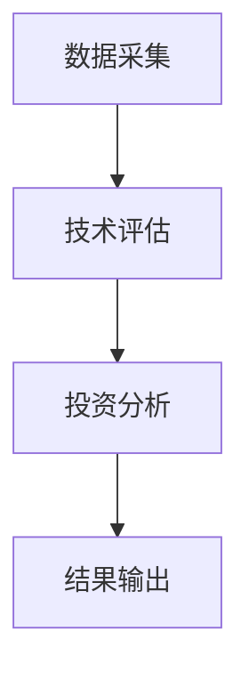

                 

# 价值投资中的新一代生物燃料技术前景

## 关键词：生物燃料，投资前景，技术分析，投资评估，可持续能源

## 摘要：本文探讨了新一代生物燃料技术在投资中的潜力，分析了其技术原理、市场现状、评估方法，并通过实际案例展示了如何进行投资决策。文章结合技术与投资分析，为读者提供了全面的视角。

---

# 第一部分：生物燃料技术的背景与现状

## 第1章：生物燃料技术的定义与重要性

### 1.1 生物燃料的基本概念

生物燃料是指由生物质（如植物、动物脂肪、微生物等）转化而来的可再生能源。主要类型包括生物乙醇、生物柴油和生物天然气，这些燃料可以替代传统的化石燃料，减少碳排放，推动能源结构转型。

### 1.2 生物燃料技术的发展现状

全球生物燃料市场正在快速增长，尤其是发展中国家如巴西和美国，已经建立了成熟的生产和消费体系。欧盟也通过严格的政策推动生物燃料的应用。然而，不同地区的政策支持和技术水平差异显著，影响了市场的发展。

### 1.3 技术挑战与投资机会

尽管生物燃料技术取得了进展，但仍面临技术瓶颈，如原料成本高、转化效率低。此外，投资生物燃料技术可能带来高回报，尤其是在政策支持和市场需求增长的背景下。然而，投资者需注意技术风险和市场波动。

---

# 第二部分：新一代生物燃料技术的核心概念

## 第2章：新一代生物燃料技术的技术原理

### 2.1 生物燃料的技术路径

新一代生物燃料技术采用先进的转化方法，如合成生物技术，将非粮食作物转化为燃料。与传统技术相比，这些方法具有更高的效率和更低的成本。

### 2.2 关键生产环节

1. **原料选择与处理**：使用纤维素类作物，降低对粮食作物的依赖。
2. **生物转化过程**：利用酶催化或微生物发酵，将生物质转化为燃料。
3. **产品精炼**：对转化产物进行处理，提高纯度和质量。

---

# 第三部分：生物燃料技术的评估与分析方法

## 第3章：生物燃料技术的评估模型

### 3.1 评估模型的构建

评估模型综合考虑技术可行性、经济回报和环境影响。技术可行性包括生产效率和设备可靠性；经济回报涉及投资成本和运营成本；环境影响包括碳排放和能源消耗。

### 3.2 评估模型的数学公式

- **技术可行性指数公式**：$$技术可行性 = \frac{生产效率}{成本}$$
- **经济回报率计算公式**：$$经济回报 = 投资成本 \times (1 + 投资回报率)$$
- **环境影响评估公式**：$$环境影响 = 碳排放量 \times 损失系数$$

---

# 第四部分：生物燃料技术的系统架构与设计

## 第4章：生物燃料技术评估系统的架构设计

### 4.1 系统功能模块划分

- **数据采集模块**：收集生产数据、市场信息。
- **技术评估模块**：分析技术可行性和成本。
- **投资分析模块**：评估经济回报和风险。

### 4.2 系统架构图

---

# 第五部分：生物燃料技术投资实战案例分析

## 第5章：实际投资案例分析

### 5.1 投资案例背景介绍

选择一家生产二代生物燃料的公司，分析其技术路线和市场定位。

### 5.2 投资评估过程

- **数据收集与处理**：收集公司过去5年的财务数据。
- **模型应用与结果分析**：使用评估模型预测未来3年的收益。
- **投资决策与风险评估**：基于模型结果，评估投资可行性。

---

# 第六部分：总结与展望

## 第6章：总结与未来趋势

### 6.1 本书内容回顾

文章详细分析了生物燃料技术的背景、核心概念、评估方法，并通过案例展示了投资分析过程。

### 6.2 未来趋势

未来，合成生物技术和人工智能的应用将推动生物燃料技术的进一步发展。投资者需关注技术创新和政策变化，以抓住投资机会。

---

# 最佳实践 Tips

- **技术关注点**：优先考虑具有高效转化技术的企业。
- **政策敏感性**：密切关注政府政策变化。
- **风险管理**：建立风险评估机制，降低投资风险。

---

通过以上结构，文章系统地介绍了生物燃料技术的投资前景，为投资者提供了全面的技术和分析框架，帮助他们在绿色能源领域做出明智决策。

