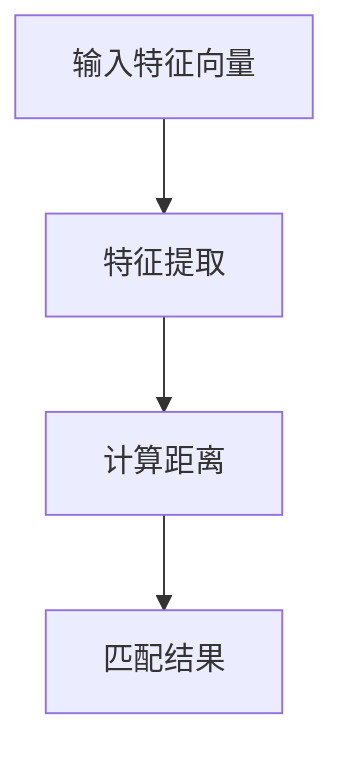
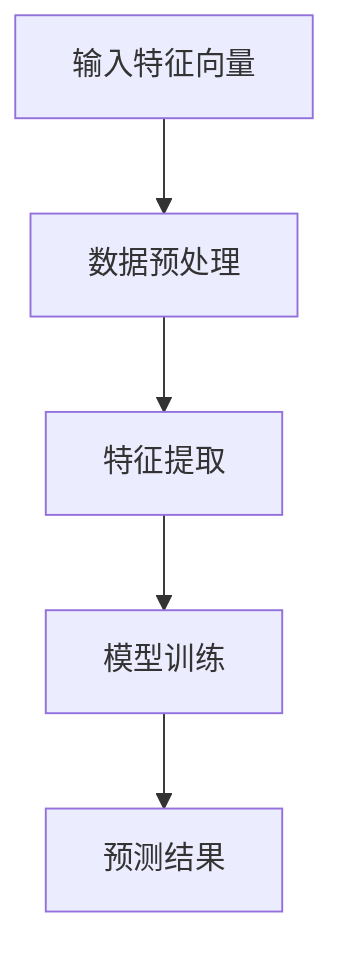
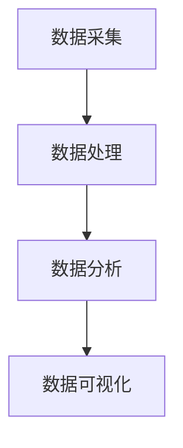
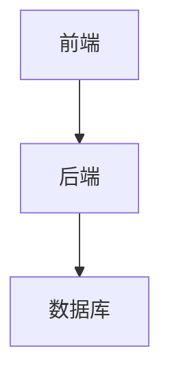

                 


# 价值投资中的新一代生物识别技术前景

## 关键词：
- 生物识别技术
- 价值投资
- 前景分析
- 算法模型
- 数据驱动决策

## 摘要：
随着科技的进步，生物识别技术在金融领域的应用日益广泛。本文探讨了生物识别技术如何赋能价值投资，通过分析投资者情绪、行为和市场动态，提升投资决策的精准性和效率。文章详细介绍了生物识别技术的核心算法、系统架构及在价值投资中的实际应用，展示了其在未来投资中的巨大潜力。

---

# 目录

1. 第一部分：生物识别技术与价值投资的背景
   1.1 生物识别技术概述
   1.2 价值投资的基本原理
   1.3 生物识别技术与价值投资的结合

2. 第二部分：生物识别技术的核心算法与数学模型
   2.1 生物识别技术的核心算法
   2.2 数学模型与公式
   2.3 算法流程图与Python实现

3. 第三部分：生物识别技术在价值投资中的应用
   3.1 投资者情绪分析
   3.2 风险评估与管理
   3.3 投资者行为分析

4. 第四部分：系统架构与项目实战
   4.1 系统功能设计
   4.2 系统架构设计
   4.3 系统接口设计
   4.4 系统交互设计

5. 第五部分：最佳实践与未来展望
   5.1 应用经验总结
   5.2 风险与挑战
   5.3 未来发展方向

---

## 正文

### 第一部分：生物识别技术与价值投资的背景

#### 1.1 生物识别技术概述

生物识别技术是一种通过人体的生理或行为特征进行身份识别的技术。其核心在于利用计算机视觉、模式识别和机器学习等技术，从生物特征中提取信息，实现对个体身份的精确识别。

- **生物识别技术的分类**：
  - 指纹识别
  - 面部识别
  - 声纹识别
  - 行为识别（如步态识别）

- **生物识别技术的特点**：
  - 非接触式：减少物理接触，降低疾病传播风险。
  - 高精度：通过先进的算法实现高准确率。
  - 实时性：支持快速识别，适用于实时应用场景。

#### 1.2 价值投资的基本原理

价值投资是一种以基本面分析为基础的投资策略，核心在于寻找市场价格低于其内在价值的资产。

- **价值投资的核心理念**：
  - 坚持长期投资：关注企业的内在价值，而非短期价格波动。
  - 低市盈率、低市净率：寻找被市场低估的企业。
  - 高质量企业：选择具有强大财务状况和竞争优势的企业。

- **价值投资的实施步骤**：
  1. 基本面分析：研究企业的财务报表、行业地位和竞争优势。
  2. 估值分析：计算企业的内在价值，判断其是否被市场低估。
  3. 投资组合构建：根据分析结果，构建投资组合并进行动态调整。

#### 1.3 生物识别技术与价值投资的结合

生物识别技术为价值投资提供了新的数据来源和分析工具，帮助投资者更精准地识别投资机会和风险。

- **生物识别技术在金融领域的应用**：
  - 投资者情绪分析：通过面部表情和声音特征，分析投资者的情绪状态，辅助投资决策。
  - 市场情绪预测：利用生物特征数据，预测市场整体情绪走势。
  - 风险评估：结合生物特征和财务数据，评估投资标的的信用风险。

### 第二部分：生物识别技术的核心算法与数学模型

#### 2.1 生物识别技术的核心算法

生物识别技术的核心在于特征提取和匹配算法。

- **特征提取**：
  - 指纹识别：基于 ridge features（ ridge features）提取特征点。
  - 面部识别：基于 facial landmarks（面部特征点）和 texture features（纹理特征）提取特征。
  - 声纹识别：基于 spectral features（频谱特征）和 prosodic features（韵律特征）提取特征。

- **匹配算法**：
  - 基于距离的匹配：计算特征向量之间的距离，判断是否为同一人。
  - 基于分类的匹配：利用机器学习模型对特征进行分类，实现身份识别。

- **算法流程图**（Mermaid）：



#### 2.2 数学模型与公式

- **概率模型**：
  - 贝叶斯定理：用于计算条件概率。
  - $$P(A|B) = \frac{P(B|A) \cdot P(A)}{P(B)}$$

- **分类算法**：
  - 支持向量机（SVM）：用于分类问题。
  - $$\text{目标函数：} \min_{w,b,\xi} \frac{1}{2}||w||^2 + C \sum_{i=1}^n \xi_i$$

- **实现代码示例（Python）**：

```python
import numpy as np
from sklearn import svm

# 示例数据
X = np.array([[1, 0], [0, 1], [2, 2], [3, 3]])
y = np.array([0, 0, 1, 1])

# 创建SVM模型
model = svm.SVC()

# 训练模型
model.fit(X, y)

# 预测
print(model.predict([[2.5, 2.5]]))
```

#### 2.3 算法流程图与Python实现

- **算法流程图**（Mermaid）：



- **Python代码实现**：

```python
import numpy as np
from sklearn.decomposition import PCA

# 示例数据
X = np.array([[1, 2], [3, 4], [5, 6], [7, 8]])
y = np.array([0, 1, 0, 1])

# 数据预处理
pca = PCA(n_components=2)
X_pca = pca.fit_transform(X)

# 特征提取
# （此处可根据具体需求自定义特征提取方法）

# 模型训练
from sklearn.svm import SVC
model = SVC()
model.fit(X_pca, y)

# 预测
print(model.predict(pca.transform([[9, 10]])))
```

### 第三部分：生物识别技术在价值投资中的应用

#### 3.1 投资者情绪分析

- **基于面部识别的情绪分析**：
  - 通过分析面部表情（如眼动、表情微变化），判断投资者的情绪状态。
  - $$\text{情绪评分公式：} \text{score} = \alpha \cdot \text{eye movement} + \beta \cdot \text{facial expression}$$

- **基于声纹识别的情绪分析**：
  - 通过分析声音的韵律、语调和音量，判断投资者的情绪状态。

#### 3.2 风险评估与管理

- **基于生物特征的投资者风险分类**：
  - 将投资者分为不同风险类别（如保守型、激进型），并根据其生物特征进行动态调整。
  - $$\text{风险评分公式：} \text{risk score} = \gamma \cdot \text{financial data} + \delta \cdot \text{biometric features}$$

- **生物识别技术在投资组合管理中的应用**：
  - 根据投资者的生物特征和财务数据，动态调整投资组合。

#### 3.3 投资者行为分析

- **基于生物识别的投资者行为分析**：
  - 通过分析投资者的行为模式（如交易频率、决策时间），识别投资机会。
  - $$\text{行为模式公式：} \text{behavior pattern} = \epsilon \cdot \text{transaction frequency} + \zeta \cdot \text{decision time}$$

### 第四部分：系统架构与项目实战

#### 4.1 系统功能设计

- **系统功能模块**：
  - 数据采集模块：采集投资者的生物特征数据。
  - 数据处理模块：对生物特征数据进行预处理和特征提取。
  - 数据分析模块：基于生物特征数据进行投资分析。
  - 数据可视化模块：展示分析结果。

- **系统功能设计图**（Mermaid）：



#### 4.2 系统架构设计

- **系统架构**：
  - 前端：用户界面，展示数据采集和分析结果。
  - 后端：数据处理和分析模块，基于生物特征数据进行投资分析。
  - 数据库：存储生物特征数据和投资分析结果。

- **系统架构设计图**（Mermaid）：



#### 4.3 系统接口设计

- **系统接口**：
  - 数据采集接口：接收投资者的生物特征数据。
  - 数据处理接口：对生物特征数据进行预处理和特征提取。
  - 数据分析接口：基于生物特征数据进行投资分析。

- **接口设计示例（RESTful API）**：

```python
from flask import Flask
from flask_restful import Resource, Api

app = Flask(__name__)
api = Api(app)

class BiometricAnalysis(Resource):
    def post(self):
        data = request.json
        # 数据处理和分析逻辑
        return {'message': 'Analysis completed successfully'}

api.add_resource(BiometricAnalysis, '/analyze')

if __name__ == '__main__':
    app.run(debug=True)
```

#### 4.4 系统交互设计

- **系统交互流程**：
  - 用户提交生物特征数据。
  - 系统进行数据处理和分析。
  - 系统返回分析结果。

- **系统交互设计图**（Mermaid）：

```mermaid
graph TD
A[用户] --> B[数据采集] --> C[数据分析] --> D[用户] <-- E[结果展示]
```

### 第五部分：最佳实践与未来展望

#### 5.1 应用经验总结

- 生物识别技术在价值投资中的应用具有巨大潜力。
- 投资者情绪分析和行为分析是目前的主要应用方向。
- 需要结合多种生物识别技术，实现更精准的投资决策。

#### 5.2 风险与挑战

- **数据隐私风险**：生物特征数据的泄露可能引发隐私问题。
- **技术局限性**：现有生物识别技术的准确性和稳定性有待提高。
- **伦理问题**：生物识别技术的使用可能引发伦理争议。

#### 5.3 未来发展方向

- **多模态生物识别**：结合多种生物特征（如指纹、面部、声纹），提高识别精度。
- **人工智能与生物识别的融合**：利用深度学习等技术，提升生物识别技术的智能化水平。
- **个性化投资服务**：基于投资者的生物特征，提供个性化的投资建议。

---

## 结语

生物识别技术为价值投资带来了新的可能性。通过投资者情绪分析、行为分析和市场情绪预测，生物识别技术可以帮助投资者更精准地识别投资机会和风险。然而，生物识别技术的应用也面临着数据隐私、技术局限性和伦理问题等挑战。未来，随着技术的进步和应用的深入，生物识别技术将在价值投资中发挥更大的作用。

---

通过以上结构和内容，您可以根据实际需求进一步扩展和详细阐述每个部分的内容。

