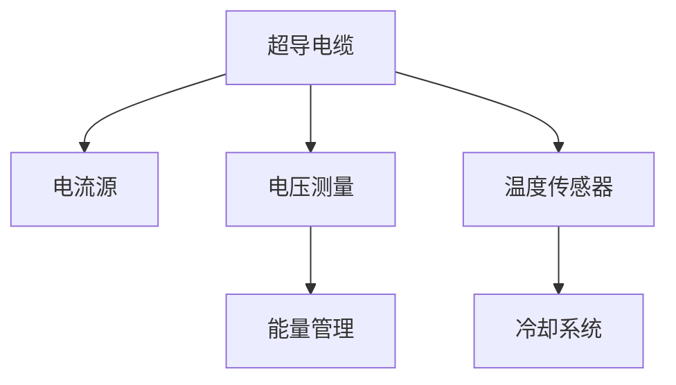

                 

# 《价值投资中的新一代高温超导输电技术前景》

> 关键词：高温超导输电技术、价值投资、数学模型、系统架构、市场分析

> 摘要：本文探讨高温超导输电技术的背景、原理及其在价值投资中的潜力。通过分析高温超导材料的物理特性、数学模型和系统架构，结合市场分析和财务指标，评估其投资价值，并提供实际案例和建议。

---

# 第1章 高温超导输电技术的背景与价值投资分析

## 1.1 高温超导输电技术的背景介绍

### 1.1.1 传统输电技术的局限性
传统输电技术面临能量损耗高、效率低等问题，特别是在长距离和大功率输电中表现不佳。

### 1.1.2 高温超导材料的发现与突破
1986年发现的高温超导材料（如钇钡铜氧）在液氮温区（77K）下实现超导，为输电技术带来革命性突破。

### 1.1.3 高温超导输电技术的定义与特点
高温超导输电技术利用超导电缆传输电流，具有低损耗、高容量和高效能的特点。

## 1.2 价值投资的基本概念

### 1.2.1 价值投资的核心理念
价值投资强调以低于内在价值的价格买入优质资产，长期持有的投资策略。

### 1.2.2 价值投资与技术创新的关系
技术创新企业具备高增长潜力，但需结合市场需求和财务状况评估其投资价值。

### 1.2.3 高温超导技术在投资中的潜力
高温超导技术的市场应用前景广阔，但需考虑研发成本、技术成熟度和政策支持。

## 1.3 高温超导输电技术与价值投资的结合点

### 1.3.1 技术进步对投资价值的影响
技术创新降低了输电损耗，提升了电网效率，具有显著的成本优势。

### 1.3.2 高温超导技术的市场应用前景
随着技术进步和成本下降，高温超导输电技术在智能电网和可再生能源中的应用将增加。

### 1.3.3 投资者如何评估高温超导技术的价值
投资者需关注企业的研发能力、市场地位、财务状况和政策环境，综合评估其投资价值。

## 1.4 本章小结

---

# 第2章 高温超导材料的物理特性与数学模型

## 2.1 高温超导材料的物理特性

### 2.1.1 超导体的基本性质
超导体在特定温度下电阻为零，临界电流密度高，磁场穿透深度有限。

### 2.1.2 高温超导材料的关键特性
包括临界电流密度（Jc）、临界磁场（Bc）和热导率（κ）等。

### 2.1.3 临界电流密度与临界磁场的数学表达
临界电流密度Jc与磁场B的关系可通过以下公式表示：
$$ J_c(B) = J_0 \left(1 - \frac{B^2}{B_c^2}\right) $$

## 2.2 高温超导输电技术的数学模型

### 2.2.1 输电系统的基本模型
输电系统由超导电缆、连接设备和保护装置组成，其数学模型包括电流-电压关系和能量损耗模型。

### 2.2.2 超导电缆的电阻与电流关系
在超导状态下，电缆电阻为零，电流由电压和电感决定：
$$ I = \frac{V}{L} $$

### 2.2.3 能量损耗的数学公式
能量损耗主要来自电缆的电阻和电容损耗，公式为：
$$ P = I^2 R + V^2 C $$

## 2.3 高温超导材料的物理特性对比

### 2.3.1 不同超导材料的特性对比表格
| 材料 | 临界温度 (K) | 临界磁场 (T) | 临界电流密度 (A/mm²) |
|------|---------------|---------------|-----------------------|
| YBCO | 77             | 30             | 100                   |
| BSCCO | 77            | 40             | 80                    |

### 2.3.2 超导材料的物理特性与投资价值的关系
临界温度和临界电流密度越高，材料的市场应用潜力越大，投资价值越高。

## 2.4 本章小结

---

# 第3章 高温超导输电技术的原理与应用

## 3.1 高温超导输电技术的基本原理

### 3.1.1 超导电缆的工作原理
超导电缆通过液氮冷却维持超导状态，实现零电阻电流传输。

### 3.1.2 超导材料在输电中的作用
超导材料用于电缆导体，降低能量损耗，提高输电效率。

### 3.1.3 超导输电的优势与劣势
优势：低损耗、高容量；劣势：高成本、技术复杂。

## 3.2 高温超导输电技术的数学模型

### 3.2.1 输电系统中的电流与电压关系
在超导状态下，电压由电流和电感决定：
$$ V = L \frac{dI}{dt} $$

### 3.2.2 超导电缆的热力学模型
热力学模型考虑电缆的温度分布和冷却系统的热交换：
$$ Q = k A \frac{dT}{dx} $$

### 3.2.3 能量损耗的优化公式
通过优化电缆设计和冷却系统，能量损耗可降低至最小：
$$ P_{\text{min}} = \frac{I^2 R}{\eta} $$

## 3.3 高温超导输电技术的系统架构设计

### 3.3.1 系统功能设计
系统功能包括电流传输、温度监控、故障保护和能量管理。

### 3.3.2 系统架构的mermaid图

### 3.3.3 系统接口设计
系统接口包括电流接口、温度接口和通信接口。

## 3.4 本章小结

---

# 第4章 高温超导输电技术的市场分析与投资价值评估

## 4.1 高温超导输电技术的市场需求

### 4.1.1 全球能源需求的增长
全球能源需求持续增长，对高效输电技术的需求增加。

### 4.1.2 高温超导技术在智能电网中的应用
智能电网需要高效、稳定的输电技术，高温超导技术符合这一需求。

### 4.1.3 高温超导技术的市场潜力
预计未来十年，高温超导输电技术市场将快速增长。

## 4.2 高温超导输电技术的财务指标分析

### 4.2.1 企业的收入与成本分析
收入增长取决于市场需求和技术应用，成本包括材料成本和研发投入。

### 4.2.2 财务指标的对比分析
对比高温超导企业的PE（市盈率）和ROE（净资产收益率），评估其投资价值。

## 4.3 高温超导输电技术的风险评估

### 4.3.1 技术风险
技术不成熟或研发失败可能导致投资损失。

### 4.3.2 市场风险
市场需求不足或竞争加剧可能影响企业的盈利能力。

### 4.3.3 政策风险
政策变化或补贴减少可能影响企业的经营环境。

## 4.4 本章小结

---

# 第5章 高温超导输电技术的价值投资策略

## 5.1 高温超导输电技术的核心竞争力

### 5.1.1 技术领先性
企业是否拥有核心技术专利和研发能力。

### 5.1.2 市场占有率
企业在全球市场中的份额和品牌影响力。

## 5.2 高温超导输电技术的财务健康状况

### 5.2.1 财务状况分析
企业是否有稳定的现金流和健康的资产负债表。

### 5.2.2 盈利能力分析
企业的毛利率、净利率和ROE是否处于行业领先水平。

## 5.3 高温超导输电技术的投资风险与应对策略

### 5.3.1 技术风险应对
通过多元化投资和风险分散降低技术风险。

### 5.3.2 市场风险应对
选择有稳定市场需求和竞争优势的企业进行投资。

## 5.4 本章小结

---

# 第6章 高温超导输电技术的未来发展趋势

## 6.1 高温超导材料的未来发展方向

### 6.1.1 新材料的研发
探索更高临界温度和更高临界电流密度的超导材料。

### 6.1.2 材料制备技术的进步
提高材料的均匀性和一致性，降低成本。

## 6.2 高温超导输电技术的应用前景

### 6.2.1 智能电网中的应用
高温超导技术将广泛应用于智能电网的建设和升级。

### 6.2.2 可再生能源中的应用
高温超导技术有助于可再生能源的高效传输和储存。

## 6.3 高温超导输电技术的投资机会

### 6.3.1 技术创新带来的投资机会
关注具有技术创新能力的企业和项目。

### 6.3.2 市场扩展带来的投资机会
关注高温超导技术在国内外市场的拓展和应用。

## 6.4 本章小结

---

# 附录

## 附录A 高温超导输电技术的数学公式汇总

## 附录B 高温超导材料的特性参数表

## 附录C 高温超导输电技术的系统架构图

---

以上是《价值投资中的新一代高温超导输电技术前景》的完整目录大纲，涵盖技术背景、原理、数学模型、系统架构、市场分析和投资策略等各个方面，旨在为投资者和技术爱好者提供全面的视角和深度的分析。

