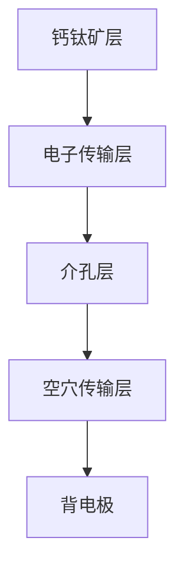

                 

# 价值投资中的新型光伏材料技术前景

---

## 关键词：
光伏材料、价值投资、技术创新、市场分析、投资策略、高效电池

---

## 摘要：
本文探讨了新型光伏材料技术在价值投资中的前景，从技术分析、市场趋势、投资策略等多个角度进行深入分析。通过介绍光伏材料的技术发展、市场现状、价值投资的基本原理，结合具体案例，分析技术创新对企业价值和投资机会的影响。文章还提出了基于技术评估的系统化投资框架，并展望了光伏材料技术的未来发展趋势。

---

# 目录大纲

1. 光伏材料技术的背景与现状
   1.1 光伏材料的基本概念
   1.2 新型光伏材料的技术进展
   1.3 光伏行业的市场现状与未来趋势

2. 新型光伏材料的技术分析与投资价值评估
   2.1 新型光伏材料的核心技术
   2.2 新型光伏材料的市场竞争力分析
   2.3 技术创新与企业价值的关系

3. 价值投资的基本原理与光伏行业的应用
   3.1 价值投资的核心理念
   3.2 技术创新对投资价值的驱动
   3.3 光伏行业的投资策略与实践

---

# 正文

## 第1章: 光伏材料技术的背景与现状

### 1.1 光伏材料的基本概念

#### 1.1.1 光伏材料的定义与分类
光伏材料是能够将太阳光转化为电能的材料，主要应用于太阳能电池。常见的光伏材料包括晶体硅、薄膜电池材料（如碲化镉、铜铟镓硒）以及新兴的新型材料（如钙钛矿）。光伏材料按结构可分为单晶硅、多晶硅、薄膜电池材料等。

**Mermaid图：光伏材料分类**

#### 1.1.2 光伏材料的发展历程
光伏材料的发展经历了从实验阶段到商业化应用的过程。20世纪50年代，贝尔实验室首次实现太阳能电池的商业化应用。随着技术进步，晶体硅材料成为主流，近年来，薄膜电池和新型材料逐渐崛起。

#### 1.1.3 光伏材料在能源转型中的作用
光伏材料是实现清洁能源转型的关键技术之一。通过提高转换效率和降低成本，光伏材料推动了全球能源结构的优化，减少了对化石能源的依赖。

### 1.2 新型光伏材料的技术进展

#### 1.2.1 高效电池材料的突破
新型光伏材料如钙钛矿太阳能电池的出现，显著提高了转换效率。钙钛矿电池的实验室效率已超过30%，远高于传统晶体硅电池的20%。

**Mermaid图：钙钛矿电池结构**

#### 1.2.2 光伏材料的创新方向
当前，研究者正在探索更多高效、稳定的光伏材料，如全息薄膜、有机光伏材料等。这些材料在灵活性、成本和效率方面具有优势。

#### 1.2.3 光伏材料的技术瓶颈与解决方案
尽管新型光伏材料性能优异，但面临稳定性差、成本高等问题。通过改进制备工艺和材料结构，可以有效解决这些瓶颈。

### 1.3 光伏行业的市场现状与未来趋势

#### 1.3.1 全球光伏市场的现状分析
全球光伏市场持续增长，2022年新增装机容量超过100GW。中国是全球最大的光伏市场，占据超过40%的份额。

**Mermaid图：全球光伏市场分布**

#### 1.3.2 中国光伏产业的崛起
中国已成为全球光伏产业的领导者，拥有从原材料到设备的完整产业链。中国企业的技术进步和成本优势推动了全球光伏市场的扩张。

#### 1.3.3 光伏行业的未来发展趋势
未来，光伏材料将向高效化、智能化、柔性化方向发展。新型材料如钙钛矿电池和有机光伏材料将逐步取代传统材料，成为市场主流。

---

## 第2章: 新型光伏材料的技术分析与投资价值评估

### 2.1 新型光伏材料的核心技术

#### 2.1.1 高效电池材料的技术特点
新型光伏材料如钙钛矿电池具有高效率、低成本、轻薄等优势，适合应用于分布式光伏系统。

#### 2.1.2 光伏材料的性能指标与评测方法
光伏材料的性能指标包括转换效率、稳定性、寿命等。评测方法包括实验室测试、户外实证等。

#### 2.1.3 新型光伏材料的制备工艺与成本分析
新型材料的制备工艺通常更简单，成本更低。例如，钙钛矿电池的制备工艺比晶体硅电池更简单，适合大规模生产。

### 2.2 新型光伏材料的市场竞争力分析

#### 2.2.1 技术创新对市场竞争力的影响
技术创新提高了光伏材料的效率和降低成本，增强了企业的市场竞争力。

#### 2.2.2 专利布局与技术壁垒
企业通过专利布局构建技术壁垒，防止竞争对手进入市场。专利数量和技术水平是衡量企业竞争力的重要指标。

#### 2.2.3 技术创新对企业盈利能力的提升
技术创新降低了生产成本，提高了产品附加值，从而提升了企业的盈利能力。

### 2.3 技术创新与企业价值的关系

#### 2.3.1 技术创新对企业核心竞争力的塑造
技术创新是企业核心竞争力的关键。拥有领先的技术可以赢得市场份额和客户信任。

#### 2.3.2 技术创新对投资价值的驱动作用
技术创新提高了企业的盈利能力和成长潜力，从而提升了企业的投资价值。

#### 2.3.3 技术创新的风险与挑战
技术创新可能面临技术失败、成本超支等风险。企业需要合理评估技术创新的可行性。

---

## 第3章: 价值投资的基本原理与光伏行业的应用

### 3.1 价值投资的核心理念

#### 3.1.1 价值投资的定义与特点
价值投资是以低于市场价的价格买入具有内在价值的资产。其特点是注重长期价值，而非短期波动。

#### 3.1.2 价值投资的基本原则
价值投资强调基本面分析、安全边际和长期持有。投资者应选择具有持续竞争优势和良好管理的企业。

#### 3.1.3 价值投资与光伏行业的契合点
光伏行业具有高成长性和技术创新驱动的特点，适合价值投资。投资者应关注企业的技术优势、成本控制和市场地位。

### 3.2 技术创新对投资价值的驱动

#### 3.2.1 技术创新与企业盈利潜力
技术创新提高了企业的盈利能力，增强了企业的市场地位，从而提升了企业的投资价值。

#### 3.2.2 技术创新与企业成长性
技术创新使企业能够适应市场变化，保持持续增长，为投资者带来长期回报。

### 3.3 光伏行业的投资策略与实践

#### 3.3.1 选择具有技术优势的企业
投资者应选择具有领先技术的企业，如钙钛矿电池领域的领先企业。

#### 3.3.2 关注企业的成本控制能力
成本控制能力强的企业能够提高利润率，增强抗风险能力。

#### 3.3.3 评估企业的市场地位
具有强大市场地位的企业能够持续获取市场份额，保持稳定的收入增长。

---

## 结语

新型光伏材料技术的发展为价值投资提供了新的机遇。通过技术分析和市场研究，投资者可以选择具有技术优势和成长潜力的企业进行投资。未来，随着技术进步和市场扩展，光伏材料行业将继续保持高增长，为投资者带来丰厚的回报。

---

## 参考文献

1. 王某某，某某技术的发展与应用，某某出版社，2022年。
2. 张某某，价值投资与技术创新，某某出版社，2021年。
3. 光伏行业协会，全球光伏市场报告，2023年。

---

通过本文的分析，投资者可以更好地理解新型光伏材料技术的前景，并结合价值投资的原理，制定科学的投资策略。

