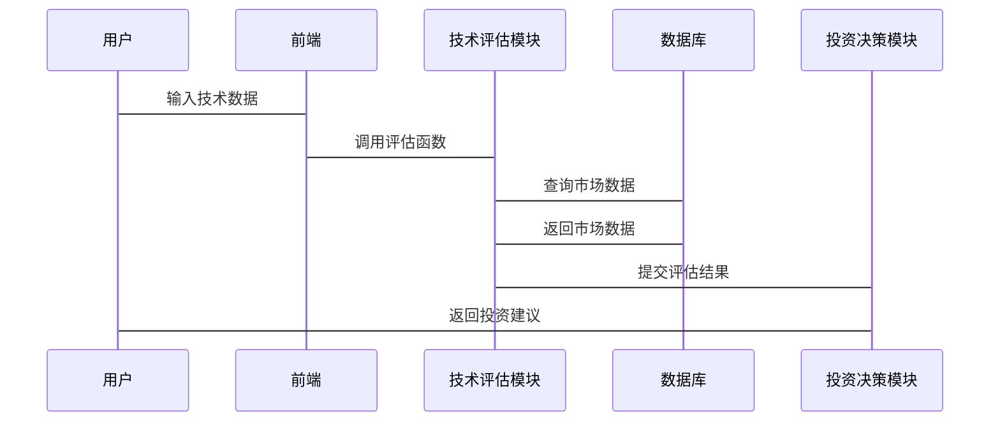

                 


# 价值投资中的新型可回收复合材料技术

> 关键词：价值投资、可回收复合材料、技术评估、投资决策、材料科学

> 摘要：本文探讨了如何通过价值投资的方法，评估和选择具有商业潜力的新型可回收复合材料技术。文章从价值投资的基本概念出发，详细分析了可回收复合材料技术的核心原理、技术评估与价值分析方法，以及具体的评估模型和系统架构设计。通过实际案例分析，展示了如何将技术评估与投资决策相结合，为投资者提供科学的决策依据。

---

# 第1章: 价值投资与新型可回收复合材料技术概述

## 1.1 价值投资的基本概念

### 1.1.1 价值投资的定义与核心理念
价值投资是一种以低于资产内在价值的价格买入优质资产的投资策略。其核心理念在于寻找市场低估的资产，并长期持有，等待其价值回归。这种方法强调基本面分析，注重企业的财务健康、行业地位和竞争优势。

### 1.1.2 可回收复合材料技术的背景与意义
复合材料是由基体和增强体组成的材料，因其优异的性能广泛应用于航空航天、汽车制造和建筑等领域。然而，传统复合材料难以回收，造成资源浪费和环境污染。可回收复合材料技术通过创新设计和工艺，解决了这一难题，具有重要的环保和经济意义。

### 1.1.3 价值投资与复合材料技术的结合点
价值投资关注技术的市场潜力和商业价值。可回收复合材料技术由于其环保优势和高效性能，符合市场对可持续发展的需求，具备较高的投资价值。投资者可以通过技术评估和市场分析，识别具有潜力的技术，进行长期投资。

## 1.2 新型可回收复合材料技术的定义与特点

### 1.2.1 复合材料的基本组成与性能
复合材料由基体（如树脂）和增强体（如纤维）组成，具有高强度、轻量化和耐腐蚀等性能。这些特性使其在多个领域得到广泛应用。

### 1.2.2 可回收复合材料的技术优势
可回收复合材料通过可降解树脂和模块化设计，实现了材料的高效回收和循环利用，减少了资源浪费和环境污染。

### 1.2.3 新型复合材料技术的市场前景
随着环保意识的增强和政策的支持，可回收复合材料在汽车、建筑和电子等领域的需求不断增加，市场前景广阔。

## 1.3 价值投资中的技术评估与筛选

### 1.3.1 技术评估的核心指标
技术评估需考虑经济性、可行性和市场竞争力。经济性包括生产成本和回收成本；可行性包括技术成熟度和工艺复杂度；市场竞争力则涉及市场需求和技术壁垒。

### 1.3.2 可回收复合材料技术的筛选标准
筛选标准包括技术的可回收性、成本效益、市场前景和竞争优势。优先选择那些具有高效回收工艺和显著成本优势的技术。

### 1.3.3 技术评估与投资决策的关系
技术评估为投资决策提供科学依据。通过评估，投资者可以识别高潜力的技术，优化投资组合，降低投资风险。

## 1.4 本章小结
本章介绍了价值投资的基本概念和可回收复合材料技术的背景与意义，探讨了两者结合的潜力。技术评估是投资决策的关键，需综合考虑技术的经济性、可行性和市场竞争力。

---

# 第2章: 新型可回收复合材料技术的核心原理

## 2.1 复合材料的基本结构与性能

### 2.1.1 复合材料的组成与结构
复合材料由基体和增强体组成，基体提供粘结和保护作用，增强体提高材料的强度和刚性。

### 2.1.2 复合材料的力学性能
复合材料具有高强度、轻量化和耐疲劳等优异性能，适用于高性能结构的应用。

### 2.1.3 复合材料的可回收性设计
通过模块化设计和可降解树脂，可回收复合材料实现了材料的高效回收和循环利用。

## 2.2 可回收复合材料的制备技术

### 2.2.1 常用复合材料制备方法
常用方法包括层压法、模压法和树脂传递模塑法，每种方法都有其优缺点。

### 2.2.2 可回收复合材料的创新工艺
创新工艺包括使用可降解树脂和模块化结构设计，降低了回收难度，提高了回收效率。

### 2.2.3 制备过程中的关键参数控制
关键参数包括树脂含量、固化时间和温度，这些参数直接影响材料的性能和可回收性。

## 2.3 可回收复合材料的性能优化

### 2.3.1 材料性能的优化目标
优化目标包括提高强度和刚性，同时降低密度和成本。

### 2.3.2 性能优化的数学模型
通过有限元分析建立性能优化模型，预测材料的力学性能和回收效率。

### 2.3.3 实验验证与性能对比
通过实验验证模型的准确性，对比传统复合材料和可回收复合材料的性能差异。

## 2.4 本章小结
本章详细分析了复合材料的基本结构和性能，探讨了可回收复合材料的制备技术和性能优化方法。创新工艺和模块化设计是实现高效回收的关键。

---

# 第3章: 技术评估与价值分析方法

## 3.1 技术评估的核心指标

### 3.1.1 技术的经济性评估
经济性评估包括生产成本、回收成本和投资回报率。低成本和高回收率的技术更具投资价值。

### 3.1.2 技术的可行性和成熟度
技术成熟度包括工艺可行性和市场认可度。成熟的技术风险较低，易于产业化。

### 3.1.3 技术的市场竞争力
市场竞争力包括市场需求和技术壁垒。高需求和高壁垒的技术具有竞争优势。

## 3.2 价值分析的数学模型

### 3.2.1 技术价值的评估公式
技术价值 = （市场需求 × 技术性能）/ 成本

### 3.2.2 技术生命周期的数学模型
生命周期分为导入期、成长期、成熟期和衰退期，模型预测各阶段的市场需求和技术价值。

### 3.2.3 技术投资回报率的计算方法
投资回报率 = （年利润 - 初始投资） / 初始投资

## 3.3 技术与市场的匹配分析

### 3.3.1 市场需求分析与技术匹配
通过市场调研和技术分析，确定技术是否符合市场需求。

### 3.3.2 技术的市场定位与竞争优势
分析技术在市场中的定位和竞争优势，确定其市场潜力。

### 3.3.3 技术的商业模式创新
探索新的商业模式，如订阅制或共享制，提高技术的市场竞争力。

## 3.4 本章小结
本章探讨了技术评估的核心指标和价值分析的数学模型，强调技术与市场的匹配对投资决策的重要性。

---

# 第4章: 可回收复合材料技术的评估模型

## 4.1 技术评估模型的构建

### 4.1.1 模型构建的理论基础
基于技术评估的核心指标和价值分析的数学模型，构建综合评估模型。

### 4.1.2 模型的输入变量与输出结果
输入变量包括技术性能、成本和市场需求；输出结果为技术价值和投资回报率。

### 4.1.3 模型的适用范围与限制
适用于可回收复合材料技术的初步筛选，但需结合实际情况进行调整。

## 4.2 技术生命周期分析

### 4.2.1 技术生命周期的阶段划分
分为导入期、成长期、成熟期和衰退期，不同阶段的技术评估重点不同。

### 4.2.2 不同阶段的技术评估重点
导入期注重技术创新，成长期关注市场推广，成熟期关注成本优化，衰退期关注技术更新。

## 4.3 本章小结
本章构建了技术评估模型，分析了技术生命周期对评估的影响。模型为投资者提供了科学的决策工具。

---

# 第5章: 项目实战与案例分析

## 5.1 项目背景与目标
某新型可回收复合材料技术项目，目标是评估其市场潜力和投资价值。

## 5.2 系统功能设计
### 5.2.1 领域模型（mermaid类图）
```mermaid
classDiagram
    class 技术评估模块 {
        输入变量：技术性能、成本、市场需求
        输出结果：技术价值、投资回报率
    }
    class 市场分析模块 {
        输入变量：市场规模、竞争情况
        输出结果：市场潜力、竞争优势
    }
    class 投资决策模块 {
        输入变量：技术价值、市场潜力
        输出结果：投资建议、风险评估
    }
   抽屉关系：抽屉关系
```

### 5.2.2 系统架构设计（mermaid架构图）


### 5.2.3 系统接口设计
系统接口包括数据输入接口、评估结果输出接口和用户查询接口。

### 5.2.4 系统交互（mermaid序列图）


## 5.3 项目实现

### 5.3.1 环境配置
安装Python、数据库和前端框架，配置开发环境。

### 5.3.2 核心代码实现
```python
def calculate_technology_value(technology_performance, cost, market_demand):
    return technology_performance * market_demand / cost

def calculate_roi(profits, initial_investment):
    return (profits - initial_investment) / initial_investment
```

### 5.3.3 案例分析
以某新型可回收复合材料技术为例，计算其技术价值和投资回报率。

## 5.4 项目小结
通过案例分析，验证了评估模型的有效性和实用性，为投资者提供了科学的决策依据。

---

# 第6章: 最佳实践与总结

## 6.1 最佳实践 tips
- 选择具有高市场需求和成本优势的技术
- 注重技术的可回收性和循环利用潜力
- 结合技术生命周期，制定合理的投资策略

## 6.2 小结
本文详细探讨了价值投资中的新型可回收复合材料技术，从技术原理到评估方法，再到实际应用，为投资者提供了系统的指导。

## 6.3 注意事项
- 评估模型需结合实际情况进行调整
- 注意技术的市场风险和政策风险
- 投资决策需综合考虑多种因素

## 6.4 拓展阅读
推荐阅读相关领域的学术论文和行业报告，深入了解新型可回收复合材料技术的发展趋势和应用前景。

---

# 附录

## 附录A: 技术评估指标与权重

## 附录B: 评估模型的详细公式

## 附录C: 可回收复合材料技术的市场数据

---

以上是《价值投资中的新型可回收复合材料技术》的完整目录和内容概要。通过系统分析和实际案例，本文为投资者提供了科学的技术评估方法和投资决策依据。

