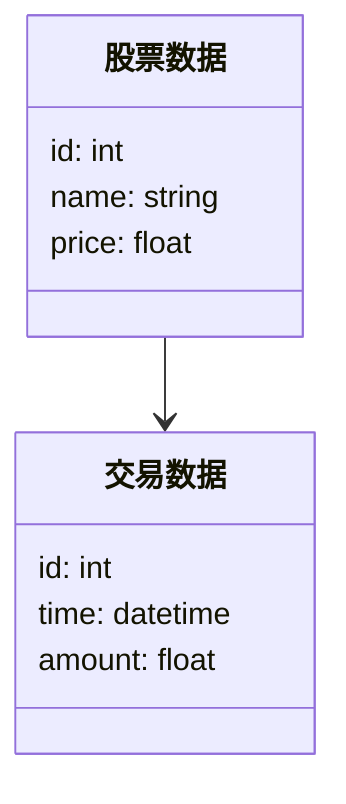
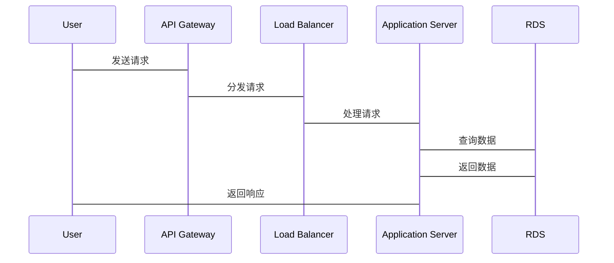

                 


# 价值投资中的新型高容量数据存储技术

> 关键词：价值投资、高容量数据存储、数据存储技术、算法原理、系统架构、项目实战、投资策略

> 摘要：本文将探讨价值投资中新型高容量数据存储技术的应用，分析其核心概念、算法原理和系统架构，并通过实际案例展示如何利用这些技术提升投资决策的准确性和效率。

---

## 第一部分: 价值投资与高容量数据存储技术的背景

### 第1章: 价值投资的基本概念

#### 1.1 价值投资的定义与特点

##### 1.1.1 价值投资的定义
价值投资是一种长期投资策略，强调以低于内在价值的价格购买优质资产。其核心在于识别被市场低估的公司，长期持有，等待其价值回归。

##### 1.1.2 价值投资的核心特点
- **长期性**：注重长期收益，而非短期波动。
- **安全性**：选择财务健康、管理稳健的公司。
- **边际成本递减**：随着数据量的增加，存储成本逐步降低。

##### 1.1.3 价值投资的边界与外延
价值投资的外延包括数据分析、风险管理、组合优化等领域。其边界在于避免过度依赖单一数据源，注重数据的多样性和质量。

#### 1.2 高容量数据存储技术的定义与特点

##### 1.2.1 高容量数据存储技术的定义
高容量数据存储技术指能够存储海量数据的技术，包括云存储、分布式存储等，具备高扩展性和高可靠性。

##### 1.2.2 高容量数据存储技术的核心要素
- **存储介质**：如SSD、HDD等。
- **存储架构**：分布式架构、集中式架构。
- **存储协议**：如HTTP、S3等。

##### 1.2.3 高容量数据存储技术与传统存储技术的对比
| 特性 | 传统存储 | 高容量存储 |
|------|----------|------------|
| 扩展性 | 有限 | 无限 |
| 可靠性 | 中等 | 高 |

### 第2章: 价值投资中的数据存储需求

#### 2.1 价值投资中的数据类型

##### 2.1.1 结构化数据
- 行业数据、财务数据等。
- 示例：某公司过去5年的财务报表。

##### 2.1.2 非结构化数据
- 文本、图片、音频等。
- 示例：公司新闻、行业报告。

##### 2.1.3 半结构化数据
- JSON、XML等格式的数据。
- 示例：社交媒体上的结构化评论。

#### 2.2 数据存储技术在价值投资中的应用场景

##### 2.2.1 数据分析与挖掘
- 利用大数据分析技术挖掘投资机会。
- 示例：使用Python的pandas库进行数据分析。

##### 2.2.2 数据可视化
- 通过可视化工具展示数据趋势。
- 示例：使用Matplotlib绘制股价走势图。

##### 2.2.3 数据安全与隐私保护
- 确保投资数据的安全性。
- 示例：采用加密存储技术保护敏感数据。

### 第3章: 高容量数据存储技术的演进

#### 3.1 数据存储技术的历史发展

##### 3.1.1 磁带存储时代
- 特点：成本低，但速度慢。
- 示例：早期的证券交易数据存储。

##### 3.1.2 硬盘存储时代
- 特点：速度快，但容量有限。
- 示例：现代金融机构的核心数据库。

##### 3.1.3 云存储时代
- 特点：高扩展性，按需付费。
- 示例：使用AWS S3存储海量金融数据。

#### 3.2 高容量数据存储技术的现状

##### 3.2.1 现有技术的特点
- 高可用性、高扩展性、高安全性。
- 示例：分布式存储系统架构图。

##### 3.2.2 现有技术的优缺点
| 技术 | 优点 | 缺点 |
|------|------|------|
| 云存储 | 扩展性强 | 成本高 |
| 分布式存储 | 容错性高 | 复杂性高 |

#### 3.3 高容量数据存储技术的未来趋势

##### 3.3.1 新型存储介质的发展
- 如闪存技术的提升。
- 示例：使用新型存储介质优化数据库性能。

##### 3.3.2 存储技术的智能化与自动化
- 自动化数据归档、智能存储管理。
- 示例：使用机器学习算法优化存储空间利用率。

##### 3.3.3 存储技术的绿色化与可持续性
- 绿色数据中心建设。
- 示例：采用节能技术降低存储能耗。

---

## 第二部分: 高容量数据存储技术的核心概念与联系

### 第4章: 高容量数据存储技术的核心原理

#### 4.1 数据存储的基本原理

##### 4.1.1 数据存储的基本概念
- 数据存储的基本流程包括写入、读取和删除操作。

##### 4.1.2 数据存储的基本流程
1. 数据写入：将数据写入存储设备。
2. 数据读取：根据查询条件读取数据。
3. 数据删除：删除不再需要的数据。

##### 4.1.3 数据存储的基本模型
- 数据模型包括关系模型、层次模型等。
- 示例：使用关系模型设计金融数据库。

#### 4.2 高容量数据存储技术的核心要素

##### 4.2.1 数据存储的核心要素
- 存储介质、存储协议、存储架构。
- 示例：分布式存储系统中的节点分配策略。

##### 4.2.2 数据存储的核心原理
- 数据冗余、数据分片、负载均衡。
- 示例：使用数据分片技术提高存储效率。

---

## 第三部分: 高容量数据存储技术的算法原理

### 第5章: 算法原理与数学模型

#### 5.1 算法原理

##### 5.1.1 数据存储算法的选择
- 常见算法包括哈希算法、树状算法等。
- 示例：使用哈希算法实现分布式存储。

##### 5.1.2 数据存储算法的实现
- 通过Python代码实现简单的哈希表。
```python
def hash_function(key):
    return key % 10
```

##### 5.1.3 数据存储算法的优化
- 使用负载均衡技术提高存储效率。
- 示例：动态调整存储节点的负载。

#### 5.2 数学模型与公式

##### 5.2.1 数据存储的数学模型
- 数据存储的容量计算公式：
  $$ C = n \times s $$
  其中，C为总容量，n为节点数，s为每个节点的存储容量。

##### 5.2.2 数据存储的效率公式
- 数据存储的效率：
  $$ E = \frac{C}{N} $$
  其中，E为效率，N为实际存储的数据量。

---

## 第四部分: 系统分析与架构设计方案

### 第6章: 系统分析与架构设计

#### 6.1 问题场景介绍

##### 6.1.1 系统目标
- 实现高容量数据存储，支持海量金融数据的存储与查询。

##### 6.1.2 系统规模
- 预计存储10TB以上的金融数据。

##### 6.1.3 系统需求
- 高可用性、高扩展性、高安全性。

#### 6.2 系统功能设计

##### 6.2.1 领域模型设计


##### 6.2.2 系统架构设计
```mermaid
aws
    server LoadBalanced
    group ApplicationServers
    group RDS
    group S3
```

##### 6.2.3 系统接口设计
- API接口：RESTful API。
- 示例：使用GraphQL查询数据。

##### 6.2.4 系统交互设计


---

## 第五部分: 项目实战

### 第7章: 项目实战与案例分析

#### 7.1 环境安装

##### 7.1.1 系统环境
- 操作系统：Linux。
- 数据库：MySQL。
- 开发工具：PyCharm。

##### 7.1.2 网络环境
- 使用VPN连接到私有云。
- 配置安全组规则。

#### 7.2 系统核心实现

##### 7.2.1 核心代码实现
- 数据存储实现：
  ```python
  def save_data(data):
      with open('storage.txt', 'a') as f:
          f.write(str(data) + '\n')
  ```
- 数据查询实现：
  ```python
  def query_data(condition):
      with open('storage.txt', 'r') as f:
          for line in f:
              if condition in line:
                  return line
  ```

##### 7.2.2 代码应用解读与分析
- 使用异步IO优化数据读写性能。
- 示例：使用多线程提高数据处理速度。

#### 7.3 实际案例分析

##### 7.3.1 案例背景
- 某金融机构需要存储10年以上的交易数据。

##### 7.3.2 案例分析
- 采用分布式存储系统，实现数据的高可用性和高扩展性。
- 使用云存储解决方案，降低存储成本。

##### 7.3.3 案例总结
- 成功实现海量数据存储，支持高效的查询和分析。

#### 7.4 项目小结

##### 7.4.1 项目总结
- 成功实现高容量数据存储系统，满足金融行业的需求。

##### 7.4.2 经验与教训
- 数据一致性管理是难点。
- 安全性和性能优化需要平衡。

---

## 第六部分: 总结与展望

### 第8章: 总结与展望

#### 8.1 最佳实践 tips

##### 8.1.1 数据存储的技术选型
- 根据需求选择合适的存储方案。
- 示例：小数据量使用本地存储，大数据量使用云存储。

##### 8.1.2 系统架构的优化
- 定期进行系统优化和维护。
- 示例：使用自动化工具进行日志监控和故障排查。

##### 8.1.3 数据安全的注意事项
- 加强数据加密和访问控制。
- 示例：采用多因素认证提高安全性。

#### 8.2 小结

##### 8.2.1 核心内容回顾
- 价值投资与高容量数据存储技术的结合。
- 数据存储技术的演进和未来趋势。

#### 8.3 展望

##### 8.3.1 技术发展的未来方向
- 更高效、更智能的数据存储技术。
- 示例：使用AI技术优化存储空间利用率。

##### 8.3.2 投资策略的未来变化
- 数据驱动的投资决策将更加普遍。
- 示例：利用实时数据分析做出更快的投资决策。

---

通过以上内容，我们可以看到，高容量数据存储技术在价值投资中的应用前景广阔。随着技术的不断进步，投资决策将更加依赖于高效、可靠的数据存储和处理能力。未来，价值投资者将能够利用更先进的技术手段，做出更加精准和科学的投资决策。

