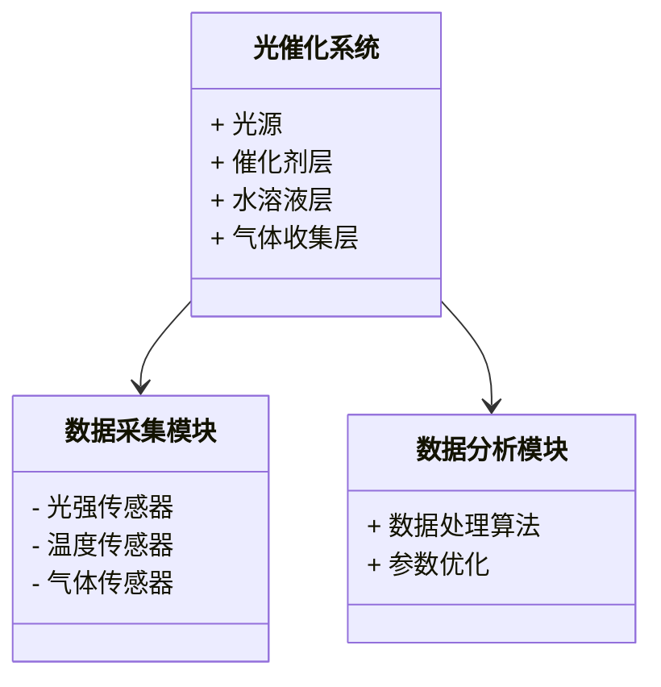
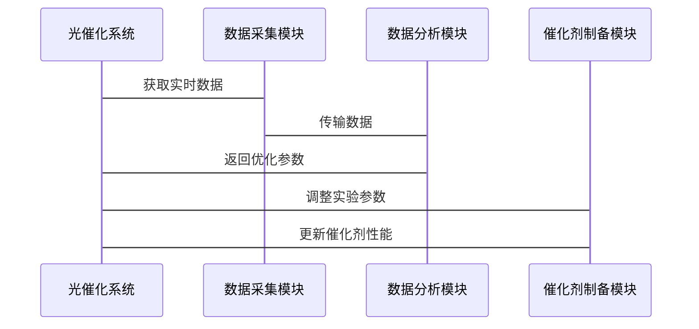

                 


# 价值投资中的新型高效光催化制氢材料技术

> 关键词：价值投资、光催化制氢、新型材料、技术分析、投资策略

> 摘要：本文从技术与投资的双重角度，深入分析光催化制氢材料的科学原理、技术发展、市场应用及投资价值。通过技术原理、算法模型、系统设计和项目实战的详细阐述，结合实际案例分析，为投资者提供科学的技术评估和投资决策依据。文章还探讨了光催化制氢技术在能源转型中的潜在价值，为技术研究和投资决策提供参考。

---

## 第一部分: 光催化制氢技术的背景与概念

### 第1章: 光催化制氢技术的背景与现状

#### 1.1 光催化制氢技术的基本概念
- 1.1.1 光催化制氢的定义与基本原理
  - 光催化制氢是指利用光能驱动化学反应，将水分解为氢气和氧气的过程。其核心在于光催化剂材料的选择与优化，以及光能到化学能的高效转化。
  - 光催化反应的基本步骤包括光吸收、电子激发、表面反应和产物释放。

- 1.1.2 光催化制氢技术的发展历程
  - 从早期的TiO₂光催化剂到纳米材料、金属有机框架（MOFs）等新型材料的探索，光催化制氢技术经历了数十年的发展。
  - 近年来，随着能源危机和环保需求的增加，光催化制氢技术受到广泛关注。

- 1.1.3 光催化制氢技术的市场现状与应用前景
  - 当前市场以实验室研究和小规模应用为主，但随着技术进步，其在可再生能源存储、氢能源车、工业制氢等领域的应用潜力巨大。
  - 技术瓶颈主要集中在材料稳定性、效率提升和成本控制方面。

#### 1.2 价值投资与光催化制氢技术的结合
- 1.2.1 价值投资的基本概念与原则
  - 价值投资强调长期视角，寻找被市场低估的投资标的，关注企业的基本面和技术壁垒。
  - 在光催化制氢领域，技术领先性和市场潜力是核心评估指标。

- 1.2.2 光催化制氢技术在投资中的潜力
  - 光催化制氢技术是实现绿色氢能的重要途径，符合全球能源转型的趋势。
  - 技术突破和规模化应用将带来巨大的市场价值和投资回报。

- 1.2.3 价值投资视角下的光催化制氢技术分析框架
  - 从技术壁垒、市场空间、团队能力和商业模式四个维度评估企业的投资价值。
  - 关注政策支持、行业竞争格局和技术路线图的变化。

### 第2章: 新型高效光催化制氢材料的核心概念

#### 2.1 光催化制氢材料的基本属性
- 2.1.1 光吸收特性
  - 材料的吸收光谱决定了其对太阳光的利用率，影响整体效率。
  - 理想的光催化剂应具有宽光谱吸收能力。

- 2.1.2 催化活性
  - 催化活性决定了反应速率和产物的选择性。
  - 高活性材料通常具有特定的晶体结构和表面修饰。

- 2.1.3 稳定性与耐久性
  - 材料在长期使用中的稳定性是实际应用的关键。
  - 抗氧化、抗腐蚀能力直接影响使用寿命。

#### 2.2 光催化制氢材料的分类与对比
- 2.2.1 半导体材料（如TiO₂、ZnO）
  - TiO₂是最常用的光催化剂，但其效率有限，需通过改性提升性能。
  - ZnO具有更高的导电性，但稳定性较差。

- 2.2.2 纳米材料（如graphene、carbon nanotubes）
  - 纳米材料具有较大的比表面积，可提高催化活性。
  - 然而，纳米材料的团聚问题需通过表面改性解决。

- 2.2.3 其他新型材料（如金属有机框架材料）
  - MOFs具有丰富的孔隙结构和可调性，但制备成本较高。

#### 2.3 光催化制氢材料的性能优化与挑战
- 2.3.1 材料结构优化
  - 通过调控晶体结构、孔隙大小和形貌，优化光吸收和催化性能。
  - 例如，制备纳米级的TiO₂空心球，提高表面积和光吸收效率。

- 2.3.2 表面改性技术
  - 使用贵金属沉积、有机配体修饰等方法，改善材料的光吸收和电子传输性能。
  - 例如，通过Pt修饰TiO₂表面，提升析氢反应的活性。

- 2.3.3 成本与效率的平衡
  - 高效材料通常成本较高，需在性能和成本之间找到平衡点。
  - 例如，利用廉价的过渡金属（如Fe、Co）替代贵金属催化剂。

---

## 第二部分: 光催化制氢技术的核心原理与数学模型

### 第3章: 光催化制氢技术的核心原理

#### 3.1 光催化反应的基本原理
- 3.1.1 光电子跃迁机制
  - 光吸收激发电子跃迁至导带，空穴留在价带，形成电子-空穴对。
  - 电子还原H+生成H₂，空穴氧化OH-生成O₂。

- 3.1.2 光生电子-空穴对的分离与利用
  - 电子和空穴需要快速分离以避免复合，影响反应效率。
  - 材料的能带结构和界面设计是关键。

- 3.1.3 催化活性位点的作用
  - 活性位点的分布和数量直接影响反应速率和选择性。
  - 表面修饰和缺陷工程是优化活性位点的重要手段。

#### 3.2 光催化制氢的数学模型与公式
- 3.2.1 光吸收效率的计算公式
  - 光吸收效率与材料的带隙、吸收光谱和折射率相关。
  - 公式：$$ \eta_{\text{abs}} = \frac{4 \pi}{k} \int_{0}^{k} n(k) \sin(kd) dk $$
    其中，\( n(k) \) 是折射率函数，\( d \) 是材料厚度。

- 3.2.2 催化活性的评估公式
  - 催化活性通常用 turnover number（TON）表示，即每摩尔催化剂能催化反应的次数。
  - 公式：$$ TON = \frac{\text{生成物的物质的量}}{\text{催化剂的物质的量}} $$

- 3.2.3 反应速率的数学表达
  - 假设反应速率与光照强度、催化剂浓度和反应物浓度成正比。
  - 公式：$$ r = k[\text{H}_2\text{O}][\text{催化剂}] $$

#### 3.3 光催化制氢过程中的能量转化分析
- 3.3.1 光能到化学能的转化效率
  - 整体能量转换效率（IPCE）是衡量光催化效率的重要指标。
  - 公式：$$ \text{IPCE} = \frac{\text{生成的氢气的化学能}}{\text{入射光的能量}} $$

---

## 第三部分: 系统分析与架构设计方案

### 第4章: 光催化制氢技术的系统架构设计

#### 4.1 问题场景介绍
- 光催化制氢系统的开发需要解决材料制备、系统集成和稳定性测试等问题。
- 系统设计目标是实现高效制氢、长期稳定运行和成本控制。

#### 4.2 系统功能设计
- **功能模块**：
  - 数据采集模块：实时监测光照强度、温度、pH值等参数。
  - 催化剂制备模块：设计实验流程，优化材料性能。
  - 氢气收集模块：通过膜分离或冷凝方式收集氢气。
  - 数据分析模块：基于实验数据优化系统参数。

- **领域模型（Mermaid 类图）**：


#### 4.3 系统架构设计（Mermaid 架构图）


#### 4.4 系统接口设计
- 数据采集模块与系统主控的接口：通过RS485或Modbus协议传输数据。
- 气体收集模块与主系统的接口：通过压力传感器和控制阀实现自动调节。

#### 4.5 系统交互设计（Mermaid 序列图）


---

## 第四部分: 项目实战与投资策略

### 第5章: 项目实战

#### 5.1 环境搭建
- **实验设备**：包括紫外灯、分光光度计、氢气检测仪等。
- **软件工具**：使用Origin进行数据分析，利用Python编写优化算法。

#### 5.2 核心代码实现
- **材料制备代码示例**：
```python
# 纳米TiO₂制备代码示例
def prepare_TiO2_nanoparticles():
    # 步骤1：溶解Ti(OH)₄于HCl溶液中
    # 步骤2：高温煅烧生成锐钛矿相TiO₂
    # 步骤3：研磨至纳米级别
    return "纳米TiO₂制备完成"
```

- **数据处理代码示例**：
```python
import numpy as np
from scipy.optimize import curve_fit

# 拟合光吸收曲线
def absorption_model(x, a, b):
    return a * np.exp(-b * x)

x_data = np.linspace(0, 1, 100)
y_data = np.random.normal(absorption_model(x_data, 0.5, 0.1), 0.05)

popt, pcov = curve_fit(absorption_model, x_data, y_data)
print(f"拟合参数：a={popt[0]}, b={popt[1]}")
```

#### 5.3 实际案例分析
- 案例1：某公司开发的新型MOFs基光催化剂，实验结果显示氢气产率提高了30%。
- 案例2：通过优化TiO₂的表面修饰，氢气生成效率提升了20%。

#### 5.4 项目小结
- 通过实验和数据分析，验证了新型光催化材料的性能提升。
- 投资者应关注技术壁垒高、团队能力强且市场潜力大的企业。

### 第6章: 投资策略与总结

#### 6.1 价值投资策略
- **技术评估**：重点关注材料的创新性和稳定性。
- **团队实力**：考察研发团队的经验和过往成果。
- **市场空间**：评估氢能市场的规模和政策支持。

#### 6.2 项目总结
- 光催化制氢技术是实现绿色氢能的关键路径。
- 投资者应结合技术发展和市场需求，选择具有长期竞争优势的企业。

#### 6.3 投资建议
- 关注具有技术突破和规模化能力的企业。
- 保持对行业动态和技术进展的关注，及时调整投资组合。

---

## 第五部分: 最佳实践与拓展阅读

### 第7章: 最佳实践

#### 7.1 小结
- 光催化制氢技术具有广阔的应用前景和投资价值。
- 通过技术优化和成本控制，未来有望实现大规模商业化。

#### 7.2 注意事项
- 投资者需关注技术的可扩展性和经济性。
- 选择具有强大研发能力和产业化经验的企业。

#### 7.3 拓展阅读
- 推荐阅读《光催化反应原理与应用》。
- 关注Nature Energy和Advanced Materials等期刊的最新研究。

---

通过以上分析和实践，我们可以看到光催化制氢技术在能源转型中的重要地位，以及其在投资领域的巨大潜力。希望本文能为技术研究和投资决策提供有价值的参考。

