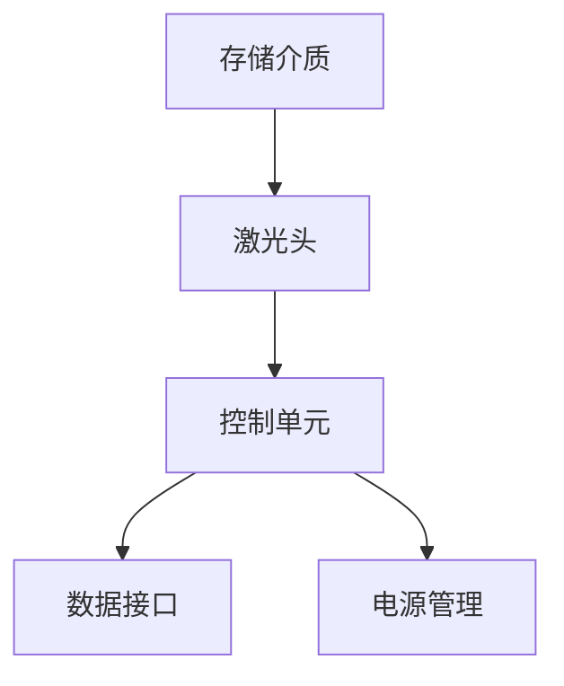
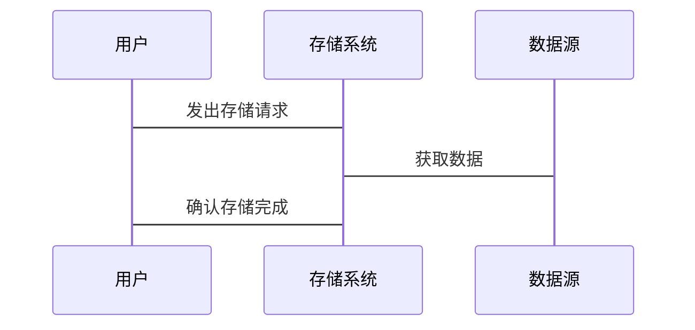

                 


# 价值投资中的新型高效光存储技术前景

## 关键词：价值投资、光存储技术、存储系统、数据存储、投资前景

## 摘要：随着数据量的爆炸式增长，高效、可靠的存储技术变得尤为重要。新型高效光存储技术作为一种新兴的技术，不仅在存储密度和成本上具有显著优势，还在环保和节能方面表现出色。本文从价值投资的角度，深入分析了新型高效光存储技术的市场前景、技术优势以及其在不同领域的应用潜力，帮助投资者更好地把握这一领域的投资机会。

---

# 第一部分: 价值投资中的光存储技术背景与概念

## 第1章: 价值投资与光存储技术概述

### 1.1 价值投资的基本概念

#### 1.1.1 价值投资的定义与核心理念
价值投资是一种投资策略，强调以低于市场价值的价格买入优质资产。其核心理念在于长期投资、精选个股以及安全边际。这种策略要求投资者深入分析企业的基本面，寻找具有持续竞争优势和良好发展前景的企业。

#### 1.1.2 光存储技术的定义与分类
光存储技术是一种利用光信号进行数据存储的技术，主要包括CD、DVD、蓝光光盘等传统光存储技术和新型的高密度光存储技术。新型高效光存储技术通过改进材料、激光技术和存储算法，实现了更高的存储密度、更快的读写速度和更长的数据保留时间。

#### 1.1.3 价值投资与光存储技术的结合
价值投资的核心在于寻找被市场低估的优质企业或技术。光存储技术作为一种具有广阔市场前景和技术创新潜力的领域，为投资者提供了丰富的投资机会。

### 1.2 光存储技术的发展历程

#### 1.2.1 光存储技术的历史演变
光存储技术起源于20世纪70年代，经历了从CD到蓝光光盘的演变。随着技术的进步，光存储技术的存储密度不断提高，应用场景也逐渐扩展。

#### 1.2.2 新型高效光存储技术的出现
近年来，新型高效光存储技术的出现，如5D光存储技术，通过使用新型材料和更高精度的激光技术，实现了单张光盘高达100TB的存储容量。

#### 1.2.3 光存储技术的现状与趋势
当前，光存储技术在数据中心、云存储、档案管理等领域得到了广泛应用。随着数据量的持续增长，光存储技术的市场需求将进一步扩大。

### 1.3 光存储技术的核心优势

#### 1.3.1 高存储密度与低成本
相比传统硬盘存储，光存储技术具有更高的存储密度，单张光盘的容量可以达到数百GB甚至TB级别，同时成本相对较低。

#### 1.3.2 高可靠性和长寿命
光存储技术采用先进的材料和制造工艺，具有高可靠性和长数据保留时间，通常可以达到数十年，适合长期数据存档。

#### 1.3.3 环保与节能特性
光存储技术在生产过程中能耗较低，且存储介质无毒无害，符合环保要求。同时，光存储设备的运行能耗也相对较低。

### 1.4 本章小结
本章介绍了价值投资的基本概念和光存储技术的定义、发展历程及其核心优势。通过分析，可以看出光存储技术在存储密度、成本、可靠性和环保性方面具有显著优势，为价值投资提供了良好的基础。

---

## 第2章: 价值投资中的光存储技术前景分析

### 2.1 光存储技术的市场应用领域

#### 2.1.1 数据中心与云存储
随着云计算和大数据技术的快速发展，数据中心的存储需求不断增加。光存储技术凭借其高存储密度和低能耗，成为数据中心的理想选择。

#### 2.1.2 档案管理与长期存储
政府机构、企业和科研机构需要长期保存大量数据和档案。光存储技术的高可靠性和长数据保留时间使其在这一领域具有重要应用价值。

#### 2.1.3 视频与多媒体存储
视频和多媒体数据的快速增长对存储技术提出了更高要求。光存储技术通过高存储密度和大容量，能够有效满足视频存储的需求。

### 2.2 光存储技术的经济效益分析

#### 2.2.1 投资成本与回报周期
光存储技术的初期投资成本相对较高，但由于其高存储密度和低运营成本，整体回报周期较短。

#### 2.2.2 市场需求与增长潜力
随着数据量的持续增长，光存储技术的市场需求将快速增长。预计在未来几年内，光存储技术的市场规模将呈现指数级增长。

#### 2.2.3 技术进步对成本的影响
技术创新将降低光存储技术的生产成本，进一步提高其市场竞争力。

### 2.3 光存储技术的竞争优势

#### 2.3.1 技术壁垒与专利分析
光存储技术的核心技术涉及材料科学、激光技术和数据编码等领域，具有较高的技术壁垒和专利保护。

#### 2.3.2 产品差异化与市场定位
新型高效光存储技术通过提供更高的存储容量和更低的成本，能够在市场上形成差异化竞争优势。

#### 2.3.3 未来技术发展的不确定性
尽管光存储技术前景广阔，但其未来发展仍存在一定的不确定性，如技术瓶颈和市场竞争等。

### 2.4 本章小结
本章分析了光存储技术的市场应用领域、经济效益及其竞争优势。通过分析，可以看出光存储技术在市场需求和技术创新方面具有显著优势，为价值投资者提供了良好的投资机会。

---

## 第3章: 光存储技术的核心原理与数学模型

### 3.1 光存储技术的基本原理

#### 3.1.1 光存储的基本概念
光存储技术通过激光在介质上记录和读取数据，利用光的反射特性实现数据存储。

#### 3.1.2 光存储的物理机制
光存储的物理机制包括激光的聚焦、数据的写入和读取过程，以及数据的纠错编码。

#### 3.1.3 光存储的信号处理
光存储的信号处理包括数据的编码、调制和解调过程，以确保数据的准确读取。

### 3.2 光存储系统的数学模型

#### 3.2.1 存储容量计算公式
光存储系统的存储容量可以通过以下公式计算：
$$
\text{存储容量} = \frac{\text{光盘面积}}{\text{最小可读区域面积}} \times \text{每个区域的存储容量}
$$

#### 3.2.2 数据纠错编码的数学模型
数据纠错编码是光存储技术的重要组成部分，常用的纠错码为Reed-Solomon码和LDPC码。其纠错能力可以通过以下公式表示：
$$
\text{纠错能力} = \left\lfloor \frac{2t}{1} \right\rfloor
$$
其中，$t$为纠错码的纠错距离。

#### 3.2.3 存储系统性能的优化算法
存储系统性能的优化算法包括数据压缩、存储介质优化和读写速度优化等。

### 3.3 光存储技术的性能评估

#### 3.3.1 存储密度与读写速度
存储密度是光存储技术的重要指标，读写速度则是影响用户体验的关键因素。

#### 3.3.2 数据保留时间与可靠性
数据保留时间是光存储技术的重要特性，可靠性则是衡量存储系统稳定性的关键指标。

#### 3.3.3 能耗与环保指标
光存储技术的能耗和环保指标是其市场竞争力的重要组成部分。

### 3.4 本章小结
本章从光存储技术的基本原理出发，分析了其数学模型和性能评估指标。通过这些分析，可以更好地理解光存储技术的核心优势及其在价值投资中的潜在价值。

---

## 第4章: 光存储技术的系统分析与架构设计

### 4.1 光存储系统的总体架构

#### 4.1.1 系统功能设计
光存储系统的核心功能包括数据写入、读取、管理和维护等。

#### 4.1.2 系统架构图
以下是光存储系统的架构图，展示了其主要组成部分：



#### 4.1.3 系统接口设计
光存储系统的接口设计包括数据接口、控制接口和电源接口等。

#### 4.1.4 系统交互流程图
以下是光存储系统的交互流程图：



### 4.2 光存储技术的系统优化

#### 4.2.1 系统性能优化
通过优化存储算法和硬件设计，可以进一步提高光存储系统的性能。

#### 4.2.2 系统可靠性提升
通过引入冗余设计和数据备份机制，可以提高光存储系统的可靠性。

#### 4.2.3 系统能耗优化
通过优化电源管理和硬件设计，可以降低光存储系统的能耗。

### 4.3 本章小结
本章通过对光存储系统的总体架构和系统优化的分析，展示了如何通过系统设计和优化进一步提升光存储技术的性能和市场竞争力。

---

## 第5章: 光存储技术的项目实战与案例分析

### 5.1 项目环境安装

#### 5.1.1 系统安装步骤
以下是光存储系统安装的主要步骤：

1. 安装操作系统和驱动程序。
2. 安装光存储设备的控制软件。
3. 配置数据接口和网络连接。

#### 5.1.2 环境配置要求
光存储系统的运行环境包括硬件设备、操作系统和应用软件等。

### 5.2 系统核心实现

#### 5.2.1 关键技术实现
以下是光存储系统的核心实现代码示例：

```python
def write_data(data):
    # 数据写入函数
    pass

def read_data():
    # 数据读取函数
    pass

def error_correction():
    # 数据纠错函数
    pass
```

#### 5.2.2 代码实现与分析
通过上述代码实现，可以看出光存储系统的核心功能包括数据写入、数据读取和数据纠错等。

### 5.3 项目案例分析

#### 5.3.1 案例背景介绍
以下是某公司光存储项目的背景介绍：

该公司需要存储大量视频数据，选择使用新型高效光存储技术进行数据存档。

#### 5.3.2 案例实施过程
项目实施过程包括需求分析、系统设计、设备采购和系统部署等阶段。

#### 5.3.3 案例分析与总结
通过案例分析可以看出，新型高效光存储技术在视频数据存储中的应用效果显著，能够有效降低存储成本和能耗。

### 5.4 本章小结
本章通过项目实战和案例分析，展示了光存储技术在实际应用中的优势和价值。通过具体实施案例的分析，进一步验证了光存储技术的市场前景和投资价值。

---

## 第6章: 价值投资中的光存储技术投资策略与风险分析

### 6.1 投资策略分析

#### 6.1.1 投资目标选择
投资者应选择具有技术优势和市场潜力的光存储技术企业。

#### 6.1.2 投资组合优化
通过合理配置光存储技术和传统存储技术的投资比例，可以降低投资风险。

#### 6.1.3 投资周期与回报预期
光存储技术的投资周期较长，但回报潜力较大。

### 6.2 投资风险分析

#### 6.2.1 技术风险
光存储技术的技术瓶颈和专利纠纷可能对投资产生不利影响。

#### 6.2.2 市场风险
市场需求的不确定性可能导致光存储技术的市场表现不佳。

#### 6.2.3 经济风险
宏观经济环境的变化可能对光存储技术的投资产生影响。

### 6.3 投资机会与总结

#### 6.3.1 光存储技术的投资机会
随着数据量的快速增长，光存储技术的市场需求将不断增加，为投资者提供了广阔的投资机会。

#### 6.3.2 投资建议
投资者应选择具有技术优势和市场潜力的光存储技术企业进行投资，同时注意分散风险，合理配置投资组合。

### 6.4 本章小结
本章分析了光存储技术的投资策略与风险，为投资者提供了科学的投资建议。通过合理配置投资组合和分散风险，投资者可以更好地把握光存储技术的投资机会。

---

## 第7章: 结论与展望

### 7.1 结论

#### 7.1.1 核心结论
光存储技术在存储密度、成本、可靠性和环保性方面具有显著优势，具有广阔的市场前景和投资价值。

#### 7.1.2 研究总结
通过对光存储技术的深入分析，可以看出其在价值投资中的重要地位。

### 7.2 展望

#### 7.2.1 未来技术发展
未来，光存储技术将朝着更高存储密度、更快读写速度和更低能耗的方向发展。

#### 7.2.2 市场应用前景
随着数据量的持续增长，光存储技术的市场需求将进一步扩大，市场应用前景广阔。

#### 7.2.3 投资机会
投资者应密切关注光存储技术的发展动态，抓住投资机会，实现长期稳定的投资回报。

### 7.3 本章小结
本章总结了光存储技术的核心结论，并展望了其未来的技术发展和市场应用前景。通过本文的分析，可以看出光存储技术在价值投资中的重要地位和广阔前景。

---

## 第8章: 最佳实践与注意事项

### 8.1 投资者的最佳实践

#### 8.1.1 深入研究技术细节
投资者应深入研究光存储技术的核心原理和市场应用，以便做出科学的投资决策。

#### 8.1.2 关注行业动态
投资者应密切关注光存储技术的行业动态和技术进步，以便及时调整投资策略。

#### 8.1.3 分散投资风险
投资者应通过分散投资和合理配置投资组合，降低光存储技术投资的风险。

### 8.2 项目实施中的注意事项

#### 8.2.1 技术选型
在项目实施中，应根据具体需求选择合适的光存储技术。

#### 8.2.2 系统维护
光存储系统的维护和管理是确保其长期稳定运行的关键。

#### 8.2.3 成本控制
在项目实施中，应注重成本控制，合理分配资源，降低项目成本。

### 8.3 本章小结
本章总结了投资者在光存储技术投资中的最佳实践和项目实施中的注意事项，为投资者提供了科学的投资建议。

---

## 第9章: 拓展阅读与参考资料

### 9.1 拓展阅读

#### 9.1.1 光存储技术的相关书籍
以下是推荐的光存储技术相关书籍：

1. 《光存储技术与应用》
2. 《高效数据存储技术》

#### 9.1.2 相关技术文档
以下是推荐的相关技术文档：

1. 光存储技术白皮书
2. 数据存储技术发展报告

### 9.2 参考资料

#### 9.2.1 技术参考资料
以下是光存储技术相关的技术参考资料：

1. 光存储技术专利分析报告
2. 光存储技术市场研究

#### 9.2.2 市场参考资料
以下是光存储技术相关的市场参考资料：

1. 全球光存储市场分析报告
2. 光存储技术行业研究报告

### 9.3 本章小结
本章提供了光存储技术相关的拓展阅读和参考资料，为读者提供了进一步学习和研究的方向。

---

## 附录: 光存储技术相关术语解释

### 附录A: 光存储技术术语

#### A.1 光存储介质
光存储介质是指用于存储数据的光盘或芯片。

#### A.2 激光头
激光头是用于读取和写入光存储介质的光学设备。

#### A.3 数据纠错编码
数据纠错编码是用于检测和纠正数据传输或存储中的错误的编码技术。

#### A.4 存储密度
存储密度是指单位面积上存储的数据量。

---

## 结束语

感谢您的阅读！希望本文能为您提供有价值的投资建议和技术创新洞察，帮助您更好地把握光存储技术的投资机会。如需进一步了解，请参考相关拓展资料。

