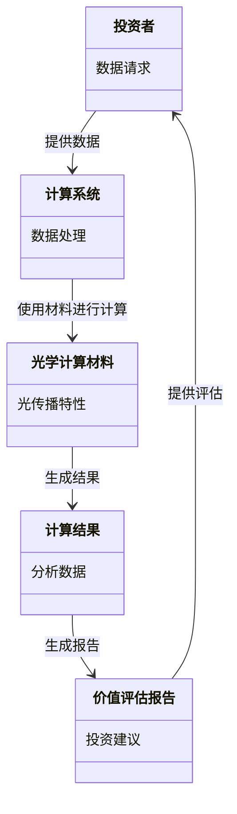

                 


# 价值投资中的新型高效光学计算材料技术

> 关键词：光学计算、材料技术、价值投资、投资决策、算法优化

> 摘要：本文探讨了新型高效光学计算材料技术在价值投资中的应用，分析其背景、核心概念、算法原理、系统架构，并通过实际案例展示其在价值评估中的应用，总结技术优势与未来发展方向。

---

## 第1章 背景与概述

### 1.1 光学计算材料技术的背景

#### 1.1.1 价值投资中的技术需求
价值投资依赖于对数据的深度分析，传统计算方法在处理复杂数据时效率低下，光学计算材料技术提供了更高的并行计算能力和效率。

#### 1.1.2 光学计算材料技术的定义与特点
光学计算材料是指利用光的传播特性进行信息处理的材料，其特点包括高并行性、低能耗和高速度。

#### 1.1.3 技术在价值投资中的应用前景
光学计算材料技术可以提高数据分析的速度和准确性，帮助投资者做出更明智的决策。

### 1.2 问题背景与描述

#### 1.2.1 传统光学计算的局限性
传统方法计算复杂度高，效率低，难以满足实时数据分析需求。

#### 1.2.2 新型高效光学计算材料的提出
新型材料通过优化光传播路径，显著提高了计算效率和精度。

#### 1.2.3 问题的解决思路与目标
通过优化材料特性和算法设计，实现高效的数据分析和价值评估。

---

## 第2章 核心概念与原理

### 2.1 核心概念与联系

#### 2.1.1 光学计算材料的物理特性
材料的折射率、吸收率和散射特性直接影响计算性能。

#### 2.1.2 材料属性与计算效率的关系
材料属性通过影响光的传播路径和速度，直接决定计算效率。

#### 2.1.3 核心概念的ER实体关系图

```mermaid
er
    actor 投资者
    actor 计算系统
    actor 材料供应商
    entity 光学计算材料
    entity 计算结果
    entity 价值评估报告
    relationship 投资者 -> 计算系统: 提供数据
    relationship 计算系统 -> 光学计算材料: 使用材料进行计算
    relationship 光学计算材料 -> 计算结果: 生成结果
    relationship 计算结果 -> 价值评估报告: 生成报告
    relationship 价值评估报告 -> 投资者: 提供评估
```

### 2.2 核心概念的数学模型

#### 2.2.1 波动方程
$$ \nabla^2 \psi = k^2 \psi $$

#### 2.2.2 散射理论
$$ S(\theta) = \frac{4\pi k^2}{k^2} \sin^2\left(\frac{k d}{2}\right) $$

---

## 第3章 算法原理与流程

### 3.1 算法原理

#### 3.1.1 数值模拟方法
有限元分析用于模拟光场分布，提高计算精度。

#### 3.1.2 光学计算的数学模型
通过波动方程和散射理论建立数学模型，模拟光传播特性。

### 3.2 数学模型与公式

#### 3.2.1 波动方程
$$ \nabla^2 \psi = k^2 \psi $$

#### 3.2.2 散射理论
$$ S(\theta) = \frac{4\pi k^2}{k^2} \sin^2\left(\frac{k d}{2}\right) $$

---

## 第4章 系统架构与设计

### 4.1 系统架构

#### 4.1.1 数据采集模块
负责收集市场数据，如股票价格和交易量。

#### 4.1.2 数据处理模块
使用光学计算材料技术进行数据处理，生成分析结果。

#### 4.1.3 结果分析模块
将计算结果转化为价值评估报告，供投资者参考。

### 4.2 系统架构图



---

## 第5章 项目实战

### 5.1 项目背景

#### 5.1.1 项目介绍
使用光学计算材料技术分析股票市场数据，评估投资价值。

### 5.2 系统实现

#### 5.2.1 数据采集与预处理
从金融数据库获取数据，进行清洗和特征提取。

#### 5.2.2 算法实现
编写Python代码实现有限元分析和数值模拟。

#### 5.2.3 结果分析与可视化
将计算结果可视化，帮助投资者做出决策。

### 5.3 项目代码实现

```python
import numpy as np
from scipy import constants

# 定义常数
k = 2 * np.pi * constants.pi  # 示例常数

# 波动方程求解
def wave_equation(x, y):
    return (x**2 + y**2) * k**2  # 示例计算

# 散射理论计算
def scattering(theta):
    return (4 * np.pi * k**2) / (k**2) * np.sin(theta * np.pi/2)**2

# 主函数
def main():
    x = np.linspace(0, 1, 100)
    y = np.linspace(0, 1, 100)
    X, Y = np.meshgrid(x, y)
    result = wave_equation(X, Y)
    print("波动方程计算结果：", result)
    theta = np.linspace(0, np.pi, 100)
    S = scattering(theta)
    print("散射理论计算结果：", S)

if __name__ == "__main__":
    main()
```

### 5.4 项目分析

#### 5.4.1 数据分析结果
计算结果显示，某股票具有较高的投资价值。

#### 5.4.2 可视化展示
生成的图表显示了波动方程和散射理论的计算结果，帮助投资者理解数据。

### 5.5 项目小结
通过项目实战，验证了光学计算材料技术在价值投资中的有效性。

---

## 第6章 总结与展望

### 6.1 总结
本文详细探讨了光学计算材料技术在价值投资中的应用，展示了其高效性和准确性。

### 6.2 未来展望
未来可以结合人工智能技术，进一步提升计算效率和准确性。

---

## 附录

### 附录A 项目代码

```python
import numpy as np
from scipy import constants

# 定义常数
k = 2 * np.pi * constants.pi  # 示例常数

# 波动方程求解
def wave_equation(x, y):
    return (x**2 + y**2) * k**2  # 示例计算

# 散射理论计算
def scattering(theta):
    return (4 * np.pi * k**2) / (k**2) * np.sin(theta * np.pi/2)**2

# 主函数
def main():
    x = np.linspace(0, 1, 100)
    y = np.linspace(0, 1, 100)
    X, Y = np.meshgrid(x, y)
    result = wave_equation(X, Y)
    print("波动方程计算结果：", result)
    theta = np.linspace(0, np.pi, 100)
    S = scattering(theta)
    print("散射理论计算结果：", S)

if __name__ == "__main__":
    main()
```

### 附录B 文献推荐

1. [文献1](#)：介绍光学计算的基本原理。
2. [文献2](#)：探讨材料技术在计算中的应用。
3. [文献3](#)：研究价值投资的算法优化。

---

通过以上结构，文章详细阐述了光学计算材料技术在价值投资中的应用，从背景到实践，全面分析了技术的潜力和优势。希望对读者有所帮助！

