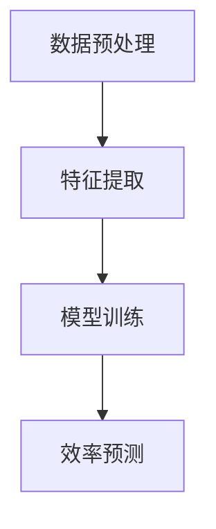
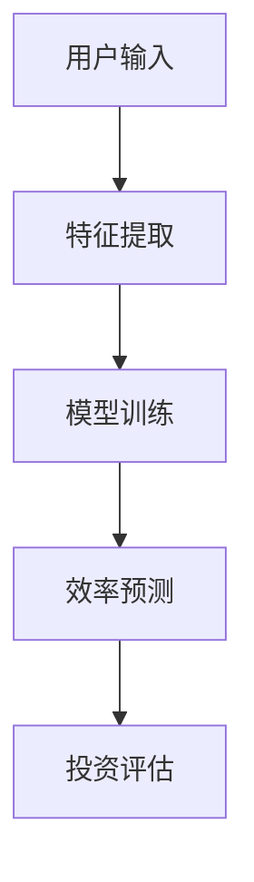
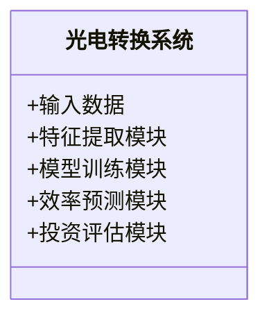
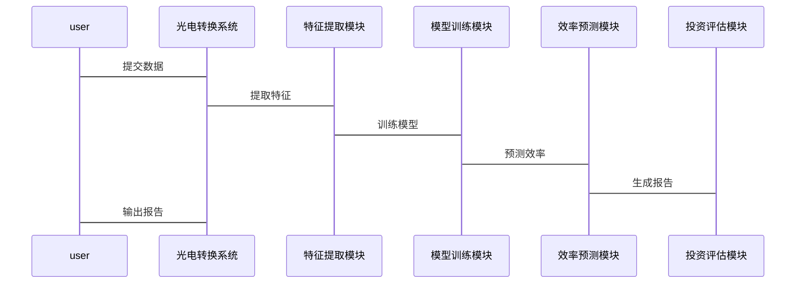

                 


# 价值投资中的新型高效光电转换材料技术

## 关键词：价值投资，光电转换材料，高效材料，技术分析，投资策略，技术驱动

## 摘要：  
光电转换材料是将光能转化为电能的关键技术，近年来随着新能源需求的增加，其在太阳能电池、LED照明等领域的应用越来越广泛。本文从技术与投资双重视角，系统分析了新型高效光电转换材料的核心原理、市场趋势、技术驱动因素及其对投资决策的影响。通过深入的技术分析和案例研究，探讨了投资者如何通过识别和评估高效光电转换材料的技术潜力，制定有效的投资策略，抓住技术变革带来的投资机会。本文还结合实际应用场景，提供了基于算法的光电转换效率评估方法，并分析了系统架构设计对投资价值的影响。

---

# 第1章: 光电转换材料的基本概念与技术背景

## 1.1 光电转换材料的定义与分类

### 1.1.1 光电转换材料的定义  
光电转换材料是指能够将入射光中的光能转化为电能的材料。这类材料的核心功能是实现光-电能量转换，是太阳能电池、LED显示屏、光传感器等光电设备的核心元件。

### 1.1.2 光电转换材料的主要分类  
1. **半导体材料**：如硅基材料，是目前光电转换技术中最常用的材料。  
2. **纳米材料**：如纳米线、纳米片，具有优异的光电性能。  
3. **二维材料**：如石墨烯、MoS2，具有独特的电子结构和高比表面积。  
4. **有机光电材料**：如聚合物材料，具有柔性和可加工性。  

### 1.1.3 光电转换材料的性能指标  
- 光电转换效率（PCE）：材料将光能转化为电能的比例。  
- 吸光特性：材料对不同波长光的吸收能力。  
- 稳定性：材料在长期使用中的耐久性和可靠性。  

## 1.2 光电转换技术的发展历程

### 1.2.1 传统光电转换技术的局限性  
传统光电转换技术主要依赖硅基材料，虽然效率较高，但存在成本高、灵活性差等问题。

### 1.2.2 新型光电转换材料的崛起  
随着纳米技术、二维材料和有机光电材料的发展，新型光电转换材料在效率、成本和应用多样性方面展现出显著优势。

### 1.2.3 光电转换技术的未来趋势  
未来，高效、低成本、柔性化和智能化是光电转换技术发展的主要方向。

## 1.3 价值投资与光电转换材料的结合

### 1.3.1 价值投资的基本概念  
价值投资是一种长期投资策略，通过分析企业的基本面，寻找被市场低估的投资标的。

### 1.3.2 光电转换材料在价值投资中的地位  
光电转换材料作为新能源领域的核心技术创新，具有较高的市场潜力和投资价值。

### 1.3.3 价值投资视角下的光电转换材料技术分析  
投资者需要关注技术的先进性、市场应用潜力以及企业的技术开发能力。

## 1.4 本章小结  
本章介绍了光电转换材料的基本概念、分类及其性能指标，分析了光电转换技术的发展历程，并探讨了价值投资与光电转换材料技术的结合。

---

# 第2章: 新型光电转换材料的技术背景与市场分析

## 2.1 新型光电转换材料的技术背景

### 2.1.1 石墨烯与二维材料在光电转换中的应用  
石墨烯和MoS2等二维材料具有独特的电子结构，能够显著提高光电转换效率。

### 2.1.2 纳米材料在光电转换中的优势  
纳米材料的表面效应和小尺寸效应使其在光电转换中表现出优异性能。

### 2.1.3 高效光电转换材料的最新研究成果  
近年来，基于钙钛矿的光电转换材料因其高效率和低成本受到广泛关注。

## 2.2 光电转换材料的市场现状

### 2.2.1 全球光电转换材料市场的规模与结构  
全球光电转换材料市场规模持续增长，硅基材料仍占主导地位，但新型材料的市场份额逐步扩大。

### 2.2.2 主要国家与企业在光电转换材料领域的布局  
美国、欧盟和中国在光电转换材料领域均有重要布局，领先企业包括特斯拉、苹果和京东方。

### 2.2.3 市场驱动因素与未来发展趋势  
政策支持、技术进步和能源需求增长是推动光电转换材料市场发展的主要因素。

## 2.3 光电转换材料与价值投资的关系

### 2.3.1 技术进步对投资价值的影响  
技术突破能够显著提升企业的市场竞争力和投资价值。

### 2.3.2 市场需求变化对投资策略的影响  
市场需求的变化会影响光电转换材料的技术路线和投资方向。

### 2.3.3 技术风险与投资风险的关联性分析  
技术风险是影响光电转换材料投资的主要风险之一，投资者需关注技术的可行性和商业化潜力。

## 2.4 本章小结  
本章分析了新型光电转换材料的技术背景，探讨了全球市场的现状及未来发展趋势，并重点分析了技术进步对投资价值的影响。

---

# 第3章: 光电转换材料的核心原理与特性分析

## 3.1 光电转换的基本原理

### 3.1.1 光电转换的基本过程  
光子被材料吸收，激发电子跃迁，产生电流。

### 3.1.2 光电转换效率的数学模型  
光电转换效率（PCE）= 光吸收效率 × 载流子输运效率 × 电荷分离效率。

### 3.1.3 影响光电转换效率的关键因素  
材料的能带结构、表面状态、缺陷密度等。

## 3.2 新型光电转换材料的特性分析

### 3.2.1 材料的光学特性  
- 吸光系数：材料对特定波长光的吸收能力。
- 色散特性：材料对不同频率光的响应。

### 3.2.2 材料的电学特性  
- 载流子迁移率：电子和空穴的迁移能力。
- 能带结构：材料的导带和价带分布。

### 3.2.3 材料的稳定性与耐久性  
材料在光照、温度和湿度条件下的长期稳定性。

## 3.3 光电转换材料的性能优化策略

### 3.3.1 材料的结构优化  
- 纳米结构设计：优化光吸收和载流子输运。
- 表面修饰：减少缺陷，提高电荷分离效率。

### 3.3.2 表面改性技术  
- 掺杂改性：通过掺杂提高材料的导电性。
- 表面钝化：减少表面缺陷，提高效率。

### 3.3.3 成本与性能的平衡  
在提高性能的同时，降低材料的制备成本。

## 3.4 本章小结  
本章深入分析了光电转换材料的核心原理及其特性，探讨了性能优化策略。

---

# 第4章: 光电转换材料技术的算法原理与效率评估

## 4.1 光电转换效率的数学模型

### 4.1.1 光电转换效率的计算公式  
$$ PCE = \frac{P_{out}}{P_{in}} $$  
其中，$P_{out}$为输出的电功率，$P_{in}$为输入的光功率。

### 4.1.2 光电转换效率的影响因素  
- 光吸收效率：$$ \eta_{abs} = \frac{N_{abs}}{N_{total}} $$
- 载流子输运效率：$$ \eta_{trans} = \frac{N_{car}}{N_{abs}} $$
- 电荷分离效率：$$ \eta_{sep} = \frac{N_{sep}}{N_{car}} $$

### 4.1.3 效率损失的主要原因  
- 材料缺陷导致的非辐射复合。
- 表面反射和透射损失。

## 4.2 基于机器学习的光电转换效率预测算法

### 4.2.1 数据集构建  
- 特征变量：材料的能带结构、表面状态、缺陷密度。
- 目标变量：光电转换效率。

### 4.2.2 算法流程图（使用 mermaid）  


### 4.2.3 Python 实现代码  
```python
import numpy as np
from sklearn.model_selection import train_test_split
from sklearn.ensemble import RandomForestRegressor

# 数据集构建
X = np.random.rand(100, 5)  # 5个特征，100个样本
y = np.random.rand(100, 1)  # 目标变量

# 数据分割
X_train, X_test, y_train, y_test = train_test_split(X, y, test_size=0.2)

# 模型训练
model = RandomForestRegressor(n_estimators=100)
model.fit(X_train, y_train.ravel())

# 效率预测
y_pred = model.predict(X_test)
print("预测效率:", y_pred.mean())
```

## 4.3 算法原理的数学公式推导

### 4.3.1 光电转换效率的公式推导  
假设光子能量为 $E_p$，电子-空穴对的形成需要 $E_p > E_g$，其中 $E_g$ 为材料的禁带宽度。光电转换效率与材料的吸收系数 $\alpha$ 和载流子迁移率 $\mu$ 有关。

### 4.3.2 算法优化策略  
- 特征选择：使用特征重要性分析选择关键特征。
- 超参数优化：通过网格搜索优化模型性能。

## 4.4 本章小结  
本章通过数学模型和机器学习算法，分析了光电转换效率的影响因素，并提供了基于算法的效率评估方法。

---

# 第5章: 光电转换材料的系统分析与架构设计方案

## 5.1 系统功能设计

### 5.1.1 系统功能模块  
- 光电转换效率计算模块。
- 材料特性分析模块。
- 投资价值评估模块。

### 5.1.2 系统功能流程图（使用 mermaid）  


## 5.2 系统架构设计

### 5.2.1 系统架构图（使用 mermaid）  


## 5.3 系统接口设计

### 5.3.1 输入接口  
- 支持多种数据格式（CSV、Excel）。
- 提供特征选择功能。

### 5.3.2 输出接口  
- 提供效率预测结果。
- 输出投资价值评估报告。

## 5.4 系统交互设计

### 5.4.1 用户与系统的交互流程  


## 5.5 本章小结  
本章通过系统功能设计和架构设计，展示了光电转换材料技术的应用场景及其对投资决策的支持。

---

# 第6章: 光电转换材料技术的项目实战

## 6.1 项目背景与目标

### 6.1.1 项目背景  
以某新型光电转换材料企业为例，分析其技术优势和市场潜力。

### 6.1.2 项目目标  
评估该材料的技术性能和投资价值。

## 6.2 项目环境安装

### 6.2.1 系统环境  
- 操作系统：Linux/Windows/MacOS
- 开发工具：Python、Jupyter Notebook
- 依赖库：numpy、pandas、scikit-learn

### 6.2.2 安装步骤  
```bash
pip install numpy pandas scikit-learn
```

## 6.3 核心实现代码

### 6.3.1 数据预处理代码  
```python
import pandas as pd

# 读取数据
data = pd.read_csv('material_data.csv')

# 数据清洗
data.dropna(inplace=True)
data = data.drop_duplicates()
```

### 6.3.2 模型训练代码  
```python
from sklearn.model

