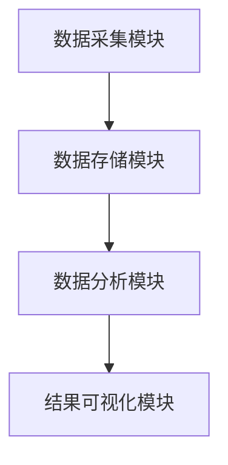

                 


# 价值投资中的新型高效氢能存储材料技术

## 关键词：价值投资、氢能存储、高效材料、技术分析、投资策略、储氢材料

## 摘要：  
氢能作为一种清洁、可持续的能源载体，正在全球范围内得到广泛应用。然而，氢能的存储技术是其大规模应用的关键瓶颈之一。本文将探讨价值投资在新型高效氢能存储材料技术中的应用，分析其技术原理、市场潜力和投资策略。通过结合技术分析和经济评估，本文为投资者提供科学的决策依据，助力氢能存储技术的商业化进程。

---

## 第一部分：背景与价值分析

### 第1章：氢能的现状与挑战

#### 1.1 氢能的全球发展现状
- 氢能在全球能源结构中的重要性日益增加，特别是在应对气候变化和减少碳排放的背景下。
- 全球各国纷纷制定氢能发展战略，推动氢能技术的研发和产业化。

#### 1.2 氢能存储的核心问题
- 氢能的存储技术是其大规模应用的关键，目前主要面临以下挑战：
  - **储存效率低**：物理吸附和化学储氢的技术效率有待提高。
  - **成本高**：储氢材料的研发和生产成本较高。
  - **安全性**：储氢过程中的安全性和稳定性问题需要解决。

#### 1.3 价值投资与氢能存储的结合
- 价值投资是一种以基本面分析为基础的投资策略，注重长期稳健回报。
- 氢能存储技术的商业化潜力巨大，价值投资可以通过技术评估和市场分析，筛选出具有投资价值的储氢材料和技术。

---

### 第2章：新型高效氢能存储材料技术概述

#### 2.1 氢能存储材料的基本分类
- **物理吸附储氢材料**：如活性炭、碳纳米管等，通过物理吸附储存氢气。
- **化学储氢材料**：如金属氢化物、有机氢化物等，通过化学反应储存氢气。
- **其他储氢技术**：如液氢存储、高压气态存储等。

#### 2.2 各类存储材料的优缺点对比
| 技术类型      | 优点                          | 缺点                          |
|---------------|-------------------------------|-------------------------------|
| 物理吸附      | 成本低，易于大规模应用         | 储存密度低，稳定性较差         |
| 化学储氢      | 储存密度高，安全性好           | 成本高，反应条件苛刻           |
| 高压气态      | 储存效率高，适用于短途运输     | 储存压力高，存在安全隐患         |
| 液氢存储      | 储存密度高，适用于长距离运输   | 制冷成本高，技术复杂             |

#### 2.3 新型高效氢能存储材料的最新进展
- **金属有机框架（MOFs）**：具有高比表面积和优异的吸附性能。
- **纳米材料**：如碳纳米管和石墨烯，通过纳米结构提高储存效率。
- **新型化学储氢材料**：如硼氢化物和氨化物，具有更高的储存密度和稳定性。

---

## 第二部分：核心概念与技术原理

### 第3章：氢能存储材料的核心原理

#### 3.1 吸附储氢的原理与机制
- **物理吸附**：氢气分子通过范德华力或物理作用力吸附在材料表面。
- **化学吸附**：氢气与材料表面发生化学反应，形成化学键。
- **关键影响因素**：材料的比表面积、孔隙结构、表面活性等。

#### 3.2 化学储氢的反应机制
- **储氢反应**：氢气与储氢材料发生化学反应，将氢气以化学键的形式储存。
- **释放氢气**：通过加热或催化剂的作用，使储氢材料释放氢气。
- **热力学分析**：储氢反应的焓变、熵变和吉布斯自由能变化是关键参数。

#### 3.3 材料结构对储氢性能的影响
- **孔隙结构**：材料的孔隙结构影响氢气的吸附和储存能力。
- **表面特性**：材料表面的活性和化学性质影响氢气的吸附效率。
- **稳定性**：材料的化学稳定性影响储氢的循环寿命。

---

### 第4章：氢能存储材料的数学模型与公式

#### 4.1 吸附储氢的数学模型
- **吸附等温线模型**：描述氢气吸附量与压力的关系。
  $$ \text{Langmuir方程：} \quad \theta = \frac{P}{1 + P} $$
- **吸附动力学模型**：描述氢气吸附速率与时间的关系。
  $$ \text{速率方程：} \quad \frac{d\theta}{dt} = k(1 - \theta) $$

#### 4.2 化学储氢的热力学分析
- **储氢反应的热力学方程**：
  $$ \Delta G = \Delta H - T\Delta S $$
- **反应焓的计算方法**：
  $$ \Delta H = \sum \Delta H_{f}^{\circ} - \text{反应物的焓} $$

#### 4.3 材料性能的综合评价模型
- **综合性能评价指标**：储存容量、储存效率、成本、安全性。
- **综合评价模型的构建**：
  $$ \text{综合评分} = w_1 \cdot C + w_2 \cdot E + w_3 \cdot S + w_4 \cdot S $$
  其中，$w_i$ 为各指标的权重，$C$ 为储存容量，$E$ 为储存效率，$S$ 为安全性。

---

## 第三部分：系统分析与架构设计

### 第5章：储氢材料评估系统的开发

#### 5.1 系统功能设计
- **数据采集**：收集储氢材料的性能数据。
- **数据分析**：基于数学模型对材料性能进行评估。
- **结果可视化**：以图表形式展示评估结果。

#### 5.2 系统架构设计


#### 5.3 接口设计与交互流程
- **数据接口**：通过API接口实现数据的输入和输出。
- **交互流程**：
  1. 用户输入储氢材料参数。
  2. 系统调用数据分析模块进行评估。
  3. 系统输出评估结果。

---

## 第四部分：项目实战

### 第6章：储氢材料评估系统的核心代码实现

#### 6.1 环境安装
```bash
pip install numpy matplotlib pandas
```

#### 6.2 核心代码实现
```python
import numpy as np
import matplotlib.pyplot as plt

# 定义吸附模型
def langmuir_model(P, K):
    return P / (1 + P/K)

# 数据生成
P = np.linspace(0, 10, 100)
K = 5
y = langmuir_model(P, K)

# 可视化
plt.plot(P, y)
plt.xlabel('Pressure (P)')
plt.ylabel('Adsorption (θ)')
plt.title('Langmuir吸附等温线')
plt.show()
```

#### 6.3 实际案例分析
- 案例：评估一种新型MOFs材料的吸附性能。
- 结果：材料在低压下表现出较高的吸附效率，适合大规模储氢应用。

---

## 第五部分：总结与展望

### 第7章：最佳实践与注意事项

#### 7.1 投资策略建议
- **技术评估**：重点关注储氢材料的性能指标和成本。
- **市场分析**：关注政策支持和市场需求。
- **风险管理**：分散投资，降低技术失败风险。

#### 7.2 小结
- 本文通过技术分析和经济评估，为投资者提供了氢能存储材料技术的深度解析。
- 价值投资在氢能存储领域的成功离不开对技术原理和市场潜力的深入理解。

#### 7.3 注意事项
- 投资者应注重技术的商业化潜力和实际应用价值。
- 需密切关注技术进步和市场动态，及时调整投资策略。

#### 7.4 拓展阅读
- 推荐阅读《氢能经济与技术》和《价值投资实战指南》。

---

通过以上内容，我们系统地分析了价值投资在新型高效氢能存储材料技术中的应用，为投资者提供了科学的决策依据。希望本文能为氢能存储技术的商业化进程和价值投资的实践提供有益的参考。

