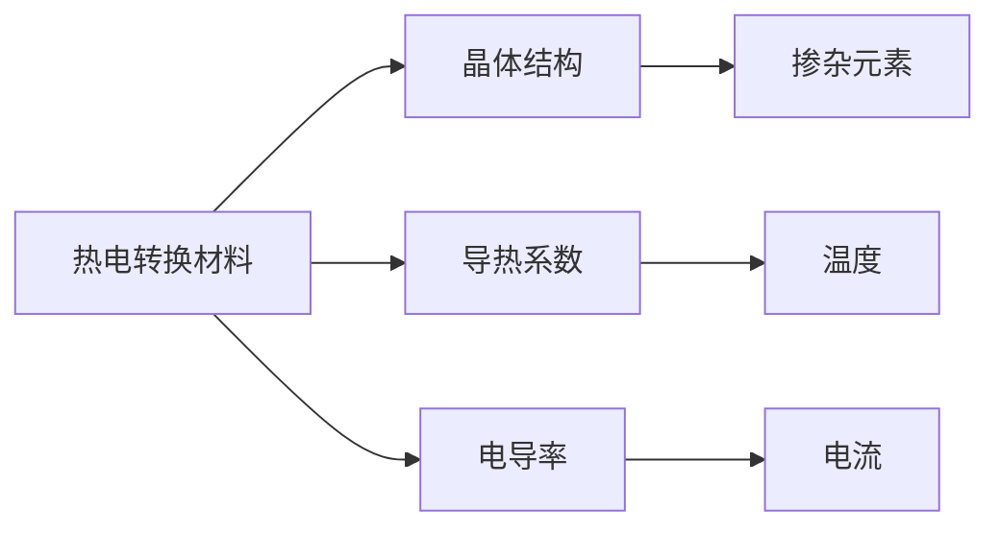
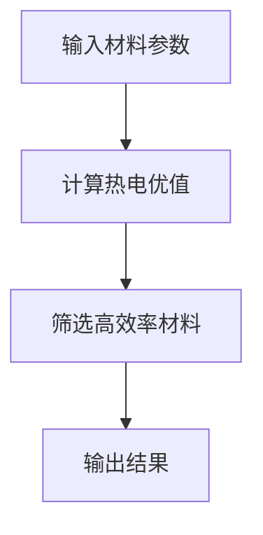
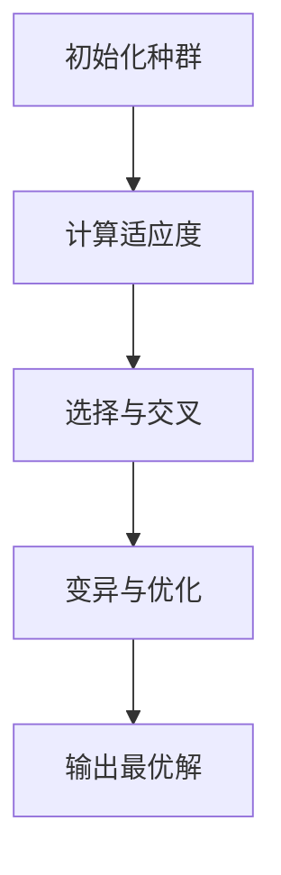
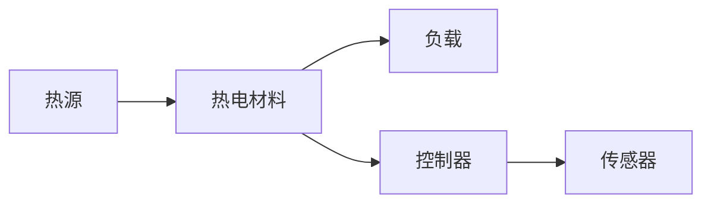
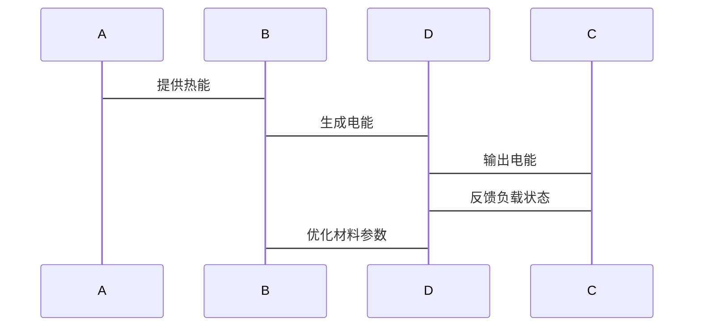

                 


# 价值投资中的新型高效热电转换材料技术

> 关键词：热电转换材料，热电效率，价值投资，材料优化，技术应用

> 摘要：本文深入探讨了热电转换材料在现代科技中的应用及其投资价值。通过分析热电转换材料的核心概念、算法原理和系统架构，结合实际案例，展示了如何通过技术创新和优化实现高效热电转换。文章还从价值投资的角度，分析了热电转换材料的市场潜力和发展趋势。

---

# 第一部分: 价值投资中的新型高效热电转换材料技术背景介绍

## 第1章: 热电转换材料的定义与应用

### 1.1 热电转换材料的基本概念
热电转换材料是一种能够直接将热能转化为电能的材料。其基本原理是基于热电效应，即通过温度差在材料中产生电压。这种技术在能源回收和发电领域具有广泛应用潜力，特别是在工业废热回收和可穿戴设备等领域。

#### 1.1.1 热电转换的定义与基本原理
热电转换是指利用半导体材料的热电效应，将热能转化为电能的过程。其基本原理是基于塞贝克效应（Seebeck effect），即当两种不同导电材料的两端存在温差时，会在接触点产生电压。

#### 1.1.2 热电转换材料的分类
热电转换材料主要分为无机材料和有机材料两大类：
- 无机热电材料：如碲化铋（Bi2Te3）、硫化镉（CdS）等。
- 有机热电材料：如聚苯胺（PANI）、聚乙炔（C6H4）等。

#### 1.1.3 热电转换材料的应用领域
热电转换材料的应用领域包括：
- 工业废热回收：将工厂产生的废热转化为电能。
- 可再生能源发电：利用太阳能、地热能等热源发电。
- 汽车尾气发电：回收汽车尾气中的热量用于发电。
- 可穿戴设备：为智能手表、健身追踪器等设备提供能量。

### 1.2 热电转换材料的性能指标
热电转换材料的性能主要由以下几个指标决定：
- 热电优值（ZT）：衡量材料热电转换效率的重要指标，公式为：
$$ZT = \frac{S^2 T}{\lambda}$$
其中，$S$为塞贝克系数，$T$为绝对温度，$\lambda$为热导率。

- 热导率：材料的导热能力，热导率越低，热电转换效率越高。
- 电导率：材料的导电能力，电导率越高，输出电流越大。
- 温度稳定性：材料在不同温度下的性能变化。

### 1.3 价值投资视角下的热电转换材料
#### 1.3.1 热电转换材料的市场现状
目前，热电转换技术在工业废热回收领域的应用较为广泛，但在可再生能源和消费电子领域的应用还处于起步阶段。随着能源危机的加剧和环保要求的提高，热电转换材料的市场需求逐渐增长。

#### 1.3.2 热电转换材料的技术发展趋势
- 高效材料研发：通过材料科学的进步，不断提高热电优值（ZT）。
- 纳米材料应用：利用纳米技术优化材料性能，降低热导率。
- 复合材料开发：通过复合材料的设计，平衡材料的导电性和导热性。

#### 1.3.3 热电转换材料的投资价值分析
- 市场需求增长：随着能源回收和绿色能源需求的增加，热电转换材料的市场空间广阔。
- 技术壁垒高：热电转换材料的研发需要较高的技术门槛，具有较高的投资壁垒。
- 技术迭代快：材料科学的快速发展为投资者提供了更多机会，但也带来了技术风险。

---

## 第2章: 热电转换材料的核心概念与联系

### 2.1 热电转换材料的核心原理
热电转换材料的核心原理是通过热电效应实现热能和电能的转换。具体来说，当两种不同材料的两端存在温差时，会在接触点产生电压，从而驱动电流流动。

#### 2.1.1 热电转换的基本机制
热电转换的基本机制包括以下几个步骤：
1. 热载流子（电子或空穴）在温差作用下发生扩散。
2. 热电势的形成：由于温度差导致的电子浓度变化，产生电势。
3. 电流的形成：在外电路中，电流从高电势端流向低电势端。

#### 2.1.2 热电材料的晶体结构与性能关系
热电材料的晶体结构对其性能具有重要影响。例如，非晶态材料具有较低的热导率，适合用于热电转换。

#### 2.1.3 热电材料的掺杂与优化
通过掺杂改性，可以优化材料的导电性和导热性。例如，向碲化铋中掺入硫元素可以提高其热电性能。

### 2.2 热电转换材料的性能对比
#### 2.2.1 不同类型热电材料的性能特征
下表对比了几种常见热电材料的性能指标：

| 材料类型 | 热电优值（ZT） | 导热系数（W/m·K） | 适用温度范围（℃） |
|----------|-----------------|---------------------|--------------------|
| 碲化铋（Bi2Te3） | 1.0 | 0.46 | -200至+200 |
| 硫化镉（CdS） | 0.5 | 0.35 | -50至+150 |
| 聚苯胺（PANI） | 0.1 | 0.1 | -50至+80 |

#### 2.2.2 热电材料的导热系数与电导率对比
热导率和电导率是衡量热电材料性能的重要指标。一般来说，热导率越低，电导率越高，热电转换效率越好。

#### 2.2.3 热电材料的热电优值分析
热电优值（ZT）是衡量热电材料性能的核心指标，公式为：
$$ZT = \frac{S^2 T}{\lambda}$$
其中，$S$为塞贝克系数，$T$为绝对温度，$\lambda$为热导率。

### 2.3 热电转换材料的实体关系图
下图展示了热电转换材料的实体关系：


---

## 第3章: 热电转换材料的数学模型与算法原理

### 3.1 热电转换效率的数学模型
#### 3.1.1 热电转换效率的公式推导
热电转换效率可以通过以下公式计算：
$$\eta = \frac{S^2 T}{\lambda + \sigma S^2 T}$$
其中，$\sigma$为电导率，$\lambda$为热导率，$S$为塞贝克系数，$T$为绝对温度。

#### 3.1.2 热电材料的热电优值公式
热电优值公式为：
$$U = \frac{S^2 T}{\lambda}$$

#### 3.1.3 数学模型的应用
通过数学模型可以优化材料参数，例如通过调整掺杂比例来降低热导率，从而提高热电优值。

### 3.2 热电材料筛选算法
#### 3.2.1 热电材料筛选的流程图
下图展示了热电材料筛选的流程：


#### 3.2.2 热电材料优化算法
下图展示了基于遗传算法的热电材料优化流程：


### 3.3 热电材料优化算法
#### 3.3.1 热电材料优化算法的Python代码
以下是一个简单的热电材料优化算法的Python代码示例：
```python
import numpy as np

def calculate_ZT(S, T, lambda_):
    return (S**2 * T) / lambda_

# 初始化种群
population = np.random.rand(100, 3)  # 假设材料参数为3个
best_ZT = 0

for individual in population:
    S = individual[0] * 0.5 + 0.1  # 塞贝克系数
    T = individual[1] * 100 + 200    # 绝对温度
    lambda_ = individual[2] * 0.2 + 0.1  # 热导率
    ZT = calculate_ZT(S, T, lambda_)
    if ZT > best_ZT:
        best_ZT = ZT

print("最优ZT值为:", best_ZT)
```

#### 3.3.2 算法原理的数学推导
通过优化算法可以找到材料参数的最优组合，从而提高热电优值（ZT）。

---

## 第4章: 热电转换材料的系统分析与架构设计

### 4.1 热电转换系统的功能设计
#### 4.1.1 热电转换系统的功能模块
热电转换系统通常包括以下几个功能模块：
- 热源输入模块：提供热能输入。
- 热电材料模块：实现热能到电能的转换。
- 电力输出模块：将产生的电能输出到负载。

#### 4.1.2 热电转换系统的领域模型
下图展示了热电转换系统的领域模型：


### 4.2 热电转换系统的架构设计
#### 4.2.1 热电转换系统的架构图
下图展示了热电转换系统的架构设计：


#### 4.2.2 热电转换系统的交互序列图
下图展示了热电转换系统的交互序列：


---

## 第5章: 热电转换材料的项目实战

### 5.1 项目环境与工具安装
为了进行热电转换材料的实验和优化，需要以下环境和工具：
- 实验设备：热电材料测试仪、温度控制设备、电流测量设备。
- 软件工具：Python编程环境、数学建模工具（如Matplotlib、SciPy）。

### 5.2 项目核心实现
#### 5.2.1 材料选择与实验设计
选择一种高效的热电材料（如碲化铋），并设计实验方案。

#### 5.2.2 热电转换效率的测量与分析
通过实验测量热电转换效率，并与数学模型进行对比。

### 5.3 实际案例分析
#### 5.3.1 案例背景
假设我们选择了一种新型热电材料，目标是优化其性能以提高热电优值（ZT）。

#### 5.3.2 实验结果与分析
通过实验得出材料的最优参数组合，并分析其在不同温度下的性能变化。

### 5.4 项目小结
通过项目实战，验证了数学模型和优化算法的有效性，为后续研究提供了参考。

---

## 第6章: 总结与展望

### 6.1 热电转换材料的投资价值总结
热电转换材料在能源回收和绿色能源领域具有广阔的应用前景，其技术进步和市场需求的增加为投资者提供了良好的机会。

### 6.2 热电转换材料的技术发展趋势
未来，热电转换材料的研究将朝着高效化、低成本化和多功能化的方向发展。

### 6.3 投资建议与注意事项
投资者应关注热电转换材料的技术壁垒和市场应用潜力，选择具有技术优势和市场竞争力的材料和技术。

### 6.4 拓展阅读
推荐读者阅读以下书籍和论文：
- 《热电材料与器件》
- "Recent Advances in Thermoelectric Materials and Devices"

---

通过以上内容，我们可以看到，热电转换材料在价值投资和技术应用中具有重要的地位。未来，随着技术的不断进步和市场需求的增加，热电转换材料的投资价值将进一步提升。

