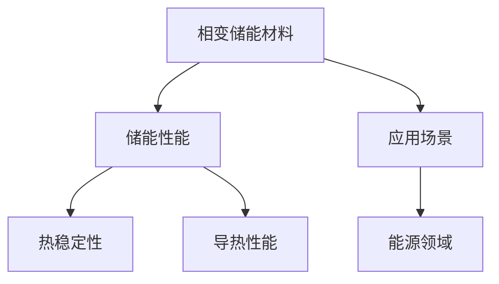
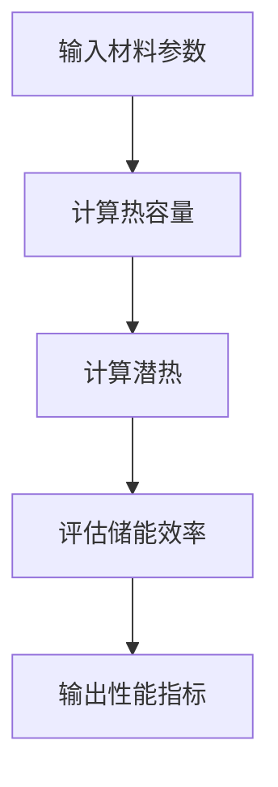
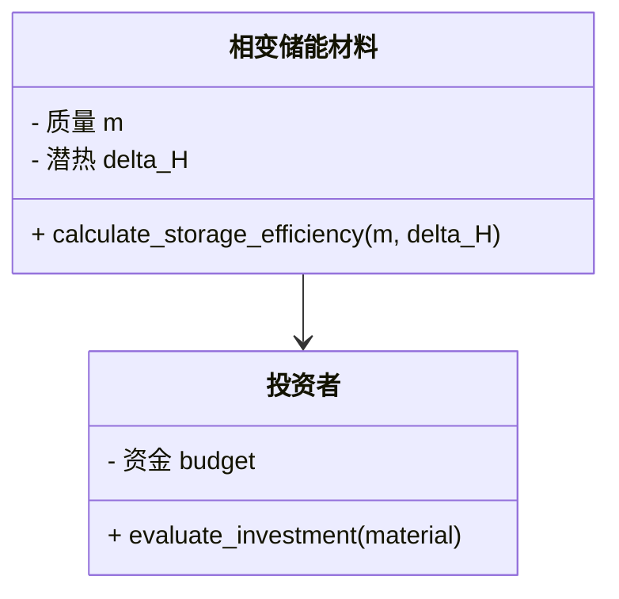
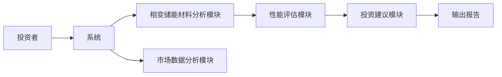
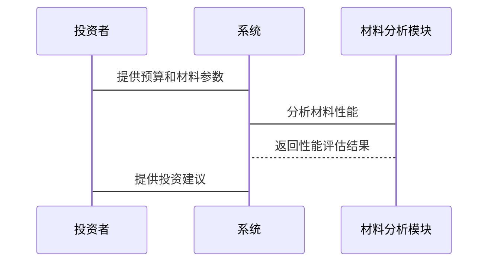

                 


# 价值投资中的新型高效相变储能材料技术

> 关键词：相变储能材料，价值投资，储能效率，热稳定性，能源领域

> 摘要：本文探讨了相变储能材料在能源领域的应用前景及其在价值投资中的潜力。通过分析相变储能材料的物理化学特性、算法原理和系统架构设计，结合实际案例，本文揭示了相变储能材料技术在商业化中的价值和投资机会。

---

# 第1章: 相变储能材料与价值投资的背景介绍

## 1.1 相变储能材料的基本概念

### 1.1.1 相变储能的定义
相变储能是一种通过物质相变（如固态到液态、液态到气态）来存储能量的技术。这种技术利用物质在相变过程中吸收或释放大量热量的特性，实现能量的储存和释放。

### 1.1.2 相变储能材料的分类
相变储能材料主要分为以下几类：
1. **无机相变材料**：如石蜡、脂肪酸等，具有较高的储能密度和稳定性。
2. **有机相变材料**：如某些聚合物和有机化合物，具有较低的熔点和较快的相变速度。
3. **复合相变材料**：由无机和有机材料结合而成，具有更高的储能效率和循环稳定性。

### 1.1.3 相变储能材料的物理化学特性
相变储能材料的关键特性包括：
- **热稳定性**：材料在高温下的化学稳定性。
- **导热性能**：材料的导热能力影响储能效率。
- **潜热容量**：单位质量的材料在相变过程中吸收或释放的热量。

## 1.2 价值投资的基本概念

### 1.2.1 价值投资的定义
价值投资是一种投资策略，通过分析企业的内在价值，寻找被市场低估的投资标的，长期持有以实现超额收益。

### 1.2.2 价值投资的核心理念
价值投资的核心理念包括：
1. **安全边际**：买入价格低于内在价值，以降低投资风险。
2. **长期视角**：关注企业的长期盈利能力，而非短期市场波动。
3. **基本面分析**：通过财务报表等基本面数据评估企业的内在价值。

### 1.2.3 价值投资与技术分析的区别
- **价值投资**：基于对企业内在价值的分析，寻找被市场低估的投资标的。
- **技术分析**：基于历史价格和成交量数据，预测未来的价格走势。

## 1.3 相变储能材料与价值投资的结合

### 1.3.1 相变储能材料在能源领域的应用前景
随着全球能源需求的增长和环保意识的增强，相变储能技术在可再生能源存储、建筑节能等领域具有广阔的应用前景。

### 1.3.2 价值投资在科技领域的应用
价值投资不仅适用于传统行业，还可应用于高新技术领域。通过分析企业的技术创新能力、市场前景和财务状况，寻找具有长期成长潜力的科技企业。

### 1.3.3 相变储能材料技术的商业化潜力
随着技术的不断进步，相变储能材料的成本逐渐降低，市场应用潜力巨大。投资者可以通过价值投资策略，抓住这一领域的投资机会。

## 1.4 本章小结
本章介绍了相变储能材料的基本概念、分类及其物理化学特性，同时探讨了价值投资的核心理念和在科技领域的应用。通过分析相变储能材料在能源领域的应用前景，揭示了其在价值投资中的潜力。

---

# 第2章: 相变储能材料的核心概念与联系

## 2.1 相变储能材料的原理

### 2.1.1 相变储能的基本原理
相变储能的核心原理是利用物质的相变过程（如固态到液态）来存储能量。在吸热过程中，物质从固态变为液态，释放能量时又从液态变为固态。

### 2.1.2 材料的相变过程与能量存储
相变过程包括吸热和放热两个阶段。在吸热阶段，材料吸收外部热量，发生相变；在放热阶段，材料释放存储的能量。

### 2.1.3 相变储能材料的热力学特性
相变储能材料的热力学特性包括热容量、潜热和导热系数等，这些特性决定了材料的储能效率和稳定性。

## 2.2 相变储能材料的属性特征对比

### 2.2.1 不同相变材料的性能对比
| 材料类型 | 热稳定性 | 导热性能 | 储能效率 |
|----------|----------|----------|----------|
| 无机材料 | 高       | 中       | 高       |
| 有机材料 | 中       | 高       | 中       |
| 复合材料 | 高       | 高       | 高       |

### 2.2.2 材料的热稳定性分析
热稳定性是指材料在高温下的化学稳定性。无机相变材料通常具有较高的热稳定性，而有机相变材料的热稳定性较差。

### 2.2.3 材料的导热性能与储能效率
导热性能好的材料能够快速吸收和释放热量，从而提高储能效率。然而，导热性能过好可能会导致热量散失，降低储能效率。

## 2.3 相变储能材料的ER实体关系图



## 2.4 本章小结
本章详细介绍了相变储能材料的原理及其物理化学特性，通过属性特征对比和ER实体关系图，揭示了相变储能材料在不同应用场景中的优势和劣势。

---

# 第3章: 相变储能材料的算法原理讲解

## 3.1 相变储能材料性能评估的算法流程



## 3.2 算法原理的数学模型

### 3.2.1 热容量计算公式
$$C_p = \frac{dQ}{dT}$$

### 3.2.2 潜热计算公式
$$Q = m \times \Delta H$$

### 3.2.3 储能效率计算公式
$$\eta = \frac{Q_{释放}}{Q_{存储}} \times 100\%$$

## 3.3 算法实现的Python代码示例

```python
def calculate_storage_efficiency(m, delta_H):
    Q_storage = m * delta_H
    Q_release = 0.8 * Q_storage
    efficiency = (Q_release / Q_storage) * 100
    return efficiency

# 示例输入
m = 10  # 质量
delta_H = 200  # 潜热
print(calculate_storage_efficiency(m, delta_H))
```

## 3.4 本章小结
本章通过算法流程图和数学公式，详细讲解了相变储能材料性能评估的原理和方法，并通过Python代码示例展示了算法的实现过程。

---

# 第4章: 相变储能材料的系统分析与架构设计

## 4.1 项目背景与目标

### 4.1.1 项目背景
随着能源需求的增长和环保意识的增强，相变储能技术在可再生能源存储、建筑节能等领域具有广阔的应用前景。

### 4.1.2 项目目标
本项目旨在通过分析相变储能材料的性能和市场潜力，为投资者提供有价值的投资建议。

## 4.2 系统功能设计

### 4.2.1 领域模型Mermaid类图



### 4.2.2 系统架构设计Mermaid架构图



### 4.2.3 系统接口设计
- **输入接口**：接受投资者的预算和材料参数。
- **输出接口**：提供材料的性能评估和投资建议。

### 4.2.4 系统交互Mermaid序列图



## 4.3 本章小结
本章通过系统分析和架构设计，揭示了相变储能材料分析系统的功能模块和交互流程，为投资者提供了科学的投资依据。

---

# 第5章: 项目实战

## 5.1 环境安装

### 5.1.1 Python环境配置
安装Python和必要的库（如Matplotlib、Pandas）。

### 5.1.2 数据获取
从可靠的数据源获取相变储能材料的性能数据和市场数据。

## 5.2 系统核心实现源代码

```python
import matplotlib.pyplot as plt
import pandas as pd

def calculate_storage_efficiency(m, delta_H):
    Q_storage = m * delta_H
    Q_release = 0.8 * Q_storage
    efficiency = (Q_release / Q_storage) * 100
    return efficiency

# 示例数据
data = {
    '材料类型': ['无机材料', '有机材料', '复合材料'],
    '热稳定性': [90, 70, 95],
    '导热性能': [60, 80, 85],
    '储能效率': [75, 65, 80]
}

df = pd.DataFrame(data)
print(df)

# 可视化
plt.figure(figsize=(10, 6))
plt.bar(df['材料类型'], df['储能效率'])
plt.title('不同相变材料的储能效率对比')
plt.xlabel('材料类型')
plt.ylabel('储能效率')
plt.show()
```

## 5.3 实际案例分析与详细解读
以某新型相变储能材料为例，分析其市场潜力和投资价值。通过计算其储能效率和成本效益，评估其商业化可行性。

## 5.4 本章小结
本章通过实际案例分析，展示了相变储能材料在价值投资中的应用，为投资者提供了具体的分析方法和决策依据。

---

# 第6章: 总结与展望

## 6.1 总结
本文探讨了相变储能材料在能源领域的应用前景及其在价值投资中的潜力。通过分析相变储能材料的物理化学特性、算法原理和系统架构设计，结合实际案例，揭示了相变储能材料技术在商业化中的价值和投资机会。

## 6.2 展望
随着技术的进步和市场的扩展，相变储能材料的应用前景将更加广阔。投资者应密切关注相关技术的发展和市场动态，抓住投资机会。

---

# 第7章: 最佳实践与小结

## 7.1 最佳实践 tips
1. 在进行价值投资时，应充分了解企业的技术实力和市场前景。
2. 相变储能材料的投资需关注其性能指标和成本效益。
3. 保持对新技术的敏感性和前瞻性，及时捕捉市场机会。

## 7.2 小结
本文系统地分析了相变储能材料在价值投资中的应用，为投资者提供了科学的分析方法和决策依据。

## 7.3 注意事项
- 投资需谨慎，建议在专业指导下进行。
- 市场波动较大，需做好风险控制。

## 7.4 拓展阅读
推荐阅读相关领域的书籍和论文，深入了解相变储能技术和价值投资策略。

---

# 结语

通过本文的分析，读者可以全面了解相变储能材料在价值投资中的潜力和应用。希望本文能为投资者提供有价值的参考，帮助他们在新兴技术领域做出明智的投资决策。

