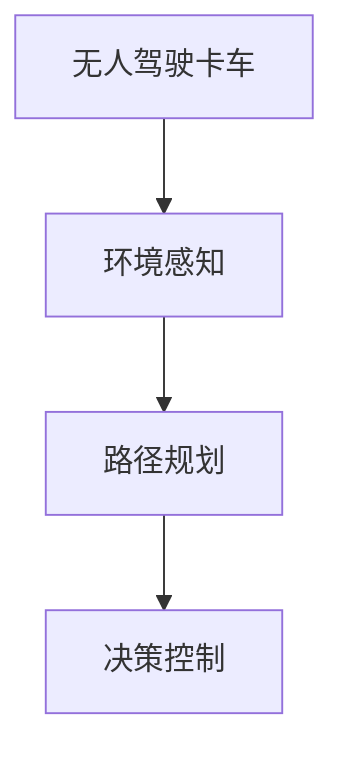

                 

# 价值投资中的无人驾驶卡车物流分析

> 关键词：价值投资，无人驾驶卡车，物流分析，投资策略，技术驱动

> 摘要：本文从价值投资的角度，深入分析无人驾驶卡车在物流行业中的应用潜力。通过技术分析、市场研究、成本效率评估、价值模型构建等方法，探讨无人驾驶卡车物流的投资机会和风险。结合实际案例，总结出一套适合投资者的分析框架和投资策略。

---

# 第一部分: 无人驾驶卡车物流的背景与现状

## 第1章: 无人驾驶卡车物流的背景与现状

### 1.1 无人驾驶卡车的核心概念

#### 1.1.1 无人驾驶卡车的定义与技术特征

无人驾驶卡车是指通过自动驾驶技术实现货物运输的车辆，具备以下技术特征：
- **环境感知**：通过激光雷达（LiDAR）、摄像头、雷达等传感器感知周围环境。
- **路径规划**：利用人工智能算法规划最优行驶路径。
- **决策控制**：通过决策系统实现车辆的加速、转向和制动控制。

无人驾驶卡车的核心技术包括：
- **感知系统**：传感器与算法的结合，实现对道路、交通和环境的实时感知。
- **决策系统**：基于感知数据，通过深度学习算法做出驾驶决策。
- **通信系统**：车辆间的通信，实现协同驾驶和数据共享。

#### 1.1.2 无人驾驶卡车与传统物流的对比

| 特性                | 传统物流            | 无人驾驶物流        |
|---------------------|--------------------|---------------------|
| 运营成本            | 高                 | 低                 |
| 运输效率            | 一般               | 高                 |
| 人力资源需求        | 大                 | 小                 |
| 安全性              | 中                 | 高                 |
| 环境影响            | 高                 | 低                 |

#### 1.1.3 无人驾驶卡车在物流行业中的应用前景

无人驾驶卡车的应用场景包括：
- **长途干线运输**：在高速公路上实现自动驾驶，降低运输成本。
- **城市配送**：在城市内部进行短途配送，减少交通拥堵。
- **最后一公里配送**：通过小型无人驾驶卡车完成末端配送。

### 1.2 价值投资的基本概念与方法

#### 1.2.1 价值投资的定义与核心理念

价值投资是一种以低于内在价值的价格买入优质资产的投资策略。其核心理念是：
- **长期视角**：关注企业的长期价值，而非短期波动。
- **安全边际**：买入价格低于企业的真实价值。
- **竞争优势**：投资具备核心竞争优势的企业。

#### 1.2.2 价值投资与成长投资的区别

| 特性                | 价值投资          | 成长投资            |
|---------------------|-------------------|--------------------|
| 投资目标            | 买入低于价值的资产 | 投资具备高增长潜力的企业 |
| 时间框架            | 长期              | 中短期             |
| 风险承受能力        | 较低              | 较高               |

#### 1.2.3 价值投资在物流行业的应用

物流行业适合价值投资的原因：
- **高门槛**：物流行业需要大量固定资产投入，具备较高的进入门槛。
- **规模效应**：具备网络优势的企业能够实现更低的单位成本。
- **持续需求**：物流需求与经济发展密切相关，具备长期增长潜力。

---

## 第2章: 无人驾驶卡车物流的市场分析

### 2.1 无人驾驶卡车物流的市场规模

#### 2.1.1 全球物流市场规模分析

全球物流市场规模呈现稳步增长趋势，预计到2030年将达到20万亿美元。无人驾驶卡车在物流行业中的渗透率将逐步提高，预计到2030年，无人驾驶卡车将占据物流市场的30%以上。

#### 2.1.2 无人驾驶卡车物流的市场潜力

无人驾驶卡车物流的市场潜力主要体现在：
- **成本降低**：通过自动化运营降低成本，提高效率。
- **需求增长**：随着电子商务的发展，物流需求持续增长。
- **技术进步**：无人驾驶技术的成熟将推动市场扩大。

#### 2.1.3 无人驾驶卡车物流的区域分布

无人驾驶卡车物流的主要市场区域：
- **北美**：美国和加拿大在无人驾驶技术的研发和应用方面处于领先地位。
- **欧洲**：欧盟对无人驾驶技术有较高的政策支持力度。
- **亚洲**：中国、日本和韩国在无人驾驶技术方面投入巨大，市场潜力巨大。

### 2.2 无人驾驶卡车物流的主要参与者

#### 2.2.1 主流无人驾驶卡车技术公司

| 公司名称          | 主要业务          | 核心技术          |
|-------------------|------------------|------------------|
| Tesla             | 卡车自动驾驶      | 人工智能、传感器技术 |
| Waymo             | 自动驾驶技术     | 深度学习、传感器融合 |
| Uber              | 自动驾驶卡车     | 路径规划、实时调度 |

#### 2.2.2 物流行业的主要企业

| 公司名称          | 主要业务          | 核心优势          |
|-------------------|------------------|------------------|
| Amazon            | 物流配送         | 全球网络、技术驱动 |
| FedEx             | 快递物流         | 广泛的运输网络    |
| DHL               | 全球物流         | 高效的运营体系    |

#### 2.2.3 投资机构与资本市场的关注点

投资者关注无人驾驶卡车物流的原因：
- **技术壁垒**：无人驾驶技术具有较高的技术门槛。
- **市场潜力**：无人驾驶卡车能够显著降低物流成本。
- **政策支持**：政府对无人驾驶技术的政策支持力度较大。

---

## 第3章: 无人驾驶卡车物流的成本与效率分析

### 3.1 无人驾驶卡车物流的成本构成

#### 3.1.1 技术研发成本

无人驾驶卡车的研发成本包括：
- **传感器**：激光雷达、摄像头等硬件设备。
- **算法开发**：深度学习、路径规划等算法的开发和优化。
- **测试与验证**：大量的道路测试和模拟验证。

#### 3.1.2 运营维护成本

无人驾驶卡车的运营成本包括：
- **能源消耗**：电动卡车的电费。
- **维护成本**：传感器、电池等设备的维护费用。
- **保险费用**：无人驾驶卡车的保险费用。

#### 3.1.3 市场推广成本

无人驾驶卡车的推广成本包括：
- **品牌建设**：市场宣传和品牌推广。
- **用户教育**：向客户普及无人驾驶技术的优势。
- **政策协调**：与政府和相关部门协调无人驾驶卡车的法规和标准。

### 3.2 无人驾驶卡车物流的效率提升

#### 3.2.1 自动驾驶技术对物流效率的提升

自动驾驶技术能够通过以下方式提高物流效率：
- **24/7运营**：无人驾驶卡车可以全天候运行，无需休息。
- **精准调度**：通过实时数据分析实现最优路径规划。
- **减少延误**：自动驾驶系统能够避免人为错误，减少运输延误。

#### 3.2.2 数据分析与路径优化

无人驾驶卡车物流的核心优势之一是数据驱动的路径优化。通过分析历史数据、实时交通状况和客户需求，系统能够自动调整运输路线，降低运输时间和成本。

#### 3.2.3 智能调度系统的作用

智能调度系统通过以下方式提高物流效率：
- **实时监控**：监控所有卡车的位置和状态。
- **动态调度**：根据需求变化动态调整运输任务。
- **资源优化**：合理分配资源，减少浪费。

---

## 第4章: 无人驾驶卡车物流的价值评估模型

### 4.1 价值评估模型的构建

#### 4.1.1 模型的核心要素

价值评估模型的核心要素包括：
- **未来现金流**：企业未来几年的预期现金流。
- **贴现率**：反映投资风险的折现率。
- **企业价值**：企业的整体价值，包括资产、负债和股权价值。

#### 4.1.2 模型的构建逻辑

价值评估模型的构建逻辑如下：
1. **预测未来现金流**：基于企业的历史数据和市场环境预测未来现金流。
2. **确定贴现率**：根据企业的风险水平确定合适的贴现率。
3. **计算企业价值**：使用贴现现金流模型计算企业的整体价值。

#### 4.1.3 模型的适用范围

价值评估模型适用于：
- **具备稳定现金流的企业**：现金流预测的准确性较高。
- **具备明确竞争优势的企业**：企业价值能够准确反映其竞争优势。
- **具备长期增长潜力的企业**：企业未来现金流的增长能够合理预测。

### 4.2 模型的数学公式与应用

#### 4.2.1 模型的数学公式

贴现现金流模型的公式为：
$$ \text{企业价值} = \frac{\text{未来现金流}}{\text{贴现率}} $$

#### 4.2.2 模型的应用步骤

模型的应用步骤如下：
1. **收集历史数据**：收集企业的历史财务数据和市场数据。
2. **预测未来现金流**：基于历史数据和市场环境预测未来现金流。
3. **确定贴现率**：根据企业的风险水平确定贴现率。
4. **计算企业价值**：使用贴现现金流模型计算企业的整体价值。

#### 4.2.3 模型的案例分析

以某无人驾驶卡车企业为例，假设其未来5年的现金流分别为1000万、1200万、1400万、1600万和1800万元，贴现率为8%。计算其企业价值如下：
$$ \text{企业价值} = \frac{1000 + 1200 + 1400 + 1600 + 1800}{1.08^5} $$
$$ \text{企业价值} \approx 5000 \text{万元} $$

---

## 第5章: 无人驾驶卡车物流的市场风险与机会

### 5.1 市场风险分析

#### 5.1.1 技术风险

技术风险主要体现在：
- **技术成熟度**：无人驾驶技术尚未完全成熟，可能存在技术瓶颈。
- **技术替代**：新技术的出现可能替代现有技术，导致投资损失。

#### 5.1.2 市场竞争风险

市场竞争风险主要体现在：
- **竞争加剧**：更多企业进入无人驾驶卡车领域，导致竞争加剧。
- **价格压力**：价格战可能导致企业利润下降。

#### 5.1.3 政策风险

政策风险主要体现在：
- **政策变化**：政府政策的变化可能影响无人驾驶卡车的推广。
- **法规不确定性**：无人驾驶卡车的法规尚未完全明确，可能影响企业的运营。

### 5.2 投资机会分析

#### 5.2.1 技术领先企业的投资机会

技术领先企业的投资机会体现在：
- **技术优势**：具备领先的技术优势，能够在市场中占据主导地位。
- **成本优势**：技术优势带来成本优势，能够降低运营成本。

#### 5.2.2 市场潜力巨大的新兴企业

新兴企业的投资机会体现在：
- **市场潜力**：新兴企业能够快速扩展市场，具备较大的增长潜力。
- **创新能力**：新兴企业具备创新能力，能够快速适应市场变化。

#### 5.2.3 产业链整合的机会

产业链整合的投资机会体现在：
- **协同效应**：通过整合上下游资源，实现协同效应，降低成本。
- **资源整合**：通过资源整合，提升企业的综合竞争力。

---

## 第6章: 无人驾驶卡车物流的未来发展趋势

### 6.1 技术发展趋势

#### 6.1.1 自动驾驶技术的进一步升级

自动驾驶技术的进一步升级体现在：
- **感知技术**：激光雷达、摄像头等感知技术的进一步优化。
- **决策算法**：深度学习、强化学习等算法的进一步优化。

#### 6.1.2 人工智能在物流中的深度应用

人工智能在物流中的深度应用体现在：
- **智能调度**：通过人工智能实现智能调度，优化运输路线。
- **智能仓储**：通过人工智能实现智能仓储管理，提高仓储效率。

#### 6.1.3 5G技术对物流效率的提升

5G技术对物流效率的提升体现在：
- **实时通信**：5G技术能够实现车辆与车辆之间的实时通信，提高运输效率。
- **数据传输**：5G技术能够实现大规模数据的快速传输，支持实时数据分析。

### 6.2 价值投资的未来策略

#### 6.2.1 长期投资策略

长期投资策略体现在：
- **长期视角**：关注企业的长期价值，而非短期波动。
- **安全边际**：买入价格低于企业的真实价值。
- **竞争优势**：投资具备核心竞争优势的企业。

#### 6.2.2 短期投资策略

短期投资策略体现在：
- **短期波动**：关注市场的短期波动，捕捉投资机会。
- **技术突破**：关注技术突破带来的投资机会。
- **政策变化**：关注政策变化带来的投资机会。

#### 6.2.3 风险控制策略

风险控制策略体现在：
- **分散投资**：通过分散投资降低风险。
- **风险评估**：定期评估投资风险，及时调整投资策略。
- **止损机制**：设置止损点，避免重大损失。

---

## 第7章: 无人驾驶卡车物流的价值投资实战案例

### 7.1 案例分析

#### 7.1.1 某无人驾驶卡车企业的投资分析

以某无人驾驶卡车企业为例，假设其具备以下特点：
- **技术领先**：具备领先的人工智能技术和传感器技术。
- **成本优势**：具备成本优势，能够降低物流成本。
- **市场潜力**：具备较大的市场潜力，未来几年市场需求将快速增长。

#### 7.1.2 某物流企业的价值评估

以某物流企业为例，假设其具备以下特点：
- **网络优势**：具备广泛的物流网络，能够实现高效的运输。
- **成本控制**：具备成本控制能力，能够降低运输成本。
- **客户资源**：具备丰富的客户资源，能够提供多样化的物流服务。

#### 7.1.3 投资组合的构建与优化

投资组合的构建与优化体现在：
- **资产配置**：合理配置资产，分散投资风险。
- **动态调整**：根据市场变化动态调整投资组合。
- **风险控制**：通过风险控制机制，降低投资风险。

### 7.2 投资策略总结

#### 7.2.1 投资策略的核心要素

投资策略的核心要素包括：
- **技术分析**：分析企业的技术优势和劣势。
- **市场分析**：分析市场的市场规模和潜力。
- **价值评估**：评估企业的内在价值和外在价值。

#### 7.2.2 投资策略的动态调整

投资策略的动态调整体现在：
- **市场变化**：根据市场变化及时调整投资策略。
- **企业变化**：根据企业的变化及时调整投资策略。
- **政策变化**：根据政策变化及时调整投资策略。

#### 7.2.3 投资策略的长期展望

投资策略的长期展望体现在：
- **技术创新**：关注无人驾驶技术的创新和发展。
- **市场需求**：关注物流行业的市场需求变化。
- **政策支持**：关注政府的政策支持和法规变化。

---

## 第8章: 无人驾驶卡车物流的价值投资总结与展望

### 8.1 本书的核心观点总结

#### 8.1.1 无人驾驶卡车物流的价值潜力

无人驾驶卡车物流的价值潜力体现在：
- **技术驱动**：无人驾驶技术能够显著降低物流成本。
- **市场需求**：物流需求的持续增长为无人驾驶卡车提供了广阔的市场空间。
- **政策支持**：政府对无人驾驶技术的政策支持力度较大。

#### 8.1.2 价值投资的核心策略

价值投资的核心策略体现在：
- **长期视角**：关注企业的长期价值，而非短期波动。
- **安全边际**：买入价格低于企业的真实价值。
- **竞争优势**：投资具备核心竞争优势的企业。

#### 8.1.3 技术与市场的双重驱动

技术与市场的双重驱动体现在：
- **技术进步**：无人驾驶技术的不断进步推动了物流行业的发展。
- **市场需求**：物流需求的持续增长为无人驾驶卡车提供了广阔的市场空间。

### 8.2 未来研究方向

#### 8.2.1 技术创新

技术创新是无人驾驶卡车物流未来发展的核心驱动力。未来的研究方向包括：
- **人工智能技术**：进一步优化人工智能算法，提高无人驾驶卡车的智能水平。
- **传感器技术**：开发更先进的传感器，提高无人驾驶卡车的感知能力。
- **通信技术**：开发更高效的通信技术，提高无人驾驶卡车的实时通信能力。

#### 8.2.2 市场扩展

市场扩展是无人驾驶卡车物流未来发展的另一个重要方向。未来的研究方向包括：
- **新兴市场**：开拓新兴市场，扩大无人驾驶卡车的市场空间。
- **国际市场**：拓展国际市场，实现全球化布局。
- **细分市场**：针对不同的细分市场，开发适合的无人驾驶卡车解决方案。

#### 8.2.3 政策与法规

政策与法规是无人驾驶卡车物流未来发展的关键因素。未来的研究方向包括：
- **政策支持**：争取更多的政策支持，推动无人驾驶卡车的普及。
- **法规完善**：完善无人驾驶卡车的法规，确保无人驾驶卡车的合法运营。
- **国际协调**：加强国际协调，推动无人驾驶卡车的全球化发展。

---

## 结语

无人驾驶卡车物流是技术与市场双重驱动的新兴领域，具备广阔的发展前景和投资潜力。通过价值投资的方法，投资者可以更好地把握无人驾驶卡车物流的投资机会，实现长期稳定的收益。未来，随着技术的不断进步和市场的进一步扩展，无人驾驶卡车物流将为投资者带来更多的投资机会和更高的投资回报。

--- 

**Note**: 本文为《价值投资中的无人驾驶卡车物流分析》的技术博客文章，文章内容基于逻辑分析和实际案例，旨在为投资者提供有价值的投资分析框架和策略建议。

