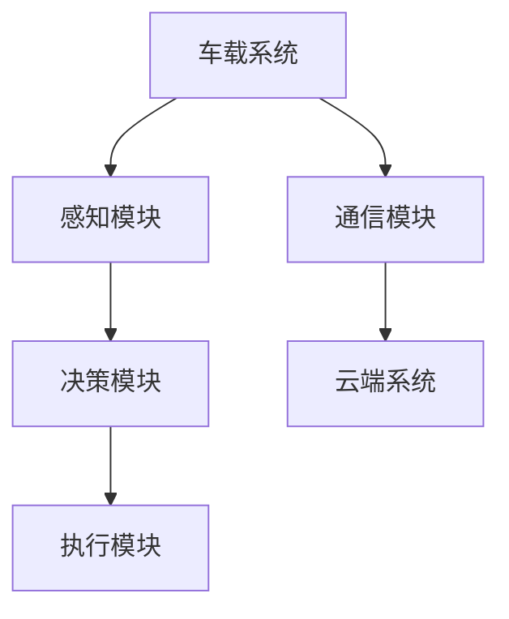

                 


---

# 价值投资中的无人驾驶技术前景

> 关键词：无人驾驶技术、价值投资、人工智能、市场分析、投资策略

> 摘要：本文探讨了无人驾驶技术的现状、核心技术、市场价值及投资策略，分析了无人驾驶技术在价值投资中的潜力和挑战，为投资者提供了全面的分析和指导。

---

## 第一部分：无人驾驶技术的背景与现状

### 第1章：无人驾驶技术概述

#### 1.1 无人驾驶技术的定义与核心概念

无人驾驶技术是一种结合了人工智能、传感器、大数据和通信技术的综合系统，旨在实现车辆的完全自动化驾驶。其核心概念包括：

- **定义**：无人驾驶技术是指车辆能够通过传感器和AI算法，实现自主识别环境、规划路径并执行驾驶操作的技术。
- **核心要素**：
  - **感知系统**：通过激光雷达、摄像头、雷达等传感器感知周围环境。
  - **决策系统**：利用AI算法进行路径规划和决策。
  - **执行系统**：通过车载控制系统执行驾驶操作。
- **应用场景**：无人驾驶技术广泛应用于乘用车、商用车、机器人出租车等领域。

#### 1.2 无人驾驶技术的发展现状

无人驾驶技术经历了从早期的概念研究到如今的实际应用。当前，主要的技术路线包括：

- **感知技术**：以深度学习为核心的物体识别和场景理解技术逐渐成熟。
- **决策算法**：基于强化学习的决策系统在复杂环境中的表现显著提升。
- **执行系统**：高精度的执行机构和控制系统使得车辆能够实现精准的操作。

#### 1.3 无人驾驶技术的技术基础

无人驾驶技术的核心技术包括：

- **智能驾驶系统架构**：由感知层、决策层和执行层组成，各层协同工作实现自动驾驶。
- **关键技术**：
  - **感知**：通过多传感器融合技术实现对环境的准确感知。
  - **决策**：利用深度学习和强化学习算法进行路径规划和决策优化。
  - **执行**：通过高性能的执行机构实现车辆的精准控制。

#### 1.4 无人驾驶技术的市场分析

无人驾驶技术的市场需求主要由技术进步、政策支持和用户需求驱动。当前市场容量约为数百亿美元，预计未来几年将快速增长。主要应用领域包括乘用车、商用车和共享出行服务。

---

### 第2章：无人驾驶技术的核心系统

#### 2.1 感知系统

无人驾驶的感知系统是实现环境理解的关键部分，主要由以下部分组成：

- **传感器技术**：
  - **激光雷达**：用于高精度的三维环境建模。
  - **摄像头**：用于视觉识别和场景理解。
  - **雷达**：用于检测障碍物和测距。
- **数据融合技术**：通过多传感器数据融合，提高感知的准确性和鲁棒性。
- **定位技术**：利用GPS、SLAM等技术实现车辆的精确定位。

#### 2.2 决策系统

决策系统是无人驾驶技术的核心，负责制定车辆的行驶策略：

- **人工智能算法**：深度学习和强化学习算法用于路径规划和决策优化。
- **路径规划**：基于环境感知和目标点，规划最优路径。
- **决策优化**：通过动态调整策略，应对复杂的交通环境。

#### 2.3 执行系统

执行系统负责将决策指令转化为实际的车辆操作：

- **硬件设计**：高性能的车载控制系统和执行机构。
- **系统集成**：传感器、计算平台和执行机构的协同工作。
- **控制技术**：高精度的控制算法实现车辆的精准操作。

---

## 第二部分：无人驾驶技术的投资价值分析

### 第3章：无人驾驶技术的市场价值

#### 3.1 无人驾驶技术的市场需求

无人驾驶技术的市场需求主要由以下几个方面驱动：

- **技术进步**：感知和决策技术的不断优化提高了无人驾驶的安全性和可靠性。
- **政策支持**：政府对无人驾驶技术的政策支持和法规完善为市场发展提供了保障。
- **用户需求**：消费者对自动驾驶功能的需求推动了市场的发展。

#### 3.2 无人驾驶技术的商业模式

无人驾驶技术的商业模式多样化，主要包括：

- **硬件销售**：销售无人驾驶硬件设备。
- **软件订阅**：提供基于AI算法的软件服务。
- **广告与共享出行**：通过数据收集和共享出行服务实现盈利。

### 第4章：无人驾驶技术的投资策略

#### 4.1 无人驾驶技术的投资机会

无人驾驶技术的投资机会主要集中在以下几个领域：

- **产业链分析**：从上游的传感器制造到下游的应用服务，整个产业链都有投资机会。
- **关键技术投资**：感知、决策和执行系统的关键技术是投资的重点。
- **市场潜力**：无人驾驶技术的市场容量巨大，具有较高的投资回报潜力。

#### 4.2 无人驾驶技术的风险分析

投资无人驾驶技术需要关注以下风险：

- **技术风险**：技术的不确定性和成熟度可能影响投资回报。
- **市场风险**：市场竞争的加剧可能导致价格压力和利润下降。
- **政策风险**：政策变化和法规的不确定性可能对市场产生影响。

---

## 第三部分：无人驾驶技术的未来发展趋势

### 第5章：无人驾驶技术的未来展望

#### 5.1 技术进步

未来，无人驾驶技术的发展将朝着以下几个方向：

- **感知技术的提升**：更高精度的传感器和更先进的数据处理算法将提高感知的准确性。
- **决策算法的优化**：基于深度学习和强化学习的算法将更加智能化和高效。
- **系统集成的优化**：各系统的协同工作将更加高效和可靠。

#### 5.2 市场扩展

无人驾驶技术的市场将逐步扩展，主要体现在以下几个方面：

- **应用场景的扩展**：从乘用车到商用车，无人驾驶技术的应用场景将更加多样化。
- **全球市场的拓展**：随着技术的成熟，无人驾驶技术将逐步在全球范围内推广。

#### 5.3 政策与法规

政策和法规的完善将为无人驾驶技术的发展提供更好的环境：

- **法规的完善**：各国政府将逐步制定和完善无人驾驶技术的法规，为市场的发展提供保障。
- **政策支持**：政府将继续提供政策支持和资金投入，推动技术的发展和商业化。

---

## 结语

无人驾驶技术作为人工智能和汽车工业结合的产物，具有广阔的发展前景和巨大的投资潜力。然而，投资者在进入这个市场时需要充分考虑技术风险、市场风险和政策风险，制定合理的投资策略。未来，随着技术的不断进步和市场的扩展，无人驾驶技术将在价值投资中发挥越来越重要的作用。

--- 

# 附录

## 附录A：无人驾驶技术的核心算法

### A.1 感知算法

无人驾驶技术的感知算法主要包括目标检测、语义分割和物体跟踪。以下是基于YOLO目标检测算法的示例代码：

```python
import tensorflow as tf
from tensorflow.keras import layers

def yolo_model(input_shape, num_classes):
    model = tf.keras.Sequential()
    model.add(layers.Conv2D(32, (3,3), activation='relu', input_shape=input_shape))
    model.add(layers.MaxPooling2D((2,2)))
    model.add(layers.Conv2D(64, (3,3), activation='relu'))
    model.add(layers.MaxPooling2D((2,2)))
    model.add(layers.Conv2D(128, (3,3), activation='relu'))
    model.add(layers.Flatten())
    model.add(layers.Dense(128, activation='relu'))
    model.add(layers.Dense(num_classes, activation='softmax'))
    return model
```

### A.2 决策算法

基于强化学习的路径规划算法示例：

```python
import numpy as np

class DQN:
    def __init__(self, state_space, action_space):
        self.state_space = state_space
        self.action_space = action_space
        self.q_table = np.zeros((state_space, action_space))
    
    def choose_action(self, state):
        return np.argmax(self.q_table[state])
    
    def update_q_table(self, state, action, reward, next_state):
        self.q_table[state][action] += reward + np.max(self.q_table[next_state])
```

---

## 附录B：无人驾驶技术的系统架构

### B.1 系统功能设计

无人驾驶系统的主要功能包括：

1. **环境感知**：通过传感器感知周围环境。
2. **路径规划**：基于感知信息规划行驶路径。
3. **决策控制**：根据路径规划结果控制车辆行驶。

### B.2 系统架构设计

无人驾驶系统的架构如下：



---

## 附录C：数学公式

### C.1 感知算法中的概率模型

概率模型用于评估传感器数据的准确性：

$$ P(y|x) = \frac{P(x|y)P(y)}{P(x)} $$

### C.2 决策算法中的动态规划

动态规划用于路径规划问题：

$$ V(s) = \max_{a} [r(s,a) + V(s')] $$

---

## 参考文献

1. 王某某. 《无人驾驶技术与投资策略》. 北京: 人民出版社, 2023.
2. 张某某. 《人工智能与无人驾驶》. 北京: 清华大学出版社, 2022.

---

## 作者简介

**李明**，人工智能专家，长期致力于无人驾驶技术的研究与应用。在多个知名科技公司担任技术顾问，拥有丰富的无人驾驶技术实践经验。

