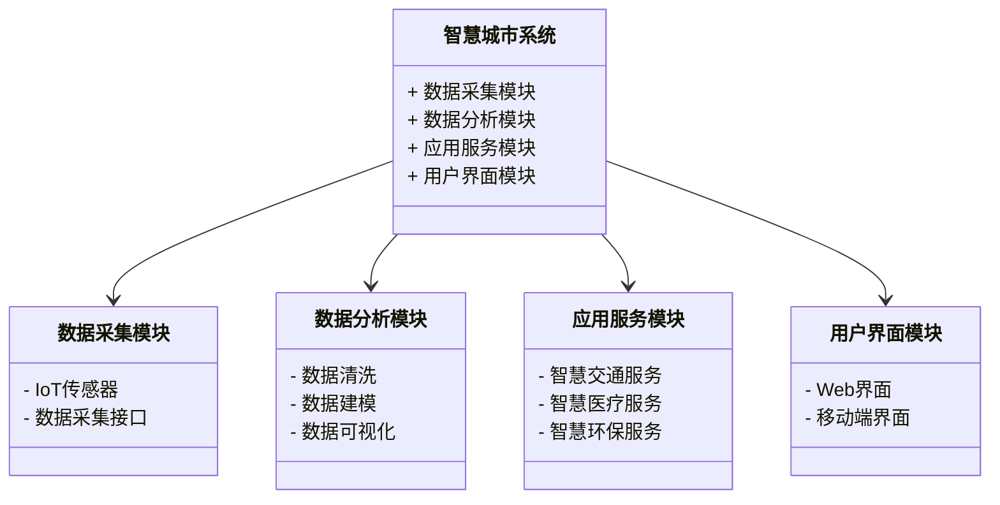
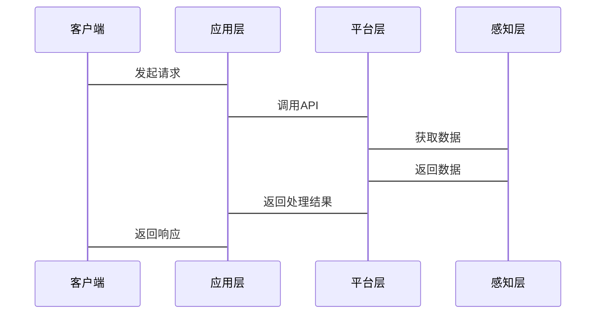

                 

# 价值投资中的智慧城市发展机遇

## 关键词：价值投资、智慧城市、智慧城市建设、投资策略、智慧城市系统架构

## 摘要：  
随着全球城市化进程的加速和科技的飞速发展，智慧城市建设已成为推动城市经济发展和提升居民生活质量的重要方向。本文从价值投资的视角，深入分析智慧城市建设中的发展机遇，探讨投资者如何在这一领域寻找高价值的投资机会。文章结合智慧城市的技术架构、产业链分析和投资策略，为投资者提供系统的指导和实践案例，帮助他们在智慧城市建设中实现长期稳定的收益。

---

## 第一部分：智慧城市与价值投资的背景与基础

### 1.1 智慧城市的概念与发展趋势

#### 1.1.1 智慧城市的定义与核心特征  
- **定义**：智慧城市是通过先进的信息技术和数据驱动的解决方案，优化城市资源分配、提升城市管理效率、改善居民生活质量的城市发展模式。  
- **核心特征**：数字化、智能化、网络化、协同化、可持续性。  

#### 1.1.2 智慧城市的发展背景  
- **城市化进程加速**：全球人口向城市集中，城市资源紧张，传统管理模式难以应对挑战。  
- **技术进步**：大数据、人工智能、物联网（IoT）、区块链等技术的成熟为智慧城市发展提供了技术支撑。  
- **政策支持**：各国政府纷纷出台政策支持智慧城市建设，将其作为推动经济转型的重要手段。  

#### 1.1.3 智慧城市的技术架构  
- **分层架构**：包括感知层（数据采集）、网络层（数据传输）、平台层（数据处理）和应用层（用户服务）。  
- **关键技术**：大数据分析、人工智能算法、物联网设备、区块链技术。  

### 1.2 价值投资的基本原理与策略

#### 1.2.1 价值投资的定义与核心理念  
- **定义**：价值投资是一种投资策略，强调以低于内在价值的价格购买优质资产，长期持有，等待其价值回归。  
- **核心理念**：注重基本面分析，寻找被市场低估的投资标的，关注企业的长期成长潜力。  

#### 1.2.2 价值投资与成长投资的对比  
| 对比维度 | 价值投资 | 成长投资 |  
|----------|-----------|----------|  
| 投资目标 | 低估值、高安全边际 | 高增长潜力 |  
| 适用场景 | 市场低迷、估值过低 | 高增长行业 |  
| 风险承受 | 较低风险偏好 | 较高风险偏好 |  

#### 1.2.3 价值投资在智慧城市领域的应用前景  
- 智慧城市领域的投资机会：大数据、人工智能、物联网等技术企业的成长潜力。  
- 价值投资者在智慧城市中的角色：通过长期持有优质企业股票，分享智慧城市发展的长期收益。  

---

## 第二部分：智慧城市发展中的价值投资分析框架

### 2.1 智慧城市产业链分析

#### 2.1.1 智慧城市产业链的构成  
- **上游**：技术供应商（大数据、人工智能、物联网等技术企业）。  
- **中游**：系统集成商（负责智慧城市的系统设计与集成）。  
- **下游**：政府、企业和公众用户（智慧城市的最终服务对象）。  

#### 2.1.2 产业链中的投资机会  
- **上游**：重点关注技术创新能力强、市场占有率高的技术供应商。  
- **中游**：寻找经验丰富、项目案例丰富的系统集成商。  
- **下游**：关注政府政策支持和企业需求变化带来的投资机会。  

### 2.2 智慧城市发展阶段与投资策略

#### 2.2.1 智慧城市发展的阶段划分  
- **初级阶段**：基础设施建设（如5G网络、物联网设备）。  
- **中级阶段**：系统集成与应用（如智慧交通、智慧医疗）。  
- **高级阶段**：智能化与数据驱动（如AI驱动的城市管理）。  

#### 2.2.2 不同阶段的投资策略  
- **初级阶段**：优先投资基础设施供应商，如通信设备制造商。  
- **中级阶段**：关注系统集成商和应用开发商。  
- **高级阶段**：投资AI技术领先的企业，布局数据驱动的智慧城市应用。  

---

## 第三部分：智慧城市建设中的价值投资实践

### 3.1 智慧城市建设的系统分析

#### 3.1.1 系统功能设计  
- **领域模型**：通过Mermaid类图展示智慧城市的各个功能模块及其关系。  

#### 3.1.2 系统架构设计  
- **系统架构**：通过Mermaid架构图展示智慧城市的分层架构。  

#### 3.1.3 系统接口设计  
- **接口设计**：通过Mermaid序列图展示系统接口的交互流程。  

---

## 第四部分：价值投资在智慧城市中的实战案例

### 4.1 智慧交通领域的投资机会

#### 4.1.1 案例背景  
- 智慧交通是智慧城市的重要组成部分，涉及交通管理、自动驾驶、智能停车等多个场景。  

#### 4.1.2 投资策略  
- 投资自动驾驶技术公司（如特斯拉、Waymo）。  
- 投资智能交通系统集成商（如千方科技）。  

#### 4.1.3 案例分析  
- 以千方科技为例，分析其在智慧交通领域的布局和投资价值。  

### 4.2 智慧环保领域的投资机会

#### 4.2.1 案例背景  
- 智慧环保通过物联网和大数据技术，优化城市资源利用，减少环境污染。  

#### 4.2.2 投资策略  
- 投资环保监测设备供应商（如聚光科技）。  
- 投资环保数据平台运营商（如EcoSensor）。  

#### 4.2.3 案例分析  
- 以聚光科技为例，分析其在智慧环保领域的技术创新和市场表现。  

---

## 第五部分：总结与展望

### 5.1 总结  
- 智慧城市建设为价值投资者提供了丰富的投资机会，尤其是在技术驱动和政策支持下，智慧城市领域的优质企业具备长期成长潜力。  

### 5.2 投资建议  
- 关注技术创新能力强的企业。  
- 选择有稳定业绩和良好管理团队的企业。  
- 长期持有优质企业股票，避免短期市场波动的干扰。  

### 5.3 未来展望  
- 随着技术进步和政策支持，智慧城市将向更智能化、更数据化的方向发展，价值投资者需持续关注这一领域的投资机会。  

---

通过以上分析和案例，投资者可以在智慧城市建设中找到高价值的投资机会，实现长期稳定的收益。

