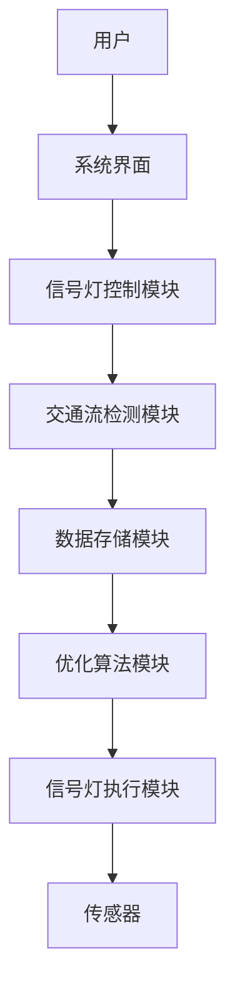

                 


# 价值投资中的智能交通信号控制系统分析

> 关键词：价值投资，智能交通信号控制系统，交通优化，算法分析，投资分析

> 摘要：本文从价值投资的角度，深入分析了智能交通信号控制系统的技术原理、系统架构、优化算法以及市场潜力。通过结合智能交通信号控制系统的实际应用场景，探讨了其在投资中的价值评估方法，为投资者提供了系统的分析框架和决策依据。

---

# 目录

1. [价值投资与智能交通信号控制系统的背景介绍](#value-investments-and-intelligent-traffic-signal-control-system-background)

2. [智能交通信号控制系统的核心概念与原理](#core-concepts-and-principles-of-the-intelligent-traffic-signal-control-system)

3. [智能交通信号控制系统的优化算法](#optimization-algorithms-for-the-intelligent-traffic-signal-control-system)

4. [智能交通信号控制系统的系统架构与设计](#system-architecture-and-design-of-the-intelligent-traffic-signal-control-system)

5. [价值投资中的智能交通信号控制系统分析](#value-investment-analysis-of-the-intelligent-traffic-signal-control-system)

6. [项目实战与案例分析](#project-practice-and-case-analysis)

7. [总结与最佳实践](#conclusion-and-best-practices)

---

## 1. 价值投资与智能交通信号控制系统的背景介绍

### 1.1 价值投资的基本概念

价值投资是一种投资策略，强调通过深入分析企业的基本面，寻找那些市场价格低于其内在价值的股票进行投资。其核心在于识别那些具有持续竞争优势、良好管理和稳定财务状况的企业，并长期持有，等待其价值的回归。

### 1.2 智能交通信号控制系统的现状

传统的交通信号控制系统依赖固定的预设模式，难以适应交通流量的动态变化。随着人工智能和大数据技术的发展，智能交通信号控制系统逐渐成为提升城市交通效率的重要工具。通过实时数据采集、分析和优化算法的应用，智能交通信号控制系统能够动态调整信号配时，减少拥堵，提高道路通行效率。

### 1.3 价值投资视角下的智能交通信号控制系统分析

从价值投资的角度来看，智能交通信号控制系统不仅是一种技术解决方案，更是一种具有广阔市场前景的投资标的。随着城市化进程的加快和人们对交通效率需求的提高，智能交通信号控制系统的需求量将大幅增加，这为其带来了巨大的市场潜力。

---

## 2. 智能交通信号控制系统的核心概念与原理

### 2.1 智能交通信号控制系统的组成与功能

智能交通信号控制系统主要由以下几个部分组成：

1. **交通流检测模块**：通过传感器、摄像头等设备采集交通流量、车速等数据。
2. **信号优化算法模块**：根据采集的数据，优化信号灯的配时方案，以提高交通效率。
3. **系统控制与执行模块**：根据优化结果，控制信号灯的开关。

### 2.2 价值投资视角下的系统分析

从价值投资的角度来看，智能交通信号控制系统的核心价值在于其能够显著提高交通效率，从而为城市带来经济效益和社会效益。例如，减少拥堵可以降低企业的物流成本，提高居民的生活质量。

---

## 3. 智能交通信号控制系统的优化算法

### 3.1 常见的信号优化算法

1. **基于遗传算法的信号优化**：
   - 通过模拟生物进化的过程，逐步优化信号灯的配时方案。
   - 使用适应度函数评估每个方案的优劣，选择最优解进行繁殖和变异。

2. **基于粒子群优化的信号优化**：
   - 模拟鸟群觅食的行为，通过粒子之间的信息共享找到最优解。
   - 粒子的位置和速度根据适应度值进行调整，逐步逼近最优解。

3. **基于强化学习的信号优化**：
   - 使用强化学习算法，通过试错的方式优化信号灯的配时方案。
   - 算法通过奖励机制，逐步学习最优的信号控制策略。

### 3.2 算法的数学模型与公式

以强化学习为例，其数学模型可以表示为：

$$
Q(s, a) = Q(s, a) + \alpha \cdot (r + \gamma \cdot \max_{a'} Q(s', a') - Q(s, a))
$$

其中：
- \( Q(s, a) \) 表示状态 \( s \) 下动作 \( a \) 的价值。
- \( \alpha \) 表示学习率。
- \( r \) 表示奖励。
- \( \gamma \) 表示折扣因子。
- \( s' \) 表示下一个状态。

### 3.3 算法的实现与应用

以下是一个基于强化学习的信号优化算法的Python实现示例：

```python
import numpy as np

class TrafficSignalController:
    def __init__(self, states, actions):
        self.states = states
        self.actions = actions
        self.Q = np.zeros((states, actions))
    
    def take_action(self, state):
        return np.argmax(self.Q[state])
    
    def update_Q(self, state, action, reward, next_state):
        self.Q[state, action] += 0.1 * (reward + 0.9 * np.max(self.Q[next_state]) - self.Q[state, action])
```

---

## 4. 智能交通信号控制系统的系统架构与设计

### 4.1 系统架构设计

智能交通信号控制系统的架构可以分为以下几个层次：

1. **数据采集层**：负责采集交通流量、车辆位置等数据。
2. **算法处理层**：对数据进行分析和优化，生成信号控制方案。
3. **执行层**：根据优化结果控制信号灯的开关。

### 4.2 系统的接口设计

系统需要与以下接口进行交互：

1. **传感器接口**：与交通流量传感器连接，获取实时数据。
2. **用户界面接口**：提供给用户查看和控制信号灯的界面。
3. **外部系统接口**：与其他交通管理系统（如交通监控系统）进行数据交互。

### 4.3 系统的交互设计

以下是一个系统的交互流程图：



---

## 5. 价值投资中的智能交通信号控制系统分析

### 5.1 价值投资的核心要素

1. **企业的财务状况分析**：包括收入、利润、现金流等指标。
2. **企业的市场竞争力分析**：包括技术优势、市场份额、竞争优势等。
3. **企业的长期投资价值预测**：基于市场前景和企业战略进行预测。

### 5.2 智能交通信号控制系统的技术优势与市场潜力

智能交通信号控制系统的技术优势在于其能够显著提高交通效率，降低拥堵，节省时间和能源。其市场潜力巨大，随着城市化进程的加快和人们对交通效率需求的提高，智能交通信号控制系统的需求量将大幅增加。

### 5.3 价值投资与智能交通信号控制系统结合的必要性

从价值投资的角度来看，智能交通信号控制系统不仅是一种技术解决方案，更是一种具有广阔市场前景的投资标的。通过深入分析企业的技术优势、市场竞争力和财务状况，投资者可以找到那些具有持续竞争优势和良好发展前景的企业进行投资。

---

## 6. 项目实战与案例分析

### 6.1 项目环境配置

1. **硬件配置**：
   - 交通流量传感器（如激光传感器、摄像头等）。
   - 信号灯控制设备。
2. **软件配置**：
   - 数据采集和处理软件。
   - 优化算法实现的Python代码。

### 6.2 核心代码实现

以下是一个基于强化学习的信号优化算法的Python代码实现：

```python
import numpy as np
import random

class TrafficSignalController:
    def __init__(self, states, actions):
        self.states = states
        self.actions = actions
        self.Q = np.zeros((states, actions))
    
    def take_action(self, state):
        return random.randint(0, self.actions-1)
    
    def update_Q(self, state, action, reward, next_state):
        self.Q[state, action] = self.Q[state, action] + 0.1 * (reward + 0.9 * np.max(self.Q[next_state]) - self.Q[state, action])
```

### 6.3 案例分析

假设我们在一个城市中部署智能交通信号控制系统，通过实时优化信号灯配时，减少交通拥堵，提高道路通行效率。通过数据分析，我们发现系统可以将高峰期间的平均等待时间减少30%，从而提高交通效率和居民满意度。

---

## 7. 总结与最佳实践

### 7.1 总结

智能交通信号控制系统是一种具有广阔市场前景的技术解决方案，其通过实时优化信号灯配时，显著提高交通效率，降低拥堵。从价值投资的角度来看，智能交通信号控制系统不仅具有技术优势，还具有良好的市场潜力和投资价值。

### 7.2 最佳实践

1. **关注企业的技术优势**：选择具有先进优化算法和技术优势的企业。
2. **分析企业的市场竞争力**：关注企业在市场中的份额和竞争优势。
3. **关注企业的财务状况**：选择财务健康、具有良好发展前景的企业。
4. **长期持有**：价值投资的核心在于长期持有，等待企业价值的回归。

### 7.3 注意事项

- **技术风险**：智能交通信号控制系统的技术复杂性较高，存在技术风险。
- **市场竞争**：市场竞争激烈，企业需要不断创新以保持竞争优势。
- **政策影响**：政策的变化可能对智能交通信号控制系统的需求产生影响。

### 7.4 拓展阅读

- 《价值投资入门》
- 《智能交通系统的设计与实现》
- 《强化学习在交通控制中的应用》

---

通过本文的分析，读者可以全面了解智能交通信号控制系统的技术原理、系统架构和优化算法，同时从价值投资的角度，找到具有投资价值的企业和标的。希望本文能够为投资者和技术人员提供有价值的参考和启示。

