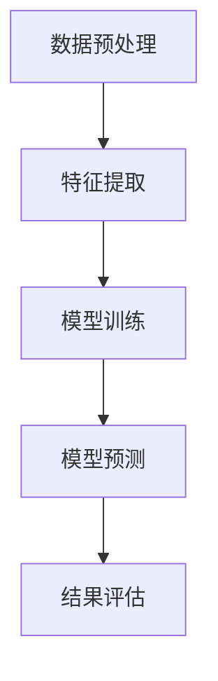
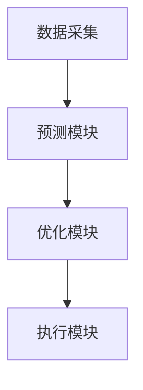

                 


# 价值投资中的智能交通拥堵预测与疏导系统分析

> 关键词：智能交通系统，拥堵预测，疏导优化，价值投资，机器学习，系统架构

> 摘要：本文从价值投资的视角分析智能交通拥堵预测与疏导系统，探讨如何通过技术手段优化城市交通管理，提升交通效率，降低拥堵带来的经济损失和社会成本。

---

## 第一部分：智能交通拥堵预测与疏导系统背景

### 第1章：智能交通拥堵预测与疏导系统背景

#### 1.1 问题背景

- **城市化带来的交通问题**：随着城市化进程的加快，交通拥堵已成为许多城市的常见问题，严重影响了城市的经济和社会发展。
- **价值投资视角下的交通管理**：在价值投资中，我们关注的是在低谷时买入、在高点时卖出。将这一理念应用到交通管理中，可以优化资源配置，降低拥堵成本。
- **智能交通系统的概念**：通过智能化的技术手段，实时监控和预测交通状况，优化交通流量，减少拥堵。

#### 1.2 问题描述

- **交通拥堵预测的核心问题**：如何准确预测交通拥堵的发生时间和地点，以便提前采取措施。
- **疏导策略优化的目标**：通过优化疏导策略，减少交通拥堵，提高交通效率。
- **系统设计的边界与外延**：明确系统的功能边界和扩展性，确保系统能够适应不同的交通场景。

#### 1.3 核心概念与联系

- **核心概念原理**：拥堵预测、疏导策略优化、价值投资策略。
- **概念属性特征对比表**：

| 概念       | 属性1：实时性 | 属性2：准确性 | 属性3：可扩展性 |
|------------|--------------|--------------|----------------|
| 拥堵预测    | 高           | 中           | 高              |
| 疏导策略优化| 中           | 高           | 高              |
| 价值投资策略| 低           | 高           | 高              |

- **ER实体关系图**：

```mermaid
er
  actor 交通管理部门
  actor 驾驶员
  actor 乘客
  actor 城市规划部门
  actor 交通信号灯系统
  actor 交通监控系统

  traffic data
  prediction model
  optimization strategy
  execution module

  交通管理部门 --> traffic data
  驾驶员 --> traffic data
  乘客 --> traffic data
  城市规划部门 --> traffic data

  traffic data --> prediction model
  prediction model --> optimization strategy
  optimization strategy --> execution module
```

---

## 第二部分：价值投资与智能交通系统的核心概念

### 第2章：价值投资与智能交通系统的核心概念

#### 2.1 价值投资的核心原理

- **价值投资的基本原理**：寻找被市场低估的资源或机会，在低价时买入，高价时卖出。
- **价值投资与交通系统的联系**：通过优化资源配置，降低拥堵成本，提高交通效率。

#### 2.2 智能交通拥堵预测的核心算法

- **机器学习在交通预测中的应用**：使用回归、分类和聚类算法，分析历史数据，预测未来交通状况。
- **时间序列分析方法**：使用ARIMA和LSTM模型，捕捉交通流量的时间依赖性。

#### 2.3 疏导策略优化的数学模型

- **数学模型的构建**：建立拥堵成本函数，优化疏导策略，最小化拥堵成本。
- **模型的优化与验证**：通过实验数据验证模型的有效性。

---

## 第三部分：智能交通拥堵预测与疏导系统的算法原理

### 第3章：智能交通拥堵预测算法

#### 3.1 机器学习算法在交通预测中的应用

- **算法选择与优化**：选择适合的算法，优化模型参数，提高预测精度。
- **算法流程图**：



- **Python代码实现**：

```python
import pandas as pd
from sklearn.model_selection import train_test_split
from sklearn.linear_model import LinearRegression

# 数据加载与预处理
data = pd.read_csv('traffic_data.csv')
X = data[['时间', '车流量', '天气']]
y = data['拥堵指数']

# 数据分割
X_train, X_test, y_train, y_test = train_test_split(X, y, test_size=0.2)

# 模型训练
model = LinearRegression()
model.fit(X_train, y_train)

# 模型预测
y_pred = model.predict(X_test)

# 结果评估
print('预测结果:', y_pred)
print('真实结果:', y_test)
```

#### 3.2 时间序列分析方法

- **ARIMA模型**：适用于线性时间序列数据的预测。
- **LSTM模型**：适用于非线性时间序列数据的预测。
- **模型对比与优化**：通过实验比较ARIMA和LSTM的性能，选择最优模型。

---

## 第四部分：系统架构与设计

### 第5章：系统架构设计

#### 5.1 系统架构设计

- **系统模块划分**：数据采集、预测模块、优化模块、执行模块。
- **系统架构图**：



- **系统接口设计**：定义各模块之间的接口，确保系统的可扩展性和可维护性。

---

## 第五部分：项目实战

### 第6章：项目实战

#### 6.1 环境配置

- **工具与库**：Python、TensorFlow、Scikit-learn、Pandas、Mermaid。

#### 6.2 核心代码实现

- **拥堵预测模块代码**：

```python
import numpy as np
from tensorflow.keras.models import Sequential
from tensorflow.keras.layers import LSTM, Dense

# 数据准备
X = np.array([...])
y = np.array([...])

# 模型构建
model = Sequential()
model.add(LSTM(128, input_shape=(X.shape[1], 1)))
model.add(Dense(1))
model.compile(optimizer='adam', loss='mse')

# 模型训练
model.fit(X, y, epochs=100, batch_size=32)
```

- **疏导优化模块代码**：

```python
import numpy as np
from scipy.optimize import genetic

# 疏导优化函数
def optimize_strategy(strategies):
    # 定义目标函数
    def objective(strategy):
        return calculate_cost(strategy)
    
    # 约束条件
    constraints = {'max_distance': 10, 'max_time': 30}
    
    # 遗传算法优化
    optimal = geneticAlgorithm(objective, constraints)
    return optimal.strategy

# 优化策略
strategies = [...]  # 可能的疏导策略
optimized = optimize_strategy(strategies)
print('优化后的策略:', optimized)
```

#### 6.3 案例分析与解读

- **案例分析**：通过具体案例，展示系统的预测和优化能力。
- **结果解读**：分析预测和优化结果，验证系统的有效性。

#### 6.4 项目总结

- **项目小结**：总结项目的实施过程和成果。
- **项目意义**：说明项目对城市交通管理的重要意义。

---

## 第六部分：最佳实践与拓展

### 第7章：最佳实践

#### 7.1 小结

- 通过价值投资视角，结合智能交通技术，优化城市交通管理。
- 通过算法优化和系统设计，提升系统的预测和优化能力。

#### 7.2 注意事项

- 数据的准确性和实时性对系统性能影响重大。
- 系统的可扩展性和可维护性需要重点关注。

#### 7.3 拓展阅读

- 推荐相关书籍和论文，进一步深入学习智能交通系统和价值投资策略。

---

## 结语

本文通过价值投资的视角，分析了智能交通拥堵预测与疏导系统的各个方面，从理论到实践，详细阐述了系统的构建与优化过程。希望本文能为相关领域的研究和实践提供有价值的参考。

