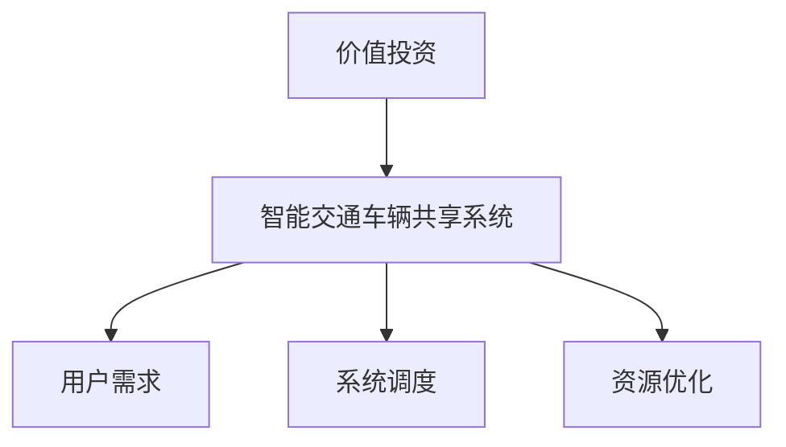
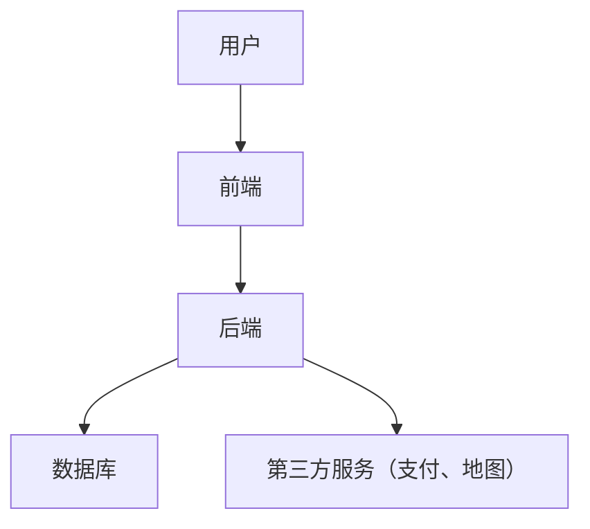

                 


# 价值投资中的智能交通车辆共享系统分析

> 关键词：价值投资、智能交通、车辆共享系统、算法原理、数学模型

> 摘要：本文探讨了价值投资在智能交通车辆共享系统中的应用，分析了系统的运作模式、算法原理和数学模型，结合实际案例，为投资者提供深入的分析和见解。

---

## 第一章 引言

### 1.1 价值投资的基本概念
价值投资是一种长期投资策略，注重分析企业的内在价值，寻找被市场低估的投资机会。核心在于分析企业的财务报表、市场地位和未来前景。

### 1.2 智能交通车辆共享系统概述
智能交通系统（ITS）利用信息技术优化交通管理，车辆共享系统则通过共享模式提高资源利用率。两者的结合为现代交通带来了高效解决方案。

### 1.3 价值投资与智能交通的结合
随着技术进步和市场变化，智能交通车辆共享系统具备了投资价值。本文将从技术与经济角度分析其投资潜力。

---

## 第二章 核心概念与联系

### 2.1 价值投资的核心概念
- **内在价值**：企业未来现金流的现值。
- **市场价值**：市场对企业的估值。
- **安全边际**：内在价值与市场价值的差额。

### 2.2 智能交通车辆共享系统的属性
- **技术依赖**：依赖信息技术实现共享。
- **用户需求**：解决交通最后一公里问题。
- **运营模式**：通过APP实现车辆调度和用户服务。

### 2.3 概念对比表
| 属性         | 价值投资               | 智能交通车辆共享系统         |
|--------------|------------------------|----------------------------|
| 核心目标     | 寻找低估企业             | 提高交通效率                 |
| 分析工具     | 财务报表分析             | 用户需求预测、系统调度算法   |
| 价值来源     | 企业盈利能力             | 车辆使用效率、用户满意度     |

### 2.4 Mermaid概念图


---

## 第三章 算法原理

### 3.1 用户需求预测算法
- **需求预测方法**：基于历史数据和用户行为分析。
- **算法流程**：
  1. 数据收集（用户使用频率、时段）。
  2. 数据清洗与特征提取。
  3. 建立预测模型（时间序列分析、机器学习模型）。
  4. 模型优化与验证。

### 3.2 系统调度优化算法
- **算法目标**：最大化车辆利用率，最小化空驶率。
- **流程图**：
  ```mermaid
  graph TD
  A[用户需求预测] --> B[车辆调度]
  B --> C[资源分配]
  C --> D[系统优化]
  ```

### 3.3 Python代码示例
```python
import pandas as pd
from sklearn.linear_model import LinearRegression

# 数据加载
data = pd.read_csv('user_demand.csv')

# 特征与目标分离
X = data[['time', 'location']]
y = data['demand']

# 建立模型
model = LinearRegression()
model.fit(X, y)

# 预测
predicted_demand = model.predict(X)
```

---

## 第四章 数学模型与公式

### 4.1 现金流折现模型（DCF）
$$ V = \sum_{t=1}^{n} \frac{CF_t}{(1 + r)^t} $$
其中，\( V \) 是企业价值，\( CF_t \) 是第t年的现金流，\( r \) 是折现率。

### 4.2 用户需求预测模型
$$ D(t) = a \cdot t + b $$
其中，\( D(t) \) 是用户需求，\( t \) 是时间，\( a \) 和 \( b \) 是模型参数。

### 4.3 系统资源分配模型
$$ \text{资源分配} = \min\left(\text{需求}, \text{供给}\right) $$

---

## 第五章 系统分析与架构设计

### 5.1 系统功能设计
- **用户功能**：注册、登录、车辆预约、支付。
- **管理功能**：车辆调度、用户管理、数据分析。

### 5.2 系统架构设计


### 5.3 系统接口设计
- **API接口**：RESTful API实现用户请求与系统响应。
- **交互流程图**：
  ```mermaid
  sequenceDiagram
  participant 用户
  participant 系统
  用户->系统: 请求车辆
  系统->用户: 返回车辆位置
  用户->系统: 确认使用
  系统->用户: 支付成功
  ```

---

## 第六章 项目实战

### 6.1 环境安装
- **工具**：Python、Jupyter Notebook、数据库。
- **库**：pandas、scikit-learn、Flask。

### 6.2 核心代码实现
```python
from flask import Flask, jsonify

app = Flask(__name__)

@app.route('/predict', methods=['POST'])
def predict():
    data = request.json['data']
    prediction = model.predict(data)
    return jsonify({'result': prediction.tolist()})

if __name__ == '__main__':
    app.run(debug=True)
```

### 6.3 案例分析
以某共享单车公司为例，分析其财务状况、市场需求和技术优势，评估其投资价值。

---

## 第七章 最佳实践与小结

### 7.1 投资建议
- 关注企业的财务健康状况。
- 评估系统的用户需求和运营效率。
- 留意政策支持和市场竞争情况。

### 7.2 未来展望
随着技术进步和市场发展，智能交通车辆共享系统具备更大的投资潜力。

---

## 第八章 小结

本文从价值投资的角度，深入分析了智能交通车辆共享系统的运作模式和投资机会。通过算法和数学模型，为投资者提供了科学的分析工具和决策依据。

---

### 注意事项：
- 投资需谨慎，本文仅为分析参考。
- 建议结合市场动态和专业分析。

---

**THE END**

---

**扩展阅读**：
- 关于价值投资的经典书籍：《 Intelligent Investor》。
- 智能交通系统的技术发展：《Smart City Technologies》。

