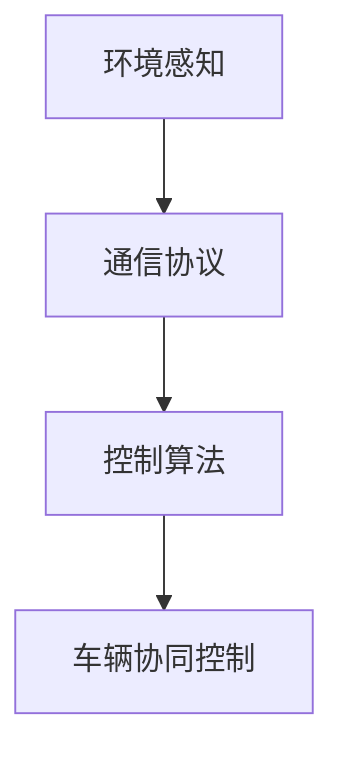
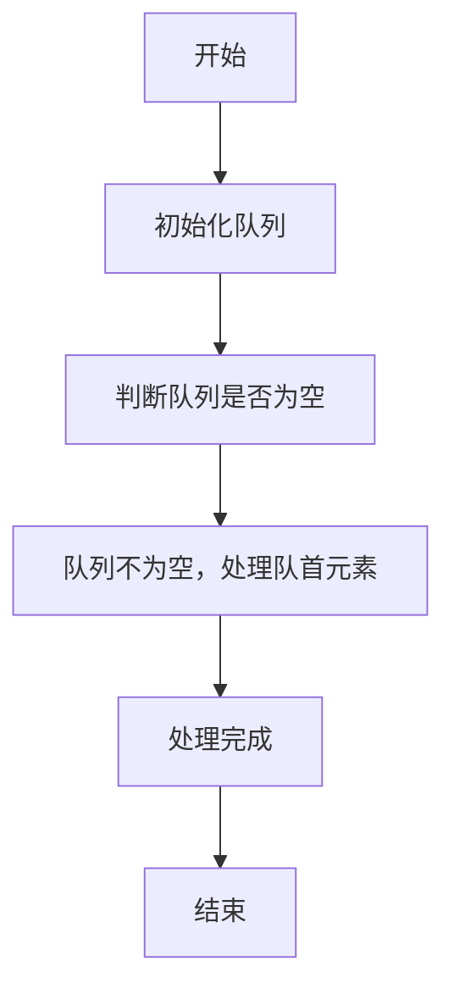

                 


# 价值投资中的智能交通车辆编队系统分析

> 关键词：价值投资，智能交通，车辆编队系统，算法原理，系统架构

> 摘要：本文系统分析了智能交通车辆编队系统在价值投资中的应用，通过背景介绍、核心概念、算法原理、系统架构设计、项目实战和最佳实践等方面，深入探讨了编队系统的技术本质和投资价值。结合实际案例分析，本文提出了优化投资策略的方法，并展望了未来的发展方向。

---

## 第一部分: 智能交通车辆编队系统背景介绍

### 第1章: 问题背景

#### 1.1 传统交通系统的局限性
传统交通系统依赖人工驾驶和交通信号灯，存在效率低、能耗高、安全性差等问题。例如，高峰时期的交通拥堵会导致车辆排队时间增加，从而浪费燃油和时间成本。

#### 1.2 智能交通系统的发展趋势
随着人工智能和物联网技术的快速发展，智能交通系统（ITS）成为提升交通效率的重要手段。车辆编队系统作为 ITS 的重要组成部分，通过智能化的车辆协同控制，实现交通流的优化。

#### 1.3 车辆编队系统的核心问题
车辆编队系统的核心问题是如何在复杂的交通环境中实现车辆的高效编队和动态调整。这需要解决多目标优化问题，包括减少燃料消耗、降低排放、提高通行效率等。

---

### 第2章: 问题描述

#### 2.1 车辆编队系统的定义
车辆编队系统是指通过智能传感器、通信技术和控制算法，实现多辆车辆在道路上的协同行驶。编队系统可以分为单车道和多车道两种类型。

#### 2.2 编队系统的关键特性
编队系统的特性包括实时性、安全性、经济性和可扩展性。其中，实时性是确保车辆能够快速响应交通变化的关键，安全性是保障驾驶员和乘客安全的基础。

#### 2.3 价值投资中的编队系统分析目标
在价值投资中，分析编队系统的投资价值需要考虑其经济效益、市场潜力和技术创新能力。通过技术分析和市场调研，可以找到具有投资潜力的编队系统项目。

---

### 第3章: 问题解决

#### 3.1 智能交通技术的应用
智能交通技术包括自动驾驶、交通预测和路径优化等。编队系统通过这些技术实现车辆的协同控制，从而提高交通效率。

#### 3.2 车辆编队系统的实现方法
编队系统的核心实现方法包括传感器数据采集、通信协议设计和控制算法优化。例如，使用毫米波雷达和摄像头进行环境感知，通过5G通信技术实现车辆间的实时通信。

#### 3.3 价值投资中的优化策略
在价值投资中，可以通过技术评估、市场分析和财务模型构建来优化投资策略。例如，评估编队系统的市场渗透率和成本回收周期，选择具有高成长潜力的项目进行投资。

---

### 第4章: 边界与外延

#### 4.1 系统边界
编队系统的边界包括车辆、道路、交通信号灯和通信网络。系统外部的因素如天气条件和驾驶员行为也会对编队系统的性能产生影响。

#### 4.2 外延与相关领域
编队系统的外延包括自动驾驶、智能物流和智慧城市等领域。这些领域的发展将为编队系统提供更广阔的应用场景。

#### 4.3 与其他系统的区别
编队系统与自动驾驶系统的主要区别在于，编队系统注重车辆间的协同控制，而自动驾驶系统注重单车的智能决策。两者可以结合使用，形成更高效的交通系统。

---

### 第5章: 概念结构与核心要素

#### 5.1 核心概念
编队系统的概念结构包括环境感知、通信协议、控制算法和车辆协同控制等核心概念。

#### 5.2 核心要素组成
核心要素包括传感器、通信模块、控制模块和执行机构。这些要素共同作用，实现车辆的协同控制。

#### 5.3 概念结构图


---

## 第二部分: 智能交通车辆编队系统的核心概念与联系

### 第6章: 核心概念原理

#### 6.1 车辆编队的核心机制
编队系统的核心机制包括车辆间的距离保持、速度同步和路径规划。这些机制通过传感器和通信技术实现。

#### 6.2 智能交通系统的支撑技术
智能交通系统的支撑技术包括人工智能、物联网和大数据分析。这些技术为编队系统的实现提供了技术基础。

#### 6.3 价值投资中的关键指标
在价值投资中，关键指标包括市场占有率、技术领先性和盈利能力。投资者需要综合考虑这些指标，选择具有竞争优势的编队系统项目。

---

### 第7章: 核心概念属性对比

#### 7.1 不同编队策略的对比分析
| 编队策略 | 优点 | 缺点 |
|----------|------|------|
| 均匀间距 | 稳定性高 | 初始成本高 |
| 自适应间距 | 灵活性好 | 实时性要求高 |

#### 7.2 各种交通技术的优缺点
| 技术 | 优点 | 缺点 |
|------|------|------|
| 自动驾驶 | 安全性高 | 成本高 |
| 编队系统 | 效率高 | 依赖通信技术 |

#### 7.3 价值投资中的指标对比
| 指标 | 重要性 | 影响因素 |
|------|--------|----------|
| 市场占有率 | 高 | 技术优势 |
| 技术领先性 | 高 | 研发投入 |
| 盈利能力 | 中 | 市场需求 |

---

## 第三部分: 智能交通车辆编队系统的算法原理

### 第8章: 算法原理讲解

#### 8.1 队列调度算法
队列调度算法用于实现车辆的有序编队。算法流程如下：



#### 8.2 路径规划算法
路径规划算法用于实现车辆的最优路径选择。数学公式如下：

$$ \text{路径长度} = \sum_{i=1}^{n} d_i $$

其中，$d_i$ 表示第 $i$ 段的距离。

---

## 第四部分: 智能交通车辆编队系统的系统分析与架构设计

### 第9章: 系统分析

#### 9.1 项目介绍
本项目旨在开发一个智能交通车辆编队系统，通过传感器和通信技术实现车辆的协同控制。

#### 9.2 功能设计
系统功能包括环境感知、通信协议设计和控制算法优化。

#### 9.3 系统架构设计
系统架构包括传感器模块、通信模块、控制模块和执行机构。架构图如下：

```mermaid
er
actor: 车辆
actor: 交通系统
actor: 编队系统
```

---

## 第五部分: 智能交通车辆编队系统的项目实战

### 第10章: 环境安装

#### 10.1 系统环境
编队系统需要安装在车辆上，依赖传感器、通信模块和控制模块。

#### 10.2 软件安装
需要安装传感器驱动、通信协议栈和控制算法。

---

### 第11章: 核心代码实现

#### 11.1 队列调度算法实现
```python
class Queue:
    def __init__(self):
        self.items = []
```

#### 11.2 路径规划算法实现
```python
def path_planning():
    total_distance = sum(d for d in distances)
    return total_distance
```

---

### 第12章: 案例分析

#### 12.1 实际案例分析
分析某编队系统项目的市场表现和投资回报。

#### 12.2 详细解读与分析
通过数据分析和市场调研，评估编队系统的投资价值。

---

### 第13章: 项目小结

#### 13.1 项目总结
总结项目的主要成果和不足。

#### 13.2 项目经验
分享项目实施中的经验教训。

---

## 第六部分: 智能交通车辆编队系统的最佳实践

### 第14章: 投资建议

#### 14.1 投资策略
建议投资者关注技术领先、市场潜力大的编队系统项目。

#### 14.2 风险提示
提示投资者注意技术风险和市场风险。

---

### 第15章: 未来展望

#### 15.1 技术发展
展望编队系统的技术发展趋势，如人工智能和5G技术的应用。

#### 15.2 市场前景
预测编队系统的市场前景，分析其在智能交通中的重要性。

---

## 结语

通过本文的系统分析，我们可以看到智能交通车辆编队系统在价值投资中的巨大潜力。投资者需要结合技术分析和市场调研，选择具有竞争优势的项目进行投资。未来，随着技术的进步，编队系统将在智能交通中发挥越来越重要的作用。

