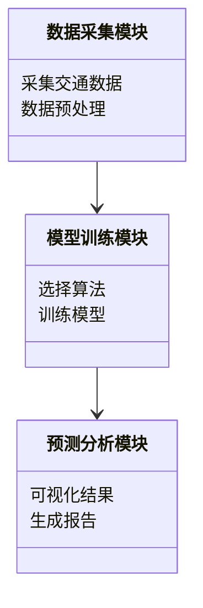
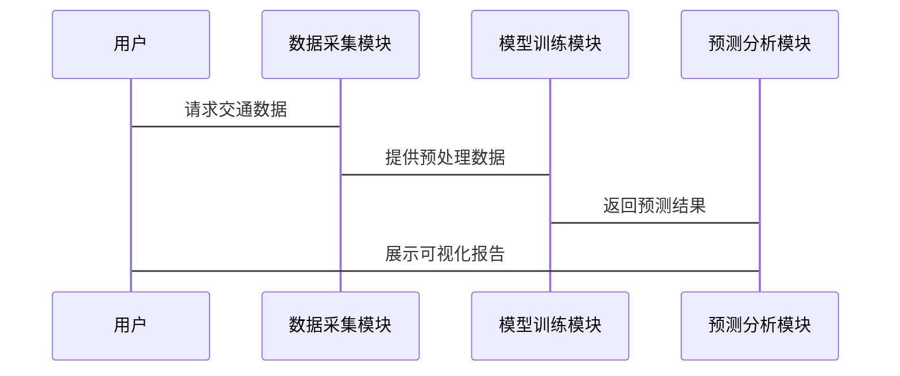

                 


```markdown
# 价值投资中的智能交通预测系统分析

> 关键词：价值投资，智能交通预测系统，深度学习，时间序列分析，交通流量预测，交通基础设施，投资决策

> 摘要：本文探讨了智能交通预测系统在价值投资中的应用，分析了交通数据对投资决策的影响，提出了基于深度学习和时间序列分析的交通预测模型，并通过系统架构设计和项目实战展示了如何利用智能交通预测系统优化价值投资策略。

---

## 第1章：价值投资与智能交通预测系统背景

### 1.1 价值投资的背景与核心理念

#### 1.1.1 价值投资的基本概念
价值投资是一种以基本面分析为基础的投资策略，强调以低于内在价值的价格买入优质资产。核心在于识别市场低估的股票，并长期持有，等待其价值回归。

#### 1.1.2 价值投资的核心理念与原则
- **安全边际**：买入价格低于内在价值，确保足够的安全空间。
- **长期视角**：关注企业的长期盈利能力，而非短期市场波动。
- **逆向思维**：在市场恐慌时寻找机会，在市场狂热时保持冷静。

#### 1.1.3 价值投资在现代金融中的应用
价值投资广泛应用于股票、房地产、基础设施等领域，尤其在基础设施投资中，交通数据的分析具有重要影响。

### 1.2 智能交通预测系统的背景

#### 1.2.1 交通预测系统的发展历程
从简单的统计分析到复杂的机器学习模型，交通预测技术经历了从经验估计到数据驱动的转变。

#### 1.2.2 智能交通预测系统的定义与特点
智能交通预测系统通过实时数据和先进算法，预测交通流量、拥堵情况和路径优化，显著提高了交通管理效率。

#### 1.2.3 智能交通预测系统在城市规划中的作用
智能交通预测系统为城市交通规划提供科学依据，优化道路设计、公交线路和交通信号灯配置。

### 1.3 价值投资与智能交通预测系统的结合

#### 1.3.1 交通数据在价值投资中的潜在价值
交通数据反映了城市的经济活力和人口流动，对房地产、零售业等投资决策有重要影响。

#### 1.3.2 智能交通预测系统如何为价值投资提供支持
通过预测交通流量，投资者可以评估商业地产的价值和潜在收益，优化投资组合。

#### 1.3.3 价值投资视角下的智能交通预测系统分析框架
本文构建了一个结合交通预测和价值评估的分析框架，帮助投资者在交通数据中发现投资机会。

---

## 第2章：智能交通预测系统的核心概念与分析框架

### 2.1 智能交通预测系统的构成要素

#### 2.1.1 数据采集与处理模块
- 数据来源：交通传感器、GPS、社交媒体等。
- 数据预处理：清洗、归一化、特征提取。

#### 2.1.2 模型构建与训练模块
- 选择合适的时间序列模型，如ARIMA、LSTM。
- 数据训练与模型调优。

#### 2.1.3 预测结果分析与可视化模块
- 可视化工具展示预测结果，辅助决策。

### 2.2 价值投资中的关键分析维度

#### 2.2.1 交通流量与市场供需关系
- 交通流量反映区域经济活力，影响商业地产价值。
- 需求预测帮助投资者判断市场潜力。

#### 2.2.2 交通基础设施的价值评估
- 基础设施状况影响房地产价值。
- 投资者关注交通项目的经济效益和长期收益。

#### 2.2.3 交通政策对投资决策的影响
- 政策变化影响交通网络布局，进而影响投资价值。

### 2.3 智能交通预测系统与价值投资的关联性分析

#### 2.3.1 数据驱动的交通预测如何影响投资决策
- 精准预测交通流量，优化商业地产投资。
- 通过交通预测评估区域经济发展潜力。

#### 2.3.2 交通预测模型的准确性对投资价值的影响
- 模型准确性直接影响投资决策的科学性。
- 高精度模型能帮助投资者发现潜在机会。

#### 2.3.3 价值投资中的交通预测系统优化方向
- 提高模型的泛化能力，适应不同城市和区域特点。
- 结合地理信息系统（GIS）进行空间分析，优化投资布局。

---

## 第3章：智能交通预测系统的算法原理与实现

### 3.1 时间序列分析算法

#### 3.1.1 ARIMA模型的原理与应用
- **原理**：ARIMA（自回归积分滑动平均）模型基于历史数据预测未来趋势。
- **公式**：
  $$ ARIMA(p, d, q) $$
  其中，p为自回归阶数，d为差分阶数，q为移动平均阶数。
- **应用**：适用于平稳时间序列的预测。

#### 3.1.2 LSTM模型在时间序列预测中的应用
- **原理**：LSTM（长短期记忆网络）通过门控机制有效捕捉长期依赖关系。
- **公式**：
  $$ f_t = \sigma(g_t) $$
  $$ h_t = f_t \cdot h_{t-1} + (1 - f_t) \cdot h_{t-1} $$
- **应用**：适用于非平稳时间序列，如交通流量预测。

#### 3.1.3 其他时间序列预测算法的对比分析
- **对比**：ARIMA适合平稳数据，LSTM适合复杂模式，Prophet（Facebook开源库）易用性强。

### 3.2 机器学习算法在交通预测中的应用

#### 3.2.1 线性回归模型的简单实现
- **原理**：通过最小二乘法拟合最佳回归线。
- **公式**：
  $$ y = \beta_0 + \beta_1x + \epsilon $$
- **应用**：适合线性关系的简单预测。

#### 3.2.2 支持向量机（SVM）在交通预测中的应用
- **原理**：通过最大化-margin分类或回归。
- **公式**：
  $$ y = sign(\sum_{i=1}^n \alpha_i y_i x_i \cdot x + b) $$
- **应用**：适合小样本、高维数据的分类和回归。

#### 3.2.3 随机森林算法的实现与优化
- **原理**：集成多个决策树，通过投票或平均得到结果。
- **公式**：无显式公式，基于树结构。
- **优化**：调整树的数量和深度，减少过拟合。

### 3.3 深度学习模型的实现与优化

#### 3.3.1 CNN在交通图像识别中的应用
- **原理**：卷积神经网络通过卷积操作提取图像特征。
- **公式**：
  $$ a_{i,j}^{(k)} = f\left(\sum_{m,n} w_{m,n}^{(k)} \cdot x_{i+m,j+n}^{(k-1)} + b_k\right) $$
- **应用**：用于交通标志识别和图像分割。

#### 3.3.2 Transformer模型在交通流量预测中的应用
- **原理**：基于自注意力机制，捕捉长距离依赖。
- **公式**：
  $$ Q = X \cdot W_Q $$
  $$ K = X \cdot W_K $$
  $$ V = X \cdot W_V $$
  $$ \text{Attention}(Q,K,V) = \text{softmax}\left(\frac{QK^T}{\sqrt{d_k}}\right)V $$
- **应用**：适合处理序列数据，如交通流量时间序列。

#### 3.3.3 深度学习模型的训练技巧与优化策略
- **技巧**：使用早停、学习率衰减、批量归一化。
- **优化**：选择合适的激活函数和损失函数，调整模型超参数。

---

## 第4章：智能交通预测系统的系统架构与设计

### 4.1 系统架构设计

#### 4.1.1 数据采集与预处理模块的设计
- **数据来源**：传感器、摄像头、GPS等。
- **数据预处理**：清洗、归一化、特征提取。

#### 4.1.2 模型训练与部署模块的设计
- **模型训练**：选择合适算法，训练模型。
- **模型部署**：将模型部署到云平台或边缘设备。

#### 4.1.3 预测结果分析与可视化模块的设计
- **可视化工具**：如Tableau、Power BI。
- **分析报告**：生成交通预测报告，辅助决策。

### 4.2 系统功能设计

#### 4.2.1 领域模型（Mermaid类图）


#### 4.2.2 系统架构（Mermaid架构图）
```mermaid
container 智能交通预测系统 {
    数据采集模块
    模型训练模块
    预测分析模块
}
```

#### 4.2.3 系统接口设计
- **API接口**：RESTful API，提供数据接口和预测结果接口。
- **交互流程**：用户请求预测，系统返回结果。

#### 4.2.4 系统交互（Mermaid序列图）


---

## 第5章：项目实战

### 5.1 环境安装与配置

#### 5.1.1 安装Python环境
- 使用Anaconda或虚拟环境，安装Python 3.8+。

#### 5.1.2 安装依赖库
- `pip install numpy pandas scikit-learn tensorflow keras matplotlib`

### 5.2 核心实现代码

#### 5.2.1 数据预处理代码
```python
import pandas as pd
import numpy as np

# 数据加载
data = pd.read_csv('traffic_data.csv')

# 数据清洗
data.dropna(inplace=True)
data = data[~data.duplicated()]

# 特征提取
features = data[['time', 'traffic_volume', 'weather']]
```

#### 5.2.2 LSTM模型实现代码
```python
from tensorflow.keras.models import Sequential
from tensorflow.keras.layers import LSTM, Dense

model = Sequential()
model.add(LSTM(64, input_shape=(timesteps, features)))
model.add(Dense(1))
model.compile(loss='mean_squared_error', optimizer='adam')
model.fit(X_train, y_train, epochs=100, batch_size=32)
```

#### 5.2.3 模型预测与可视化
```python
# 预测
y_pred = model.predict(X_test)

# 可视化
import matplotlib.pyplot as plt

plt.plot(y_test, label='实际值')
plt.plot(y_pred, label='预测值')
plt.legend()
plt.show()
```

### 5.3 实际案例分析与解读

#### 5.3.1 案例背景
- 数据来源：某城市交通传感器数据，包括时间、交通流量、天气等特征。

#### 5.3.2 模型训练与评估
- 使用LSTM模型训练，评估指标：MAE、MSE、RMSE。

#### 5.3.3 预测结果分析
- 分析预测结果与实际值的偏差，优化模型参数。

### 5.4 项目小结

#### 5.4.1 核心代码实现
- 数据预处理、模型训练、结果可视化。

#### 5.4.2 项目总结
- 成功实现了智能交通预测系统，验证了模型的有效性。
- 提供了价值投资中的交通数据决策支持。

---

## 第6章：最佳实践与总结

### 6.1 小结

#### 6.1.1 核心观点回顾
- 智能交通预测系统为价值投资提供了新的视角和工具。
- 数据驱动的预测模型帮助投资者做出更科学的决策。

#### 6.1.2 项目成果总结
- 成功构建了智能交通预测系统，验证了其在价值投资中的应用。

### 6.2 注意事项

#### 6.2.1 数据质量的重要性
- 数据清洗和特征选择直接影响模型性能。

#### 6.2.2 模型选择的策略
- 根据数据特点选择合适算法，避免盲目堆叠模型。

#### 6.2.3 模型部署的挑战
- 考虑计算资源和实时性，选择合适的部署方案。

### 6.3 拓展阅读

#### 6.3.1 推荐书籍
- 《Python机器学习实战》
- 《深度学习入门：基于Python的CNN、RNN、GAN等模型原理与实现》

#### 6.3.2 推荐博客与资源
- TensorFlow官方文档
- Keras官方文档
- 交通数据相关研究论文

---

## 总结

本文系统地探讨了智能交通预测系统在价值投资中的应用，通过理论分析和项目实战，展示了如何利用先进的算法和技术优化投资决策。未来，随着人工智能技术的不断发展，智能交通预测系统将在价值投资中发挥更大的作用，为投资者提供更精准的决策支持。
```

