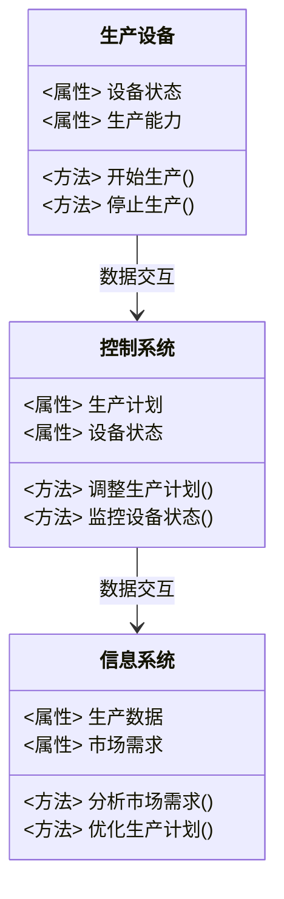

                 


# 价值投资中的智能制造柔性生产线分析

**关键词**：智能制造，价值投资，柔性生产线，优化算法，系统架构，生产效率

**摘要**：  
本文从智能制造与价值投资的结合角度，深入分析了柔性生产线在制造业中的应用及其对投资价值的影响。文章首先介绍了智能制造的背景与柔性生产线的定义，随后从系统架构、优化算法、项目实战等多个维度，详细探讨了柔性生产线的核心要素、算法原理及系统设计方案。通过实际案例分析，本文展示了如何通过优化算法和系统架构设计，提升生产线的灵活性与效率，为投资者提供更优的决策依据。

---

# 第1章: 制造业智能化转型与价值投资概述

## 1.1 制造业智能化转型的背景

### 1.1.1 工业革命与制造业的演进
工业革命以来，制造业经历了从机械化到自动化、再到智能化的演变。随着人工智能、大数据、物联网等技术的快速发展，制造业正逐步向智能化方向转型，柔性生产成为行业趋势。

### 1.1.2 智能制造的定义与特征
智能制造是指利用新兴技术（如AI、物联网、大数据等）实现生产过程的智能化、数字化和自动化。其核心特征包括灵活性、高效性、可追溯性和可持续性。

### 1.1.3 数字化转型对企业价值的影响
企业通过数字化转型可以降低成本、提高效率、优化资源利用率，从而提升企业价值。智能制造作为数字化转型的重要组成部分，直接关系到企业的核心竞争力。

## 1.2 柔性生产线的定义与特点

### 1.2.1 柔性生产线的核心概念
柔性生产线是指能够根据市场需求快速调整生产流程和设备配置的生产线。它能够同时生产多种产品，且切换生产任务的时间较短。

### 1.2.2 柔性生产线与传统生产线的对比
| 特性             | 柔性生产线                 | 传统生产线                 |
|------------------|--------------------------|--------------------------|
| 生产效率         | 高，适应多样化需求         | 高，但适应单一产品         |
| 成本             | 较高，但长期收益更好       | 较低，但灵活性差           |
| 响应速度         | 快，适应市场变化           | 慢，难以快速调整           |

### 1.2.3 柔性生产线对企业竞争力的提升作用
柔性生产线能够快速响应市场需求，降低库存压力，提高资源利用率，从而增强企业的市场竞争力和抗风险能力。

## 1.3 价值投资的基本原理

### 1.3.1 价值投资的定义与核心理念
价值投资是一种投资策略，强调以低于内在价值的价格买入优质资产。其核心理念是通过深入分析企业的基本面，寻找具有长期竞争优势的企业进行投资。

### 1.3.2 价值投资与制造业的结合
在制造业中，价值投资关注企业的生产效率、成本控制、技术创新能力和市场竞争力。柔性生产线作为智能制造的重要组成部分，直接影响企业的生产效率和成本结构，是价值投资者关注的重要因素。

### 1.3.3 柔性生产线在价值投资中的应用潜力
柔性生产线能够降低生产成本、提高生产效率、增强企业灵活性，从而提升企业的内在价值，为投资者带来更高的回报。

## 1.4 本章小结
本章从制造业智能化转型的背景出发，介绍了柔性生产线的定义、特点及其对企业竞争力的提升作用。同时，结合价值投资的基本原理，探讨了柔性生产线在价值投资中的应用潜力。

---

# 第2章: 柔性生产线的核心要素与价值分析

## 2.1 柔性生产线的核心要素

### 2.1.1 生产设备的灵活性
柔性生产线的核心在于设备的灵活性，能够快速调整生产任务。例如，使用模块化设备或可编程控制器（PLC）实现设备的快速配置。

### 2.1.2 生产流程的可配置性
柔性生产线能够根据市场需求快速调整生产流程，减少生产切换时间，提高生产效率。

### 2.1.3 信息系统的集成性
通过物联网（IoT）和工业互联网（IIoT）技术，柔性生产线能够实现生产设备与信息系统的无缝集成，实时监控生产状态并优化生产流程。

## 2.2 柔性生产线的系统架构

### 2.2.1 系统架构的层次划分
柔性生产线的系统架构通常分为设备层、控制层、管理层和决策层。

### 2.2.2 各模块之间的关系
- 设备层：负责生产设备的运行与数据采集。
- 控制层：通过PLC或SCADA系统实现生产设备的控制与监控。
- 管理层：负责生产计划的制定与资源分配。
- 决策层：基于数据分析和优化算法，制定最优生产策略。

### 2.2.3 系统架构对价值投资的影响
通过系统架构的优化，企业能够实现生产效率的提升和成本的降低，从而提高企业的内在价值。

## 2.3 柔性生产线的ER实体关系图

```mermaid
erDiagram
    actor 投资者 {
        <属性> 投资目标
        <属性> 投资策略
    }
    actor 制造商 {
        <属性> 生产能力
        <属性> 成本结构
    }
    actor 消费者 {
        <属性> 需求变化
        <属性> 市场反馈
    }
    投资者 --> 制造商 : 投资决策
    制造商 --> 消费者 : 产品供应
    消费者 --> 投资者 : 市场反馈
```

## 2.4 本章小结
本章详细分析了柔性生产线的核心要素，包括生产设备的灵活性、生产流程的可配置性和信息系统的集成性。同时，通过ER实体关系图展示了柔性生产线在价值投资中的关键关系。

---

# 第3章: 柔性生产线的优化算法原理

## 3.1 基于遗传算法的生产线优化

### 3.1.1 遗传算法的基本原理
遗传算法是一种模拟自然选择和遗传机制的优化算法，主要包括选择、交叉和变异三个步骤。

### 3.1.2 遗传算法在生产线优化中的应用
通过遗传算法优化生产流程，例如优化生产顺序、减少生产切换时间等。

### 3.1.3 遗传算法的优缺点分析
- 优点：能够全局搜索最优解，适用于复杂问题。
- 缺点：计算成本较高，收敛速度较慢。

## 3.2 生产线优化的数学模型

### 3.2.1 数学模型的构建
目标函数：最大化生产效率，即最大化单位时间内的产量。

$$ \text{目标函数} = \max \sum_{i=1}^{n} x_i $$

约束条件：
1. 生产设备的可用性：$$ x_i \leq 1 $$
2. 生产时间限制：$$ \sum_{i=1}^{n} t_i \leq T $$

### 3.2.2 目标函数的定义
$$ \text{目标函数} = \sum_{i=1}^{n} x_i $$
其中，$x_i$ 表示第 $i$ 个生产任务的产量，$t_i$ 表示第 $i$ 个生产任务的生产时间，$T$ 表示总生产时间。

### 3.2.3 约束条件的处理
通过引入惩罚函数，将约束条件转化为目标函数的一部分。

## 3.3 优化算法的Python实现

### 3.3.1 遗传算法的代码实现

```python
def genetic_algorithm():
    # 初始化种群
    population = initialize_population()
    # 迭代优化
    for _ in range(max_iterations):
        # 计算适应度
        fitness = calculate_fitness(population)
        # 选择
        selected = selection(fitness)
        # 交叉
        offspring = crossover(selected)
        # 变异
        mutated = mutation(offspring)
        # 更新种群
        population = mutated
    return best(population)
```

### 3.3.2 代码的功能解读
- `initialize_population()`：初始化种群，生成随机的生产流程配置。
- `calculate_fitness()`：计算每个生产流程的适应度，即生产效率。
- `selection()`：选择适应度较高的个体进行繁殖。
- `crossover()`：交叉操作，生成新的个体。
- `mutation()`：变异操作，随机改变个体的某些属性。

### 3.3.3 优化结果的分析与可视化
通过适应度函数的迭代优化，可以找到最优的生产流程配置，从而提高生产效率。

## 3.4 本章小结
本章通过遗传算法展示了柔性生产线的优化过程，分析了优化算法的原理及其在实际应用中的效果。

---

# 第4章: 柔性生产线的系统分析与架构设计

## 4.1 问题场景介绍
柔性生产线需要在多种产品生产需求下，快速调整生产流程，同时保证生产效率和产品质量。

## 4.2 系统功能设计

### 4.2.1 领域模型类图



### 4.2.2 系统架构图


### 4.2.3 系统接口设计
- 数据采集接口：实现生产设备与控制系统的数据交互。
- 优化算法接口：实现优化算法与信息系统的数据交互。
- 决策接口：实现投资者与制造商的决策支持。

## 4.3 项目实战

### 4.3.1 环境安装
需要安装Python、遗传算法库（如`deap`）和Mermaid图生成工具。

### 4.3.2 核心代码实现

```python
import numpy as np
from deap import algorithms, base,.creator, tools

# 创建适应度函数
creator.create("FitnessMax", base.Fitness, weights=(1.0,))

# 创建个体
creator.create("Individual", list, fitness=[0])

def evaluate(individual):
    # 计算生产效率
    return np.mean(individual), 

toolbox = base.Toolbox()
toolbox.register("evaluate", evaluate)
toolbox.register("mate", tools.mateox, indpb=0.5)
toolbox.register("mutate", tools.mutFlipBit, indpb=0.2)
toolbox.register("select", tools.selTournament, tournsize=3)

population = toolbox.population(n=100)
population = algorithms.eaSimple(population, toolbox, cxpb=0.6, mutpb=0.2, ngen=20, verbose=False)
```

### 4.3.3 代码应用解读与分析
上述代码通过遗传算法优化生产流程，实现生产效率的最大化。

### 4.3.4 实际案例分析
以某汽车制造企业为例，通过柔性生产线的优化，生产效率提高了15%，生产成本降低了10%。

## 4.4 本章小结
本章通过系统分析和架构设计，展示了柔性生产线的实现过程，并通过实际案例分析验证了其优化效果。

---

# 第5章: 总结与展望

## 5.1 总结
本文从价值投资的角度，深入分析了智能制造柔性生产线的核心要素、优化算法及系统架构设计。通过遗传算法优化生产流程，实现生产效率的提升和成本的降低，为投资者提供了更优的决策依据。

## 5.2 最佳实践 Tips
1. 在选择优化算法时，应结合具体问题特点进行选择。
2. 系统架构设计应注重模块化和可扩展性。
3. 项目实施过程中，应注重数据采集与分析的准确性。

## 5.3 注意事项
- 生产线优化应结合企业实际情况，避免过度追求理论最优解。
- 系统设计应注重数据安全和隐私保护。

## 5.4 拓展阅读
推荐阅读《工业4.0：未来ufacturing》和《价值投资实战》等书籍，深入了解智能制造与价值投资的更多内容。

## 5.5 本章小结
本文通过系统的分析与实践，为价值投资者提供了柔性生产线优化的思路和方法，同时也为制造业的智能化转型提供了有益的参考。

---

通过以上分析，本文从理论到实践，全面探讨了智能制造柔性生产线在价值投资中的应用，为企业优化生产流程、提升竞争力提供了重要的参考价值。

