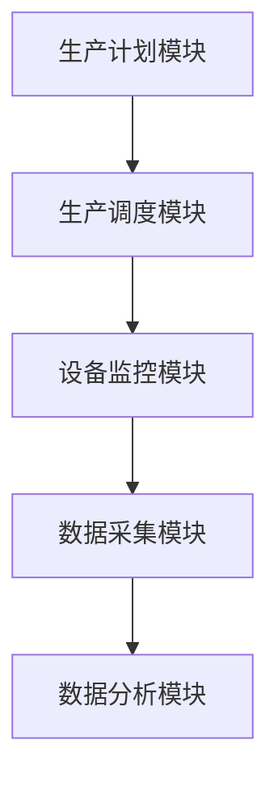
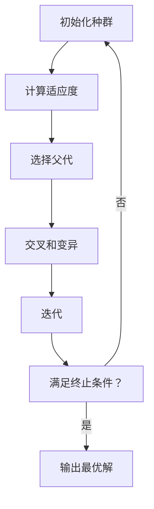

                 

# 价值投资中的智能制造柔性生产线分析

## 关键词：价值投资，智能制造，柔性生产线，生产调度算法，数学模型

## 摘要：  
智能制造柔性生产线是现代制造业的重要组成部分，其灵活性和高效性为价值投资提供了新的机会。本文通过分析柔性生产线的系统架构、生产调度算法、数学模型和价值评估方法，探讨如何在智能制造中实现高效投资。文章结合实际案例，详细讲解了算法实现和优化策略，为投资者提供了科学的决策依据。

---

# 第1章: 柔性生产线的背景与概念

## 1.1 制造业智能化的背景与趋势  
制造业的智能化是工业革命的必然产物，随着技术的进步，传统制造业正向智能制造转型。柔性生产线作为智能制造的核心，能够适应市场变化，快速调整生产节奏，满足多样化的客户需求。  

### 1.1.1 工业革命与制造业的演变  
- 第一次工业革命：机械化生产，提高了生产效率。  
- 第二次工业革命：流水线生产，实现了规模化制造。  
- 第三次工业革命：自动化生产，引入了机器人和计算机技术。  
- 第四次工业革命：智能化生产，柔性生产线成为主流。  

### 1.1.2 智能制造的定义与特点  
智能制造是以数字化、网络化、智能化为特征，通过物联网、大数据和人工智能技术实现生产过程的智能化管理。其特点包括：  
1. **数据驱动**：利用实时数据优化生产。  
2. **自动化**：减少人工干预，提高效率。  
3. **灵活性**：适应多样化的产品需求。  
4. **高效性**：缩短生产周期，降低成本。  

### 1.1.3 柔性生产在现代制造业中的地位  
柔性生产是指在不改变设备的前提下，能够快速切换生产不同产品的能力。它通过模块化设计和智能化管理，帮助企业应对市场需求的变化，提高竞争力。  

---

## 1.2 柔性生产线的核心概念  

### 1.2.1 柔性生产线的定义  
柔性生产线是通过灵活配置生产设备和生产流程，实现多种产品高效生产的系统。  

### 1.2.2 柔性生产线的关键特征  
- **模块化设计**：设备可根据需求灵活组合。  
- **智能化管理**：通过AI技术优化生产调度。  
- **快速切换**：快速调整生产参数，适应不同产品。  
- **数据驱动**：实时监控生产数据，实现精准管理。  

### 1.2.3 柔性生产线与传统生产线的对比  

| 对比维度       | 柔性生产线                  | 传统生产线                  |
|----------------|-----------------------------|-----------------------------|
| 生产效率       | 高                          | 一般                        |
| 成本           | 低                          | 高                          |
| 灵活性         | 高                          | 低                          |
| 技术复杂性     | 高                          | 低                          |

---

## 1.3 价值投资视角下的智能制造  

### 1.3.1 价值投资的基本原理  
价值投资是通过分析企业的内在价值，寻找被市场低估的投资机会。  

### 1.3.2 制造业投资的价值评估方法  
- **净现值法（NPV）**：计算未来现金流的现值，与初始投资对比。  
- **内部收益率法（IRR）**：计算项目投资的回报率。  
- **投资回收期法**：计算投资回收所需的时间。  

### 1.3.3 柔性生产线对投资价值的影响  
柔性生产线能够提高生产效率、降低成本、适应市场需求变化，从而提升企业的竞争力和盈利能力，增加投资价值。  

---

## 1.4 本章小结  
本章介绍了智能制造的背景和趋势，详细讲解了柔性生产线的定义、特点和优势，并从价值投资的角度分析了其对投资价值的影响。  

---

# 第2章: 柔性生产线的系统分析与架构设计  

## 2.1 柔性生产线的系统架构  

### 2.1.1 系统模块划分  
- **生产计划模块**：制定生产计划。  
- **设备监控模块**：实时监控设备状态。  
- **数据采集模块**：采集生产数据。  
- **生产调度模块**：优化生产调度。  

### 2.1.2 系统功能描述  
- 生产计划：根据市场需求制定生产计划。  
- 设备监控：实时监测设备运行状态。  
- 数据采集：采集生产数据并进行分析。  
- 生产调度：优化生产流程，提高效率。  

### 2.1.3 系统架构图（Mermaid）  

---

## 2.2 生产调度算法原理  

### 2.2.1 生产调度问题的数学建模  
生产调度的目标是最大化生产效率，最小化生产成本。数学模型如下：  

$$ \text{目标函数} = \min \sum_{i=1}^{n} c_i x_i $$  
$$ \text{约束条件} = \begin{cases} 
\sum_{i=1}^{n} x_i \leq C \\ 
x_i \geq 0 
\end{cases} $$  

其中，$c_i$ 是生产任务 $i$ 的成本，$x_i$ 是生产任务 $i$ 的数量，$C$ 是总成本预算。  

### 2.2.2 遗传算法在生产调度中的应用  
遗传算法是一种模拟自然选择过程的优化算法，适用于复杂的调度问题。  

#### 算法步骤：  
1. 初始化种群。  
2. 计算适应度。  
3. 选择父代。  
4. 交叉和变异。  
5. 重复迭代，直到满足终止条件。  

### 2.2.3 算法流程图（Mermaid）  

---

## 2.3 柔性生产线的数学模型  

### 2.3.1 生产效率的数学表达  
生产效率可以通过以下公式计算：  

$$ \text{生产效率} = \frac{\text{实际产量}}{\text{理论产量}} $$  

### 2.3.2 成本优化的数学模型  
成本优化的目标是最小化生产成本，同时满足生产需求。数学模型如下：  

$$ \text{目标函数} = \min \sum_{i=1}^{n} c_i x_i $$  
$$ \text{约束条件} = \begin{cases} 
\sum_{i=1}^{n} x_i \geq D \\ 
x_i \geq 0 
\end{cases} $$  

其中，$D$ 是总需求量。  

### 2.3.3 数学公式与实例分析  
假设某企业生产两种产品，成本分别为 $c_1=2$ 和 $c_2=3$，需求量分别为 $D_1=100$ 和 $D_2=200$。根据上述模型，计算最优生产量：  

$$ \min 2x_1 + 3x_2 $$  
$$ \text{约束} = x_1 \geq 100, x_2 \geq 200 $$  

最优解为 $x_1=100$, $x_2=200$，总成本为 $2 \times 100 + 3 \times 200 = 800$。  

---

## 2.4 本章小结  
本章详细分析了柔性生产线的系统架构，介绍了生产调度算法的原理和实现，并通过数学模型展示了如何优化生产效率和降低成本。  

---

接下来是第3章至第7章的内容，按照上述结构进行详细撰写。

