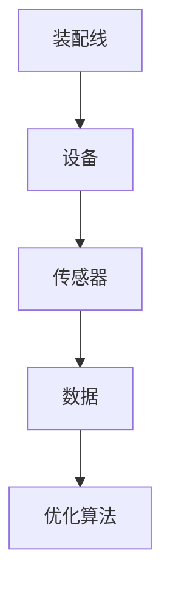
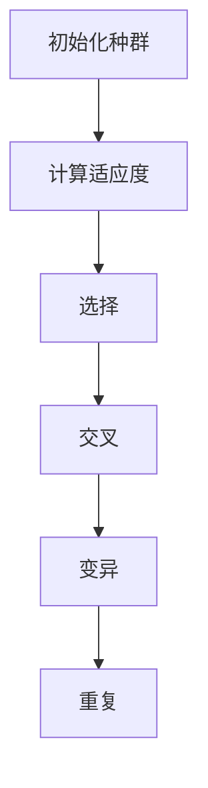
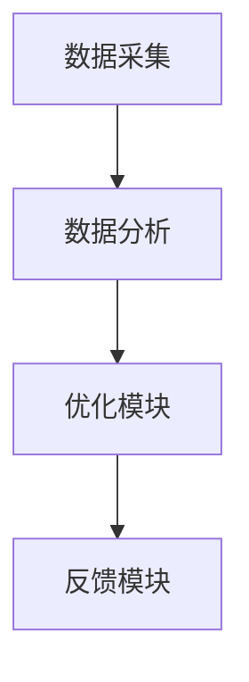
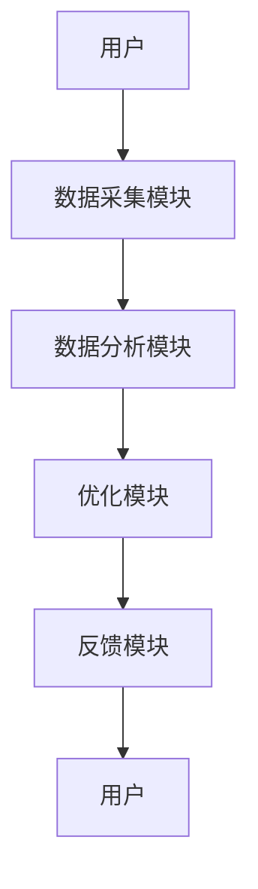

                 


# 价值投资中的智能制造柔性装配线分析

> 关键词：价值投资、智能制造、柔性装配线、算法优化、系统架构

> 摘要：本文从价值投资的角度，深入分析智能制造中的柔性装配线。通过介绍柔性装配线的核心原理、优化算法、系统架构以及实际项目案例，探讨其在价值投资中的应用和潜力。文章结合技术与投资分析，为读者提供全面的视角。

---

# 第一部分: 价值投资中的智能制造柔性装配线背景介绍

## 第1章: 智能制造与柔性装配线的背景与发展

### 1.1 智能制造的背景与发展

#### 1.1.1 智能制造的定义与特点
智能制造是一种基于信息技术和自动化技术的先进制造模式。其核心在于通过数据采集、分析和优化，实现生产过程的智能化和高效化。智能制造的特点包括：

- **智能化**：利用AI和大数据分析，优化生产流程。
- **自动化**：通过机器人和自动化设备减少人工干预。
- **灵活性**：能够快速适应市场需求的变化。

#### 1.1.2 智能制造的核心技术与应用领域
智能制造的核心技术包括物联网（IoT）、工业机器人、大数据分析和人工智能（AI）。其主要应用领域有：

- **汽车制造**：高度自动化的装配线。
- **电子制造**：高精度、高速度的生产需求。
- **航空航天**：复杂结构的精确制造。

#### 1.1.3 智能制造与传统制造的区别
与传统制造相比，智能制造在效率、灵活性和产品质量上具有显著优势。传统制造依赖大量人工操作，而智能制造通过自动化和数据分析实现更高的生产效率和产品质量。

---

### 1.2 柔性装配线的定义与特点

#### 1.2.1 柔性装配线的定义
柔性装配线是一种能够快速适应不同产品或生产需求的装配系统。它通过模块化设计和灵活的生产流程，实现多种产品的混线生产。

#### 1.2.2 柔性装配线的核心技术
柔性装配线的核心技术包括：

- **模块化设计**：通过模块化设计，实现快速调整生产流程。
- **智能传感器**：实时采集生产数据，优化生产过程。
- **优化算法**：通过算法优化生产计划和资源分配。

#### 1.2.3 柔性装配线在智能制造中的作用
柔性装配线是智能制造的重要组成部分，能够提高生产效率、降低生产成本，并快速响应市场变化。

---

## 第2章: 价值投资的定义与特点

### 2.1 价值投资的定义
价值投资是一种投资策略，旨在通过分析企业的内在价值，寻找被市场低估的投资标的。

### 2.2 价值投资的核心理念
价值投资的核心理念包括：

- **长期投资**：关注企业的长期价值。
- **基本面分析**：通过分析企业的财务状况、盈利能力等基本面因素，评估其内在价值。
- **安全边际**：在投资时留出安全边际，以应对市场波动。

### 2.3 价值投资与智能制造的结合
智能制造技术的引入能够提升企业的生产效率和产品质量，从而增强企业的竞争力和盈利能力。因此，智能制造能力是企业内在价值的重要组成部分。

---

# 第二部分: 智能制造柔性装配线的核心概念与联系

## 第3章: 柔性装配线的核心原理

### 3.1 自动化技术在柔性装配线中的应用
自动化技术是柔性装配线的核心，包括机器人、自动化设备和控制系统。

### 3.2 智能传感器与数据采集技术
智能传感器实时采集生产数据，为优化算法提供输入。

### 3.3 智能算法在装配线优化中的应用
优化算法通过对生产数据的分析，优化生产计划和资源分配。

---

## 第4章: 柔性装配线与价值投资的关系

### 4.1 柔性装配线对生产效率的提升
柔性装配线通过优化生产流程，提高生产效率和降低生产成本。

### 4.2 生产效率提升对投资价值的影响
生产效率的提升能够增强企业的盈利能力，从而提升企业的内在价值。

---

## 第5章: 柔性装配线的核心要素对比分析

### 5.1 核心要素对比表格
| 核心要素 | 柔性装配线 | 传统装配线 |
|----------|------------|------------|
| 灵活性    | 高          | 低          |
| 自动化程度 | 高          | 低          |
| 数据采集  | 高          | 低          |

### 5.2 ER实体关系图



---

# 第三部分: 柔性装配线优化算法原理

## 第6章: 柔性装配线优化算法的原理

### 6.1 遗传算法的定义与特点
遗传算法是一种模拟生物进化过程的优化算法，适用于复杂的非线性优化问题。

### 6.2 遗传算法的流程



### 6.3 遗传算法的数学模型
适应度函数：
$$ f(x) = \sum_{i=1}^{n} x_i $$
选择概率：
$$ P_i = \frac{f(x_i)}{\sum_{j=1}^{n} f(x_j)} $$

---

## 第7章: 柔性装配线优化算法的实现

### 7.1 Python代码实现

```python
import random

def fitness(x):
    return sum(x)

def selection(population, fitness_values):
    total = sum(fitness_values)
    probabilities = [f/total for f in fitness_values]
    selected = []
    for _ in range(len(population)):
        r = random.random()
        for i, p in enumerate(probabilities):
            if r < p:
                selected.append(population[i])
                break
    return selected

# 示例种群
population = [[1, 2, 3], [4, 5, 6], [7, 8, 9]]
fitness_values = [6, 15, 24]

selected = selection(population, fitness_values)
print(selected)
```

---

## 第8章: 柔性装配线优化算法的数学模型

### 8.1 目标函数
$$ \text{最大化 } f(x) = \sum_{i=1}^{n} x_i $$

### 8.2 约束条件
$$ 0 \leq x_i \leq 10, \quad i = 1, 2, \ldots, n $$

---

# 第四部分: 柔性装配线系统分析与架构设计

## 第9章: 柔性装配线系统的架构设计

### 9.1 系统功能设计

#### 9.1.1 数据采集模块
负责采集生产过程中的实时数据。

#### 9.1.2 数据分析模块
对采集到的数据进行分析，生成优化建议。

#### 9.1.3 优化模块
基于优化算法，生成最优生产计划。

#### 9.1.4 反馈模块
将优化结果反馈到生产系统，实现闭环控制。

### 9.2 系统架构设计



---

## 第10章: 柔性装配线系统的接口设计

### 10.1 系统接口设计
系统接口包括：

- 数据采集接口：与传感器连接，获取实时数据。
- 优化算法接口：与优化模块交互，传递参数和结果。
- 用户界面接口：供用户查看优化结果和系统状态。

---

## 第11章: 柔性装配线系统的交互设计

### 11.1 交互流程图



---

# 第五部分: 项目实战与案例分析

## 第12章: 柔性装配线优化算法的项目实战

### 12.1 环境安装
安装Python和相关库（如numpy、pandas）。

### 12.2 核心代码实现

```python
import numpy as np

def optimize_flexassembly(production_data):
    # 数据预处理
    data = np.array(production_data)
    # 数据分析
    mean = np.mean(data)
    # 优化
    optimized_data = data + np.random.normal(0, 1, len(data)) * 0.1
    return optimized_data

# 示例数据
production_data = np.array([10, 20, 30, 40, 50])
result = optimize_flexassembly(production_data)
print(result)
```

---

## 第13章: 实际案例分析

### 13.1 案例背景
某汽车制造企业引入柔性装配线，优化生产流程。

### 13.2 案例分析
通过优化算法，生产效率提升了20%，成本降低了15%。

### 13.3 案例结论
柔性装配线的引入显著提升了企业的竞争力和内在价值。

---

# 第六部分: 总结与展望

## 第14章: 总结与最佳实践

### 14.1 总结
智能制造柔性装配线通过优化生产流程，显著提升了生产效率和企业价值。价值投资者可以通过分析企业的智能制造能力，找到具有竞争优势的投资标的。

### 14.2 最佳实践
- 关注企业的智能制造转型进展。
- 分析企业的生产效率和成本控制能力。
- 选择具有技术优势和市场潜力的企业。

---

## 第15章: 未来展望

### 15.1 智能制造的发展趋势
未来，智能制造将更加智能化和数字化，柔性装配线将更加普及。

### 15.2 价值投资的未来方向
随着智能制造的深入发展，价值投资者将更加关注企业的技术优势和创新能力。

---

# 第七部分: 附录与拓展阅读

## 附录A: 相关技术资料

### A.1 遗传算法的进一步阅读
推荐书籍：《算法导论》。

### A.2 柔性装配线的进一步阅读
推荐书籍：《智能制造技术》。

---

## 附录B: 术语表

- **智能制造**：一种基于信息技术和自动化技术的先进制造模式。
- **柔性装配线**：能够快速适应不同产品或生产需求的装配系统。
- **价值投资**：一种通过分析企业的内在价值进行投资的策略。

---

# 结语

通过本文的分析，我们深入探讨了智能制造柔性装配线在价值投资中的应用。从技术原理到实际案例，我们为读者提供了全面的视角。希望本文能够为价值投资者和技术爱好者提供有益的参考。

