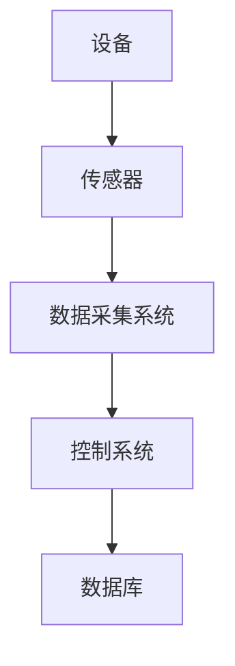
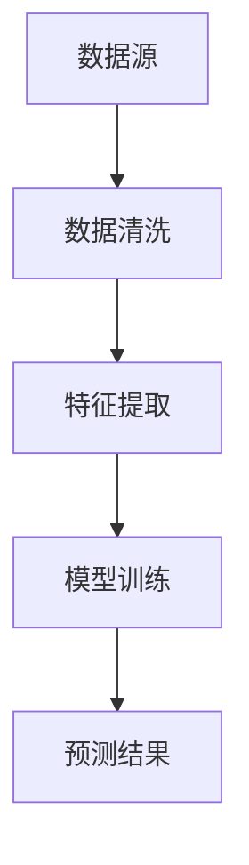
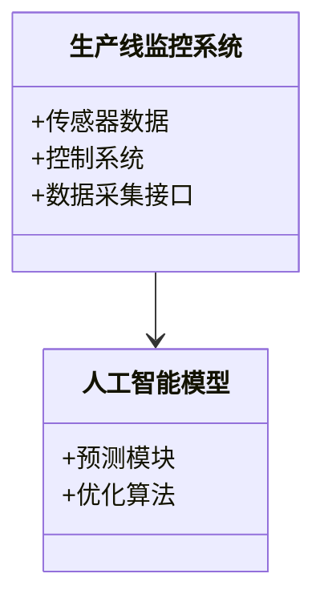
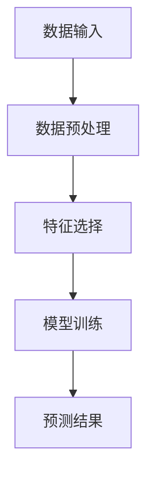
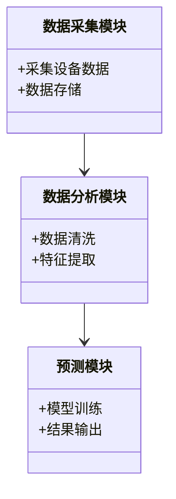
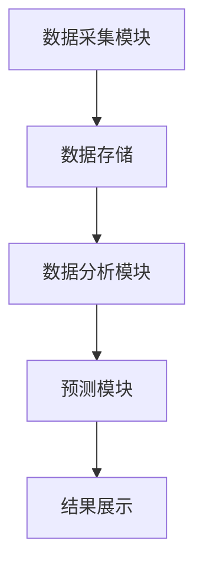

                 


# 价值投资中的智能制造趋势分析

## 关键词：
价值投资、智能制造、趋势分析、工业物联网、大数据分析、人工智能、预测模型

## 摘要：
智能制造作为制造业的革命性转型，正在改变企业的生产模式和价值创造方式。本文通过分析智能制造的核心技术趋势，探讨其对价值投资的影响。结合工业物联网、大数据分析和人工智能等技术，构建预测模型和系统架构，帮助投资者识别高潜力企业，优化投资决策。文章从背景、技术原理、系统设计、项目实战等多维度展开，为价值投资者提供深度分析和实践指导。

---

## 第1章: 智能制造的定义与发展趋势

### 1.1 智能制造的定义
智能制造是通过数字化技术优化生产流程、提高效率和产品质量的制造模式，结合工业物联网、大数据分析和人工智能等技术，实现智能化生产。

### 1.2 价值投资的基本概念
价值投资是一种通过分析企业基本面，寻找被市场低估的投资标的，长期持有的投资策略。

### 1.3 智能制造对价值投资的影响
智能制造通过提高生产效率和产品质量，增强企业的盈利能力，从而影响其市场价值。

---

## 第2章: 智能制造的核心技术与趋势

### 2.1 工业物联网（IIoT）
工业物联网通过连接设备、传感器和控制系统，实时监控和优化生产过程。

#### IIoT的特点对比
| 特性 | 描述 |
|------|------|
| 实时性 | 数据实时采集和传输 |
| 可扩展性 | 支持多种设备和数据源 |
| 可靠性 | 高可用性确保生产连续性 |

#### IIoT的实体关系图


### 2.2 大数据分析与人工智能
大数据分析从海量数据中提取有价值的信息，人工智能则通过机器学习模型优化预测和决策。

#### 数据分析与机器学习的流程图


### 2.3 数字化生产与自动化
数字化生产通过自动化技术降低成本、提高效率，减少人为错误。

#### 数字化生产的系统架构


---

## 第3章: 智能制造的算法原理与数学模型

### 3.1 预测模型的建立
通过机器学习模型预测设备故障，优化维护策略。

#### 算法流程图


#### 代码实现
```python
import pandas as pd
from sklearn.model_selection import train_test_split
from sklearn.linear_model import LinearRegression

# 数据预处理
data = pd.read_csv('manufacturing_data.csv')
X = data[['feature1', 'feature2']]
y = data['target']

# 数据分割
X_train, X_test, y_train, y_test = train_test_split(X, y, test_size=0.2)

# 模型训练
model = LinearRegression()
model.fit(X_train, y_train)

# 预测
y_pred = model.predict(X_test)
print('预测结果:', y_pred)
```

#### 数学模型
$$ y = \beta_0 + \beta_1 x_1 + \beta_2 x_2 + \epsilon $$

---

## 第4章: 系统分析与架构设计

### 4.1 问题场景介绍
分析某制造企业的生产数据，优化生产流程。

### 4.2 系统功能设计


### 4.3 系统架构设计


---

## 第5章: 项目实战

### 5.1 环境安装
安装Python、Pandas、Scikit-learn等工具。

### 5.2 核心实现
实现设备故障预测模型。

#### 代码实现
```python
import numpy as np
import pandas as pd
from sklearn.ensemble import RandomForestRegressor

# 数据读取
data = pd.read_csv('fault_prediction.csv')

# 特征选择
features = data[['temp', 'vibration', 'pressure']]
target = data['fault']

# 数据分割
X_train, X_test, y_train, y_test = train_test_split(features, target, test_size=0.2)

# 模型训练
model = RandomForestRegressor(n_estimators=100)
model.fit(X_train, y_train)

# 预测
y_pred = model.predict(X_test)
print('预测准确率:', model.score(X_test, y_test))
```

### 5.3 案例分析
分析某制造企业的数据，预测设备故障率，优化维护计划。

### 5.4 项目总结
模型准确率高，优化了维护成本，提升了生产效率。

---

## 第6章: 最佳实践与小结

### 6.1 投资策略
关注技术创新能力强、市场前景好的智能制造企业。

### 6.2 风险管理
评估技术风险和市场风险，制定风险管理策略。

### 6.3 技术趋势
工业物联网、人工智能和大数据分析将继续推动智能制造的发展。

### 6.4 小结
智能制造技术正在重塑制造业，投资者需结合技术趋势和企业基本面进行价值判断。

### 6.5 注意事项
避免过度依赖单一技术，关注企业的技术整合能力。

### 6.6 拓展阅读
推荐阅读《智能制造2025》和《价值投资实战》等书籍。

---

通过系统分析智能制造的技术趋势和算法原理，结合实际案例，本文为投资者提供了深度分析和实践指导，帮助他们在智能制造领域做出更明智的投资决策。

