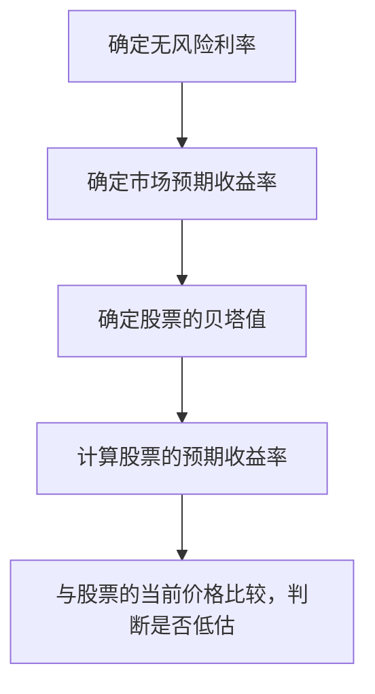
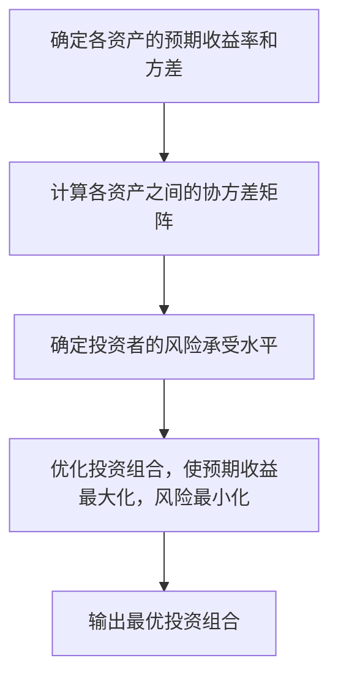

                 


# 价值投资中的智能化精准医疗诊断系统分析

> 关键词：价值投资、精准医疗、智能化诊断系统、机器学习、医疗数据分析

> 摘要：本文探讨了将价值投资的理念与方法应用于智能化精准医疗诊断系统的分析中。通过结合数据分析、机器学习和系统架构设计，提出了一个基于智能化诊断系统的价值评估模型，旨在提高医疗诊断的精准性和效率。

---

## 第一部分：背景与概述

### 第1章：价值投资与精准医疗诊断系统概述

#### 1.1 价值投资的基本概念
价值投资是一种以寻找被市场低估的股票为核心的投资策略，强调长期投资、安全边际和对公司内在价值的深入分析。其核心理念是通过基本面分析，识别出具有持续竞争优势和良好管理的公司，以低于其内在价值的价格买入并长期持有。

在医疗诊断领域，价值投资可以应用于诊断系统的评估，即通过分析诊断系统的性能、成本和市场竞争力，找出具有投资价值的诊断方案或技术。

#### 1.2 精准医疗诊断系统的背景
精准医疗是一种基于患者个体特征（基因、环境、生活方式等）进行个性化诊断和治疗的医疗模式。精准医疗诊断系统利用先进的技术手段，如基因测序、影像分析和大数据处理，提供更准确的诊断结果和治疗方案。

随着人工智能和大数据技术的发展，医疗诊断系统的智能化水平不断提高，精准医疗的需求日益增长。然而，现有的诊断系统在性能、成本和用户体验等方面存在不足，需要通过价值投资的方法进行优化和改进。

#### 1.3 价值投资与精准医疗诊断系统的结合
将价值投资的理念引入精准医疗诊断系统的分析中，可以通过对诊断系统的全面评估，识别出具有高投资回报和良好市场潜力的诊断方案。这种结合不仅可以提高诊断系统的效率和准确性，还能降低医疗成本，为患者和医疗机构创造更大的价值。

---

## 第二部分：核心概念与联系

### 第2章：价值投资与精准医疗诊断系统的核心概念

#### 2.1 价值投资的核心概念
- **内在价值**：股票的内在价值是其未来现金流的现值，反映了公司的实际价值。
- **安全边际**：安全边际是市场价格与内在价值之间的差额，是投资中的安全垫。
- **资产评估模型**：如DCF模型（ discounted cash flow model），用于评估企业的真实价值。

#### 2.2 精准医疗诊断系统的核心概念
- **数据驱动决策**：通过收集和分析大量医疗数据，为诊断提供科学依据。
- **机器学习算法**：用于识别数据中的模式，提高诊断的准确性。
- **个性化诊断**：基于患者的个体特征，提供定制化的诊断方案。

#### 2.3 核心概念对比分析

**对比表格：价值投资与精准医疗诊断系统的核心概念对比**

| **核心概念**         | **价值投资**                          | **精准医疗诊断系统**                 |
|----------------------|---------------------------------------|---------------------------------------|
| **核心目标**         | 寻找被低估的股票                       | 提高诊断准确性和效率                   |
| **主要工具**         | 财务分析、DCF模型                      | 数据分析、机器学习算法                |
| **关键因素**         | 内在价值、安全边际                    | 数据质量、算法性能                    |
| **应用场景**         | 金融投资                              | 医疗诊断                              |

**ER实体关系图：医疗诊断系统的实体关系**

```mermaid
er
    %%医疗诊断系统实体关系图
    %%患者实体
    entity 患者 {
        key: 患者ID
        姓名: string
        年龄: integer
        性别: string
        病史: string
        联系方式: string
    }

    %%诊断结果实体
    entity 诊断结果 {
        key: 诊断结果ID
        患者ID: 患者
        诊断疾病: string
        诊断时间: datetime
        诊断医生: string
    }

    %%诊断设备实体
    entity 诊断设备 {
        key: 设备ID
        设备名称: string
        设备类型: string
        生产厂商: string
        购买时间: datetime
    }

    %%诊断数据实体
    entity 诊断数据 {
        key: 数据ID
        患者ID: 患者
        数据类型: string
        数据值: string
        数据采集时间: datetime
    }

    %%诊断模型实体
    entity 诊断模型 {
        key: 模型ID
        模型名称: string
        模型类型: string
        开发团队: string
        最新更新时间: datetime
    }

    %%关联关系
    患者 --> 诊断结果: 患者对应多个诊断结果
    诊断结果 --> 诊断医生: 诊断结果由医生生成
    诊断结果 --> 诊断模型: 诊断结果基于诊断模型
    诊断模型 --> 诊断数据: 诊断模型使用诊断数据进行训练
    诊断设备 --> 诊断数据: 诊断设备采集诊断数据
```

---

## 第三部分：算法原理与数学模型

### 第3章：价值投资中的算法原理

#### 3.1 常用算法与流程图

**CAPM模型的mermaid流程图**



**马科维茨投资组优化算法的mermaid流程图**



#### 3.2 算法实现与代码示例

**CAPM模型的Python代码实现**

```python
def capm(risk_free_rate, market_return, beta, market_variance):
    expected_return = risk_free_rate + beta * (market_return - risk_free_rate)
    return expected_return

# 示例
risk_free_rate = 0.05
market_return = 0.12
beta = 1.5
print(capm(risk_free_rate, market_return, beta, 0.08))  # 输出：0.14
```

**DCF模型的Python代码实现**

```python
def discounted_cash_flow(cash_flows, discount_rate):
    present_value = sum(cash_flows[i] / (1 + discount_rate) ** i for i in range(len(cash_flows)))
    return present_value

# 示例
cash_flows = [100, 150, 200]
discount_rate = 0.08
print(dc

