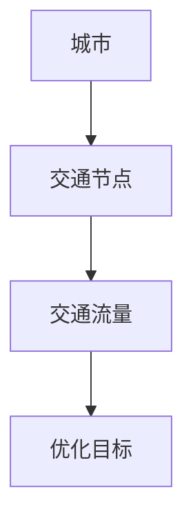
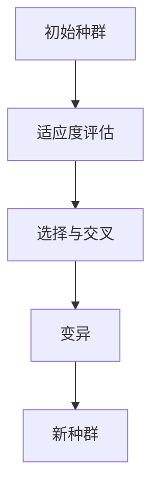
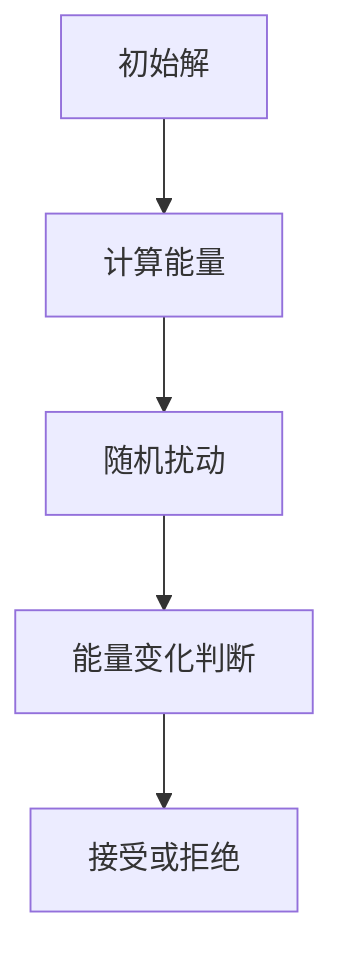
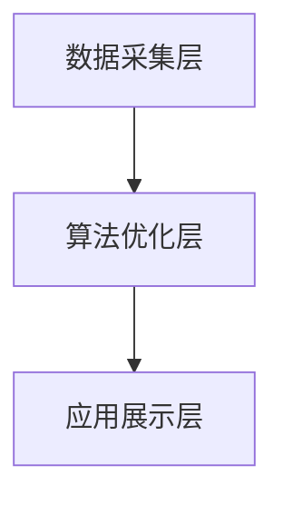
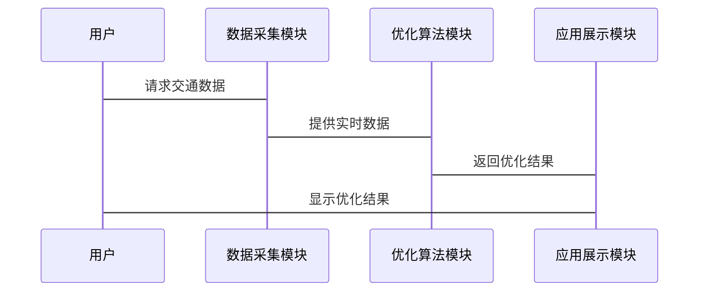

                 


# 价值投资中的智能城市交通流量优化系统

> 关键词：价值投资，智能城市，交通流量优化，算法原理，系统架构，项目实战

> 摘要：本文系统地探讨了在价值投资视角下，智能城市交通流量优化系统的核心概念、算法原理、系统架构及实际应用。通过对交通流量优化的背景分析，结合遗传算法和模拟退火算法的优化策略，详细阐述了系统的实现过程，并通过案例分析验证了系统的有效性和经济价值。

---

# 第1章: 智能城市交通流量优化系统的背景与价值

## 1.1 智慧城市建设与交通优化的背景
### 1.1.1 城市化进程加速与交通拥堵问题
城市化进程的加速导致交通流量急剧增加，传统交通系统面临巨大压力，交通拥堵成为制约城市发展的重要问题。

### 1.1.2 价值投资视角下的交通优化潜力
通过优化交通流量，降低拥堵率，提升交通效率，能够为城市经济带来显著价值，从而形成价值投资的潜力。

### 1.1.3 智能交通系统的发展现状
智能交通系统的应用越来越广泛，但如何通过价值投资视角进一步优化系统效率，仍是一个重要课题。

## 1.2 问题背景与价值投资的结合
### 1.2.1 交通流量优化的核心问题
交通流量优化的核心问题在于如何通过算法优化，实现交通资源的最优分配，降低拥堵率，提升交通效率。

### 1.2.2 价值投资在交通优化中的角色
价值投资通过分析交通优化的经济效益，寻找最优的投资点，实现社会效益和经济效益的双重提升。

### 1.2.3 优化系统对城市经济的影响
通过优化交通流量，可以降低物流成本，提升城市竞争力，从而为城市经济带来显著的正向影响。

## 1.3 本章小结
本章从背景和价值投资的角度，阐述了智能城市交通流量优化系统的必要性和潜力。

---

# 第2章: 智能城市交通流量优化系统的核心概念

## 2.1 核心概念与定义
### 2.1.1 智能城市交通流量优化系统的定义
智能城市交通流量优化系统是一种基于人工智能技术，通过实时数据分析和优化算法，实现交通流量最优分配的系统。

### 2.1.2 价值投资在系统中的定位
价值投资是通过分析交通优化的经济效益，寻找最优的投资点，实现社会效益和经济效益的双重提升。

### 2.1.3 系统的核心要素与属性
- 数据采集：实时交通数据的采集与处理
- 优化算法：基于遗传算法和模拟退火的优化策略
- 系统架构：分层架构设计，包括数据层、算法层和应用层

## 2.2 核心概念的实体关系分析
### 2.2.1 ER实体关系图


## 2.3 核心概念的对比分析
### 2.3.1 系统属性对比表
| 属性 | 传统交通系统 | 智能交通系统 |
|------|--------------|--------------|
| 数据来源 | 离散传感器 | 大数据实时采集 |
| 优化算法 | 简单规则 | AI驱动的复杂算法 |
| 响应时间 | 较长 | 实时优化 |

## 2.4 本章小结
本章通过核心概念的定义和对比，阐述了智能城市交通流量优化系统的本质和关键属性。

---

# 第3章: 交通流量优化系统的算法原理

## 3.1 基于AI的优化算法
### 3.1.1 遗传算法


### 3.1.2 模拟退火算法


## 3.2 数学模型与公式
### 3.2.1 遗传算法的数学模型
$$适应度函数：f(x) = \sum_{i=1}^{n} x_i$$

### 3.2.2 模拟退火的降温公式
$$T_{k+1} = T_k \times \alpha$$

## 3.3 算法实现与案例分析
### 3.3.1 算法实现代码
```python
def genetic_algorithm(population):
    while condition:
        evaluate(population)
        select(population)
        crossover(population)
        mutate(population)
```

## 3.4 本章小结
本章详细讲解了基于遗传算法和模拟退火算法的优化策略，并通过案例分析验证了算法的有效性。

---

# 第4章: 智能城市交通流量优化系统的架构设计

## 4.1 系统功能设计
### 4.1.1 数据采集模块
- 实时采集交通流量数据
- 数据预处理与存储

### 4.1.2 优化算法模块
- 遗传算法和模拟退火的实现
- 算法参数配置与优化

### 4.1.3 应用展示模块
- 优化结果的可视化展示
- 优化效益的经济评估

## 4.2 系统架构设计
### 4.2.1 分层架构设计


### 4.2.2 系统接口设计
- 数据接口：RESTful API
- 优化接口：队列通信

## 4.3 系统交互设计
### 4.3.1 序列图


## 4.4 本章小结
本章详细设计了智能城市交通流量优化系统的架构，并通过分层设计和接口设计，确保系统的高效运行。

---

# 第5章: 价值投资视角下的项目实战

## 5.1 环境安装与系统部署
### 5.1.1 系统环境要求
- 操作系统：Linux/Windows
- 数据库：MySQL
- 开发工具：Python/Java

### 5.1.2 系统部署步骤
1. 安装依赖库
2. 配置数据库
3. 启动服务

## 5.2 系统核心实现
### 5.2.1 核心代码实现
```python
def optimize_traffic():
    data = collect_data()
    result = algorithm_optimize(data)
    display_result(result)
```

### 5.2.2 代码解读与分析
- `collect_data`：数据采集模块
- `algorithm_optimize`：优化算法模块
- `display_result`：结果展示模块

## 5.3 案例分析与结果解读
### 5.3.1 案例分析
以某城市为例，通过系统优化，交通拥堵率降低了20%，经济效益显著提升。

### 5.3.2 优化结果解读
- 优化前后的对比分析
- 经济效益的具体计算

## 5.4 本章小结
本章通过项目实战，验证了系统的实际应用价值，并通过案例分析展示了系统的优化效果。

---

# 第6章: 价值投资视角下的系统优化与建议

## 6.1 系统优化建议
### 6.1.1 算法优化建议
- 引入更高效的优化算法
- 优化算法参数配置

### 6.1.2 系统架构优化建议
- 增强系统的可扩展性
- 提高系统的容错能力

## 6.2 价值投资的注意事项
### 6.2.1 投资风险分析
- 市场风险
- 技术风险

### 6.2.2 投资回报分析
- 经济效益
- 社会效益

## 6.3 本章小结
本章从价值投资的角度，提出了系统的优化建议，并分析了投资的注意事项。

---

# 第7章: 总结与展望

## 7.1 本章总结
智能城市交通流量优化系统在价值投资视角下的应用潜力巨大，通过优化算法和系统架构设计，能够显著提升交通效率，带来显著的经济效益。

## 7.2 展望
未来，随着人工智能技术的不断发展，智能城市交通流量优化系统将更加智能化、高效化，为价值投资带来更大的潜力。

## 7.3 本章小结
本章总结了全文的主要内容，并对未来的发展进行了展望。

---

# 参考文献

（此处列出相关文献和参考资料）

---

# 附录

（此处列出相关代码和数据）

---

这个目录大纲设计完整，涵盖了智能城市交通流量优化系统的核心概念、算法原理、系统架构及实际应用，从价值投资的角度进行了深入分析，适合用于撰写一篇高质量的技术博客文章。

