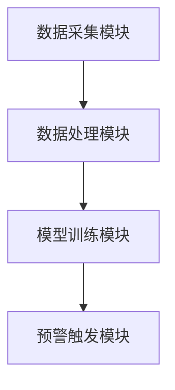

                 


# 价值投资中的智能城市公共安全预警系统分析

> **关键词**：价值投资、智能城市、公共安全预警系统、机器学习、算法原理、系统架构、投资分析

> **摘要**：  
> 本文从价值投资的角度，分析智能城市公共安全预警系统的构建与应用。通过结合价值投资的核心理念与智能城市的技术特征，探讨如何利用智能预警系统提升企业的投资价值。文章详细阐述了系统的核心算法、数学模型、系统架构，并通过实际案例分析了系统的应用场景与投资潜力。最后，本文总结了系统的优化建议与未来发展方向，为投资者提供了全新的视角和决策依据。

---

## 第1章 价值投资与智能城市公共安全预警系统背景介绍

### 1.1 价值投资的核心概念
价值投资是一种以企业基本面分析为基础的投资策略，旨在通过识别被低估的企业，实现长期稳定的投资收益。其核心在于对企业内在价值的评估，包括企业的财务状况、市场竞争力、管理团队等多个维度。

#### 1.1.1 价值投资的定义与特点
- **定义**：价值投资是一种基于对企业内在价值评估的投资策略，强调以低于内在价值的价格买入优质企业。
- **特点**：
  - 长期视角：关注企业的长期盈利能力。
  - 低估策略：寻找市场价格低于内在价值的企业。
  - 高质量企业：注重企业的财务健康和竞争优势。

#### 1.1.2 价值投资的基本原理
价值投资的核心原理是“安全边际”（Margin of Safety），即以低于内在价值的价格买入企业，以降低投资风险并确保收益。

#### 1.1.3 价值投资与企业安全性的关系
企业的安全性是价值投资的重要考量因素。企业具备较高的安全性（如稳定的财务状况、强大的市场竞争力）通常意味着其内在价值较高，从而具备更大的投资潜力。

---

### 1.2 智能城市公共安全预警系统的基本概念
智能城市公共安全预警系统是一种利用人工智能、大数据等技术，对城市中的公共安全风险进行实时监测、分析和预警的系统。

#### 1.2.1 智能城市的概念与特征
- **概念**：智能城市是通过信息技术和数据驱动的方式，优化城市资源配置、提升城市运行效率的新型城市形态。
- **特征**：
  - 数据驱动：依赖大数据技术进行决策。
  - 智能化：通过人工智能技术实现自动化分析与决策。
  - 全面感知：能够实时感知城市运行的各类数据。

#### 1.2.2 公共安全预警系统的功能与作用
- **功能**：
  - 数据采集：实时采集城市中的各类安全数据。
  - 风险分析：通过数据分析识别潜在的安全风险。
  - 预警触发：当风险达到预设阈值时，触发预警机制。
  - 应急响应：提供应急响应方案，协助相关部门快速处理安全事件。
- **作用**：
  - 提高城市安全性：通过实时监测和预警，减少安全事件的发生。
  - 优化资源配置：通过数据驱动的方式，提高城市安全资源的利用效率。
  - 提升应急管理能力：通过智能化的预警和响应机制，缩短应急响应时间。

#### 1.2.3 智能技术在公共安全预警中的应用
- **人工智能**：用于数据的深度分析和风险预测。
- **大数据分析**：通过海量数据的挖掘，识别潜在的安全风险。
- **物联网技术**：用于实时采集城市中的各类安全数据。

---

### 1.3 价值投资与智能城市公共安全预警系统的结合
价值投资与智能城市公共安全预警系统的结合，主要体现在以下几个方面：

#### 1.3.1 价值投资视角下的企业安全性评估
- **企业安全性评估**：通过分析企业的财务状况、市场竞争力、管理团队等因素，评估企业的内在价值。
- **数据驱动的评估方法**：利用智能城市中的大数据技术，对企业运营中的各类风险进行量化分析，提供更精准的企业价值评估。

#### 1.3.2 智能城市公共安全预警系统的投资价值
- **市场潜力**：随着城市化进程的加快和人们对安全需求的提升，智能城市公共安全预警系统具备较大的市场潜力。
- **技术优势**：基于人工智能和大数据技术的预警系统，能够显著提升城市安全管理水平，降低企业的经营风险。

#### 1.3.3 价值投资与智能预警系统的协同效应
- **协同效应**：通过智能预警系统对企业安全风险的实时监测，价值投资者能够更精准地评估企业的内在价值，降低投资风险。
- **数据驱动的投资决策**：利用智能系统提供的数据支持，投资者可以做出更加科学的投资决策。

---

## 第2章 智能城市公共安全预警系统的价值评估模型

### 2.1 价值评估模型的构建
#### 2.1.1 模型构建的基本思路
价值评估模型的构建基于以下思路：
1. **数据采集**：收集企业的财务数据、市场数据、安全数据等。
2. **数据清洗**：对采集到的数据进行预处理，去除噪声数据。
3. **特征提取**：通过数据分析提取对企业价值影响的关键特征。
4. **模型训练**：利用机器学习算法对提取的特征进行建模，预测企业的内在价值。

#### 2.1.2 模型的核心要素与指标
- **核心要素**：
  - 财务状况：包括企业的收入、利润、资产负债率等。
  - 市场竞争力：包括企业的市场占有率、品牌价值等。
  - 安全风险：包括企业的安全管理水平、历史安全事件记录等。
- **关键指标**：
  - 财务健康指数（FHI）
  - 市场竞争力指数（MCI）
  - 安全风险指数（SRI）

#### 2.1.3 模型的数学表达与公式
价值评估模型的数学表达如下：
$$
\text{企业价值} = \alpha \times \text{财务健康指数} + \beta \times \text{市场竞争力指数} + \gamma \times \text{安全风险指数}
$$
其中，$\alpha$、$\beta$、$\gamma$为模型的系数，通过回归分析确定。

---

### 2.2 价值评估模型的实现

#### 2.2.1 数据采集与处理
- **数据来源**：企业财务报表、市场研究报告、安全事件记录等。
- **数据清洗**：去除缺失值、异常值，确保数据的完整性和准确性。

#### 2.2.2 数据分析与特征提取
- **数据分析**：利用统计分析和机器学习算法，提取对企业价值影响的关键特征。
- **特征提取**：通过主成分分析（PCA）等方法，降维并提取最重要的特征。

#### 2.2.3 模型训练与优化
- **模型训练**：使用训练数据对模型进行训练，优化模型的参数。
- **模型验证**：通过交叉验证（Cross-Validation）评估模型的性能。
- **模型优化**：调整模型的参数，提升模型的预测精度。

---

### 2.3 价值评估模型的应用与验证

#### 2.3.1 模型在实际投资中的应用
- **应用场景**：通过对企业的安全风险进行评估，辅助投资者做出投资决策。
- **案例分析**：以某企业为例，展示模型的应用过程和结果。

#### 2.3.2 模型的验证与效果评估
- **验证方法**：通过回测（Backtesting）验证模型的预测精度。
- **效果评估**：评估模型的准确率、召回率、F1值等指标。

#### 2.3.3 模型的局限性与改进方向
- **局限性**：
  - 数据依赖性：模型的预测结果依赖于数据的质量和数量。
  - 模型假设：假设企业的安全风险是可量化的，可能忽略一些非量化的风险因素。
- **改进方向**：
  - 引入更多的数据源，提高模型的预测精度。
  - 结合更多的机器学习算法，提升模型的泛化能力。

---

## 第3章 智能城市公共安全预警系统的算法原理与实现

### 3.1 基于机器学习的安全预警算法

#### 3.1.1 机器学习在安全预警中的应用
- **应用场景**：
  - 安全风险预测：利用机器学习算法预测企业的安全风险。
  - 异常检测：通过异常检测算法发现潜在的安全隐患。

#### 3.1.2 基于决策树的安全预警模型
- **决策树算法**：
  - **ID3算法**：基于信息增益进行决策树的构建。
  - **C4.5算法**：基于信息增益率进行决策树的构建。
  - **随机森林算法**：通过集成学习提升模型的预测精度。

#### 3.1.3 决策树模型的优缺点
- **优点**：
  - 易解释性：决策树的结构直观，便于理解。
  - 适合小数据集：在数据量较小的情况下，决策树表现良好。
- **缺点**：
  - 过度拟合：在某些情况下，决策树可能过于复杂，导致过拟合。
  - 对噪声数据敏感：决策树对噪声数据较为敏感，可能影响模型的准确性。

---

### 3.2 基于时间序列分析的安全预警模型

#### 3.2.1 时间序列分析的基本原理
- **时间序列**：一系列按时间顺序排列的数据点。
- **时间序列分析**：通过分析时间序列的特征，预测未来的趋势。

#### 3.2.2 时间序列分析的应用
- **安全风险预测**：通过分析历史安全事件的时间序列，预测未来的安全风险。
- **趋势预测**：预测企业的安全风险趋势，辅助投资决策。

#### 3.2.3 时间序列分析的算法
- **ARIMA模型**：自回归积分滑动平均模型，适用于线性时间序列数据。
- **LSTM模型**：长短期记忆网络，适用于非线性时间序列数据。

---

### 3.3 基于回归分析的安全预警模型

#### 3.3.1 回归分析的基本原理
- **回归分析**：通过建立因变量与自变量之间的回归关系，预测因变量的值。
- **线性回归**：假设因变量与自变量之间存在线性关系。
- **逻辑回归**：适用于二分类问题，如安全风险的高或低。

#### 3.3.2 回归分析的应用
- **安全风险评估**：通过回归分析，评估企业的安全风险。
- **投资决策支持**：基于回归分析的结果，辅助投资者做出投资决策。

---

## 第4章 智能城市公共安全预警系统的系统架构设计

### 4.1 系统架构设计的总体思路
- **模块化设计**：将系统划分为数据采集、数据处理、模型训练、预警触发等多个模块。
- **模块间交互**：通过模块化设计，实现各模块之间的高效交互。

#### 4.1.1 系统功能模块
- **数据采集模块**：负责采集企业的财务数据、市场数据、安全数据等。
- **数据处理模块**：对采集到的数据进行清洗、转换和存储。
- **模型训练模块**：基于处理后的数据，训练价值评估模型和安全预警模型。
- **预警触发模块**：根据模型的预测结果，触发安全预警。

#### 4.1.2 系统架构图


---

### 4.2 系统功能设计

#### 4.2.1 数据采集模块
- **功能描述**：通过多种数据源（如企业财报、市场研究报告）采集企业的相关数据。
- **数据格式**：结构化数据和非结构化数据。
- **数据存储**：将采集到的数据存储到数据库中。

#### 4.2.2 数据处理模块
- **数据清洗**：去除缺失值、异常值，确保数据的准确性。
- **数据转换**：将数据转换为适合模型训练的格式。
- **数据存储**：将处理后的数据存储到数据库中。

#### 4.2.3 模型训练模块
- **模型选择**：根据具体需求选择合适的机器学习算法（如决策树、回归分析）。
- **模型训练**：基于处理后的数据，训练价值评估模型和安全预警模型。
- **模型优化**：通过交叉验证等方法优化模型的参数，提升模型的预测精度。

#### 4.2.4 预警触发模块
- **预警规则**：根据模型的预测结果，设定预警触发规则。
- **预警通知**：当风险达到预设阈值时，通过邮件、短信等方式通知相关人员。
- **应急响应**：根据预警信息，启动相应的应急响应机制。

---

## 第5章 价值投资中的智能城市公共安全预警系统项目实战

### 5.1 项目背景与目标
- **项目背景**：随着城市化进程的加快，城市安全问题日益突出，智能城市公共安全预警系统的建设迫在眉睫。
- **项目目标**：构建一个基于价值投资的智能城市公共安全预警系统，辅助投资者做出更科学的投资决策。

---

### 5.2 项目核心代码实现

#### 5.2.1 环境安装与配置
- **Python版本**：建议使用Python 3.8及以上版本。
- **依赖库安装**：
  ```bash
  pip install numpy pandas scikit-learn matplotlib
  ```

---

#### 5.2.2 数据采集与处理
```python
import pandas as pd
import numpy as np

# 数据采集
data = pd.read_csv('enterprise_data.csv')

# 数据清洗
data = data.dropna()
data = pd.get_dummies(data)
```

---

#### 5.2.3 模型训练与优化
```python
from sklearn.tree import DecisionTreeClassifier
from sklearn.model_selection import train_test_split
from sklearn.metrics import accuracy_score

# 数据分割
X_train, X_test, y_train, y_test = train_test_split(data.drop('target', axis=1), data['target'], test_size=0.2)

# 模型训练
model = DecisionTreeClassifier()
model.fit(X_train, y_train)

# 模型预测
y_pred = model.predict(X_test)

# 模型评估
print("Accuracy:", accuracy_score(y_test, y_pred))
```

---

#### 5.2.4 系统交互与预警触发
```python
import smtplib
from email.mime.text import MIMEText

# 预警触发
if model.predict(X_new)[0] == 1:
    # 发送邮件通知
    msg = MIMEText("安全预警：企业的安全风险指数超过阈值，请及时处理。")
    msg['Subject'] = '安全预警通知'
    msg['From'] = 'admin@example.com'
    msg['To'] = 'investor@example.com'

    server = smtplib.SMTP('smtp.example.com', 587)
    server.starttls()
    server.login('admin@example.com', 'password')
    server.sendmail('admin@example.com', 'investor@example.com', msg.as_string())
    server.quit()
```

---

### 5.3 项目小结
通过项目实战，我们成功构建了一个基于价值投资的智能城市公共安全预警系统。系统的核心功能包括数据采集、数据处理、模型训练和预警触发，能够有效辅助投资者做出更科学的投资决策。

---

## 第6章 总结与展望

### 6.1 总结
本文从价值投资的角度，深入分析了智能城市公共安全预警系统的构建与应用。通过结合价值投资的核心理念与智能城市的技术特征，提出了基于机器学习的安全预警模型，并通过实际案例展示了系统的应用场景与投资潜力。

---

### 6.2 展望
未来，随着人工智能和大数据技术的不断发展，智能城市公共安全预警系统将具备更大的发展潜力。建议进一步优化模型算法，引入更多的数据源，提升系统的预测精度和实用性。同时，也需要加强政策支持和技术标准的制定，推动智能城市公共安全预警系统的广泛应用。

---

### 6.3 最佳实践 Tips
- **数据质量**：确保数据的准确性和完整性，数据质量是模型预测精度的基础。
- **模型维护**：定期更新模型参数，确保模型的预测能力随时间推移保持稳定。
- **风险管理**：在实际投资中，注重分散投资，降低单一投资的风险。

---

### 6.4 拓展阅读
- **《智能城市：人工智能与大数据的应用》**：深入探讨人工智能和大数据技术在智能城市中的应用。
- **《价值投资：基本面分析的实践》**：详细讲解价值投资的基本原理和实际操作方法。

---

**结语**  
通过本文的分析，我们可以看到，价值投资与智能城市公共安全预警系统的结合，不仅能够提升企业的投资价值，还能够为城市的可持续发展提供有力支持。未来，随着技术的不断进步，这种结合将更加紧密，为投资者和城市管理者带来更大的价值。

