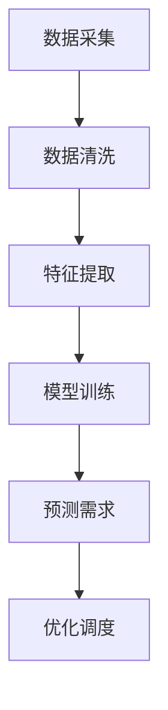
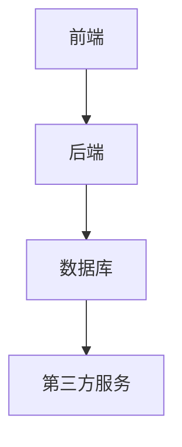
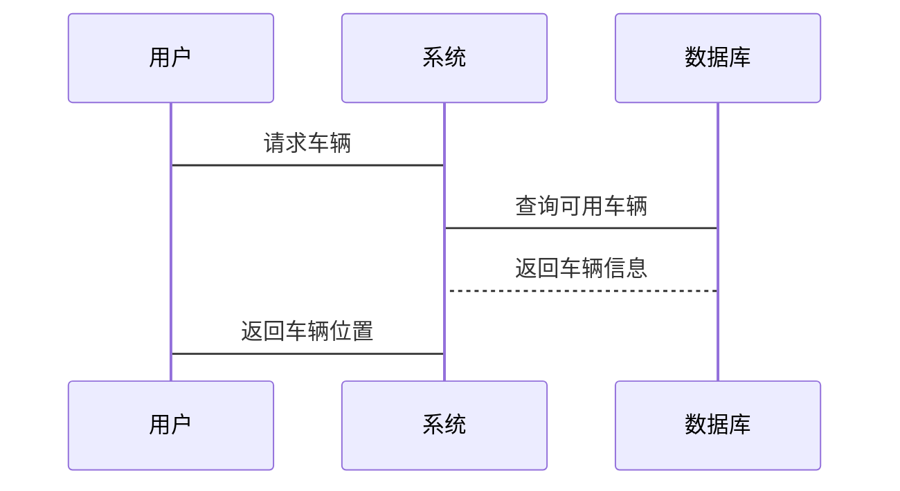

                 


# 价值投资中的智能城市共享单车管理系统分析

> 关键词：价值投资，智能城市，共享单车，管理系统，算法原理

> 摘要：本文分析了价值投资在智能城市共享单车管理中的应用，探讨了系统的背景、核心概念、算法原理、数学模型、系统架构、项目实战及最佳实践。通过案例分析，展示了如何利用价值投资理念优化共享单车管理系统，提高资源利用效率。

---

## 第1章: 价值投资与智能城市共享单车管理的背景介绍

### 1.1 价值投资的基本原理
- **1.1.1 价值投资的定义与核心理念**  
  价值投资是一种长期投资策略，强调以低于内在价值的价格买入优质资产。核心理念包括安全边际、长期视角和对公司基本面的深入分析。  
  > 例如，巴菲特的价值投资理念强调“买入并持有”，注重企业的内在价值。

- **1.1.2 价值投资在现代经济中的应用**  
  价值投资不仅适用于传统金融领域，还可应用于智能城市中的资源优化配置。例如，通过分析共享单车的市场需求和运营效率，寻找具备长期增长潜力的项目。

- **1.1.3 智慧城市的发展背景与趋势**  
  智慧城市整合了物联网、大数据和人工智能技术，优化城市资源分配。共享单车作为城市交通的重要组成部分，其管理系统需要智能化以应对需求波动。

### 1.2 智能城市共享单车管理系统的概念与特点
- **1.2.1 共享单车管理系统的定义**  
  共享单车管理系统是通过智能设备和数据平台对共享单车的停放、调度和用户行为进行实时监控和管理的系统。

- **1.2.2 智能城市中共享单车管理的核心特点**  
  - 数据驱动：利用传感器和用户行为数据优化资源分配。  
  - 智能调度：通过算法实时调整单车分布，满足需求。  
  - 用户友好：提供便捷的骑行和支付体验。

- **1.2.3 共享单车管理系统与智慧城市的深度融合**  
  智能共享单车管理系统是智慧城市建设的重要组成部分，通过数据共享和协同优化，提升城市交通效率。

### 1.3 问题背景与问题描述
- **1.3.1 共享单车管理中的痛点分析**  
  - 资源浪费：部分区域单车数量过多，其他区域却供不应求。  
  - 调度不及时：传统管理依赖人工调度，效率低且响应慢。  
  - 用户体验差：高峰期找车难，乱停乱放问题突出。

- **1.3.2 智能城市背景下共享单车管理的机遇与挑战**  
  机遇：大数据和人工智能技术的应用，提高了管理效率。  
  挑战：数据隐私、系统稳定性以及用户习惯的改变。

- **1.3.3 问题解决的目标与边界**  
  目标：通过智能化管理，优化资源分配，提升用户体验。  
  边界：仅关注单车调度和用户行为分析，不涉及车辆维护和政策监管。

---

## 第2章: 智能城市共享单车管理系统的核心概念与联系

### 2.1 核心概念的原理分析
- **2.1.1 数据采集与处理**  
  通过传感器采集单车状态、用户骑行数据和环境信息，数据清洗和特征提取后用于分析。

- **2.1.2 智能调度算法**  
  使用聚类算法分析用户需求分布，预测高峰期和低谷期，优化单车调度。

- **2.1.3 用户行为分析**  
  分析用户的骑行习惯、使用频率和偏好，制定精准的营销策略。

### 2.2 核心概念的属性特征对比
- **2.2.1 传统共享单车管理与智能管理的对比分析**  
  | 特性 | 传统管理 | 智能管理 |
  |------|----------|----------|
  | 调度方式 | 人工调度 | 数据驱动 |
  | 数据利用 | 无 | 全面分析 |
  | 效率 | 低 | 高 |

- **2.2.2 数据驱动与人工调度的对比**  
  数据驱动：基于实时数据优化资源配置。  
  人工调度：依赖经验，效率低且误差大。

- **2.2.3 用户需求与资源分配的对比**  
  用户需求分析帮助优化资源分配，提升用户体验。

### 2.3 ER实体关系图架构
```mermaid
erDiagram
    user {
        用户ID
        用户名
        联系方式
        骑行记录
    }
    vehicle {
        车辆ID
        车型
        状态(可用/不可用)
        停放位置
    }
    station {
        站点ID
        地理位置
        车辆数量
        用户流量
    }
    user -> vehicle : 骑行
    user -> station : 使用
    vehicle -> station : 停放
```

---

## 第3章: 智能城市共享单车管理系统的算法原理

### 3.1 算法原理概述
- **3.1.1 数据挖掘与机器学习的应用**  
  使用聚类分析（K-Means）识别用户需求热点区域，使用线性回归预测需求波动。

- **3.1.2 常见的调度算法介绍**  
  - 聚类算法：分析用户需求分布，确定调度区域。  
  - 线性回归：预测需求波动，优化车辆分配。

- **3.1.3 算法的优缺点分析**  
  优点：提高调度效率，降低资源浪费。  
  缺点：算法复杂度高，需要大量数据支持。

### 3.2 算法流程图


### 3.3 算法实现代码
```python
import pandas as pd
from sklearn.cluster import KMeans
from sklearn.linear_model import LinearRegression

# 数据加载与清洗
data = pd.read_csv('sharing_bike.csv')
data = data.dropna()

# 特征提取
features = data[['经度', '纬度', '用户流量']]
X = features.values

# 聚类分析
model = KMeans(n_clusters=5)
model.fit(X)
clusters = model.labels_

# 线性回归预测
reg = LinearRegression()
reg.fit(X, data['需求预测'])
```

---

## 第4章: 数学模型与公式推导

### 4.1 用户需求预测模型
$$ Y = aX + b $$
其中，$Y$是需求预测，$X$是用户流量，$a$和$b$是回归系数。

### 4.2 案例分析
以某城市为例，建立需求预测模型：
$$ Y = 1.5X + 10 $$

---

## 第5章: 系统分析与架构设计

### 5.1 问题场景介绍
高峰期某区域用户需求激增，系统需实时调整车辆分配。

### 5.2 系统功能设计
```mermaid
classDiagram
    class 用户管理 {
        用户ID
        用户名
        联系方式
    }
    class 车辆管理 {
        车辆ID
        状态
        停放位置
    }
    class 站点管理 {
        站点ID
        地理位置
        车辆数量
    }
    用户管理 -->> 车辆管理 : 骑行
    用户管理 -->> 站点管理 : 使用
    车辆管理 -->> 站点管理 : 停放
```

### 5.3 系统架构设计


### 5.4 系统交互设计


---

## 第6章: 项目实战

### 6.1 环境安装
安装Python和相关库：
```bash
pip install pandas scikit-learn
```

### 6.2 核心代码实现
```python
import pandas as pd
from sklearn.cluster import KMeans

# 数据加载
data = pd.read_csv('sharing_bike.csv')

# 聚类分析
model = KMeans(n_clusters=5)
model.fit(data[['经度', '纬度']])
clusters = model.labels_

# 可视化
import matplotlib.pyplot as plt
plt.scatter(data['经度'], data['纬度'], c=clusters)
plt.show()
```

### 6.3 案例分析
分析某城市的需求预测，优化车辆调度，减少资源浪费。

### 6.4 项目小结
通过价值投资理念优化系统设计，提升资源利用效率和用户体验。

---

## 第7章: 最佳实践与总结

### 7.1 最佳实践 tips
- 数据质量是关键，确保数据清洗和特征提取准确。  
- 算法选择需结合实际场景，避免过度复杂化。

### 7.2 小结
本文通过价值投资理念，分析了智能城市共享单车管理系统的背景、核心概念、算法原理和系统架构，展示了如何利用技术优化资源分配。

### 7.3 注意事项
- 数据隐私保护需重视。  
- 系统稳定性是运营的关键。

### 7.4 拓展阅读
推荐阅读《智能城市：大数据与人工智能的应用》和《价值投资实战技巧》。

---

通过以上分析，智能城市共享单车管理系统在价值投资理念的指导下，能够更高效地优化资源配置，提升用户体验，为智慧城市建设提供重要支持。

