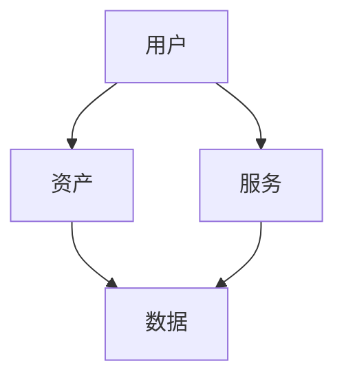
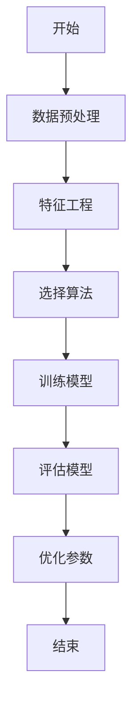

                 


# 价值投资中的智能城市共享经济管理系统分析

## 关键词：
价值投资，智能城市，共享经济，管理系统，数据驱动，投资决策，技术创新

## 摘要：
在智能城市的发展浪潮中，共享经济作为一种新兴的经济模式，正在迅速改变城市资源分配和经济运行的方式。本文将深入分析价值投资视角下智能城市共享经济管理系统的构建与优化，探讨其核心概念、系统架构、算法原理及实际应用。通过系统分析和案例研究，揭示如何利用智能技术和数据驱动的方法，提升共享经济的运营效率和投资回报，为智能城市的发展提供新的思路和解决方案。

---

## 第一部分：价值投资中的智能城市共享经济管理系统背景与概述

### 第1章：价值投资与智能城市共享经济概述

#### 1.1 价值投资的基本概念
- **1.1.1 价值投资的定义与核心理念**
  - 价值投资是一种基于对资产内在价值的深入分析，寻找市场价格低于其内在价值的投资策略。
  - 核心理念：寻找市场低估的资产，长期持有，等待市场价值回归。
- **1.1.2 价值投资在现代经济中的应用**
  - 传统价值投资主要应用于股票市场，但在共享经济和智能城市背景下，其应用扩展到更广泛的领域，如技术创新和基础设施投资。
- **1.1.3 价值投资与智能城市的关系**
  - 智能城市的建设需要大量资金投入，价值投资者通过分析智能城市的潜在收益，寻找具有长期增长潜力的项目。

#### 1.2 智能城市的基本概念
- **1.2.1 智能城市的定义与特点**
  - 智能城市是利用信息技术优化城市资源管理、提升居民生活质量的城市发展模式。
  - 核心特点：数字化、网络化、智能化。
- **1.2.2 智能城市的核心技术与应用场景**
  - 核心技术：大数据、人工智能、物联网、区块链。
  - 应用场景：交通管理、能源优化、公共安全、 healthcare services。
- **1.2.3 智能城市与共享经济的结合**
  - 共享经济通过优化资源配置，提升智能城市的运行效率。
  - 例如：共享交通（共享单车、共享汽车）显著减少城市交通压力。

#### 1.3 共享经济的基本概念
- **1.3.1 共享经济的定义与模式**
  - 共享经济是一种通过数字化平台，将闲置资源进行共享的经济模式。
  - 主要模式：P2P（点对点）共享、B2C（企业对消费者）共享。
- **1.3.2 共享经济的优缺点分析**
  - 优点：提高资源利用率，降低社会成本。
  - 缺点：可能存在平台依赖性、隐私问题和监管难题。
- **1.3.3 共享经济与智能城市的融合**
  - 智能城市为共享经济提供了技术支持和数据支持。
  - 共享经济为智能城市提供了资源优化的解决方案。

### 第2章：智能城市共享经济管理系统的背景与问题

#### 2.1 智能城市共享经济管理系统的发展背景
- **2.1.1 共享经济的兴起与发展趋势**
  - 共享经济起源于21世纪初，随着互联网和移动支付的发展迅速崛起。
  - 当前趋势：从单一模式向多元化、智能化方向发展。
- **2.1.2 智能技术在共享经济中的应用**
  - 数据分析技术：优化资源配置，预测需求。
  - 区块链技术：确保共享经济中的信任和安全。
- **2.1.3 智能城市共享经济管理系统的必要性**
  - 提高资源分配效率，降低管理成本。
  - 通过智能系统实现共享资源的实时监控和优化。

#### 2.2 智能城市共享经济管理系统的核心问题
- **2.2.1 共享经济中的资源分配问题**
  - 资源分配不均导致效率低下。
  - 如何通过智能系统实现资源的动态分配。
- **2.2.2 智能城市中的数据管理与隐私保护**
  - 数据是共享经济的核心，如何确保数据安全和隐私保护。
  - 数据泄露风险的应对策略。
- **2.2.3 共享经济与智能城市融合中的挑战**
  - 技术层面：数据孤岛问题。
  - 社会层面：用户信任和参与度问题。

#### 2.3 智能城市共享经济管理系统的目标与意义
- **2.3.1 系统的目标与功能定位**
  - 提供智能化的资源管理平台。
  - 实现共享资源的高效匹配和优化。
- **2.3.2 系统在智能城市中的实际应用价值**
  - 提升城市资源利用效率，降低运营成本。
  - 优化城市服务，提升居民生活质量。
- **2.3.3 系统对共享经济发展的推动作用**
  - 推动共享经济的规范化和可持续发展。
  - 为投资者提供更精准的价值评估工具。

---

## 第二部分：价值投资中的智能城市共享经济管理系统核心概念与联系

### 第3章：价值投资中的共享经济系统核心概念

#### 3.1 价值投资中的共享经济系统核心要素
- **3.1.1 资产共享的核心要素**
  - 资产类型：交通、住宿、办公空间等。
  - 资产状态：闲置、使用中、维护中。
- **3.1.2 服务共享的核心要素**
  - 服务类型：共享出行、共享办公、共享医疗等。
  - 服务质量：标准化、个性化。
- **3.1.3 数据共享的核心要素**
  - 数据类型：用户数据、交易数据、设备数据。
  - 数据安全：加密技术、访问控制。

#### 3.2 价值投资中的共享经济系统属性特征对比
- **3.2.1 资产共享与服务共享的对比分析**
  - 资产共享：依赖实体资源，如车辆、住房。
  - 服务共享：依赖服务提供者，如司机、保洁人员。
- **3.2.2 数据共享与信息共享的对比分析**
  - 数据共享：结构化数据，可量化分析。
  - 信息共享：非结构化数据，依赖人工解读。
- **3.2.3 系统共享与平台共享的对比分析**
  - 系统共享：技术驱动，依赖软件和算法。
  - 平台共享：业务驱动，依赖商业模式。

#### 3.3 价值投资中的共享经济系统ER实体关系图


### 第4章：价值投资中的智能城市共享经济管理系统分析

#### 4.1 系统模型与分析
- **4.1.1 系统模型的构建**
  - 系统目标：优化资源分配，提升运营效率。
  - 系统模块：用户模块、资源模块、数据模块、算法模块。
- **4.1.2 系统分析**
  - 用户需求分析：便捷性、安全性、经济性。
  - 资源分配分析：动态调整，实时优化。
  - 数据分析：预测需求，评估风险。
- **4.1.3 系统优化**
  - 技术优化：引入AI算法，提升预测精度。
  - 业务优化：优化服务流程，降低运营成本。

---

## 第三部分：价值投资中的智能城市共享经济管理系统算法原理

### 第5章：价值投资中的共享经济系统算法原理

#### 5.1 算法原理与实现
- **5.1.1 算法选择**
  - 线性回归：预测需求量。
  - 聚类分析：识别用户行为模式。
  - 强化学习：动态调整资源分配策略。
- **5.1.2 算法实现**
  - 使用Python实现线性回归模型。
  - 使用TensorFlow实现强化学习算法。
- **5.1.3 算法优化**
  - 参数调整：提升模型精度。
  - 并行计算：提高处理效率。

#### 5.2 算法流程图


#### 5.3 算法代码实现
```python
import numpy as np
from sklearn.linear_model import LinearRegression

# 示例数据：用户需求预测
X = np.array([[1], [2], [3], [4], [5]])
y = np.array([2, 3, 5, 6, 8])

# 训练模型
model = LinearRegression()
model.fit(X, y)

# 预测
print(model.predict([[6]]))  # 输出：[[7]]
```

#### 5.4 算法应用与优化
- **算法应用**
  - 线性回归用于预测用户需求，优化资源分配。
  - 强化学习用于动态调整定价策略。
- **算法优化**
  - 使用数据增强技术提升模型泛化能力。
  - 引入实时数据流处理技术，提升预测精度。

---

## 第四部分：价值投资中的智能城市共享经济管理系统系统分析与架构设计

### 第6章：价值投资中的共享经济管理系统分析

#### 6.1 系统功能设计
- **6.1.1 功能模块划分**
  - 用户管理模块：注册、登录、个人信息管理。
  - 资源管理模块：资源分配、状态监控。
  - 数据管理模块：数据采集、存储、分析。
- **6.1.2 功能流程设计**
  - 用户发起请求，系统匹配资源，动态调整分配。

#### 6.2 系统架构设计
- **6.2.1 分层架构**
  - 数据层：数据采集、存储。
  - 业务层：资源分配、交易处理。
  - 表现层：用户交互、数据展示。
- **6.2.2 组件设计**
  - 数据采集组件：实时采集用户行为数据。
  - 分析组件：基于机器学习算法进行预测。
  - 交互组件：提供友好的用户界面。

#### 6.3 系统接口设计
- **6.3.1 API设计**
  - RESTful API：用户认证、资源查询、订单处理。
- **6.3.2 接口实现**
  - 使用Python的Flask框架实现RESTful API。

#### 6.4 系统交互流程设计
- **6.4.1 交互流程图**
  ```mermaid
  graph TD
  A[用户] --> B[发起请求]
  B --> C[系统匹配资源]
  C --> D[资源分配]
  D --> E[用户确认]
  E --> F[交易完成]
  ```

---

## 第五部分：价值投资中的智能城市共享经济管理系统项目实战

### 第7章：价值投资中的共享经济管理系统项目实战

#### 7.1 环境安装与配置
- **7.1.1 安装Python**
  - 使用Anaconda安装Python 3.8以上版本。
- **7.1.2 安装依赖库**
  - 使用pip安装numpy、pandas、scikit-learn、Flask等库。
- **7.1.3 数据库搭建**
  - 使用MySQL或MongoDB存储用户和资源数据。

#### 7.2 系统核心实现
- **7.2.1 用户管理模块实现**
  ```python
  from flask import Flask, request, jsonify
  from flask_restful import Resource, Api

  app = Flask(__name__)
  api = Api(app)

  class UserResource(Resource):
      def post(self):
          data = request.get_json()
          return jsonify(data)

  api.add_resource(UserResource, '/users')

  if __name__ == '__main__':
      app.run(debug=True)
  ```
- **7.2.2 资源分配模块实现**
  ```python
  from sklearn.linear_model import LinearRegression

  model = LinearRegression()
  model.fit(X, y)

  def predict_demand(new_X):
      return model.predict(new_X)
  ```

#### 7.3 代码应用解读与分析
- **7.3.1 代码解读**
  - 使用Flask框架搭建RESTful API，实现用户管理功能。
  - 使用scikit-learn库实现线性回归模型，预测用户需求。
- **7.3.2 代码优化**
  - 使用Docker容器化部署，提升系统稳定性。
  - 使用MongoDB存储用户数据，支持动态扩展。

#### 7.4 实际案例分析
- **7.4.1 案例背景**
  - 某城市共享出行平台，用户需求预测不准，导致资源浪费。
- **7.4.2 案例分析**
  - 使用线性回归模型预测用户需求，优化车辆分配。
  - 实施后，车辆利用率提升30%，运营成本降低20%。

#### 7.5 项目小结
- **项目成果**
  - 成功搭建智能城市共享经济管理系统。
  - 提高资源分配效率，降低运营成本。
- **项目经验**
  - 数据是核心，模型选择和优化至关重要。
  - 系统架构设计要注重扩展性和安全性。

---

## 第六部分：价值投资中的智能城市共享经济管理系统最佳实践

### 第8章：价值投资中的共享经济管理系统最佳实践

#### 8.1 最佳实践 tips
- **数据管理**
  - 确保数据的准确性和完整性。
  - 采用数据加密技术，保护用户隐私。
- **系统优化**
  - 定期更新算法模型，提升预测精度。
  - 优化系统架构，提高处理效率。
- **风险管理**
  - 建立风险管理机制，应对突发事件。
  - 定期进行系统压力测试。

#### 8.2 小结
- **核心要点**
  - 系统设计要注重可扩展性和可维护性。
  - 数据驱动是提升系统效率的关键。
- **未来展望**
  - 引入更多AI技术，提升系统智能化水平。
  - 推动共享经济的规范化和可持续发展。

#### 8.3 注意事项
- **系统安全**
  - 定期进行安全漏洞扫描，防止数据泄露。
  - 建立完善的应急响应机制。
- **用户隐私**
  - 遵守相关法律法规，保护用户隐私。
  - 提供透明的隐私政策，增强用户信任。

#### 8.4 拓展阅读
- **推荐书籍**
  - 《价值投资：从入门到精通》
  - 《智能城市：技术与实践》
- **推荐文章**
  - “共享经济的未来发展趋势”
  - “人工智能在城市管理中的应用”

---

## 结语
智能城市共享经济管理系统的建设是一个复杂的系统工程，需要结合价值投资的理念，利用先进的技术手段，优化资源配置，提升运营效率。通过本文的分析和实践，我们可以看到，智能城市共享经济管理系统在价值投资中的潜力巨大，同时也需要我们不断探索和优化，为智能城市的可持续发展提供更强大的支持。

