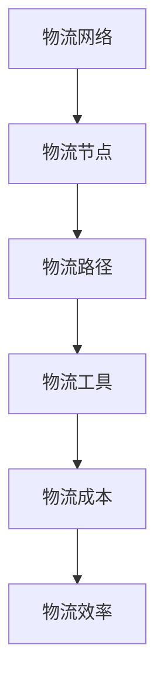
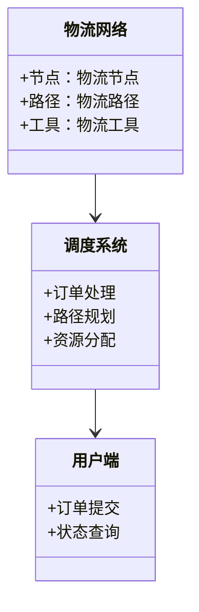
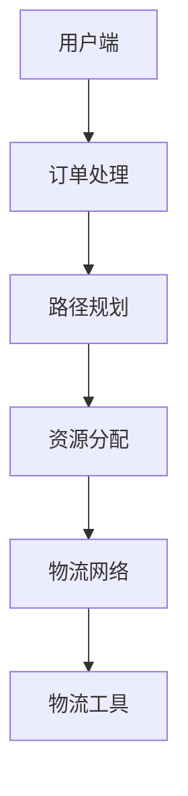
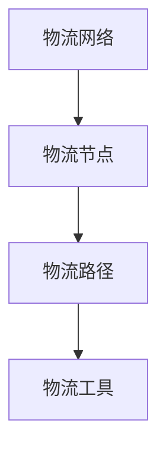

                 


# 价值投资中的智能城市地下物流系统分析

> 关键词：智能城市，地下物流，价值投资，物流系统，数学模型，系统架构，投资策略

> 摘要：随着城市化进程的加快，智能城市地下物流系统成为提升城市物流效率的重要手段。本文从价值投资的角度，分析智能城市地下物流系统的组成、运作机制及其在投资中的应用。通过构建数学模型和系统架构，探讨如何通过价值投资优化物流系统的效率和成本。

---

# 第一部分: 背景与概述

## 第1章: 背景与概述

### 1.1 智能城市地下物流系统的背景

智能城市地下物流系统是智慧城市建设的重要组成部分。随着城市人口的增加和物流需求的激增，传统的地面物流系统已难以满足高效、低成本的需求。地下物流系统通过利用城市地下空间，实现了物流的高效运作，减少了交通拥堵和环境影响。

### 1.2 价值投资的基本概念

价值投资是一种长期投资策略，强调通过深入分析企业的基本面，寻找被市场低估的投资标的。在物流系统中，价值投资的核心在于识别具有长期增长潜力的项目，并通过优化资源配置实现收益最大化。

### 1.3 智能城市地下物流系统的组成部分

智能城市地下物流系统主要包括物流网络、物流节点、物流路径和物流工具等组成部分。这些部分通过智能化的调度系统协同工作，确保物流的高效运转。

---

# 第二部分: 核心概念与联系

## 第2章: 核心概念与联系

### 2.1 智能城市地下物流系统的价值评估模型

价值评估模型是智能城市地下物流系统分析的核心工具。本文构建了一个基于收益、成本和风险的多维度评估模型，用于量化物流系统的投资价值。

### 2.2 核心概念对比分析

以下是物流系统与传统物流的对比分析：

| 特性                | 智能物流系统                 | 传统物流系统               |
|---------------------|-----------------------------|---------------------------|
| 运作效率            | 高效，智能化调度             | 低效，依赖人工干预         |
| 成本                 | 低，通过地下空间节省成本     | 高，地面交通成本较高       |
| 可扩展性            | 高，地下空间潜力大           | 有限，地面空间有限         |
| 环境影响            | 低，减少交通拥堵和污染       | 高，加剧交通拥堵和污染     |

### 2.3 系统架构图（Mermaid）



---

# 第三部分: 数学模型与公式

## 第3章: 数学模型与公式

### 3.1 物流系统的数学建模

物流系统的数学建模需要考虑多个变量，包括物流成本、收益、路径长度、运输时间等。以下是一个简化的物流系统模型：

$$
\text{目标函数} = \min \sum_{i=1}^{n} c_i x_i
$$

其中，$c_i$ 是路径 $i$ 的成本，$x_i$ 是路径 $i$ 的使用次数。

### 3.2 价值评估模型的数学公式

价值评估模型需要综合考虑收益和成本。以下是一个基本的价值评估公式：

$$
\text{价值} = \text{收益} - \text{成本}
$$

收益和成本的具体计算如下：

收益：

$$
\text{收益} = \sum_{j=1}^{m} p_j q_j
$$

其中，$p_j$ 是订单 $j$ 的价格，$q_j$ 是订单 $j$ 的数量。

成本：

$$
\text{成本} = \sum_{k=1}^{l} c_k t_k
$$

其中，$c_k$ 是资源 $k$ 的成本，$t_k$ 是资源 $k$ 的使用时间。

---

# 第四部分: 系统分析与架构设计

## 第4章: 系统分析与架构设计

### 4.1 问题场景介绍

智能城市地下物流系统需要解决的主要问题是高效调度物流资源、降低物流成本和提升物流效率。本文通过构建一个智能化的调度系统，实现对物流资源的优化配置。

### 4.2 系统功能设计

以下是物流系统的功能模块图：



### 4.3 系统架构设计

以下是物流系统的架构图：



---

# 第五部分: 项目实战

## 第5章: 项目实战

### 5.1 环境安装

为了实现物流系统的智能化调度，需要安装以下环境：

- Python 3.8 或更高版本
- Python库：numpy, pandas, matplotlib, networkx

### 5.2 核心代码实现

以下是物流系统的核心代码实现：

```python
import numpy as np
import networkx as nx

def calculate_cost(path):
    # 计算路径成本
    return sum([edge['weight'] for edge in path])

def optimize_route(graph, start, end):
    # 使用Dijkstra算法优化路径
    shortest_path = nx.dijkstra(graph, start, end)
    return shortest_path

# 示例图
graph = nx.Graph()
graph.add_edge('A', 'B', weight=1)
graph.add_edge('B', 'C', weight=2)
graph.add_edge('A', 'C', weight=3)

optimized_path = optimize_route(graph, 'A', 'C')
print(f"优化路径：{optimized_path}")
print(f"总成本：{calculate_cost(optimized_path)}")
```

### 5.3 案例分析

以下是一个简单的案例分析：

假设有一个物流网络，包含节点A、B、C，边的权重分别为AB=1，BC=2，AC=3。通过Dijkstra算法优化路径后，从A到C的最短路径为AB->BC，总成本为3。

---

# 第六部分: 投资策略与风险管理

## 第6章: 投资策略与风险管理

### 6.1 投资策略

在价值投资中，关键在于识别具有长期增长潜力的物流项目。本文的模型可以帮助投资者评估物流系统的投资价值，并制定相应的投资策略。

### 6.2 风险管理

物流系统的投资风险主要包括市场风险、技术风险和运营风险。通过建立风险管理模型，可以有效降低投资风险。

---

# 第七部分: 结论与展望

## 第7章: 结论与展望

### 7.1 结论

本文通过构建智能城市地下物流系统的数学模型和系统架构，探讨了价值投资在物流系统中的应用。研究表明，智能物流系统具有较高的投资价值。

### 7.2 展望

未来的研究可以进一步优化物流系统的算法，探索更多的应用场景，并结合人工智能技术提升物流系统的智能化水平。

---

# 附录

## 附录A: 常用公式汇总

- 收益预测公式：$$\text{收益} = \sum_{j=1}^{m} p_j q_j$$
- 成本分析公式：$$\text{成本} = \sum_{k=1}^{l} c_k t_k$$
- 价值评估公式：$$\text{价值} = \text{收益} - \text{成本}$$

---

## 附录B: 系统架构图



---

通过以上思考和分析，我们可以系统地撰写一篇关于价值投资中的智能城市地下物流系统分析的技术博客文章。

