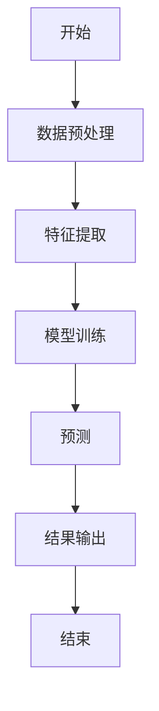
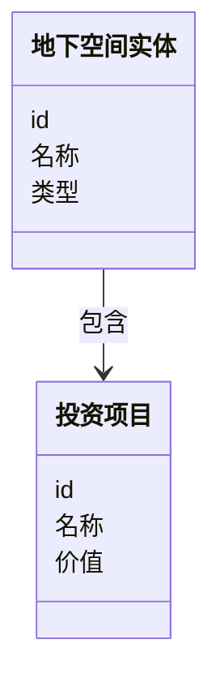
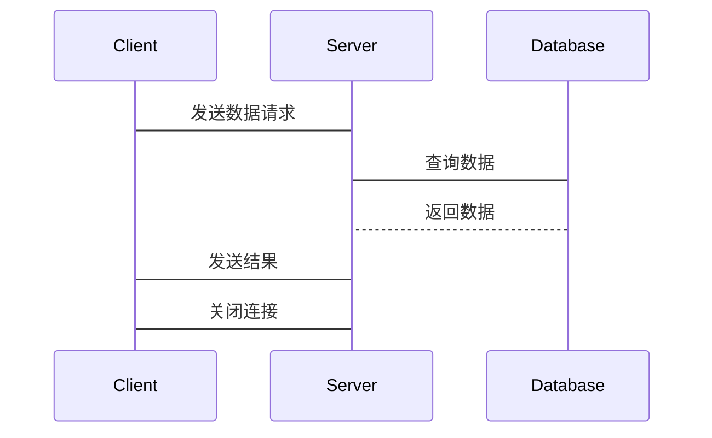

                 


# 价值投资中的智能城市地下空间利用系统分析

## 关键词：价值投资, 智能城市, 地下空间, 数据驱动, 系统分析

## 摘要：  
本文系统地分析了价值投资在智能城市地下空间利用中的应用，通过数据驱动的方法，构建了地下空间利用系统的价值评估模型，并结合实际案例进行了系统设计与实现。文章从背景介绍、核心概念、算法原理、系统架构设计到项目实战，全面探讨了如何利用智能化系统优化地下空间的利用效率和投资回报。

---

## 第1章：价值投资与智能城市地下空间利用系统概述

### 1.1 问题背景

#### 1.1.1 价值投资的定义与核心理念  
价值投资是一种长期投资策略，强调通过分析资产的内在价值，寻找市场低估的投资机会。其核心理念包括：  
1. **安全边际**：以低于内在价值的价格买入资产。  
2. **长期视角**：关注企业的长期盈利能力，而非短期市场波动。  
3. **基本面分析**：通过财务报表、行业地位等基本面因素评估资产价值。  

#### 1.1.2 智能城市与地下空间利用的背景  
随着城市化进程的加快，土地资源日益紧张，地下空间的利用成为城市发展的重要方向。智能城市通过物联网、大数据、人工智能等技术，优化地下空间的规划、建设和管理。  

#### 1.1.3 价值投资与地下空间利用的结合点  
价值投资的核心是通过数据驱动的方法，发现市场低估的投资机会。而地下空间利用系统需要通过智能化技术优化空间规划和资源配置。两者的结合点在于通过数据驱动的方法，优化地下空间的利用效率和投资回报。

### 1.2 问题描述

#### 1.2.1 地下空间利用的现状与挑战  
1. **资源浪费**：部分地下空间未被充分利用，或用途单一。  
2. **管理分散**：地下空间的规划和管理涉及多个部门，协调难度大。  
3. **规划不合理**：缺乏系统性规划，导致空间利用效率低下。  

#### 1.2.2 价值投资在地下空间利用中的问题  
1. **数据不足**：地下空间利用的相关数据分散，难以获取。  
2. **模型复杂**：价值评估模型需要考虑多种因素，构建难度大。  
3. **决策滞后**：传统投资分析方法难以应对快速变化的市场环境。  

#### 1.2.3 智能化与数据驱动的必要性  
通过智能化系统，可以实时采集和分析地下空间的相关数据，为价值投资提供科学依据。数据驱动的方法能够帮助投资者发现市场低估的机会，优化投资决策。

### 1.3 问题解决

#### 1.3.1 数据驱动的地下空间利用分析  
通过大数据技术，整合地下空间的地理位置、建筑结构、使用功能等信息，构建数据驱动的分析模型。  

#### 1.3.2 价值投资模型的构建  
基于地下空间利用的特征，构建价值评估模型，量化空间的潜在价值。  

#### 1.3.3 智能化系统在地下空间利用中的应用  
通过智能化系统，实时监控地下空间的使用情况，优化空间分配和资源利用。

### 1.4 边界与外延

#### 1.4.1 系统的边界条件  
1. 数据来源：地下空间的相关数据，如地理位置、建筑信息等。  
2. 投资范围：地下空间的开发和利用项目。  
3. 评估指标：如投资回报率、空间利用率等。  

#### 1.4.2 系统的外延与扩展  
1. **扩展功能**：增加空间利用的优化建议和风险评估功能。  
2. **多领域应用**：将系统扩展到其他领域，如商业地产、交通管理等。  

#### 1.4.3 相关领域的关联性分析  
1. **城市规划**：地下空间利用与城市总体规划密切相关。  
2. **交通管理**：地下交通网络的优化可以提高空间利用效率。  
3. **环境保护**：合理利用地下空间可以减少对地面环境的影响。  

### 1.5 概念结构与核心要素

#### 1.5.1 系统的核心要素  
1. **数据层**：地下空间的相关数据，如地理位置、建筑信息等。  
2. **模型层**：价值评估模型和优化算法。  
3. **应用层**：智能化系统的功能实现和用户界面。  

#### 1.5.2 要素之间的关系  
通过数据驱动的方法，构建价值评估模型，指导智能化系统的应用和优化。  

#### 1.5.3 系统的结构化描述  
通过层次化的方法，将系统分解为数据层、模型层和应用层，分别实现数据的采集、分析和应用。

---

## 第2章：价值投资中的地下空间利用系统分析

### 2.1 核心概念原理

#### 2.1.1 价值投资的核心原理  
通过分析资产的内在价值，寻找市场低估的投资机会。  

#### 2.1.2 地下空间利用的系统特征  
1. **数据驱动**：依赖于大量数据的采集和分析。  
2. **实时性**：需要实时监控地下空间的使用情况。  
3. **动态优化**：根据数据变化，动态调整空间利用策略。  

#### 2.1.3 价值投资与系统分析的结合  
通过数据驱动的方法，优化地下空间的利用效率，提升投资回报率。

### 2.2 核心概念属性对比

| 属性          | 价值投资                        | 地下空间利用系统                  |
|---------------|---------------------------------|-----------------------------------|
| 数据驱动      | 是                              | 是                                |
| 目标          | 最大化投资回报                  | 提高空间利用效率                  |
| 方法          | 财务分析、基本面分析            | 技术分析、实时监控                |
| 应用场景      | 金融市场                       | 城市规划、地产开发                |

### 2.3 ER实体关系图

```mermaid
erDiagram
    class 地下空间实体 {
        id
        名称
        类型
    }
    class 投资项目 {
        id
        名称
        价值
    }
    地下空间实体 --> 投资项目 : 包含
```

---

## 第3章：算法原理讲解

### 3.1 数据预处理

#### 3.1.1 数据清洗  
去除重复数据、缺失数据和异常值。  

#### 3.1.2 特征提取  
从原始数据中提取有用的特征，如地理位置、建筑类型等。  

### 3.2 价值评估模型

#### 3.2.1 线性回归模型  
通过线性回归模型，预测地下空间的潜在价值。  

#### 3.2.2 模型训练  
使用训练数据，训练价值评估模型。  

#### 3.2.3 模型预测  
利用训练好的模型，预测新数据的潜在价值。  

### 3.3 算法流程图



### 3.4 数学模型

价值评估模型的数学公式：

$$ V = \beta_0 + \beta_1 x_1 + \beta_2 x_2 + ... + \beta_n x_n $$

其中，$V$ 是预测的潜在价值，$x_i$ 是特征变量，$\beta_i$ 是回归系数。

---

## 第4章：系统分析与架构设计

### 4.1 项目介绍

#### 4.1.1 项目目标  
通过智能化系统，优化地下空间的利用效率，提升投资回报率。  

#### 4.1.2 项目范围  
涵盖地下空间的规划、建设和管理全过程。  

### 4.2 系统功能设计

#### 4.2.1 领域模型



#### 4.2.2 系统架构设计


### 4.3 系统接口设计

#### 4.3.1 API接口  
提供RESTful API，供外部系统调用。  

#### 4.3.2 数据接口  
与传感器、数据库等系统对接，获取实时数据。  

### 4.4 系统交互流程



---

## 第5章：项目实战

### 5.1 环境安装

#### 5.1.1 安装Python  
安装Python 3.8或更高版本。  

#### 5.1.2 安装依赖库  
安装Pandas、NumPy、Scikit-learn等库。  

### 5.2 核心代码实现

#### 5.2.1 数据加载与处理

```python
import pandas as pd
import numpy as np

# 加载数据
data = pd.read_csv('underground_space.csv')

# 数据清洗
data.dropna(inplace=True)
data = data[~data.duplicated()]
```

#### 5.2.2 模型训练

```python
from sklearn.linear_model import LinearRegression
from sklearn.metrics import mean_squared_error

# 特征与目标变量
X = data[['area', 'location']]
y = data['value']

# 模型训练
model = LinearRegression()
model.fit(X, y)

# 预测
predictions = model.predict(X)

# 评估
mse = mean_squared_error(y, predictions)
print(f'Mean Squared Error: {mse}')
```

#### 5.2.3 系统实现

```python
class UndergroundSpaceSystem:
    def __init__(self, data):
        self.data = data
        self.model = LinearRegression()

    def train_model(self):
        X = self.data[['area', 'location']]
        y = self.data['value']
        self.model.fit(X, y)

    def predict_value(self, input_data):
        return self.model.predict(input_data)
```

### 5.3 案例分析

#### 5.3.1 数据分析  
以某城市为例，分析地下空间的利用情况，预测其潜在价值。  

#### 5.3.2 投资决策  
根据模型预测结果，优化投资决策，选择具有较高回报潜力的项目。  

---

## 第6章：结论

通过智能化系统分析，价值投资在地下空间利用中的潜力得到了充分展现。系统通过数据驱动的方法，优化了空间利用效率，提升了投资回报率。未来，随着技术的进步，智能化系统将在更多领域发挥重要作用。

---

## 参考文献

1. 书籍：《价值投资实战策略》  
2. 论文：《基于大数据的地下空间利用优化研究》  

---

## 附录

附录内容，如代码、数据表格等。

---

## 致谢

感谢所有参与项目设计和实现的人员，感谢读者的支持与关注。

---

# 结束语

通过本文的系统分析和实战案例，我们展示了如何利用智能化系统优化地下空间的利用效率，提升价值投资的回报率。希望本文能为相关领域的研究和实践提供参考。

