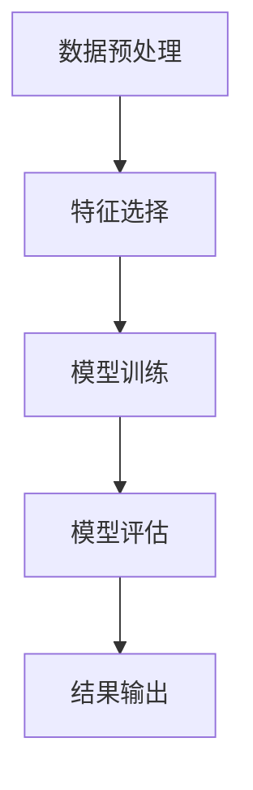
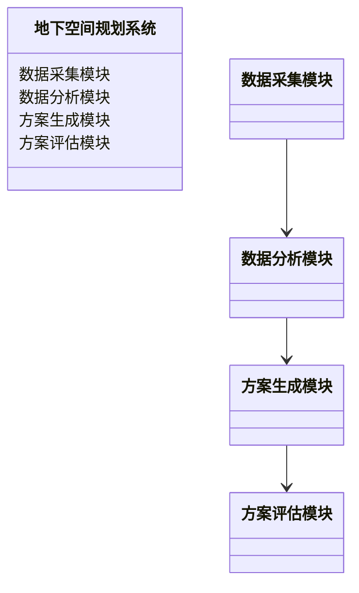
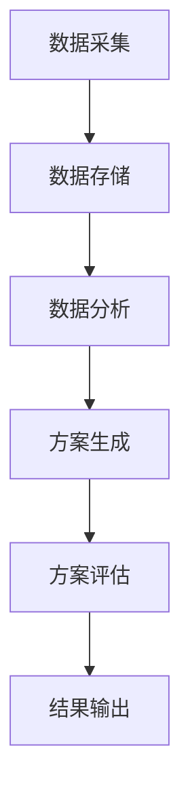
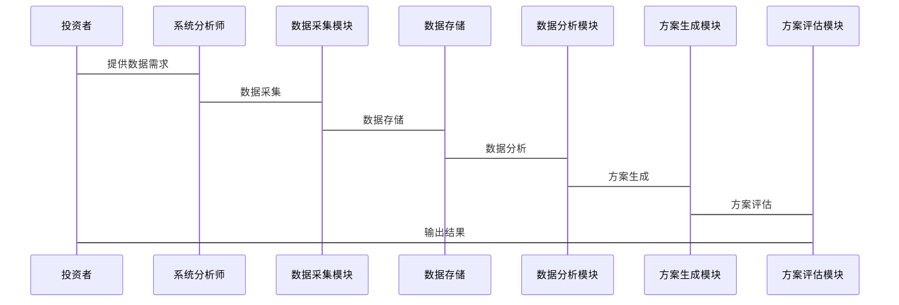

                 


# 价值投资中的智能城市地下空间规划系统分析

> 关键词：价值投资，智能城市，地下空间规划，系统分析，算法原理，系统架构，项目实战

> 摘要：本文将深入分析价值投资在智能城市地下空间规划系统中的应用。通过系统分析、算法原理、系统架构设计、项目实战等多方面的探讨，揭示如何通过智能化手段优化地下空间规划，实现投资价值最大化。文章结合理论与实践，提供详细的解决方案和实施路径，为相关领域的研究和实践提供参考。

---

## 第一部分: 价值投资中的智能城市地下空间规划系统背景

### 第1章: 价值投资与智能城市地下空间规划系统背景

#### 1.1 问题背景

##### 1.1.1 城市化进程中地下空间需求的增加

随着城市化进程的加快，城市土地资源日益紧张，地下空间的开发成为解决城市空间不足的重要手段。地下空间的规划和利用直接关系到城市的可持续发展和投资价值。

##### 1.1.2 价值投资在城市规划中的重要性

价值投资是一种通过分析资产的内在价值来决定投资策略的方法。在城市规划中，价值投资的核心在于通过科学的分析方法，评估不同规划方案的经济价值和社会效益，从而做出最优决策。

##### 1.1.3 智能城市地下空间规划的核心问题

智能城市地下空间规划的核心问题是如何通过智能化手段，优化地下空间的利用效率，最大化其经济价值和社会效益。

---

#### 1.2 问题描述

##### 1.2.1 城市地下空间规划的主要挑战

1. **空间利用效率低**：传统地下空间规划缺乏数据支持，导致空间利用效率低下。
2. **投资决策不精准**：由于缺乏系统的分析方法，投资决策往往依赖经验，存在较大风险。
3. **规划方案的可实施性差**：传统规划方案难以量化评估，导致实施难度大。

##### 1.2.2 价值投资在地下空间规划中的应用需求

1. **投资价值评估**：通过价值投资方法，评估地下空间开发的经济价值。
2. **风险控制**：通过数据分析和模型模拟，降低投资风险。
3. **规划优化**：通过智能化手段，优化地下空间的规划方案。

##### 1.2.3 智能城市地下空间规划系统的边界与外延

智能城市地下空间规划系统的边界包括数据采集、模型构建、方案评估等核心环节；其外延则涉及城市交通、环境保护、经济发展等多个领域。

---

#### 1.3 问题解决

##### 1.3.1 价值投资方法在地下空间规划中的应用

通过价值投资方法，评估地下空间开发的潜在收益和风险，为投资决策提供依据。

##### 1.3.2 智能系统在地下空间规划中的作用

智能系统通过数据采集、分析和模拟，优化地下空间的规划方案，提高利用效率。

##### 1.3.3 问题解决的路径与目标

1. **路径**：数据采集 -> 模型构建 -> 方案评估 -> 优化实施。
2. **目标**：实现地下空间的高效利用和投资价值最大化。

---

#### 1.4 核心概念与要素

##### 1.4.1 智能城市地下空间规划系统的核心要素

1. **数据采集**：包括地理数据、交通数据、经济数据等。
2. **模型构建**：包括空间分析模型、价值评估模型等。
3. **方案评估**：包括经济效益评估、社会效益评估等。

##### 1.4.2 价值投资在系统中的关键作用

通过价值投资方法，量化评估地下空间开发的经济价值和社会效益，为投资决策提供支持。

##### 1.4.3 系统的结构与功能

1. **系统结构**：分为数据层、模型层、应用层。
2. **系统功能**：数据采集、模型构建、方案评估、优化实施。

---

#### 1.5 本章小结

本章从背景、问题、解决路径等方面，详细阐述了价值投资在智能城市地下空间规划系统中的重要性。通过分析核心概念和要素，为后续的系统设计和实施奠定了基础。

---

## 第二部分: 智能城市地下空间规划系统的核心概念与联系

### 第2章: 智能城市地下空间规划系统的核心概念与联系

#### 2.1 系统架构原理

##### 2.1.1 系统架构的基本原理

智能城市地下空间规划系统基于数据驱动的架构，通过多维度数据分析，优化规划方案。

##### 2.1.2 智能城市地下空间规划系统的架构特征

1. **数据驱动**：以数据为核心，构建分析模型。
2. **模块化设计**：系统功能模块化，便于扩展和维护。
3. **智能化分析**：通过人工智能技术，实现自动化分析和优化。

##### 2.1.3 系统架构与价值投资的联系

系统架构为价值投资提供了数据支持和分析工具，帮助投资者做出科学决策。

---

#### 2.2 价值评估模型

##### 2.2.1 价值评估模型的定义

价值评估模型是一种通过量化分析，评估资产内在价值的数学模型。

##### 2.2.2 模型的数学表达式

$$ V = \alpha \times E + \beta \times R $$

其中，\( V \) 表示资产价值，\( E \) 表示预期收益，\( R \) 表示风险调整因子，\( \alpha \) 和 \( \beta \) 是模型参数。

##### 2.2.3 模型与系统规划的结合

通过将价值评估模型嵌入系统架构，实现地下空间开发方案的经济价值评估。

---

#### 2.3 系统核心要素的ER实体关系图

```mermaid
erDiagram
    class 投资者 {
        投资金额
        投资回报率
    }
    class 城市规划者 {
        地下空间需求
        规划方案
    }
    class 系统分析师 {
        数据采集
        分析结果
    }
    投资者 --|{many} 规划方案
    城市规划者 --|{many} 分析结果
    系统分析师 --|{many} 数据采集
```

---

## 第三部分: 算法原理讲解

### 第3章: 算法原理讲解

#### 3.1 算法概述

##### 3.1.1 算法原理

智能城市地下空间规划系统的核心算法包括数据预处理、特征选择、模型训练和评估。

---

#### 3.2 数据预处理

##### 3.2.1 数据清洗

通过去除重复数据、填充缺失值等方法，确保数据质量。

##### 3.2.2 数据标准化

通过归一化处理，使不同特征的数据具有可比性。

---

#### 3.3 特征选择

##### 3.3.1 特征重要性评估

通过统计分析和机器学习方法，评估各特征对模型的贡献度。

##### 3.3.2 主成分分析（PCA）

通过PCA方法，降低数据维度，提取核心特征。

---

#### 3.4 模型训练与评估

##### 3.4.1 模型选择

选择适合的机器学习模型，如线性回归、随机森林等。

##### 3.4.2 模型训练

通过训练数据，优化模型参数，提高预测精度。

##### 3.4.3 模型评估

通过交叉验证、ROC曲线等方法，评估模型性能。

---

#### 3.5 算法实现

##### 3.5.1 Python代码实现

```python
import numpy as np
from sklearn.linear_model import LinearRegression
from sklearn.metrics import mean_squared_error

# 数据预处理
data = np.array([[1, 2], [2, 3], [3, 4], [4, 5]])
X = data[:, 0:-1]
y = data[:, -1]

# 模型训练
model = LinearRegression()
model.fit(X, y)

# 模型预测
y_pred = model.predict(X)

# 模型评估
 mse = mean_squared_error(y, y_pred)
 print("均方误差:", mse)
```

##### 3.5.2 算法流程图



---

## 第四部分: 系统分析与架构设计方案

### 第4章: 系统分析与架构设计方案

#### 4.1 问题场景介绍

智能城市地下空间规划系统需要解决地下空间利用效率低、投资决策不精准等问题。

---

#### 4.2 系统功能设计

##### 4.2.1 领域模型设计



##### 4.2.2 系统架构设计



##### 4.2.3 接口设计

系统接口包括数据接口、模型接口和用户接口。

##### 4.2.4 交互流程设计



---

## 第五部分: 项目实战

### 第5章: 项目实战

#### 5.1 环境安装

##### 5.1.1 Python环境安装

安装Python和必要的库，如NumPy、Pandas、Scikit-learn等。

##### 5.1.2 数据库安装

安装MySQL或MongoDB等数据库，用于存储和管理数据。

---

#### 5.2 系统核心实现

##### 5.2.1 数据采集模块实现

```python
import pandas as pd
import requests

def fetch_data(url):
    response = requests.get(url)
    data = response.json()
    df = pd.DataFrame(data)
    return df
```

##### 5.2.2 数据分析模块实现

```python
from sklearn.linear_model import LinearRegression

def train_model(X, y):
    model = LinearRegression()
    model.fit(X, y)
    return model
```

##### 5.2.3 方案生成模块实现

```python
def generate_plan(model, new_X):
    y_pred = model.predict(new_X)
    return y_pred
```

##### 5.2.4 方案评估模块实现

```python
def evaluate_plan(y_true, y_pred):
    mse = mean_squared_error(y_true, y_pred)
    return mse
```

---

#### 5.3 实际案例分析

##### 5.3.1 案例背景

假设某城市计划开发地下商场，需要评估其经济价值。

##### 5.3.2 数据分析

通过数据分析模块，评估地下商场的潜在收益和风险。

##### 5.3.3 方案生成

通过方案生成模块，生成多个规划方案，并进行评估。

##### 5.3.4 优化实施

根据评估结果，优化方案，实现投资价值最大化。

---

#### 5.4 项目小结

通过项目实战，验证了系统的可行性和有效性，为后续优化提供了依据。

---

## 第六部分: 总结与展望

### 第6章: 总结与展望

#### 6.1 本章总结

本文通过系统分析、算法原理、架构设计和项目实战，详细阐述了价值投资在智能城市地下空间规划系统中的应用。

---

#### 6.2 展望

未来，随着人工智能和大数据技术的不断发展，智能城市地下空间规划系统将更加智能化和精准化。

---

## 第七部分: 最佳实践 tips、小结、注意事项、拓展阅读

### 7.1 最佳实践 tips

1. 在系统设计中，注重模块化设计，便于扩展和维护。
2. 在数据分析中，确保数据质量和完整性。
3. 在模型训练中，合理选择模型和参数，提高预测精度。

---

### 7.2 小结

本文通过理论与实践相结合的方式，深入分析了价值投资在智能城市地下空间规划系统中的应用，为相关领域的研究和实践提供了参考。

---

### 7.3 注意事项

1. 数据采集时，注意数据的合法性和隐私性。
2. 模型训练时，避免过拟合，确保模型的泛化能力。
3. 系统实施时，注重团队协作和项目管理。

---

### 7.4 拓展阅读

1. 《机器学习实战》
2. 《城市规划与价值投资》
3. 《智能城市与地下空间开发》

--- 

# 结语

通过本文的系统分析和实践，我们可以看到，价值投资在智能城市地下空间规划系统中的应用具有广阔前景。未来，随着技术的不断发展，智能城市地下空间规划系统将更加智能化和精准化，为城市的可持续发展和投资价值最大化提供有力支持。

