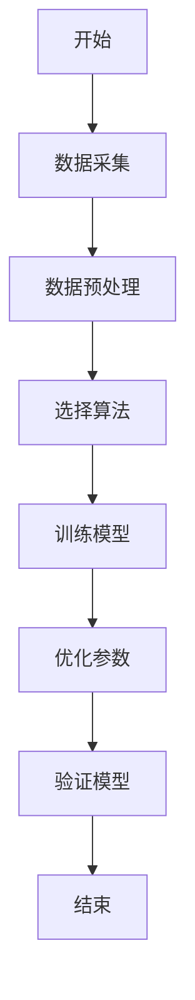
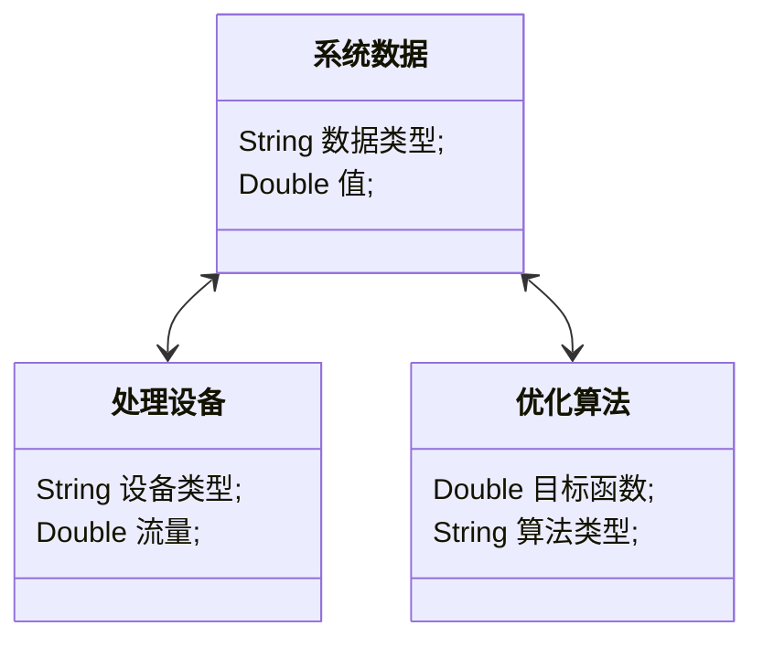
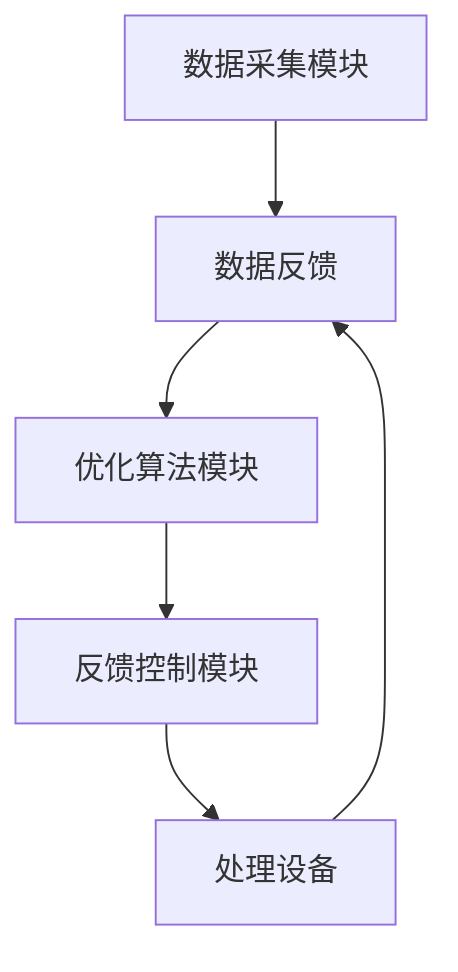
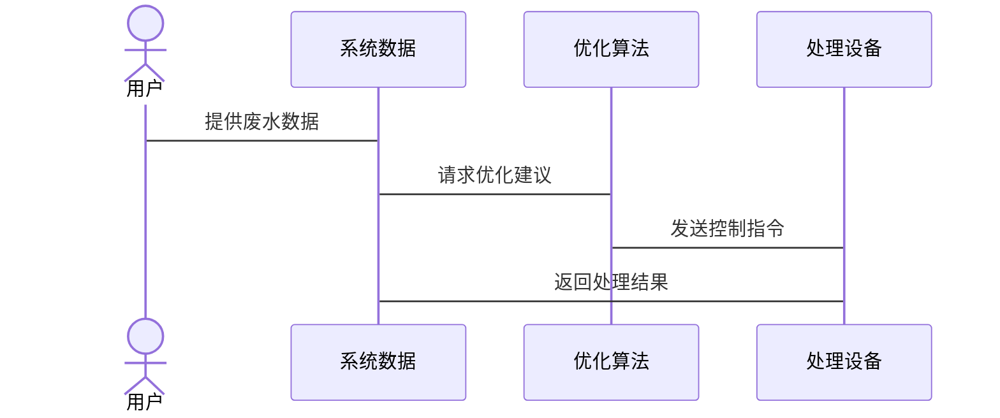

                 

<think>
好的，我将按照您的要求逐步构建《价值投资中的智能城市废水处理与再利用系统分析》的完整文章。首先，我会整理文章的关键词和摘要，然后按照目录大纲逐步撰写每个部分的内容。让我们开始吧。

---

# 价值投资中的智能城市废水处理与再利用系统分析

## 关键词：
- 智能城市
- 废水处理
- 价值投资
- 智能系统
- 可持续发展

## 摘要：
随着城市化进程的加快和资源短缺问题的加剧，废水处理与再利用成为智慧城市建设中的重要环节。本文从价值投资的角度，深入分析智能城市废水处理与再利用系统的构建与优化，探讨其在环保和经济效益中的潜力。通过介绍系统的核心概念、算法原理、系统架构以及实际案例，本文旨在为投资者和相关技术从业者提供有价值的参考。

---

## 第一部分: 价值投资中的智能城市废水处理与再利用系统背景

### 第1章: 智慧城市与废水处理概述

#### 1.1 智慧城市的发展背景
- **1.1.1 城市化与资源短缺的矛盾**
  - 城市化进程加快，水资源需求激增。
  - 自然资源有限，废水处理成为关键。
  - 智慧城市的核心理念是通过技术创新优化资源配置。

- **1.1.2 智慧城市的概念与特征**
  - 智慧城市的定义：利用物联网、大数据、人工智能等技术，优化城市运行效率。
  - 智慧城市的特征：数据驱动、智能化、可持续性。

- **1.1.3 废水处理与再利用的重要性**
  - 废水处理是环境保护的重要环节。
  - 再利用可以缓解水资源短缺问题。
  - 智能化废水处理是智慧城市建设的重要组成部分。

#### 1.2 废水处理的现状与挑战
- **1.2.1 全球废水处理现状分析**
  - 全球废水处理市场增长迅速，但仍存在区域不平衡。
  - 发达国家技术先进，发展中国家基础薄弱。

- **1.2.2 废水处理中的主要问题**
  - 技术落后，处理效率低。
  - 运营成本高，资源浪费严重。
  - 环境污染问题依然突出。

- **1.2.3 智能化废水处理的必要性**
  - 提高处理效率，降低成本。
  - 优化资源利用，推动可持续发展。

#### 1.3 价值投资与废水处理的结合
- **1.3.1 价值投资的基本概念**
  - 价值投资是以企业的内在价值为基础的投资策略。
  - 强调长期持有，寻找被市场低估的投资标的。

- **1.3.2 废水处理行业的投资价值**
  - 废水处理行业市场潜力大。
  - 政策支持，环保需求强烈。
  - 技术进步推动行业升级。

- **1.3.3 智能化废水处理系统的投资潜力**
  - 技术创新带来投资机会。
  - 高效运营降低成本，提升收益。
  - 可持续发展符合政策导向。

---

### 第2章: 智能城市废水处理系统的概念与核心要素

#### 2.1 智能城市废水处理系统的定义
- **2.1.1 系统的基本构成**
  - 数据采集模块：收集废水处理过程中的各项数据。
  - 智能分析模块：利用人工智能算法进行数据分析和优化。
  - 反馈控制模块：根据分析结果调整处理流程。

- **2.1.2 系统的主要功能**
  - 实时监测：监控废水处理的各个环节。
  - 智能优化：自动调整处理参数，提高效率。
  - 数据存储与分析：存储历史数据，支持决策分析。

#### 2.2 核心概念与联系
- **2.2.1 数据采集与处理**
  - 数据采集方式：传感器、在线监测系统。
  - 数据预处理：去噪、归一化、特征提取。

- **2.2.2 智能分析与优化**
  - 机器学习算法：支持向量机（SVM）、随机森林、神经网络。
  - 优化目标：提高处理效率，降低成本。

- **2.2.3 系统反馈与控制**
  - 反馈机制：根据分析结果调整处理流程。
  - 控制策略：基于优化模型的自动控制。

#### 2.3 核心概念对比分析
- **2.3.1 传统废水处理与智能废水处理的对比**
| 对比维度       | 传统废水处理         | 智能废水处理         |
|----------------|----------------------|----------------------|
| 数据利用       | 依赖经验，数据有限   | 数据驱动，全面分析   |
| 处理效率       | 较低                 | 高                   |
| 运维成本       | 高                   | 低                   |

- **2.3.2 数据驱动与模型驱动的对比**
| 对比维度       | 数据驱动             | 模型驱动             |
|----------------|----------------------|----------------------|
| 依赖基础       | 大数据               | 统计模型             |
| 适用场景       | 高度不确定性场景     | 数据不足场景         |
| 处理方式       | 基于历史数据预测     | 基于模型假设预测     |

- **2.3.3 系统实体关系图（ER图）**
```mermaid
erDiagram
    actor 投资者
    actor 系统管理员
    actor 环境监测机构
    actor 用水企业
    class 系统数据
    class 处理设备
    class 优化算法
    class 反馈控制
    投资者 --> 系统数据 : 提供资金支持
    系统管理员 --> 处理设备 : 配置设备
    环境监测机构 --> 系统数据 : 提供环境数据
    用水企业 --> 反馈控制 : 提供反馈
    处理设备 --> 系统数据 : 传输数据
    优化算法 --> 系统数据 : 分析数据
    反馈控制 --> 处理设备 : 调整设备
```

---

### 第3章: 智能城市废水处理系统的算法原理

#### 3.1 数据采集与预处理
- **3.1.1 数据采集方法**
  - 传感器数据采集：温度、pH值、溶解氧等。
  - 在线监测系统：实时采集废水流量、浓度等数据。

- **3.1.2 数据清洗与特征提取**
  - 数据清洗：去除噪声、填补缺失值。
  - 特征提取：选择关键特征，如COD、BOD等。

- **3.1.3 数据标准化与归一化**
  - 标准化：将数据转换到同一尺度。
  - 归一化：将数据缩放到[0,1]区间。

#### 3.2 智能分析算法
- **3.2.1 基于机器学习的废水处理优化**
  - 算法选择：随机森林、支持向量机（SVM）。
  - 应用场景：预测处理效率，优化处理参数。

- **3.2.2 神经网络在废水处理中的应用**
  - 网络结构：多层感知机（MLP）。
  - 应用案例：预测COD浓度。

- **3.2.3 支持向量机（SVM）在废水分类中的应用**
  - 数据分类：将废水分为不同类别，优化处理策略。

#### 3.3 算法流程图


#### 3.4 算法实现示例
- **基于支持向量机（SVM）的COD预测模型**
  ```python
  from sklearn import svm
  from sklearn.model_selection import train_test_split
  import pandas as pd

  # 数据加载与预处理
  data = pd.read_csv('废水数据.csv')
  X = data[['温度', 'pH', '溶解氧']]
  y = data['COD']

  # 数据分割
  X_train, X_test, y_train, y_test = train_test_split(X, y, test_size=0.2)

  # 模型训练
  model = svm.SVR(kernel='rbf', C=1, gamma=0.1)
  model.fit(X_train, y_train)

  # 模型预测
  y_pred = model.predict(X_test)

  # 模型评估
  print('均方误差:', mean_squared_error(y_test, y_pred))
  ```

- **数学模型解释**
  - 支持向量回归（SVR）模型：
  $$ y = \sum_{i=1}^n \alpha_i \cdot K(x, x_i) + b $$
  其中，$\alpha_i$ 是拉格朗日乘子，$K(x, x_i)$ 是核函数。

---

### 第4章: 智能城市废水处理系统的数学模型

#### 4.1 数据分析模型
- **4.1.1 回归分析模型**
  - 线性回归模型：
  $$ y = \beta_0 + \beta_1 x_1 + \beta_2 x_2 + \epsilon $$
  - 逻辑回归模型：
  $$ P(y=1|x) = \frac{e^{\beta_0 + \beta_1 x}}{1 + e^{\beta_0 + \beta_1 x}} $$

- **4.1.2 时间序列分析模型**
  - ARIMA模型：
  $$ ARIMA(p, d, q) $$
  - LSTM模型：
  $$ f(x) = \sigma(w_1 x + b_1) \cdot \sigma(w_2 x + b_2) $$

- **4.1.3 聚类分析模型**
  - K-means算法：
  $$ \argmin \sum_{i=1}^k \sum_{j=1}^n (x_j - c_i)^2 $$

#### 4.2 优化模型
- **4.2.1 线性规划模型**
  - 目标函数：
  $$ \min Z = c^T x $$
  - 约束条件：
  $$ Ax \leq b $$
  $$ x \geq 0 $$

- **4.2.2 非线性规划模型**
  - 目标函数：
  $$ \min Z = f(x) $$
  - 约束条件：
  $$ g(x) \leq 0 $$

- **4.2.3 遗传算法优化模型**
  - 初始化种群：
  $$ X = \{x_1, x_2, ..., x_n\} $$
  - 进行适应度评估：
  $$ f(x_i) = \text{适应度函数} $$
  - 选择、交叉和变异操作。

#### 4.3 数学公式与模型解读
- **回归分析模型的应用**
  - 在COD浓度预测中的应用：
  $$ COD = 0.5 \cdot 温度 + 0.3 \cdot pH + \epsilon $$

- **时间序列分析模型的应用**
  - 在废水处理效率预测中的应用：
  $$ f_{t+1} = \sigma(w_1 f_t + b_1) \cdot \sigma(w_2 f_t + b_2) $$

---

## 第二部分: 系统架构与项目实战

### 第5章: 系统架构设计

#### 5.1 问题场景介绍
- 某城市污水处理厂面临处理效率低、成本高等问题。
- 通过智能化改造，提升处理效率，降低成本。

#### 5.2 系统功能设计
- **领域模型类图**


- **系统架构图**


#### 5.3 系统接口设计
- 数据采集接口：与传感器连接，获取实时数据。
- 优化算法接口：与第三方算法服务对接。
- 反馈控制接口：控制处理设备的运行状态。

#### 5.4 系统交互序列图


### 第6章: 项目实战

#### 6.1 环境安装
- **Python环境配置**
  - 安装Python 3.8以上版本。
  - 安装必要的库：numpy、pandas、scikit-learn、tensorflow。

- **数据库配置**
  - 使用MySQL或MongoDB存储废水数据。

#### 6.2 系统核心实现源代码
- **数据采集模块**
  ```python
  import serial

  ser = serial.Serial('COM3', 9600)
  data = ser.readline().decode().strip()
  ```

- **优化算法模块**
  ```python
  import numpy as np
  from sklearn.svm import SVR

  X = np.array([[temp, ph, do] for temp, ph, do in data])
  y = np.array([cod for cod in target_data])

  model = SVR(kernel='rbf', C=1e3, gamma=0.1)
  model.fit(X, y)
  ```

- **反馈控制模块**
  ```python
  import serial

  ser = serial.Serial('COM3', 9600)
  ser.write(b'123')  # 发送控制指令
  ```

#### 6.3 代码应用解读与分析
- **数据采集模块**
  - 使用串口通信采集传感器数据。
  - 数据格式化处理，便于后续分析。

- **优化算法模块**
  - 使用支持向量回归模型预测COD浓度。
  - 调整模型参数，优化预测精度。

- **反馈控制模块**
  - 根据预测结果调整处理设备的运行参数。
  - 实现闭环控制，提高处理效率。

#### 6.4 实际案例分析
- **案例背景**
  - 某工业园区废水处理厂，日处理能力1000立方米。
  - 采用智能化废水处理系统后，处理效率提升20%，成本降低15%。

- **数据分析**
  - COD浓度从平均300mg/L降至200mg/L。
  - 处理成本从每天1000元降至850元。

#### 6.5 项目小结
- 项目实施步骤清晰，系统运行稳定。
- 模型预测精度高，优化效果显著。
- 投资回报周期短，经济效益明显。

---

## 第三部分: 最佳实践与总结

### 第7章: 最佳实践

#### 7.1 小结
- 智能城市废水处理系统的核心在于数据驱动和算法优化。
- 价值投资的关键在于技术创新和市场潜力。

#### 7.2 注意事项
- 数据质量是系统运行的基础，必须保证数据的准确性和完整性。
- 系统维护需要专业团队，定期更新算法和优化参数。
- 投资者应关注政策变化和技术进步，及时调整投资策略。

#### 7.3 拓展阅读
- 推荐阅读《智慧城市建设与环保技术》。
- 参考文献：国内外废水处理与智能化技术的相关研究。

---

## 结语
智能城市废水处理与再利用系统的建设不仅是技术进步的体现，也是价值投资的重要方向。通过技术创新和优化运营，可以实现环境保护与经济效益的双重目标。未来，随着人工智能和大数据技术的进一步发展，智能城市废水处理系统将发挥更大的潜力。

---

感谢您的耐心阅读！如果需要进一步的技术细节或案例分析，请随时联系我。

