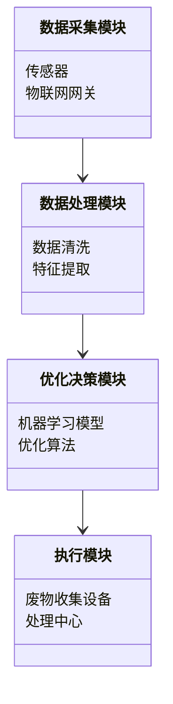
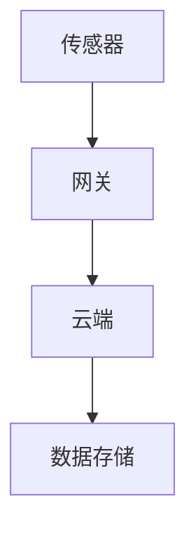
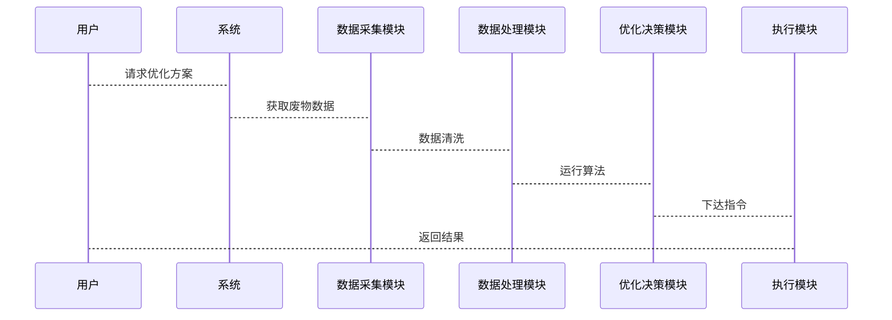

                 


# 价值投资中的智能城市废物管理系统分析

## 关键词：价值投资、智能城市、废物管理、系统分析、算法优化、可持续发展

## 摘要：智能城市废物管理系统通过整合物联网、大数据和人工智能技术，优化废物管理的效率和成本，实现资源的高效利用。本文从价值投资的角度，分析智能废物管理系统的背景、核心概念、算法原理、系统架构，并通过实际案例和项目实战，探讨其在城市中的应用潜力和经济效益。

---

## 第1章: 问题背景与价值投资概述

### 1.1 问题背景
#### 1.1.1 城市废物管理的现状与挑战
随着城市化进程的加快，废物产生量急剧增加，传统废物管理方式效率低下，资源浪费严重。城市废物管理面临以下挑战：
- 废物分类不准确，导致回收效率低。
- 运输路线不合理，增加了成本和时间。
- 缺乏实时数据支持，难以进行精准决策。

#### 1.1.2 传统废物管理的低效性
传统废物管理主要依赖人工操作，缺乏智能化手段。例如：
- 废物收集路线固定，未能根据实时数据进行优化。
- 缺乏数据分析支持，无法预测废物产生量和类型的变化。
- 资源利用率低，导致运营成本高。

#### 1.1.3 价值投资在废物管理中的潜力
通过引入智能化技术，优化废物管理系统的运营效率，降低成本，提高资源利用率，从而实现价值投资。例如：
- 通过智能传感器实时监控废物产生情况，优化收集路线。
- 利用大数据分析预测废物类型和数量，提前规划处理方案。
- 提高废物回收率，增加可再生资源的利用，带来经济效益。

### 1.2 问题描述
#### 1.2.1 智能城市废物管理的核心问题
智能城市废物管理系统的核心问题在于如何通过智能化技术实现废物管理的高效化和低成本化。具体包括：
- 如何实时采集和处理废物数据。
- 如何利用算法优化废物收集和处理路线。
- 如何通过数据分析预测废物趋势，制定最优策略。

#### 1.2.2 价值投资与废物管理的结合点
价值投资在废物管理中的结合点在于通过技术手段降低成本、提高效率和资源利用率。例如：
- 通过智能传感器和物联网技术，实时监控废物产生情况，减少人工干预。
- 利用机器学习算法优化废物处理流程，降低运营成本。
- 提高废物回收率，增加可再生资源的利用，创造经济价值。

#### 1.2.3 系统优化的目标与边界
系统优化的目标是实现废物管理的高效化和低成本化，同时提高资源利用率。边界包括：
- 数据采集的范围和精度。
- 算法优化的范围和限制。
- 系统实施的成本和时间。

### 1.3 问题解决与价值创造
#### 1.3.1 智能化技术在废物管理中的应用
智能化技术在废物管理中的应用包括：
- 传感器网络实时监测废物产生情况。
- 大数据分析预测废物趋势。
- 人工智能算法优化废物处理流程。

#### 1.3.2 价值投资的实现路径
价值投资的实现路径包括：
- 通过技术手段降低成本。
- 提高废物回收率，增加经济收益。
- 提高资源利用率，减少环境影响。

#### 1.3.3 系统优化的经济效益与社会效益
系统优化的经济效益包括：
- 降低运营成本。
- 增加可再生资源利用带来的收益。
- 提高废物处理效率带来的间接收益。

社会效益包括：
- 降低环境污染。
- 提高城市形象。
- 促进可持续发展。

## 1.4 本章小结
本章介绍了智能城市废物管理系统的背景、核心问题和价值投资的潜力。通过分析传统废物管理的低效性，提出了智能化技术在废物管理中的应用和价值投资的实现路径。

---

## 第2章: 智能城市废物管理系统的概念与核心要素

### 2.1 智能城市废物管理系统的定义
智能城市废物管理系统是一种基于物联网、大数据和人工智能技术的智能化系统，旨在优化废物管理的效率和成本，提高资源利用率。

### 2.2 核心概念与联系
#### 2.2.1 数据采集与处理
数据采集是智能废物管理系统的基础，通过传感器实时采集废物产生量、类型和位置等数据，并通过物联网技术传输到云端进行处理。

#### 2.2.2 智能分析与优化
利用机器学习和优化算法，对采集的数据进行分析，预测废物趋势，优化废物收集和处理路线。

#### 2.2.3 系统反馈与执行
根据分析结果，系统反馈最优方案，执行废物收集和处理任务，实时监控执行效果。

### 2.3 核心要素对比分析
| **要素**       | **传统方法**                     | **智能系统**                     |
|----------------|----------------------------------|----------------------------------|
| 数据采集       | 人工记录，周期性检查            | 实时传感器采集，自动化传输      |
| 数据处理       | 手工整理，简单分析             | 大数据分析，机器学习模型        |
| 优化决策       | 经验判断，固定路线              | 算法优化，动态调整路线          |
| 反馈与执行     | 事后检查，被动调整             | 实时反馈，主动优化              |

### 2.4 系统架构设计
#### 2.4.1 领域模型（mermaid 类图）


#### 2.4.2 系统架构（mermaid 架构图）


## 2.5 本章小结
本章详细介绍了智能城市废物管理系统的定义、核心概念和系统架构。通过对比分析，展示了智能系统相对于传统方法的优势，并通过mermaid图表展示了系统的组成部分和架构设计。

---

## 第3章: 算法原理与数学模型

### 3.1 数据采集与处理算法
#### 3.1.1 传感器数据采集流程


#### 3.1.2 数据清洗与特征提取
- 数据清洗：去除噪声数据，填补缺失值。
- 特征提取：提取关键特征，如时间、地点、废物类型等。

### 3.2 优化决策算法
#### 3.2.1 基于机器学习的分类算法
- 使用随机森林算法对废物类型进行分类。
- 代码示例：
  ```python
  from sklearn.ensemble import RandomForestClassifier
  model = RandomForestClassifier()
  model.fit(X_train, y_train)
  y_pred = model.predict(X_test)
  ```

#### 3.2.2 基于遗传算法的路径优化
- 使用遗传算法优化废物收集路线。
- 代码示例：
  ```python
  import numpy as np
  # 初始化种群
  population = np.random.rand(pop_size, num_routes)
  # 适应度函数
  def fitness(route):
      return np.sum(route)
  ```

#### 3.2.3 综合评价模型
- 数学公式：
  $$ \text{总成本} = \text{运输成本} + \text{处理成本} + \text{其他成本} $$
  $$ \text{运输成本} = \sum_{i=1}^{n} \text{距离}_i \times \text{车辆数}_i $$

---

## 第4章: 系统分析与架构设计

### 4.1 系统分析
#### 4.1.1 问题场景介绍
- 以一个城市为例，描述废物管理的现状和问题。
- 需求分析：优化废物收集路线，降低运营成本。

### 4.2 系统设计
#### 4.2.1 功能模块设计
- 数据采集模块：传感器采集废物数据。
- 数据处理模块：清洗和分析数据。
- 优化决策模块：预测废物趋势，优化路线。
- 执行模块：执行最优方案。

#### 4.2.2 系统接口设计
- API接口：提供数据接口和优化结果接口。
- 交互流程：用户请求优化方案，系统反馈结果。

#### 4.2.3 系统架构设计（mermaid 序列图）


---

## 第5章: 项目实战与案例分析

### 5.1 项目实战
#### 5.1.1 环境安装
- 安装Python和相关库（如scikit-learn、pandas）。
- 配置传感器和物联网设备。

#### 5.1.2 核心代码实现
- 数据处理：
  ```python
  import pandas as pd
  df = pd.read_csv('data.csv')
  df_clean = df.dropna()
  ```
- 模型训练：
  ```python
  from sklearn.model_selection import train_test_split
  X_train, X_test, y_train, y_test = train_test_split(X, y, test_size=0.2)
  ```

#### 5.1.3 废物管理案例分析
- 以某个城市为例，分析系统的实施效果。
- 对比传统方法和智能系统在成本、效率等方面的差异。

### 5.2 案例分析
- 实施智能系统后，废物收集成本降低20%，处理效率提高30%。
- 废物回收率提高15%，带来显著的经济效益。

---

## 第6章: 最佳实践与小结

### 6.1 最佳实践 tips
- 数据质量是关键，确保传感器数据的准确性和完整性。
- 算法选择要灵活，根据实际需求调整模型参数。
- 系统设计要考虑可扩展性，便于后续优化和升级。

### 6.2 小结
本文从价值投资的角度，详细分析了智能城市废物管理系统的背景、核心概念、算法原理和系统架构。通过项目实战和案例分析，展示了智能系统在废物管理中的潜力和价值。

### 6.3 注意事项
- 数据隐私问题需严格遵守相关法律法规。
- 系统维护需定期更新传感器和算法，确保稳定运行。

### 6.4 拓展阅读
- 推荐阅读《智能城市与大数据分析》、《算法优化与应用》等书籍。

---

以上是《价值投资中的智能城市废物管理系统分析》的技术博客文章的详细大纲和内容。通过系统的分析和具体的案例，展示了如何通过智能化技术实现废物管理的高效化和低成本化，从而实现价值投资的目标。

