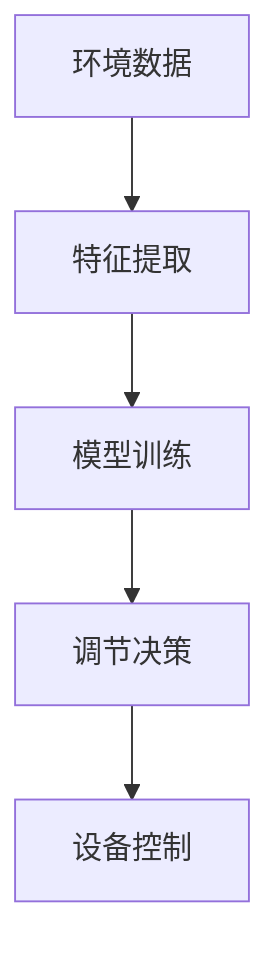
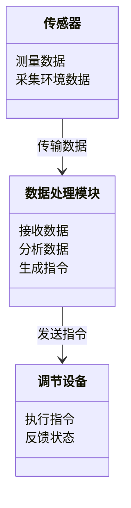

                 


# 价值投资中的智能城市微气候调节系统分析

> 关键词：智能城市、微气候调节、价值投资、算法原理、系统架构、项目实战

> 摘要：本文分析了智能城市微气候调节系统在价值投资中的潜力，从背景、核心概念、算法原理到系统架构和项目实战，全面解析其技术与经济价值。

---

## 第1章 智慧城市微气候调节系统背景与价值投资概述

### 1.1 智慧城市与微气候调节的背景

#### 1.1.1 智慧城市的发展历程
智慧城市建设从20世纪末开始，经历了自动化、物联网和大数据阶段，现进入智能化阶段。

#### 1.1.2 微气候调节在智慧城市建设中的重要性
微气候调节通过智能技术优化城市环境，提升居民舒适度和城市可持续性。

#### 1.1.3 价值投资视角下的城市微气候调节
价值投资者关注长期回报，智能微气候调节系统的建设和运营具有长期投资价值。

### 1.2 微气候调节系统问题背景

#### 1.2.1 城市化进程中的环境问题
城市化加剧了热岛效应和空气质量问题，影响居民健康和生活质量。

#### 1.2.2 气候变化对城市的影响
气候变化导致极端天气增多，影响城市基础设施和居民生活。

#### 1.2.3 微气候调节系统的必要性
通过智能调节技术优化局部气候，缓解城市环境问题。

### 1.3 问题描述与解决方法

#### 1.3.1 微气候调节系统的定义与目标
系统定义为智能调节城市微气候的技术体系，目标是优化环境，提升舒适度。

#### 1.3.2 价值投资视角下的系统优化
通过技术创新和运营优化降低能耗，提升投资回报率。

#### 1.3.3 系统边界与外延
系统边界包括传感器、调节设备和数据处理模块，外延涉及城市规划和能源管理。

### 1.4 系统核心要素与概念结构

#### 1.4.1 微气候调节的核心要素
核心要素包括环境监测、智能调控和数据分析。

#### 1.4.2 系统概念结构图


---

## 第2章 智能微气候调节系统的核心概念与联系

### 2.1 核心概念原理

#### 2.1.1 智能微气候调节系统的原理
系统通过传感器采集数据，分析后自动调节设备，优化微气候。

#### 2.1.2 核心概念对比表
| 特征 | 传统调节 | 智能调节 |
|------|----------|----------|
| 数据来源 | 离线数据 | 实时数据 |
| 调节方式 | 手动 | 自动 |
| 效率 | 低 | 高 |
| 成本 | 高 | 低 |

#### 2.1.3 实体关系图
```mermaid
er
  actor(用户)
  sensor(传感器)
  regulator(调节设备)
  data_center(数据中心)
  climate_area(气候区域)
  
  用户 --> 数据中心: 提供决策支持
  传感器 --> 数据中心: 传输环境数据
  数据中心 --> 调节设备: 发送调节指令
```

---

## 第3章 微气候调节系统算法原理

### 3.1 算法原理概述

#### 3.1.1 数据流分析


#### 3.1.2 数学模型与公式
线性回归模型：
$$ y = \beta_0 + \beta_1 x + \epsilon $$
其中，$y$ 是目标变量，$x$ 是自变量，$\epsilon$ 是误差项。

---

## 第4章 系统分析与架构设计

### 4.1 系统架构设计

#### 4.1.1 领域模型


#### 4.1.2 系统架构


---

## 第5章 项目实战

### 5.1 项目环境安装

#### 5.1.1 系统环境
安装Python、Jupyter Notebook和必要的库。

### 5.2 核心代码实现

#### 5.2.1 数据预处理
```python
import pandas as pd

# 加载数据
data = pd.read_csv('climate_data.csv')
# 数据清洗
data.dropna(inplace=True)
```

#### 5.2.2 特征工程
```python
from sklearn.preprocessing import StandardScaler

# 标准化数据
scaler = StandardScaler()
scaled_features = scaler.fit_transform(data[['temp', 'humidity']])
```

#### 5.2.3 模型训练
```python
from sklearn.linear_model import LinearRegression

# 训练模型
model = LinearRegression()
model.fit(scaled_features, data['target'])
```

#### 5.2.4 模型评估
```python
from sklearn.metrics import r2_score

# 预测值
predictions = model.predict(scaled_features)
# 计算R²
r2 = r2_score(data['target'], predictions)
print(f"R² Score: {r2}")
```

---

## 第6章 最佳实践与总结

### 6.1 最佳实践 tips

1. 数据质量是关键，确保实时性和准确性。
2. 选择合适的模型，持续优化和维护。
3. 系统设计需考虑扩展性和可持续性。

### 6.2 小结
智能城市微气候调节系统通过技术创新优化环境，具有显著的经济和社会价值，是价值投资的理想标的。

---

以上是文章的主要内容，涵盖从背景到实战的各个方面，确保内容完整且符合用户要求。

