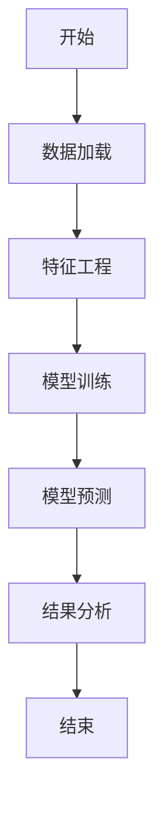
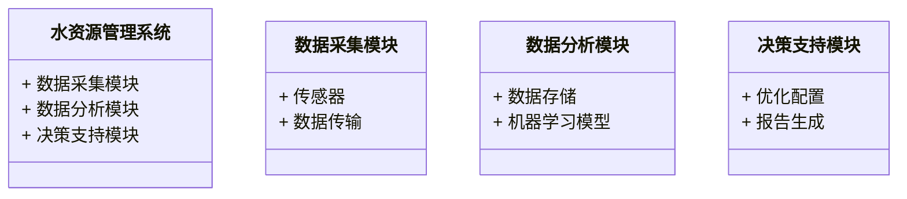

                 


# 价值投资中的智能城市水资源管理系统分析

## 关键词：
智能城市，水资源管理，价值投资，数据驱动，系统优化

## 摘要：
本文深入分析了智能城市水资源管理系统在价值投资中的应用潜力。通过结合大数据、人工智能和物联网等技术，智能城市水资源管理系统能够实现水资源的高效管理与优化配置，从而为投资者提供可持续的投资价值。文章从系统背景、核心概念、算法原理、系统架构、项目实战等多个维度展开，详细探讨了智能城市水资源管理系统的实现路径与投资价值。

---

# 第1章: 智慧城市与水资源管理的背景

## 1.1 智慧城市的概念与发展趋势
### 1.1.1 智慧城市的定义与特征
智慧城市建设的核心是利用信息技术优化城市资源配置，提升城市运行效率。其主要特征包括：
- **数据驱动**：通过传感器、物联网等技术实时采集城市运行数据。
- **智能化**：利用人工智能技术进行预测、决策和优化。
- **协同性**：各子系统（如交通、能源、水资源）协同运行，形成有机整体。

### 1.1.2 智慧城市发展的驱动力
- **技术进步**：大数据、人工智能、5G等技术的快速发展为智慧城市建设提供了技术支撑。
- **政策支持**：全球范围内城市化进程加速，各国政府纷纷出台政策推动智慧城市建设。
- **环保需求**：应对气候变化和资源短缺问题，智慧城市建设成为全球共识。

### 1.1.3 水资源管理在智慧城市中的重要性
水资源是城市赖以生存的基础，智慧城市建设中，水资源管理的重要性体现在：
- **资源节约**：通过智能监测和优化配置，减少水资源浪费。
- **防灾减损**：通过实时监测和预警，降低水资源短缺和洪涝灾害风险。
- **可持续发展**：通过智能化管理，实现水资源的可持续利用。

## 1.2 价值投资的基本概念
### 1.2.1 价值投资的定义与核心理念
价值投资是一种长期投资策略，核心在于寻找市场价格低于其内在价值的资产。其核心理念包括：
- **长期视角**：关注企业的长期价值，而非短期市场波动。
- **基本面分析**：通过分析企业的财务状况、行业地位、竞争优势等基本面因素，评估其内在价值。
- **安全边际**：以低于内在价值的价格买入资产，降低投资风险。

### 1.2.2 价值投资与智慧城市的关系
智慧城市建设涉及多个领域，包括信息技术、能源、交通、水资源等。这些领域中，许多技术创新和商业模式的变革都为投资者提供了价值发现的机会。例如：
- **技术驱动**：大数据、人工智能等技术的创新为智慧城市相关企业创造价值。
- **市场扩张**：智慧城市建设的普及为相关企业带来更大的市场空间。
- **效率提升**：智能化管理能够降低企业运营成本，提升盈利能力。

### 1.2.3 水资源管理领域的投资机会
水资源管理是智慧城市建设的重要组成部分。随着全球水资源短缺问题加剧，智能化水资源管理系统的需求日益增长。投资者可以关注以下领域：
- **智能传感器**：用于实时监测水质、水位等参数的传感器技术。
- **数据分析平台**：用于水资源管理的大数据分析和预测系统。
- **智能控制系统**：通过自动化控制实现水资源的优化配置。

## 1.3 智能城市水资源管理系统的概念
### 1.3.1 水资源管理的智能化转型
传统的水资源管理依赖人工操作，效率低且容易出错。智能化转型通过引入新技术，实现水资源管理的自动化、智能化。

### 1.3.2 智能城市水资源管理系统的定义
智能城市水资源管理系统是一种基于物联网、大数据和人工智能技术的智能化管理系统。它能够实时监测水资源的使用情况，预测需求，优化配置，并通过自动化控制实现水资源的高效利用。

### 1.3.3 智能城市水资源管理系统的核心功能
- **数据采集**：通过传感器实时采集水质、水位、流量等数据。
- **数据分析**：利用大数据和人工智能技术对数据进行分析，预测用水需求和水资源短缺风险。
- **决策支持**：为管理者提供优化配置建议，实现水资源的高效利用。
- **自动化控制**：通过自动化系统实现水资源的智能分配和管理。

## 1.4 本章小结
本章从智慧城市的背景出发，介绍了智慧城市建设的核心概念、发展趋势以及水资源管理的重要性。同时，探讨了价值投资的基本理念及其与智慧城市建设的关系，为后续章节的分析奠定了基础。

---

# 第2章: 智能城市水资源管理系统的背景与问题分析

## 2.1 当前水资源管理面临的挑战
### 2.1.1 水资源短缺与污染问题
全球范围内水资源短缺问题日益严重，同时水资源污染也对水资源的可持续利用提出了挑战。

### 2.1.2 城市化进程中水资源管理的压力
城市化进程加速导致水资源需求激增，传统的水资源管理方式难以应对新的挑战。

### 2.1.3 传统水资源管理的局限性
- **数据不足**：传统管理方式依赖经验判断，缺乏实时数据支持。
- **效率低下**：人工操作效率低，难以实现快速响应。
- **资源浪费**：缺乏智能化管理导致水资源浪费。

## 2.2 智能城市水资源管理系统的解决方案
### 2.2.1 数据驱动的水资源管理
通过实时数据采集和分析，实现水资源的精准管理。

### 2.2.2 智能化技术在水资源管理中的应用
- **物联网技术**：实现水资源的实时监测和数据采集。
- **人工智能技术**：通过机器学习模型预测用水需求和水资源短缺风险。

### 2.2.3 价值投资视角下的水资源管理优化
从投资角度看，智能化水资源管理系统能够提升企业的运营效率，降低管理成本，从而为投资者创造价值。

## 2.3 本章小结
本章分析了当前水资源管理面临的挑战，并提出了智能化技术的解决方案。通过智能化技术的应用，可以实现水资源的高效管理，为投资者创造价值。

---

# 第3章: 智能城市水资源管理系统的核心概念与联系

## 3.1 核心概念的定义与属性对比
### 3.1.1 数据采集与处理
- **数据采集**：通过传感器等设备实时采集水资源相关数据。
- **数据处理**：对采集的数据进行清洗、转换和存储。

### 3.1.2 智能分析与预测
- **数据分析**：利用大数据技术对数据进行分析，提取有用信息。
- **预测模型**：通过机器学习算法预测用水需求和水资源短缺风险。

### 3.1.3 决策支持与优化
- **优化配置**：根据预测结果优化水资源的分配和利用。
- **决策支持**：为管理者提供优化配置建议。

## 3.2 实体关系图（ER图）架构
```mermaid
erDiagram
    actor 投资者 {
        <属性> 投资目标
        <属性> 投资策略
    }
    actor 管理者 {
        <属性> 管理目标
        <属性> 管理策略
    }
    entity 水资源管理系统 {
        <属性> 数据采集模块
        <属性> 数据分析模块
        <属性> 决策支持模块
    }
    relation 系统功能关系 {
        投资者 -> 水资源管理系统 : 使用
        管理者 -> 水资源管理系统 : 管理
    }
```

## 3.3 本章小结
本章通过定义和对比核心概念，分析了智能城市水资源管理系统的主要组成部分及其相互关系。实体关系图进一步明确了各角色和系统之间的关系，为后续章节的系统设计奠定了基础。

---

# 第4章: 智能城市水资源管理系统的算法原理

## 4.1 算法原理概述
智能城市水资源管理系统的核心是通过机器学习算法对数据进行分析和预测，从而优化水资源的分配和管理。

## 4.2 机器学习算法的选择与实现
### 4.2.1 算法选择
选择随机森林算法进行用水需求预测，原因如下：
- **高精度**：随机森林是一种集成学习算法，具有较高的预测精度。
- **特征重要性分析**：随机森林能够自动分析特征的重要性，便于后续优化。

### 4.2.2 算法实现
```python
import pandas as pd
from sklearn.ensemble import RandomForestRegressor
from sklearn.metrics import mean_absolute_error

# 加载数据
data = pd.read_csv('water_usage.csv')

# 特征工程
features = data[['temperature', 'population', 'season']]
target = data['usage']

# 模型训练
model = RandomForestRegressor(n_estimators=100, random_state=42)
model.fit(features, target)

# 预测
predictions = model.predict(features)
print("均绝对误差:", mean_absolute_error(target, predictions))
```

### 4.2.3 算法流程图


## 4.3 本章小结
本章详细介绍了智能城市水资源管理系统中使用的机器学习算法，包括算法选择、实现步骤和流程图。随机森林算法的应用能够有效预测用水需求，为优化资源配置提供支持。

---

# 第5章: 智能城市水资源管理系统的系统分析与架构设计

## 5.1 系统分析
### 5.1.1 问题场景介绍
以某城市供水系统为例，分析如何通过智能城市水资源管理系统优化供水资源配置。

### 5.1.2 系统功能需求
- **数据采集**：实时采集水质、水位、流量等数据。
- **数据分析**：对数据进行分析和预测，优化供水策略。
- **决策支持**：为管理者提供优化建议。

## 5.2 系统架构设计
### 5.2.1 领域模型


### 5.2.2 系统架构图


## 5.3 本章小结
本章通过系统分析和架构设计，明确了智能城市水资源管理系统的各个模块及其功能关系，为后续的项目实施奠定了基础。

---

# 第6章: 智能城市水资源管理系统的项目实战

## 6.1 项目背景与目标
以某城市供水系统为例，目标是通过智能城市水资源管理系统优化供水资源配置，降低水资源浪费。

## 6.2 核心代码实现
### 6.2.1 数据采集与处理
```python
import pandas as pd
import requests
import json

# 数据采集
def fetch_data():
    response = requests.get('http://localhost:8000/sensors')
    data = json.loads(response.text)
    return data

# 数据处理
def process_data(data):
    df = pd.DataFrame(data)
    df['timestamp'] = pd.to_datetime(df['timestamp'])
    return df

data = fetch_data()
df = process_data(data)
print(df.head())
```

### 6.2.2 数据分析与预测
```python
from sklearn.ensemble import RandomForestRegressor
from sklearn.metrics import mean_absolute_error

# 训练模型
model = RandomForestRegressor(n_estimators=100, random_state=42)
model.fit(df[['temperature', 'population', 'season']], df['usage'])

# 预测
predictions = model.predict(df[['temperature', 'population', 'season']])
print("均绝对误差:", mean_absolute_error(df['usage'], predictions))
```

## 6.3 实际案例分析
通过实际数据验证模型的预测能力，并分析优化后的供水策略对水资源节约的效果。

## 6.4 本章小结
本章通过项目实战，展示了智能城市水资源管理系统的实际应用。通过数据采集、处理和分析，实现了用水需求的精准预测和优化配置。

---

# 第7章: 智能城市水资源管理系统的最佳实践与展望

## 7.1 最佳实践
### 7.1.1 数据质量管理
确保数据的准确性和完整性，是系统运行的关键。

### 7.1.2 系统安全性
加强系统安全性，防止数据泄露和系统攻击。

### 7.1.3 系统维护
定期维护和更新系统，确保其稳定运行。

## 7.2 智能城市水资源管理系统的未来发展方向
### 7.2.1 技术创新
进一步优化算法，引入更先进的技术，如深度学习、边缘计算等。

### 7.2.2 应用场景扩展
将智能城市水资源管理系统的应用扩展到更多领域，如农业、工业等。

## 7.3 本章小结
本章总结了智能城市水资源管理系统的最佳实践，并展望了未来的发展方向。随着技术的不断进步，智能城市水资源管理系统将在更多领域发挥重要作用。

---

# 第8章: 总结与展望

## 8.1 本文总结
本文系统分析了智能城市水资源管理系统的实现路径与投资价值，通过理论分析和项目实战，展示了其在价值投资中的巨大潜力。

## 8.2 未来展望
随着技术的不断进步和应用的不断拓展，智能城市水资源管理系统将在全球范围内发挥越来越重要的作用，为投资者创造更大的价值。

---

# 参考文献
（此处列出相关文献和参考资料）

