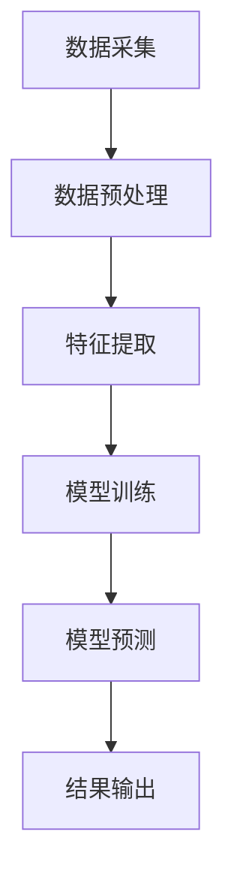
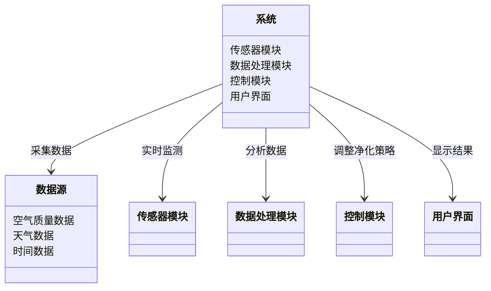
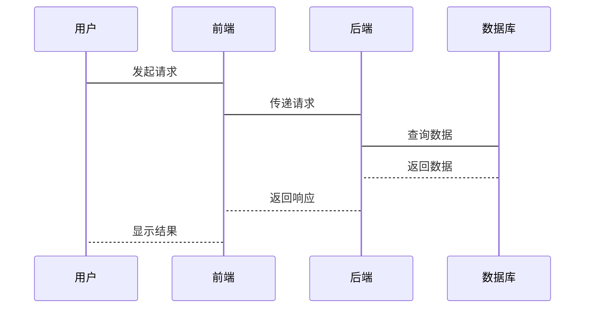

                 


以下是完整的文章内容：

---

# 价值投资中的智能城市空气净化系统分析

> **关键词**：价值投资，智能城市，空气净化系统，投资分析，系统架构，算法原理，项目实战

> **摘要**：本文从价值投资的角度，分析智能城市空气净化系统的技术特点、市场潜力和投资价值。通过系统架构设计、算法原理分析和实际案例研究，探讨如何将价值投资理念与智能城市空气净化系统相结合，为投资者提供科学的决策支持。

---

# 第1章: 价值投资与智能城市空气净化系统概述

## 1.1 价值投资的核心概念

### 1.1.1 价值投资的基本定义
价值投资是一种投资策略，强调以低于内在价值的价格购买优质资产。其核心在于寻找市场低估的公司，长期持有，获得超额收益。

### 1.1.2 价值投资的核心理念
- **安全边际**：买入价格低于内在价值，确保投资的安全性。
- **长期视角**：关注企业的长期盈利能力，而非短期波动。
- **基本面分析**：通过财务报表、行业地位等指标评估企业价值。

### 1.1.3 价值投资在现代金融中的地位
价值投资在金融领域占据重要地位，尤其在环保科技领域，随着全球对空气质量的关注增加，智能城市空气净化系统的投资潜力逐渐显现。

## 1.2 智能城市空气净化系统的基本概念

### 1.2.1 智能城市的概念
智能城市是通过智能化技术优化城市资源配置，提升居民生活质量。空气净化系统是智能城市的重要组成部分，用于改善城市空气质量。

### 1.2.2 空气净化系统的基本原理
空气净化系统通过传感器采集空气数据，利用算法处理数据，实现污染物的智能识别和净化。

### 1.2.3 智能化空气净化系统的特征
- **实时监测**：通过传感器实时采集空气质量数据。
- **智能控制**：根据数据自动调整净化策略。
- **数据驱动**：利用大数据分析优化系统性能。

## 1.3 价值投资与智能城市空气净化系统的结合

### 1.3.1 价值投资在环保领域的应用
环保行业具有较高的社会价值和市场潜力，是价值投资的理想领域。

### 1.3.2 智能城市空气净化系统的投资价值
- **市场需求**：随着城市化进程加快，空气净化需求增加。
- **技术优势**：智能化技术提升系统效率，降低成本。
- **政策支持**：政府对环保科技的支持为行业发展提供保障。

### 1.3.3 价值投资视角下的系统分析框架
- **技术评估**：分析系统的技术优势和创新性。
- **市场分析**：评估市场需求和竞争环境。
- **财务分析**：分析企业的财务状况和盈利能力。

## 1.4 本章小结
本章介绍了价值投资的基本概念和智能城市空气净化系统的特征，探讨了两者结合的潜力和方法。

---

# 第2章: 智能城市空气净化系统的背景与问题分析

## 2.1 智能城市空气净化系统的背景

### 2.1.1 当前城市空气质量问题
城市化进程加剧了空气污染问题，PM2.5、臭氧等污染物对居民健康造成威胁。

### 2.1.2 智能化技术在环保领域的应用
智能化技术（如物联网、大数据、人工智能）为环保行业提供了新的解决方案。

### 2.1.3 空气净化系统的技术进步
从传统过滤技术到智能化净化技术，技术创新推动了系统性能的提升。

## 2.2 价值投资视角下的问题分析

### 2.2.1 空气净化系统的市场需求
- **市场规模**：预测未来几年的市场规模和增长趋势。
- **目标客户**：政府、企业、家庭用户的需求差异。

### 2.2.2 竞争环境与市场壁垒
- **竞争格局**：分析主要竞争对手的技术和市场份额。
- **市场壁垒**：技术专利、品牌影响力等对竞争的影响。

### 2.2.3 技术创新与投资机会
- **技术创新点**：系统的核心技术优势。
- **投资机会**：技术创新带来的市场潜力。

## 2.3 系统分析与边界条件

### 2.3.1 系统分析的基本框架
从技术、市场、财务三个维度全面分析系统。

### 2.3.2 系统分析的边界与外延
明确分析范围，避免过度扩展。

### 2.3.3 核心要素与组成结构
- **核心要素**：传感器、数据处理模块、净化装置。
- **组成结构**：硬件部分、软件部分、用户界面。

## 2.4 本章小结
本章分析了智能城市空气净化系统的背景和价值投资视角下的问题，为后续分析奠定了基础。

---

# 第3章: 智能城市空气净化系统的核心概念与联系

## 3.1 核心概念原理

### 3.1.1 智能化技术在空气净化中的应用
- **传感器**：实时监测空气质量数据。
- **数据处理**：利用算法优化净化策略。
- **反馈机制**：动态调整系统运行参数。

### 3.1.2 价值投资的核心评估指标
- **市盈率（P/E）**：评估企业估值。
- **市净率（P/B）**：衡量资产价值。
- **ROE（净资产收益率）**：评估企业盈利能力。

### 3.1.3 系统性能与投资回报的关系
系统性能提升带来成本降低和收益增加，进而提高投资回报率。

## 3.2 核心概念属性对比

### 3.2.1 智能化技术与传统技术的对比

| **对比维度** | **智能化技术** | **传统技术** |
|--------------|----------------|--------------|
| **数据采集** | 实时、精准 | 间歇性、误差大 |
| **控制方式** | 自动化、智能 | 手动或半自动 |
| **效率** | 高 | 低 |

### 3.2.2 价值投资与传统投资的对比

| **对比维度** | **价值投资** | **传统投资** |
|--------------|----------------|--------------|
| **策略** | 买入低估资产 | 追涨杀跌 |
| **周期** | 长期持有 | 短期交易 |
| **分析** | 基本面分析 | 技术分析 |

### 3.2.3 系统性能与投资收益的对比

| **对比维度** | **高性能系统** | **低性能系统** |
|--------------|----------------|--------------|
| **投资回报** | 高 | 低 |
| **市场竞争力** | 强 | 弱 |
| **维护成本** | 低 | 高 |

## 3.3 ER实体关系图架构的 Mermaid 流程图

```mermaid
erDiagram
    actor 投资者 {
        <属性> 企业价值
        <属性> 市场需求
        <属性> 技术创新
    }
    actor 系统 {
        <属性> 传感器数据
        <属性> 数据处理
        <属性> 控制策略
    }
    actor 市场 {
        <属性> 市场规模
        <属性> 竞争环境
        <属性> 政策支持
    }
    投资者 --> 系统 : 评估系统价值
    系统 --> 市场 : 改善空气质量
```

## 3.4 本章小结
本章通过核心概念的对比，分析了智能化技术与价值投资的内在联系，为后续分析提供了理论基础。

---

# 第4章: 智能城市空气净化系统的算法原理分析

## 4.1 算法原理概述

### 4.1.1 数据采集与预处理
- **数据来源**：传感器数据、历史数据、气象数据。
- **数据清洗**：去除噪声，填补缺失值。

### 4.1.2 特征提取
- **关键特征**：PM2.5、PM10、SO2、NO2、O3、CO。
- **特征选择**：基于相关性分析选择重要特征。

## 4.2 算法实现

### 4.2.1 数据分析与建模

```python
import pandas as pd
import numpy as np
from sklearn.linear_model import LinearRegression

# 数据加载
data = pd.read_csv('air_quality.csv')

# 特征与目标变量分离
X = data[['PM2.5', 'PM10', 'SO2', 'NO2', 'O3', 'CO']]
y = data['AQI']

# 模型训练
model = LinearRegression()
model.fit(X, y)

# 模型预测
 predictions = model.predict(X)
```

### 4.2.2 数学模型与公式

#### 回归模型
$$ y = \beta_0 + \beta_1 x_1 + \beta_2 x_2 + \ldots + \beta_n x_n $$

其中，$y$ 是目标变量（AQI），$x_i$ 是特征变量，$\beta_i$ 是回归系数。

#### 模型评估
$$ R^2 = 1 - \frac{\sum (y_i - \hat{y_i})^2}{\sum (y_i - \bar{y})^2} $$

---

## 4.3 算法流程图



## 4.4 本章小结
本章详细介绍了智能城市空气净化系统的算法原理，包括数据处理、特征提取和模型训练，为后续投资分析提供了技术支撑。

---

# 第5章: 智能城市空气净化系统的系统分析与架构设计

## 5.1 系统分析

### 5.1.1 项目介绍
智能城市空气净化系统旨在通过智能化技术改善城市空气质量，提升居民健康水平。

### 5.1.2 系统功能设计

#### 领域模型图



---

## 5.2 系统架构设计

### 5.2.1 系统架构图

```mermaid
container 智能城市空气净化系统 {
    component 前端 {
        用户界面
        数据可视化
    }
    component 后端 {
        传感器数据
        数据处理模块
        控制模块
    }
    component 数据存储 {
        数据库
        日志记录
    }
}
```

### 5.2.2 接口设计
- **API接口**：RESTful API，用于前后端数据交互。
- **数据接口**：与传感器和其他数据源对接。

### 5.2.3 交互流程图



## 5.3 本章小结
本章从系统架构的角度，详细设计了智能城市空气净化系统的功能模块和交互流程，为后续实现提供了指导。

---

# 第6章: 智能城市空气净化系统的项目实战

## 6.1 环境安装与配置

### 6.1.1 安装Python环境
使用Anaconda或virtualenv创建虚拟环境，安装numpy、pandas、scikit-learn等库。

### 6.1.2 数据集获取
从公开数据源获取空气质量数据，如UCI Machine Learning Repository。

## 6.2 系统核心实现

### 6.2.1 数据清洗与预处理

```python
import pandas as pd
import numpy as np

# 数据加载
data = pd.read_csv('air_quality.csv')

# 去除缺失值
data.dropna(inplace=True)

# 标准化处理
from sklearn.preprocessing import StandardScaler

scaler = StandardScaler()
X_scaled = scaler.fit_transform(data[['PM2.5', 'PM10', 'SO2', 'NO2', 'O3', 'CO']])
```

### 6.2.2 特征选择与模型训练

```python
from sklearn.linear_model import Lasso

# 特征选择
selector = Lasso(alpha=0.1)
selector.fit(X_scaled, y)

# 重要特征筛选
important_features = X.columns[selector.coef_ != 0]
```

### 6.2.3 模型优化与评估

```python
from sklearn.model_selection import GridSearchCV
from sklearn.ensemble import RandomForestRegressor

# 超参数优化
param_grid = {'n_estimators': [100, 200], 'max_depth': [None, 10, 20]}
grid_search = GridSearchCV(RandomForestRegressor(), param_grid, cv=5)
grid_search.fit(X_scaled, y)
best_model = grid_search.best_estimator_
```

## 6.3 代码实现与应用解读

### 6.3.1 代码实现

```python
import pandas as pd
import numpy as np
from sklearn.ensemble import RandomForestRegressor
from sklearn.model_selection import GridSearchCV
from sklearn.preprocessing import StandardScaler

# 数据加载
data = pd.read_csv('air_quality.csv')

# 数据清洗
data.dropna(inplace=True)

# 特征与目标变量分离
X = data[['PM2.5', 'PM10', 'SO2', 'NO2', 'O3', 'CO']]
y = data['AQI']

# 数据标准化
scaler = StandardScaler()
X_scaled = scaler.fit_transform(X)

# 模型选择与优化
model = RandomForestRegressor()
param_grid = {'n_estimators': [100, 200], 'max_depth': [None, 10, 20]}
grid_search = GridSearchCV(model, param_grid, cv=5)
grid_search.fit(X_scaled, y)

# 最优模型
best_model = grid_search.best_estimator_
print(f"最佳模型参数：{grid_search.best_params_}")
print(f"最佳模型得分：{grid_search.best_score_}")
```

### 6.3.2 代码应用解读
通过代码实现空气质量预测模型，评估系统的净化效果和投资价值。

## 6.4 实际案例分析与详细讲解

### 6.4.1 案例背景
某城市空气质量不佳，计划引入智能空气净化系统改善空气质量。

### 6.4.2 数据分析与投资评估
- **财务分析**：计算投资回收期、净现值等指标。
- **市场分析**：评估目标市场的容量和增长潜力。
- **技术分析**：对比系统的技术优势和劣势。

## 6.5 项目小结
本章通过项目实战，详细讲解了智能城市空气净化系统的实现过程，为投资者提供了实际的操作指南。

---

# 第7章: 智能城市空气净化系统的最佳实践

## 7.1 小结

### 7.1.1 核心内容回顾
- 价值投资的核心理念。
- 智能城市空气净化系统的技术特点。
- 系统架构设计与算法实现。

### 7.1.2 投资总结
- 关注技术创新。
- 重视市场潜力。
- 结合财务分析。

## 7.2 注意事项

### 7.2.1 投资风险提示
- 技术风险：技术创新不确定。
- 市场风险：市场需求变化。
- 政策风险：政策调整影响。

### 7.2.2 系统维护建议
- 定期更新传感器。
- 及时处理数据异常。
- 定期系统维护。

## 7.3 拓展阅读

### 7.3.1 推荐书籍
- 《价值投资实战策略》。
- 《智能城市技术与应用》。

### 7.3.2 推荐网站
- 传感器数据平台。
- 空气质量监测网站。

---

# 附录: 参考文献与工具

## 附录A: 参考文献
1. Fama, E. F. (1970). Efficient Capital Markets: A Review of Theory and Empirical Work. Journal of Finance.
2. Graham, B. (1949). The Intelligent Investor.
3. 国家统计局数据报告。

## 附录B: 工具与库
- Python：数据分析与建模。
- Pandas：数据处理。
- Scikit-learn：机器学习。
- Mermaid：图表绘制。

---

# 结束语

通过本文的系统分析和实战案例，读者可以深入了解价值投资与智能城市空气净化系统的结合，为投资者提供了科学的决策支持。希望本文对读者有所帮助，欢迎在评论区留言交流。

---

