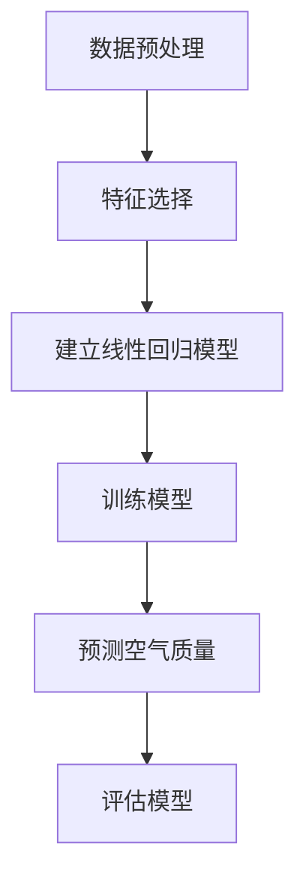
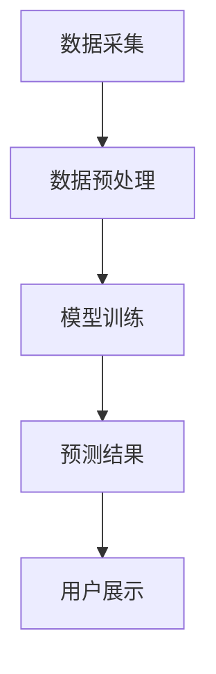
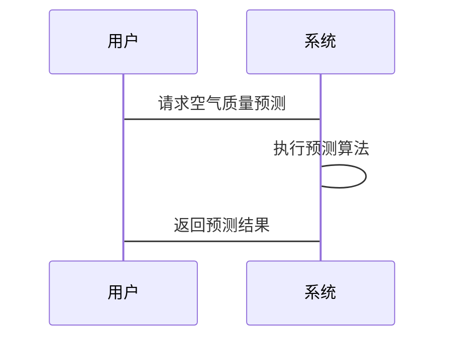

                 


# 价值投资中的智能城市空气质量预测系统分析

## 关键词：智能城市，空气质量预测，价值投资，机器学习，数据驱动决策

## 摘要：  
本文探讨了智能城市中空气质量预测系统在价值投资中的应用，分析了系统的核心要素和算法原理，结合实际案例展示了如何通过数据驱动决策优化投资策略。文章详细讲解了机器学习算法在空气质量预测中的应用，并提供了系统设计与架构方案，最后通过实战项目和最佳实践总结了空气质量预测系统的投资价值和实际意义。

---

## 正文

### 第一部分：背景介绍

#### 第1章：智能城市与空气质量问题

##### 1.1 智能城市的定义与特点
- 智能城市是通过数字化技术优化城市运行效率的新型城市模式。
- 其特点包括高效的数据采集、智能化的决策支持和实时化的反馈机制。

##### 1.2 价值投资的基本概念
- 价值投资是通过分析标的物的内在价值，寻找市场低估的投资机会。
- 其核心理念是长期持有优质资产，而非短期波动。

##### 1.3 空气质量预测的背景与意义
- 空气质量直接影响居民健康和城市环境。
- 准确预测空气质量有助于政府制定环保政策，企业优化生产计划，投资者调整投资策略。

### 第二部分：核心概念与联系

#### 第2章：空气质量预测系统的核心要素

##### 2.1 数据源分析
- 数据来源包括空气质量监测站、气象数据和卫星遥感。
- 数据预处理包括清洗、特征提取和标准化。

##### 2.2 空气质量预测模型
- 模型类型包括统计模型、机器学习模型和深度学习模型。
- 各模型的优缺点对比（见表2.1）：

| 模型类型    | 优点                     | 缺点                     |
|------------|--------------------------|--------------------------|
| 统计模型    | 简单易用，计算速度快      | 需要大量假设，精度有限    |
| 机器学习模型 | 高精度，可处理非线性关系  | 需要大量数据和计算资源    |
| 深度学习模型 | 高精度，自动提取特征      | 计算资源需求大，解释性差    |

##### 2.3 数据源与预测模型的ER图
- ER图展示空气质量预测系统的实体关系，包括数据源、模型、结果和用户。

```mermaid
er
    %%{init: 'flowchart', direction: 'TB'}
    %% 数据源
    entity 空气质量监测数据 {
        id 数据点ID
        时间戳 timestamp
        PM2.5 浓度
        PM10 浓度
        SO2 浓度
        NO2 浓度
        CO 浓度
        O3 浓度
    }
    %% 气象数据
    entity 气象数据 {
        id 数据点ID
        时间戳 timestamp
        温度 temperature
        湿度 humidity
        风速 wind_speed
        风向 wind_direction
        气压 pressure
    }
    %% 卫星遥感数据
    entity 卫星遥感数据 {
        id 数据点ID
        时间戳 timestamp
        悬浮颗粒物浓度 Aerosol_concentration
        大气能见度 visibility
    }
    %% 预测模型
    entity 预测模型 {
        id 模型ID
        名称 model_name
        类型 model_type
        输入特征 input_features
        输出结果 output_results
    }
    %% 预测结果
    entity 预测结果 {
        id 预测ID
        时间戳 timestamp
        预测值 predicted_value
        实际值 actual_value
        模型ID 模型ID
    }
    %% 用户
    entity 用户 {
        id 用户ID
        名称 name
        类型 类型 (投资者, 政府机构, 企业)
    }
    %% 关系
    空气质量监测数据 --> 预测结果: 提供输入数据
    气象数据 --> 预测结果: 提供输入数据
    卫星遥感数据 --> 预测结果: 提供输入数据
    预测结果 --> 用户: 提供决策支持
```

### 第三部分：算法原理讲解

#### 第3章：空气质量预测的机器学习算法

##### 3.1 线性回归模型

###### 3.1.1 线性回归的基本原理
- 线性回归通过最小化预测值与实际值之间的平方差，建立线性关系模型。

###### 3.1.2 算法流程图


###### 3.1.3 Python代码实现
```python
import numpy as np
import pandas as pd
from sklearn.linear_model import LinearRegression
from sklearn.metrics import mean_squared_error

# 加载数据
data = pd.read_csv('air_quality.csv')

# 特征选择
X = data[['温度', '湿度', '风速']]
y = data['PM2.5']

# 创建模型
model = LinearRegression()

# 训练模型
model.fit(X, y)

# 预测
predictions = model.predict(X)

# 评估
mse = mean_squared_error(y, predictions)
print(f"均方误差：{mse}")
```

###### 3.1.4 示例分析与结果解读
- 线性回归模型在空气质量预测中表现一般，适合线性关系明显的场景。

##### 3.2 随机森林模型

###### 3.2.1 随机森林的原理与优势
- 随机森林通过构建多个决策树，利用投票法进行预测，具有高精度和强健性。

###### 3.2.2 算法流程图


###### 3.2.3 Python代码实现
```python
import numpy as np
import pandas as pd
from sklearn.ensemble import RandomForestRegressor
from sklearn.metrics import mean_squared_error

# 加载数据
data = pd.read_csv('air_quality.csv')

# 特征选择
X = data[['温度', '湿度', '风速', 'SO2', 'NO2']]
y = data['PM2.5']

# 创建模型
model = RandomForestRegressor(n_estimators=100, random_state=42)

# 训练模型
model.fit(X, y)

# 预测
predictions = model.predict(X)

# 评估
mse = mean_squared_error(y, predictions)
print(f"均方误差：{mse}")
```

###### 3.2.4 实际案例分析
- 随机森林模型在空气质量预测中表现优异，适合多因素影响的场景。

### 第四部分：系统分析与架构设计

#### 第4章：智能城市空气质量预测系统架构

##### 4.1 项目背景与目标
- 项目背景：随着城市化进程加快，空气质量问题日益严重。
- 项目目标：构建一个实时预测系统，支持投资决策。

##### 4.2 系统功能设计
- 数据采集模块：实时采集空气质量数据。
- 预测模块：基于机器学习算法进行预测。
- 展示模块：以可视化形式呈现预测结果。

##### 4.3 系统架构设计


##### 4.4 系统交互设计


### 第五部分：项目实战

#### 第5章：空气质量预测系统实战

##### 5.1 环境安装
- 安装Python、Pandas、Scikit-learn等库。

##### 5.2 核心代码实现
```python
import numpy as np
import pandas as pd
from sklearn.ensemble import RandomForestRegressor
from sklearn.metrics import mean_squared_error

# 加载数据
data = pd.read_csv('air_quality.csv')

# 特征选择
X = data[['温度', '湿度', '风速', 'SO2', 'NO2']]
y = data['PM2.5']

# 创建模型
model = RandomForestRegressor(n_estimators=100, random_state=42)

# 训练模型
model.fit(X, y)

# 预测
predictions = model.predict(X)

# 评估
mse = mean_squared_error(y, predictions)
print(f"均方误差：{mse}")
```

##### 5.3 实际案例分析
- 通过实际数据展示模型预测的准确性和应用价值。

### 第六部分：最佳实践与总结

#### 第6章：总结与建议

##### 6.1 最佳实践
- 数据质量是模型准确性的关键。
- 模型选择应基于实际场景和数据特点。

##### 6.2 小结
- 智能城市空气质量预测系统在价值投资中的应用潜力巨大。
- 通过数据驱动决策，投资者可以更科学地优化投资策略。

##### 6.3 注意事项
- 数据隐私和安全问题需高度重视。
- 模型需要定期更新以适应数据变化。

##### 6.4 拓展阅读
- 推荐阅读《数据驱动的决策》和《机器学习实战》。

---

通过以上分析，我们详细探讨了智能城市空气质量预测系统在价值投资中的应用，从背景介绍到系统设计，再到项目实战，为投资者提供了科学的决策支持。希望本文能为相关领域的研究和实践提供有价值的参考。

