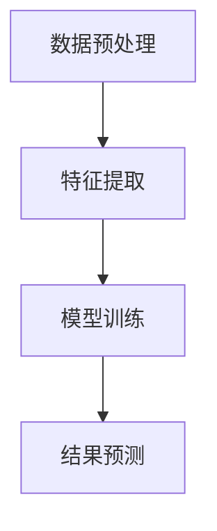
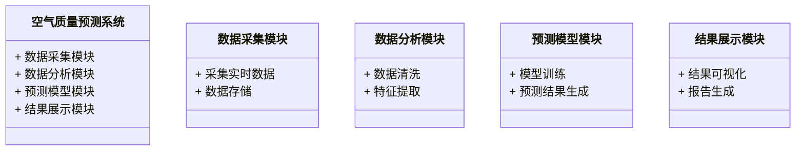
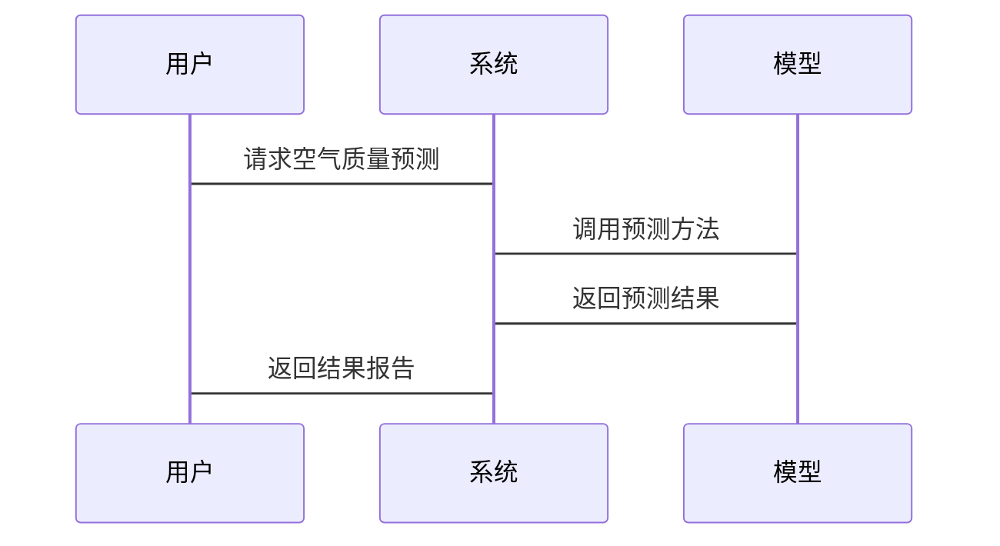

                 


# 价值投资中的智能城市空气质量预测系统分析

> 关键词：价值投资、智能城市、空气质量预测系统、数据分析、机器学习

> 摘要：本文探讨了在智能城市背景下，空气质量预测系统如何帮助投资者做出更明智的决策。通过分析空气质量数据，结合价值投资策略，展示了如何利用智能技术提升投资效率和准确性。

---

## 第一部分：价值投资与智能城市空气质量预测系统概述

### 第1章：价值投资与智能城市空气质量预测系统概述

#### 1.1 价值投资的基本概念
- **1.1.1 价值投资的定义**：价值投资是一种投资策略，旨在通过寻找市场价格低于其内在价值的资产来实现长期收益。
- **1.1.2 价值投资的核心理念**：关注基本面分析，寻找被市场低估的机会，长期持有优质资产。
- **1.1.3 价值投资与智能城市的关系**：智能城市的发展提供了新的投资机会，如环保技术、绿色能源等领域。

#### 1.2 智能城市的基本概念
- **1.2.1 智能城市的定义**：利用信息技术整合城市资源，提升居民生活质量和社会运行效率的城市发展模式。
- **1.2.2 智能城市的发展背景**：随着城市化进程加快，智能技术的应用成为解决城市问题的重要手段。
- **1.2.3 智能城市的核心技术**：物联网、大数据、人工智能、云计算等。

#### 1.3 空气质量预测系统的基本概念
- **1.3.1 空气质量预测的定义**：利用历史数据和模型预测未来空气质量状况的技术。
- **1.3.2 空气质量预测的重要性**：对公共健康、环境保护和城市规划具有重要意义。
- **1.3.3 空气质量预测系统的组成部分**：数据采集、分析模型、预测模块等。

#### 1.4 价值投资与智能城市空气质量预测系统的关联
- **1.4.1 空气质量对城市价值的影响**：良好的空气质量是城市吸引力的重要因素，影响房地产、健康保险等投资领域。
- **1.4.2 空气质量预测在投资决策中的作用**：帮助投资者识别环保型企业的投资机会，评估城市发展的潜力。
- **1.4.3 智能城市空气质量预测系统的投资价值**：技术进步带来投资机会，环保企业的发展前景广阔。

---

## 第二部分：空气质量预测系统的原理与核心概念

### 第2章：空气质量预测系统的原理与核心概念

#### 2.1 空气质量预测系统的原理
- **2.1.1 数据采集与处理**：通过传感器获取实时数据，清洗和预处理数据以提高准确性。
- **2.1.2 数据分析与建模**：应用统计分析和机器学习方法，构建预测模型。
- **2.1.3 预测结果输出**：将模型预测结果转化为可读的报告或警报信息。

#### 2.2 核心概念与联系
- **2.2.1 空气质量数据的特征分析**：分析数据的时序性、波动性等特征，为模型选择提供依据。
- **2.2.2 空气质量预测模型的构建**：选择适合的算法，如线性回归、随机森林等，并进行模型验证。
- **2.2.3 空气质量预测系统的优化**：通过参数调整和模型集成提升预测精度。

#### 2.3 空气质量预测系统的ER实体关系图
```mermaid
er
    entity 空气质量数据 {
        id: 自增主键
        测点编号: �惟一标识监测点
        测点位置: 经纬度坐标
        污染物指标: 如PM2.5、SO2等
        测定时间: 时间戳
        测定值: 测定结果
    }

    entity 监测点 {
        id: 自增主键
        名称: 监测点名称
        位置: 经纬度坐标
        类型: 如城市中心、郊区等
    }

    entity 污染物指标 {
        id: 自增主键
        名称: 如PM2.5、SO2等
        标准限值: 国家或地方标准
    }

    空气质量数据 --> 监测点: belongsTo
    空气质量数据 --> 污染物指标: belongsTo
```

---

## 第三部分：空气质量预测系统的算法原理

### 第3章：空气质量预测系统的算法原理

#### 3.1 算法原理讲解
- **3.1.1 算法选择与流程**：选择适合的机器学习算法，如支持向量机（SVM）或长短时记忆网络（LSTM），并展示算法流程图。
- **3.1.2 算法实现步骤**：数据预处理、特征提取、模型训练、结果预测。

#### 3.2 算法流程图


#### 3.3 算法实现代码示例
```python
import pandas as pd
from sklearn.model_selection import train_test_split
from sklearn.svm import SVR

# 数据加载与预处理
data = pd.read_csv('air_quality.csv')
X = data[['温度', '湿度', '风速', '污染物浓度']]
y = data['空气质量指数']

# 划分训练集和测试集
X_train, X_test, y_train, y_test = train_test_split(X, y, test_size=0.2, random_state=42)

# 模型训练
model = SVR(kernel='rbf', C=1e3, gamma=0.1)
model.fit(X_train, y_train)

# 模型预测
y_pred = model.predict(X_test)
```

#### 3.4 数学模型讲解
- **线性回归模型**：$$ y = \beta_0 + \beta_1x_1 + \beta_2x_2 + \dots + \beta_nx_n + \epsilon $$
- **随机森林模型**：通过集成学习提高模型的泛化能力。

---

## 第四部分：空气质量预测系统的系统分析与架构设计

### 第4章：系统分析与架构设计

#### 4.1 项目背景介绍
- 本项目旨在开发一个智能城市空气质量预测系统，帮助投资者评估环保企业的投资价值。

#### 4.2 系统功能设计


#### 4.3 系统架构设计


#### 4.4 系统交互设计


---

## 第五部分：空气质量预测系统的项目实战

### 第5章：项目实战

#### 5.1 环境安装
- 安装Python、Pandas、Scikit-learn等库。

#### 5.2 核心代码实现
```python
from sklearn.metrics import mean_absolute_error, mean_squared_error

# 模型评估
print('MAE:', mean_absolute_error(y_test, y_pred))
print('MSE:', mean_squared_error(y_test, y_pred))
print('RMSE:', mean_squared_error(y_test, y_pred, squared=False))
```

#### 5.3 案例分析
- 分析某城市空气质量数据，预测未来空气质量指数，评估环保企业投资价值。

#### 5.4 代码解读与分析
- 解释每部分代码的功能，展示数据可视化结果，如预测值与实际值的对比图。

---

## 第六部分：最佳实践、小结与注意事项

### 第6章：最佳实践、小结与注意事项

#### 6.1 最佳实践
- 数据预处理是关键，确保数据质量和完整性。
- 选择合适的模型，进行充分的模型验证和调优。

#### 6.2 小结
- 本文详细分析了智能城市空气质量预测系统在价值投资中的应用，展示了如何利用技术提升投资决策的科学性。

#### 6.3 注意事项
- 数据隐私和安全需严格保护。
- 模型需定期更新，以适应数据变化和环境因素的影响。

#### 6.4 拓展阅读
- 探索更复杂的预测模型，如深度学习在空气质量预测中的应用。
- 研究空气质量对不同类型投资的影响，如房地产、健康保险等。

---

通过以上步骤，我们系统地构建了一个智能城市空气质量预测系统的分析框架，并展示了其在价值投资中的潜力。希望本文能为投资者和技术人员提供有价值的参考和启发。

