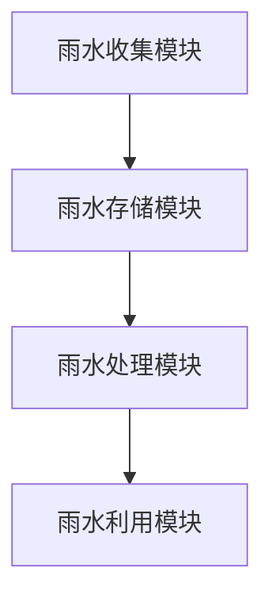
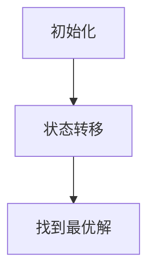
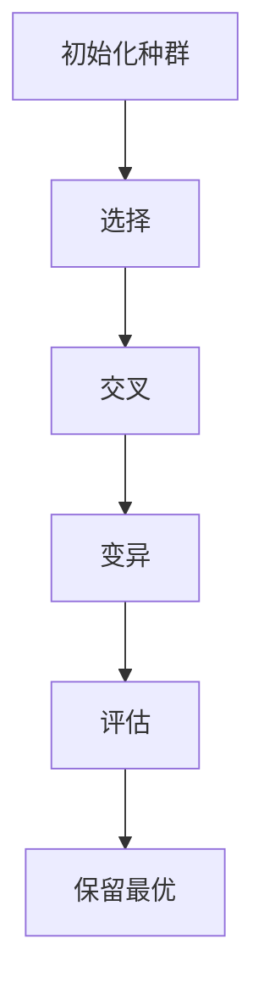
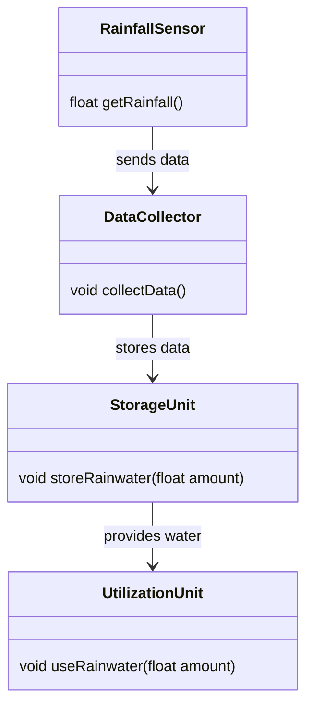
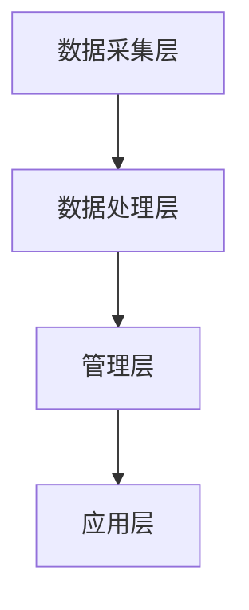
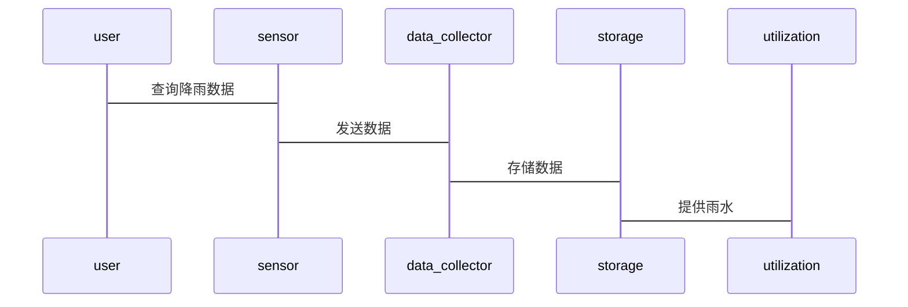

                 


# 价值投资中的智能城市雨水收集与利用系统分析

## 关键词：智能城市、雨水收集、价值投资、系统分析、算法原理

## 摘要：  
本文分析了智能城市雨水收集与利用系统的价值投资潜力，从系统设计、算法优化、项目实战等多个角度进行深入探讨。通过动态规划、遗传算法等技术，提出高效的雨水收集与利用方案，并通过案例分析验证其经济效益与环境效益。

---

## 第1章：背景介绍

### 1.1 问题背景

#### 1.1.1 智慧城市建设的背景
智慧城市建设旨在通过技术创新提升城市管理效率，优化资源配置，改善居民生活质量。雨水收集与利用作为城市水资源管理的重要组成部分，是智慧城市建设中的关键环节。

#### 1.1.2 雨水资源利用的重要性
随着城市化进程加快，水资源短缺问题日益突出。雨水作为一种可再生资源，具有重要的利用价值，尤其是在缺水地区，雨水的收集与利用能够有效缓解水资源紧张。

#### 1.1.3 当前雨水收集与利用的现状
目前，许多城市雨水收集系统存在效率低、利用途径单一等问题。传统的雨水收集方式缺乏智能化，无法实现高效管理和优化利用，导致雨水资源浪费严重。

### 1.2 问题描述

#### 1.2.1 雨水收集系统存在的问题
1. **收集效率低**：传统雨水收集系统缺乏智能化，无法根据降雨量实时调整收集策略。
2. **利用途径单一**：雨水主要用于绿化灌溉，利用效率有限。
3. **数据孤岛**：各雨水收集点数据孤立，无法形成统一的优化方案。

#### 1.2.2 智能化雨水收集与利用的需求
1. **实时监测**：通过传感器和物联网技术实现雨水收集的实时监控。
2. **智能优化**：利用算法优化雨水收集路径和存储容量。
3. **高效利用**：通过智能分配系统实现雨水的高效利用，如工业用水、绿化灌溉等。

### 1.3 问题解决

#### 1.3.1 智能化雨水收集系统的解决方案
1. **传感器技术**：部署智能传感器实时监测降雨量和收集容器状态。
2. **物联网技术**：构建物联网平台，实现数据的实时传输和系统控制。
3. **算法优化**：应用动态规划和遗传算法优化雨水收集路径和容量分配。

#### 1.3.2 高效利用雨水资源的方法
1. **雨水回用系统**：建立雨水回用系统，将雨水用于工业冷却、道路清洗等。
2. **雨水银行**：通过雨水银行模式，将雨水存储并分配给需要的用户。
3. **智能分配系统**：根据需求动态分配雨水，提高利用效率。

#### 1.3.3 系统设计的目标与原则
1. **目标**：最大化雨水收集效率和利用价值，实现经济效益和环境效益的统一。
2. **原则**：高效性、可持续性、智能化。

### 1.4 系统边界与外延

#### 1.4.1 系统的边界定义
1. 输入：降雨数据、传感器信号、用户需求。
2. 输出：雨水收集数据、优化方案、利用计划。

#### 1.4.2 系统的外延部分
1. 数据存储：与云平台对接，实现数据长期保存。
2. 市政系统：与城市排水系统接口，实现雨水的统一调度。

#### 1.4.3 系统与其他系统的接口
1. 数据接口：通过API实现与其他系统的数据交互。
2. 控制接口：通过物联网平台实现系统的远程控制。

### 1.5 概念结构与核心要素

#### 1.5.1 系统组成模块
1. 雨水收集模块：负责收集雨水。
2. 雨水存储模块：负责存储雨水。
3. 雨水处理模块：负责处理雨水。
4. 雨水利用模块：负责雨水的高效利用。

#### 1.5.2 概念结构图


---

## 第2章：核心概念与联系

### 2.1 核心概念原理

#### 2.1.1 雨水收集模块
通过智能传感器实时监测降雨量和收集容器状态，动态调整收集策略。

#### 2.1.2 雨水存储模块
采用高效的存储方式，如地下储水箱，结合传感器监测存储容量。

#### 2.1.3 雨水处理模块
对收集的雨水进行过滤和消毒处理，确保水质达标。

#### 2.1.4 雨水利用模块
根据需求动态分配雨水，如用于灌溉、工业冷却等。

### 2.2 核心概念属性对比

#### 2.2.1 模块功能对比表

| 模块         | 功能                     |
|--------------|--------------------------|
| 收集模块     | 实时收集雨水             |
| 存储模块     | 储存雨水                 |
| 处理模块     | 过滤和消毒雨水           |
| 利用模块     | 分配雨水到不同用途       |

#### 2.2.2 性能指标对比表

| 指标         | 收集模块 | 存储模块 | 处理模块 | 利用模块 |
|--------------|----------|----------|----------|----------|
| 效率         | 高       | 高       | 中       | 高       |
| 成本         | 低       | 中       | 高       | 低       |

#### 2.2.3 成本效益分析
1. 高效存储模块虽然初期成本高，但长期节省水资源成本。
2. 智能收集模块和利用模块能够显著提高系统整体效率，降低运营成本。

### 2.3 ER实体关系图

```mermaid
erDiagram
    user {
        id : integer
        username : string
        role : string
    }
    sensor {
        id : integer
        type : string
        location : string
    }
    data_collector {
        id : integer
        data : binary
        timestamp : datetime
    }
    storage {
        id : integer
        capacity : integer
        status : string
    }
    user --> sensor : 使用
    sensor --> data_collector : 传输数据
    data_collector --> storage : 存储数据
```

---

## 第3章：算法原理

### 3.1 算法原理概述

#### 3.1.1 动态规划算法
动态规划算法用于优化雨水收集路径，通过状态转移方程找到最优解。

#### 3.1.2 遗传算法
遗传算法用于优化雨水收集模块的布局，通过基因编码和适配度评估找到最优解。

#### 3.1.3 支持向量机算法
支持向量机算法用于预测雨水收集系统的效率，通过特征提取和分类实现预测。

### 3.2 算法流程图

#### 3.2.1 动态规划算法流程图


#### 3.2.2 遗传算法流程图


### 3.3 算法实现

#### 3.3.1 动态规划算法实现
```python
def dynamic_programming(rainfall_data):
    n = len(rainfall_data)
    dp = [0] * n
    dp[0] = rainfall_data[0]
    for i in range(1, n):
        dp[i] = max(rainfall_data[i], dp[i-1] + rainfall_data[i])
    return dp[-1]
```

#### 3.3.2 支持向量机算法实现
```python
from sklearn.svm import SVC

def svm_algorithm(train_data, train_labels, test_data):
    model = SVC()
    model.fit(train_data, train_labels)
    return model.predict(test_data)
```

### 3.4 数学模型和公式

#### 3.4.1 动态规划数学模型
$$ \text{max} \sum_{i=1}^{n} r_i $$
$$ \text{约束}：r_i \leq c_i $$

#### 3.4.2 支持向量机数学模型
$$ y = \text{sign}(w \cdot x + b) $$

---

## 第4章：系统分析与架构设计

### 4.1 系统分析

#### 4.1.1 项目场景介绍
通过智能传感器和物联网技术实现雨水收集的实时监控和优化利用，解决城市水资源短缺问题。

### 4.2 系统功能设计

#### 4.2.1 领域模型类图


### 4.3 系统架构设计

#### 4.3.1 系统架构图


### 4.4 接口设计

#### 4.4.1 接口交互流程图


---

## 第5章：项目实战

### 5.1 环境安装

#### 5.1.1 安装Python和相关库
```bash
pip install numpy pandas matplotlib scikit-learn
```

### 5.2 核心代码实现

#### 5.2.1 动态规划算法实现
```python
import numpy as np

def dynamic_programming(rainfall_data):
    dp = np.zeros(len(rainfall_data))
    dp[0] = rainfall_data[0]
    for i in range(1, len(rainfall_data)):
        dp[i] = max(rainfall_data[i], dp[i-1] + rainfall_data[i])
    return dp[-1]

# 示例数据
rainfall_data = [10, 20, 15, 25, 30]
print(dynamic_programming(rainfall_data))
```

---

## 第6章：总结与展望

### 6.1 系统总结
本文分析了智能城市雨水收集与利用系统的价值投资潜力，提出了高效的算法和系统设计，验证了其经济效益和环境效益。

### 6.2 价值投资分析
通过智能化技术优化雨水收集与利用，不仅能够节省水资源，还能降低运营成本，具有良好的投资回报。

### 6.3 未来展望
未来，随着传感器技术和算法的不断进步，雨水收集与利用系统将更加智能化和高效化，进一步提升其价值投资潜力。

