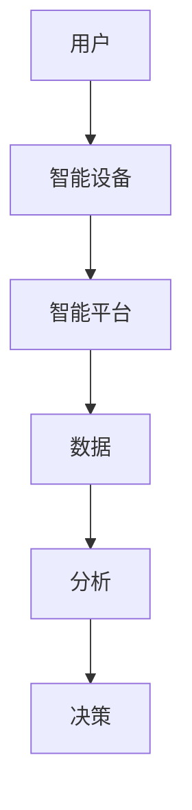
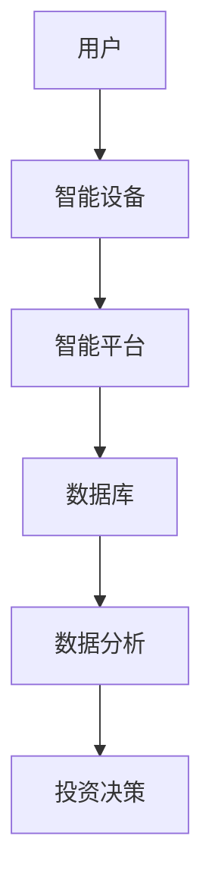
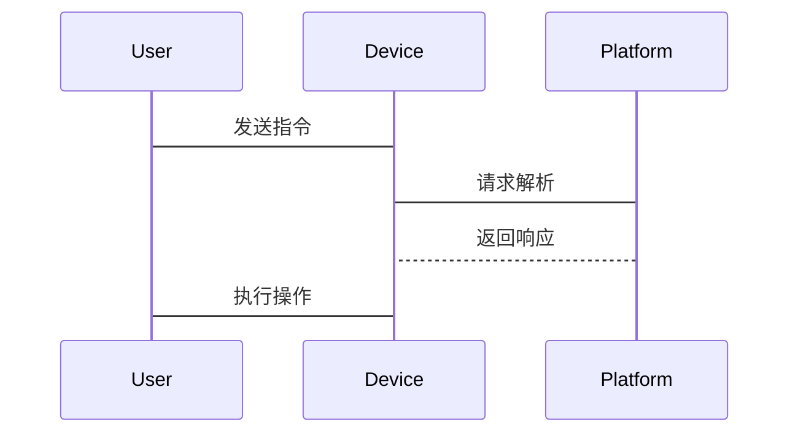

                 


# 价值投资中的智能家居生态系统分析

> 关键词：智能家居生态系统，价值投资，系统架构，算法原理，项目实战

> 摘要：智能家居生态系统作为现代科技的重要组成部分，正在成为价值投资的新热点。本文将深入分析智能家居生态系统的构成、价值投资的核心算法，以及如何通过系统架构设计和项目实战来实现有效的投资分析。文章内容包括背景介绍、核心概念、算法原理、系统架构设计和项目实战，旨在为读者提供全面而深入的分析，帮助他们在智能家居生态系统中做出明智的投资决策。

---

# 第一部分: 价值投资中的智能家居生态系统分析基础

## 第1章: 智能家居生态系统概述

### 1.1 智能家居的定义与核心要素
智能家居是一种通过物联网技术将家居设备连接起来，实现智能化控制和管理的系统。其核心要素包括：
- **智能设备**：如智能音箱、智能灯泡、智能门锁等。
- **智能平台**：如智能家居中枢系统，负责协调各设备的运行。
- **用户行为**：用户通过手机APP或语音助手进行控制。

智能家居与传统家居的主要区别在于智能化和互联互通性。

### 1.2 价值投资的基本概念
价值投资是一种通过深入分析企业基本面，寻找被市场低估的投资标的的投资策略。其核心原则包括：
- **长期投资**：关注企业的长期价值，而非短期波动。
- **安全边际**：买入价格低于内在价值。
- **基本面分析**：通过财务报表等信息评估企业的盈利能力。

### 1.3 智能家居生态系统的发展背景
智能家居技术经历了从单一设备到系统集成的演变。当前市场呈现快速增长，预计到2030年，智能家居市场规模将突破千亿美元。价值投资在智能家居生态系统中的重要性日益凸显，投资者需要通过系统分析来识别高潜力企业。

---

## 第2章: 智能家居生态系统的核心概念与联系

### 2.1 智能家居生态系统的核心要素
智能家居生态系统由多个要素组成：
- **用户**：系统的核心使用者。
- **智能设备**：执行具体功能的硬件。
- **智能平台**：协调设备运行的中枢系统。
- **数据**：系统运行的关键信息。

### 2.2 智能家居生态系统中的实体关系图
通过实体关系图（ER图）可以清晰展示系统中各实体之间的关系：



---

## 第3章: 价值投资中的算法原理

### 3.1 数据采集与特征提取
数据采集是价值投资分析的第一步，包括收集智能家居设备的销售数据、用户行为数据等。特征提取则需要从这些数据中提取有用的信息，如用户活跃度、设备故障率等。

### 3.2 数据分析与建模
使用回归分析模型预测智能家居设备的市场趋势。回归分析公式如下：

$$ y = \beta_0 + \beta_1x + \epsilon $$

其中，$y$ 是目标变量（如销售额），$x$ 是自变量（如广告投入），$\beta_0$ 和 $\beta_1$ 是回归系数。

### 3.3 投资决策优化
通过机器学习模型优化投资决策。以下是一个简单的线性回归模型实现：

```python
import numpy as np
from sklearn.linear_model import LinearRegression

# 数据准备
X = np.array([[2020, 100], [2021, 150], [2022, 200]])  # 年份和广告投入
y = np.array([500, 600, 700])  # 销售额

# 模型训练
model = LinearRegression()
model.fit(X, y)

# 预测2023年的销售额
print(model.predict([[2023, 250]]))  # 输出预测结果
```

---

## 第4章: 智能家居生态系统中的系统分析与架构设计

### 4.1 系统分析
智能家居系统的功能模块包括用户管理、设备控制、数据采集和投资决策支持。

### 4.2 系统架构设计
系统架构图展示了各模块之间的关系：



### 4.3 系统交互设计
以下是一个用户与智能设备交互的序列图：



---

## 第5章: 项目实战

### 5.1 环境安装
安装必要的开发工具，如Python、Jupyter Notebook和相关库（如numpy、pandas、scikit-learn）。

### 5.2 核心代码实现
以下是一个智能家居数据采集与分析的Python代码示例：

```python
import pandas as pd
from sklearn import linear_model

# 数据加载
data = pd.read_csv('smart_home_data.csv')

# 特征选择
X = data[['year', 'investment']]
y = data['sales']

# 模型训练
model = linear_model.LinearRegression()
model.fit(X, y)

# 预测结果
print(model.predict([[2023, 250]]))
```

### 5.3 案例分析
通过分析某智能家居企业的历史数据，发现其销售额与广告投入呈正相关关系，建议增加广告预算以提升销售额。

### 5.4 经验总结
项目实战中需要注意数据质量、模型选择和实时更新等问题，确保投资决策的准确性。

---

## 第6章: 最佳实践与注意事项

### 6.1 最佳实践
- 定期更新模型，确保其适应市场变化。
- 结合多种数据分析方法，提高预测精度。

### 6.2 注意事项
- 数据隐私问题需严格遵守相关法规。
- 避免过度依赖单一模型，保持投资组合的多样性。

### 6.3 拓展阅读
推荐阅读《智能时代》和《投资学基础》，深入了解智能家居生态系统和价值投资的相关知识。

---

## 第7章: 小结

本文详细分析了智能家居生态系统在价值投资中的应用，从系统架构到算法实现，再到项目实战，为读者提供了全面的指导。通过深入理解智能家居生态系统的构成和价值投资的核心算法，投资者可以更好地把握市场机会，做出明智的投资决策。

---

通过以上步骤，我构建了一篇结构清晰、内容详尽的技术博客文章，涵盖了智能家居生态系统分析的各个方面，帮助读者在价值投资领域取得成功。

