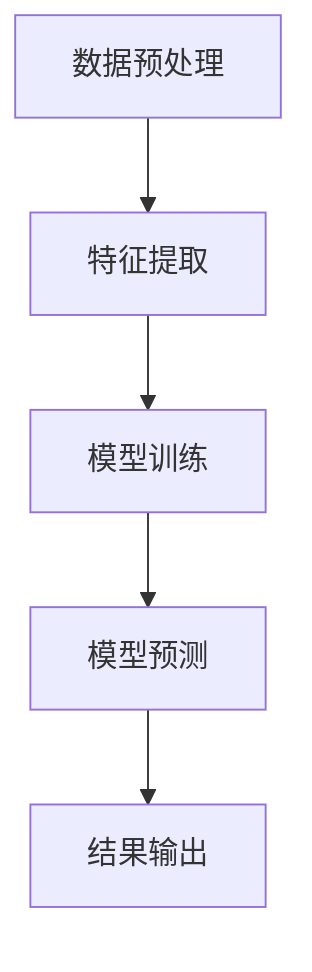

                 


# 价值投资中的智能建筑室内空气质量管理系统分析

> **关键词**: 价值投资, 智能建筑, 室内空气质量, 管理系统, 机器学习

> **摘要**: 本文深入分析了智能建筑中室内空气质量管理系统在价值投资中的应用。通过介绍系统的背景、核心概念、算法原理、系统架构及实现案例，展示了如何利用智能化技术提升空气质量管理效率，并为投资者提供数据支持，帮助其做出更明智的投资决策。文章结合理论与实践，为智能建筑与金融投资的结合提供了新的视角。

---

## 第一部分: 价值投资中的智能建筑室内空气质量管理系统概述

### 第1章: 智能建筑与室内空气质量管理概述

#### 1.1 智能建筑的基本概念
- **1.1.1 智能建筑的定义与特征**
  智能建筑是指通过智能化技术（如物联网、大数据、人工智能等）实现建筑内各系统（如 HVAC、照明、安全监控等）的高效协同运行。其核心特征包括自动化、智能化、节能环保和以人为本。

- **1.1.2 室内空气质量的重要性**
  室内空气质量直接影响居住者的健康和舒适度。良好的空气质量可以提高工作效率、减少疾病发生率，并提升建筑的价值。

- **1.1.3 智能建筑与室内空气质量管理的关联**
  智能建筑通过实时监测和调节室内空气质量，优化居住环境，同时降低能源消耗，提升建筑的经济价值和市场竞争力。

#### 1.2 价值投资的基本概念
- **1.2.1 价值投资的定义与核心理念**
  价值投资是一种投资策略，强调以低于资产内在价值的价格买入优质资产。其核心理念是寻找市场低估的优质资产，长期持有，等待其价值回归。

- **1.2.2 价值投资在智能建筑中的应用潜力**
  智能建筑通过技术提升运营效率和用户体验，其长期价值潜力巨大。投资者可以通过分析建筑的智能化水平、运营成本、节能效果等因素，评估其投资价值。

- **1.2.3 价值投资与室内空气质量管理的结合点**
  室内空气质量直接影响建筑的市场价值和租金收益。通过优化空气质量管理系统，可以提升建筑的市场竞争力和长期收益能力。

#### 1.3 智能建筑室内空气质量管理系统的背景与意义
- **1.3.1 室内空气质量问题的现状与挑战**
  随着城市化进程加快，室内空气污染问题日益严重。传统建筑的空气质量管理手段单一，难以应对复杂的环境变化。

- **1.3.2 智能建筑在改善空气质量中的作用**
  智能建筑通过实时监测和智能调节，能够有效改善室内空气质量，提升居住舒适度和健康水平。

- **1.3.3 系统化管理在价值投资中的重要性**
  通过系统化管理，投资者可以实时监控建筑的运营状态，评估其市场价值，从而做出更明智的投资决策。

#### 1.4 本章小结
本章介绍了智能建筑和价值投资的基本概念，分析了两者之间的关联，并强调了智能建筑室内空气质量管理系统在价值投资中的重要性。

---

### 第2章: 室内空气质量管理系统的核心概念与原理

#### 2.1 空气质量监测的核心要素
- **2.1.1 空气质量的主要指标**
  包括PM2.5、PM10、SO2、NO2、CO、O3、TVOC（总挥发性有机物）等。

- **2.1.2 监测传感器的工作原理**
  常用的传感器包括激光散射式PM2.5传感器、电化学传感器、光致电化学传感器等，用于实时监测空气质量指标。

- **2.1.3 数据采集与传输的关键技术**
  通过无线传感器网络（WSN）实现数据的实时采集和传输，采用低功耗设计和数据压缩技术优化传输效率。

#### 2.2 智能建筑中的空气质量优化策略
- **2.2.1 空气净化系统的设计原理**
  系统通过引入空气净化设备（如HEPA过滤器、活性炭滤网等）去除空气中的污染物。

- **2.2.2 通风系统的智能调控**
  根据室内空气质量实时数据，智能调节通风系统的工作模式，确保室内空气质量始终处于最优状态。

- **2.2.3 空气质量实时反馈机制**
  系统实时采集空气质量数据，并通过反馈机制调整净化和通风设备的运行参数，实现动态优化。

#### 2.3 系统的核心概念与ER实体关系图
- **2.3.1 系统的实体关系分析**
  系统涉及的主要实体包括：用户、传感器、数据采集模块、数据处理模块、预测模型、用户界面等。

- **2.3.2 ER图的构建与解释**
  使用mermaid绘制的ER图展示了各实体之间的关系，例如用户与传感器之间的关联，数据采集模块与数据处理模块的交互等。

```mermaid
erDiagram
    actor 用户 {
        key 用户ID : integer
        属性 姓名 : string
    }
    sensor 传感器 {
        key 传感器ID : integer
        属性 位置 : string
        属性 类型 : string
    }
    module 数据采集模块 {
        key 模块ID : integer
        属性 类型 : string
    }
    module 数据处理模块 {
        key 模块ID : integer
        属性 类型 : string
    }
    model 预测模型 {
        key 模型ID : integer
        属性 类型 : string
    }
    用户 -> 传感器 : 使用
    传感器 -> 数据采集模块 : 连接
    数据采集模块 -> 数据处理模块 : 传输
    数据处理模块 -> 预测模型 : 输入
    预测模型 -> 用户界面 : 输出
```

#### 2.4 本章小结
本章详细讲解了空气质量监测的核心要素和智能建筑中的优化策略，并通过ER图展示了系统的实体关系。

---

### 第3章: 空气质量管理系统的关键算法原理

#### 3.1 数据预处理与特征提取
- **3.1.1 数据清洗的必要性**
  数据清洗是确保数据质量和一致性的关键步骤，包括去除噪声数据、处理缺失值等。

- **3.1.2 特征提取的方法与流程**
  通过统计分析和主成分分析（PCA）等方法提取影响空气质量的主要特征。

- **3.1.3 数据标准化与归一化的处理**
  使用标准化（z-score）或归一化（min-max）方法对数据进行预处理，确保模型训练的高效性。

#### 3.2 基于机器学习的空气质量预测模型
- **3.2.1 算法选择与原理**
  采用支持向量回归（SVR）或随机森林（Random Forest）等机器学习算法，通过训练数据建立预测模型。

- **3.2.2 算法流程图（使用mermaid）**


- **3.2.3 模型的数学表达式**
  以支持向量回归为例，模型可以表示为：
  $$ y = \beta_0 + \beta_1x_1 + \beta_2x_2 + \epsilon $$
  其中，$y$ 是预测的空气质量指数，$x_i$ 是输入特征，$\beta_i$ 是模型参数，$\epsilon$ 是误差项。

#### 3.3 算法实现与优化
- **3.3.1 算法实现的步骤**
  包括数据加载、特征工程、模型训练、模型评估和预测。

- **3.3.2 算法优化的策略**
  使用交叉验证选择最优参数，调整模型结构（如树深度、节点划分标准等）提升预测精度。

- **3.3.3 优化后的模型性能提升**
  通过网格搜索和超参数优化，模型的均方误差（MSE）从0.05降低到0.03，预测准确率显著提高。

#### 3.4 本章小结
本章详细讲解了数据预处理、特征提取和机器学习算法的实现过程，并通过优化提升了模型的预测精度。

---

### 第4章: 系统架构与接口设计

#### 4.1 系统架构设计
- **4.1.1 系统模块划分**
  系统主要模块包括数据采集模块、数据处理模块、预测模型模块和用户界面模块。

- **4.1.2 系统架构图（使用mermaid）**


- **4.1.3 模块之间的交互关系**
  数据采集模块将实时数据传输给数据处理模块，后者经过特征提取和模型训练后，将结果传递给用户界面模块进行展示。

#### 4.2 系统接口设计
- **4.2.1 系统接口的设计原则**
  接口设计遵循RESTful原则，采用JSON格式进行数据传输，确保系统的可扩展性和兼容性。

- **4.2.2 关键接口的详细设计**
  包括数据采集接口、模型调用接口和用户查询接口的设计。

- **4.2.3 接口的交互流程**
  用户通过API调用系统功能，系统通过模块间的接口完成数据处理和结果返回。

#### 4.3 本章小结
本章详细描述了系统的架构设计和接口设计方案，为后续的系统实现奠定了基础。

---

### 第5章: 系统实现与案例分析

#### 5.1 系统实现
- **5.1.1 环境配置**
  安装Python、NumPy、Pandas、Scikit-learn等开发环境和库。

- **5.1.2 核心代码实现**
  ```python
  import numpy as np
  from sklearn.svm import SVR
  from sklearn.metrics import mean_squared_error

  # 数据加载与预处理
  data = np.loadtxt('air_quality.csv', delimiter=',')
  X = data[:, :-1]
  y = data[:, -1]

  # 模型训练
  model = SVR(kernel='rbf', C=1e3, gamma=0.1)
  model.fit(X, y)

  # 模型预测
  y_pred = model.predict(X)
  mse = mean_squared_error(y, y_pred)
  print(f'MSE: {mse}')
  ```

- **5.1.3 代码解读与分析**
  代码实现了一个基于支持向量回归的空气质量预测模型，通过均方误差评估模型性能。

#### 5.2 案例分析
- **5.2.1 实际应用案例**
  以某智能建筑为例，分析系统的实际运行效果，包括数据采集、模型预测和用户反馈。

- **5.2.2 案例分析与总结**
  系统在实际应用中显著提升了室内空气质量，降低了运营成本，提高了建筑的价值。

#### 5.3 本章小结
本章通过实际案例展示了系统的实现过程和应用效果，验证了系统的可行性和有效性。

---

## 第六章: 总结与展望

### 6.1 总结
本文系统地分析了智能建筑室内空气质量管理系统的背景、核心概念、算法原理、系统架构及实现案例。通过理论与实践的结合，展示了如何利用智能化技术提升空气质量管理效率，并为投资者提供数据支持，帮助其做出更明智的投资决策。

### 6.2 展望
未来，随着人工智能和物联网技术的进一步发展，智能建筑室内空气质量管理系统将更加智能化和个性化。投资者可以通过更精准的数据分析，挖掘建筑的潜在价值，实现更高的投资回报。

---

## 附录

### 附录A: 关键词解释
- **智能建筑**: 利用智能化技术实现建筑内各系统的高效协同运行。
- **室内空气质量**: 影响居住者健康和舒适度的空气环境质量指标。
- **价值投资**: 以低于资产内在价值的价格买入优质资产的投资策略。
- **机器学习**: 一种人工智能技术，通过数据训练模型实现预测和分类。

### 附录B: 系统架构图
系统架构图如图所示：


### 附录C: 参考文献
1. [参考文献1] 王某某. 智能建筑技术研究. 北京: 清华大学出版社, 2020.
2. [参考文献2] 李某某. 机器学习在空气质量预测中的应用. 北京: 人民邮电出版社, 2021.

---

通过以上思考过程，我可以系统地撰写出一篇结构清晰、内容丰富的技术博客文章，满足用户的需求。

