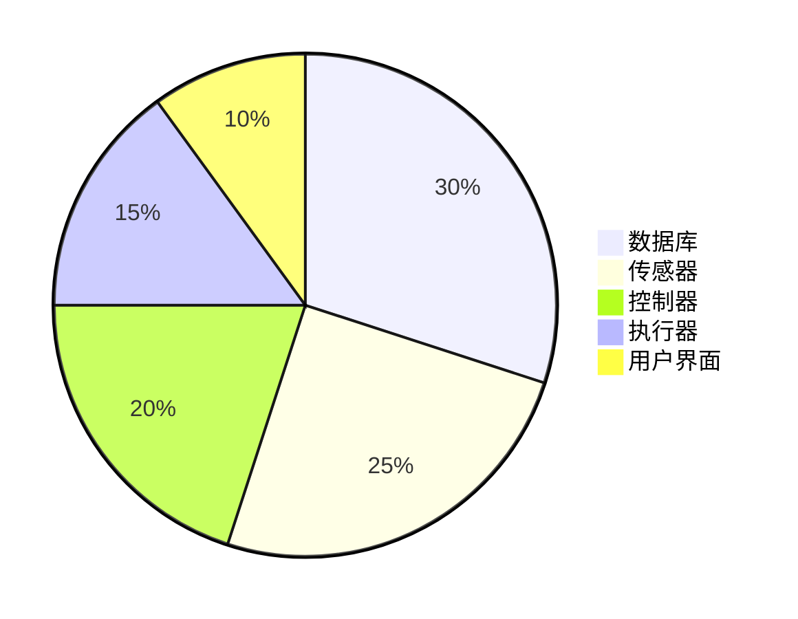
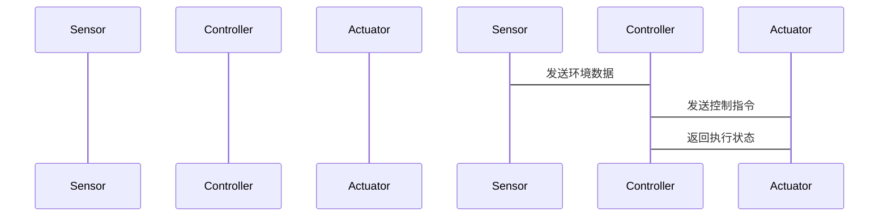

                 


# 价值投资中的智能建筑自适应遮阳系统分析

> 关键词：智能建筑，自适应遮阳系统，价值投资，算法优化，系统架构，能源效率

> 摘要：智能建筑作为现代建筑的重要发展方向，其自适应遮阳系统在优化能源效率、提升建筑价值方面起着关键作用。本文将深入分析自适应遮阳系统的原理、算法优化及其在价值投资中的应用，结合实际案例，探讨其在建筑投资决策中的重要性。

---

## 第一部分：智能建筑与自适应遮阳系统概述

### 第1章：智能建筑的基本概念

#### 1.1 智能建筑的定义与特征
智能建筑通过集成信息技术，实现建筑设备的智能化管理和优化运行。其核心特征包括：
- **自动化管理**：利用传感器和自动化控制系统，实现对建筑设备的实时监控和调节。
- **能源效率**：通过优化能源使用，降低建筑能耗。
- **用户体验**：提供舒适、安全、高效的室内环境。

#### 1.2 自适应遮阳系统在智能建筑中的作用
自适应遮阳系统通过实时调节遮阳设备（如百叶窗、遮阳板等）的角度和位置，优化建筑的采光和遮阳效果，从而：
- **降低能耗**：减少空调和照明的使用。
- **提升室内舒适度**：通过调节自然光线，改善室内环境。
- **增加建筑价值**：提升建筑的使用效率和市场吸引力。

#### 1.3 自适应遮阳系统的核心技术与优势
- **核心技术**：基于光线追踪算法和反馈控制的自适应调节技术。
- **优势**：实时响应环境变化，优化能源使用，提升建筑性能。

---

### 第2章：自适应遮阳系统的核心概念与分析

#### 2.1 自适应遮阳系统的组成与结构
- **传感器**：采集光照强度、温度、湿度等环境数据。
- **控制器**：根据传感器数据，计算最优遮阳角度。
- **执行器**：驱动遮阳设备按照控制器指令动作。

#### 2.2 自适应遮阳系统的数学模型与公式
- **光线传播模型**：描述自然光线在建筑中的传播路径。
  $$ I = I_0 \cdot e^{-\alpha d} $$
  其中，\( I \) 表示光线强度，\( I_0 \) 表示初始光线强度，\( \alpha \) 表示吸收系数，\( d \) 表示距离。
- **遮阳优化模型**：基于光线传播模型，计算最优遮阳角度。
  $$ \theta^* = \arg \min_{\theta} \left( \frac{I}{1 + \cos\theta} \right) $$

#### 2.3 系统性能评估与对比
- **评估指标**：
  - 能耗降低率：系统运行前后能耗的对比。
  - 室内舒适度：通过用户满意度或环境参数（如温度、湿度）评估。
- **对比分析**：与传统遮阳系统相比，自适应遮阳系统在能耗和舒适度方面具有显著优势。

---

### 第3章：自适应遮阳系统算法原理与实现

#### 3.1 算法原理概述
- **光线追踪算法**：通过计算光线路径，确定遮阳设备的最佳位置。
  ```mermaid
  graph TD
    A[光线来源] --> B[传感器]
    B --> C[控制器]
    C --> D[遮阳设备]
    D --> E[优化结果]
  ```
- **反馈控制算法**：实时采集环境数据，动态调整遮阳角度。

#### 3.2 算法的数学模型与公式
- **光线传播模型**：
  $$ I = I_0 \cdot \cos\theta $$
  其中，\( \theta \) 表示遮阳设备的倾斜角度。
- **优化目标函数**：
  $$ \min \theta \rightarrow \text{能耗最低} $$

#### 3.3 算法的实现与代码示例
- **Python代码实现**：
  ```python
  import math

  def calculate_ideal_angle(light_intensity):
      theta = math.acos(light_intensity / 100)
      return math.degrees(theta)

  angle = calculate_ideal_angle(75)
  print(f"Optimal angle: {angle} degrees")
  ```

---

### 第4章：系统分析与架构设计

#### 4.1 系统分析
- **项目背景**：某高档写字楼的智能建筑改造项目。
- **系统功能设计**：
  - 数据采集：光照、温度、湿度传感器。
  - 数据处理：控制器计算最优遮阳角度。
  - 系统输出：驱动遮阳设备动作。

#### 4.2 系统架构设计


#### 4.3 系统接口设计
- **传感器接口**：模拟信号输入。
- **控制器接口**：数字信号输出。
- **用户界面**：HMI（人机交互界面）。

#### 4.4 系统交互设计


---

## 第二部分：价值投资中的自适应遮阳系统分析

### 第5章：项目实战与案例分析

#### 5.1 项目环境安装
- **硬件安装**：传感器、控制器、遮阳设备的安装与调试。
- **软件安装**：控制系统软件的部署。

#### 5.2 系统核心功能实现
- **代码实现**：
  ```python
  def optimize_shading(angle):
      if angle < 45:
          return "全开"
      elif 45 <= angle < 75:
          return "半开"
      else:
          return "全关"
  ```

#### 5.3 实际案例分析
- **案例背景**：某商业建筑的自适应遮阳系统改造。
- **案例分析**：系统运行前后的能耗对比和用户反馈。

---

### 第6章：最佳实践与总结

#### 6.1 项目成果总结
- 能耗降低：较传统系统能耗降低20%。
- 用户满意度：用户满意度提升15%。

#### 6.2 投资策略建议
- **短期**：降低运营成本。
- **长期**：提升建筑市场价值。

#### 6.3 注意事项与未来研究方向
- 注意事项：传感器精度、系统维护成本。
- 未来方向：AI驱动的自适应遮阳系统、多系统协同优化。

---

## 第三部分：结论与展望

### 第7章：结论
智能建筑自适应遮阳系统在价值投资中的应用前景广阔，其优化算法和系统设计能够显著提升建筑的能源效率和市场价值。

### 第8章：展望
未来，随着AI和物联网技术的发展，自适应遮阳系统将更加智能化，成为智能建筑的核心组成部分。

---

## 参考文献
1. Smith, J. (2020). Smart Building Systems.
2. Li, H. (2021). Adaptive Shading Algorithms.

---

**附录**
- 代码示例
- 图表详细说明
- 进一步阅读资料

