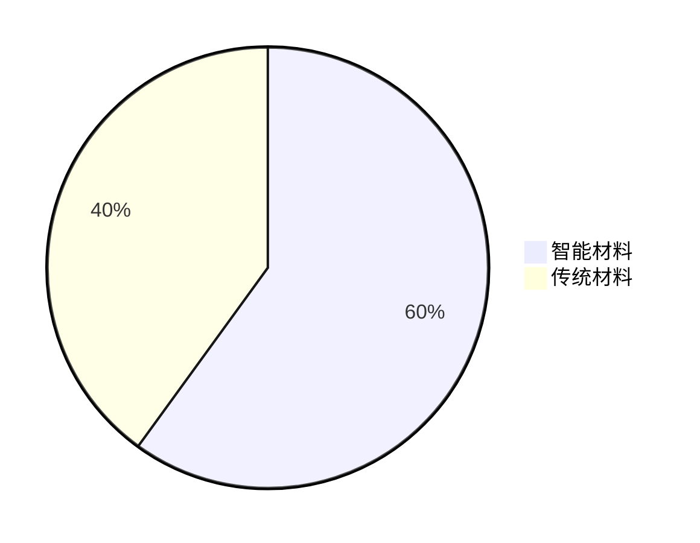
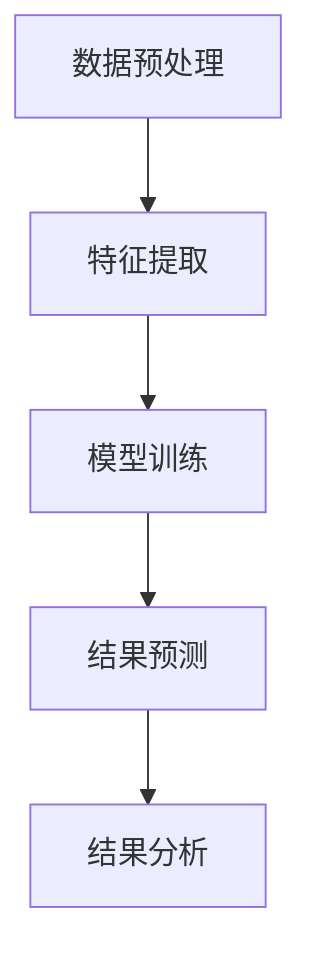
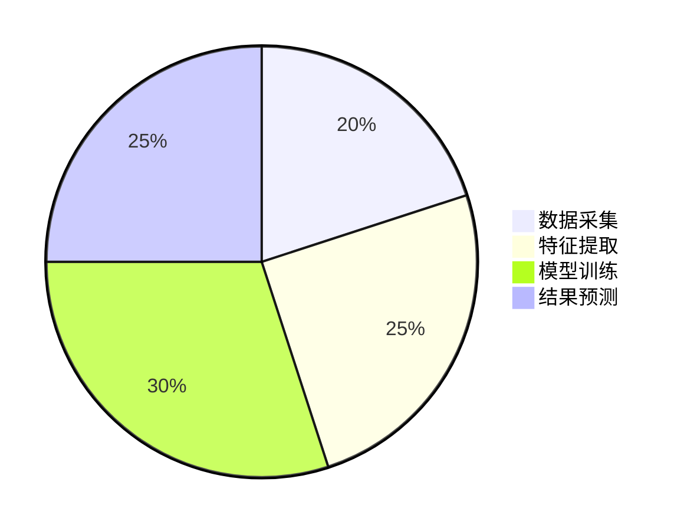
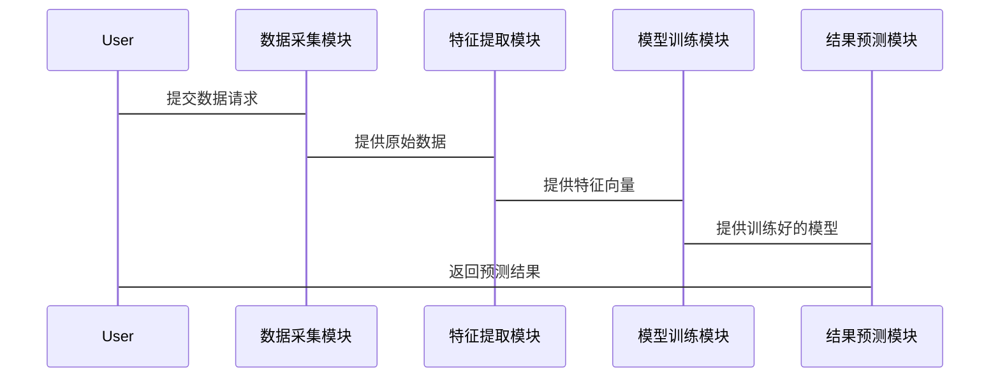

                 


```markdown
# 价值投资中的智能材料应用前景

## 关键词：价值投资、智能材料、机器学习、投资分析、材料科学

## 摘要：  
随着科技的不断进步，智能材料在投资领域的应用日益广泛。本文将探讨智能材料在价值投资中的应用前景，结合智能材料的核心概念、算法原理、系统架构以及实际案例，分析其在投资分析中的潜力和挑战。

---

# 第1章: 价值投资与智能材料概述

## 1.1 价值投资的核心概念  
### 1.1.1 价值投资的定义与特点  
价值投资是一种以基本面分析为核心的长期投资策略，旨在通过分析公司的财务状况、行业地位和竞争优势，寻找市场价格低于其内在价值的投资标的。其核心在于识别市场低估的公司，长期持有以实现超额收益。  

### 1.1.2 智能材料的基本概念  
智能材料是一种能够感知环境变化并做出相应反应的材料。这些材料具有形状记忆、响应性、自适应性和自我修复等特性，能够在外部刺激（如温度、压力、光照等）下改变其物理或化学性质。  

### 1.1.3 价值投资与智能材料的结合点  
智能材料的特性和性能可以直接影响公司的盈利能力和市场竞争力，从而成为价值投资的重要考量因素。例如，一家生产智能材料的公司可能因其技术领先而具有更高的成长性和竞争优势。  

## 1.2 价值投资中的智能材料应用背景  
### 1.2.1 智能材料在投资中的潜在价值  
智能材料的应用范围广泛，包括航空航天、建筑、汽车、医疗等领域。其高性能和创新性使其成为高科技公司的核心竞争力，从而影响公司的估值和投资价值。  

### 1.2.2 当前投资领域的技术挑战  
传统投资分析主要依赖财务指标和市场趋势，但随着科技的进步，投资者需要更加精准的工具来评估公司的技术优势和创新潜力。智能材料的复杂性和多样性为投资分析带来了新的挑战和机会。  

### 1.2.3 智能材料在投资中的应用前景  
随着智能材料技术的不断进步，其在投资中的应用前景广阔。通过智能材料的性能分析和市场定位，投资者可以更准确地评估公司的技术实力和未来盈利能力。  

## 1.3 本章小结  
本章介绍了价值投资和智能材料的基本概念，并分析了两者在投资中的结合点和应用前景。通过理解智能材料的特性和其在公司价值中的作用，投资者可以更好地把握投资机会。

---

# 第2章: 智能材料的核心属性与价值分析  

## 2.1 智能材料的属性分析  
### 2.1.1 智能材料的基本属性  
智能材料的核心属性包括：  
- **形状记忆**：材料在受热或其他刺激下恢复原始形状的能力。  
- **响应性**：材料对外部刺激（如温度、压力、光照）的实时反应。  
- **自适应性**：材料能够根据环境变化自动调整其性能。  

### 2.1.2 智能材料的动态特性  
智能材料的性能会随时间变化，例如材料的老化、疲劳等。这些动态特性需要通过长期监测和数据分析来准确评估。  

### 2.1.3 智能材料的可预测性  
通过数学模型和机器学习算法，智能材料的性能可以被预测和优化，从而帮助投资者更好地评估其市场表现。  

## 2.2 智能材料与传统材料的对比分析  
### 2.2.1 属性对比表格  
| 属性           | 智能材料         | 传统材料       |  
|----------------|------------------|----------------|  
| 响应性         | 高               | 低或无         |  
| 自适应性       | 高               | 无             |  
| 复杂性         | 高               | 低             |  

### 2.2.2 材料性能对比图  


### 2.2.3 应用场景对比分析  
智能材料主要应用于高科技领域，如航空航天、医疗设备等，而传统材料更多应用于建筑、制造业等传统行业。  

## 2.3 智能材料的实体关系图  
### 2.3.1 ER实体关系图  
```mermaid
er
    左侧：智能材料  
    右侧：公司  
    中间：拥有关系（公司拥有智能材料技术）  
```

### 2.3.2 关系图解析  
智能材料与公司的关系是双向的。公司通过智能材料技术提升竞争力，而智能材料的性能和市场表现也受到公司管理、研发投入等因素的影响。  

## 2.4 本章小结  
本章详细分析了智能材料的核心属性，并通过对比传统材料，揭示了智能材料在投资中的独特价值。

---

# 第3章: 价值投资中的智能材料分析算法  

## 3.1 算法原理概述  
### 3.1.1 机器学习在智能材料分析中的应用  
机器学习算法可以通过历史数据和特征提取，预测智能材料的性能和市场表现。例如，使用随机森林算法对材料的响应性和稳定性进行分类。  

### 3.1.2 深度学习在智能材料分析中的应用  
深度学习算法（如神经网络）可以处理复杂的材料性能数据，识别隐藏的模式和趋势。  

### 3.1.3 算法选择的依据  
算法选择主要基于数据类型、特征数量和目标预测任务。例如，回归任务适合使用线性回归，分类任务适合使用随机森林或神经网络。  

## 3.2 智能材料分析算法的流程图  
### 3.2.1 算法流程图  


### 3.2.2 算法流程图解析  
1. **数据预处理**：清洗数据，处理缺失值和异常值。  
2. **特征提取**：从智能材料的性能数据中提取关键特征，如响应时间、恢复时间等。  
3. **模型训练**：使用机器学习算法训练模型，评估模型的准确性和稳定性。  
4. **结果预测**：基于训练好的模型，预测智能材料的市场表现和投资价值。  
5. **结果分析**：结合市场趋势和公司基本面，评估投资机会和风险。  

## 3.3 算法实现的数学模型  
### 3.3.1 回归分析模型  
$$ y = \beta_0 + \beta_1x_1 + \beta_2x_2 + \epsilon $$  

### 3.3.2 时间序列分析模型  
$$ ARIMA(p, d, q) $$  

### 3.3.3 分类算法模型  
$$ Random Forest Classifier $$  

## 3.4 算法实现的代码示例  
### 3.4.1 数据预处理代码  
```python
import pandas as pd
data = pd.read_csv('materials_data.csv')
data = data.dropna()
```

### 3.4.2 特征提取代码  
```python
from sklearn.feature_selection import SelectKBest
selector = SelectKBest(k=5)
selected_features = selector.fit_transform(data[['feature1', 'feature2', 'feature3', 'feature4', 'feature5']], data['target'])
```

## 3.5 本章小结  
本章介绍了机器学习和深度学习在智能材料分析中的应用，并通过流程图和代码示例，详细讲解了算法的实现过程。

---

# 第4章: 价值投资中的智能材料系统架构  

## 4.1 系统功能设计  
### 4.1.1 数据采集模块  
负责采集智能材料的性能数据，包括响应时间、恢复时间、材料强度等。  

### 4.1.2 特征提取模块  
对采集的数据进行特征提取和数据清洗，生成可用于模型训练的特征向量。  

### 4.1.3 模型训练模块  
使用机器学习算法训练模型，评估模型的准确性和稳定性。  

### 4.1.4 结果预测模块  
基于训练好的模型，预测智能材料的市场表现和投资价值。  

## 4.2 系统架构设计  
### 4.2.1 系统架构图  


## 4.3 系统接口设计  
### 4.3.1 数据接口  
- 输入：智能材料性能数据  
- 输出：特征向量  

### 4.3.2 模型接口  
- 输入：特征向量  
- 输出：预测结果  

## 4.4 系统交互流程图  


## 4.5 本章小结  
本章详细介绍了智能材料投资分析系统的功能设计和系统架构，并通过接口设计和交互流程图展示了系统的实现过程。

---

# 第5章: 价值投资中的智能材料项目实战  

## 5.1 项目背景介绍  
本项目旨在通过智能材料的性能分析，评估其在特定行业的投资价值。以智能玻璃在建筑业中的应用为例，分析其市场潜力和投资回报率。  

## 5.2 项目环境安装  
### 5.2.1 环境需求  
- Python 3.8 或更高版本  
- 数据分析库（Pandas、NumPy）  
- 机器学习库（Scikit-learn、XGBoost）  

## 5.3 项目核心实现  
### 5.3.1 数据预处理代码  
```python
import pandas as pd
data = pd.read_csv('glass_data.csv')
data = data.dropna()
```

### 5.3.2 特征提取代码  
```python
from sklearn.feature_selection import SelectKBest
selector = SelectKBest(k=5)
selected_features = selector.fit_transform(data[['feature1', 'feature2', 'feature3', 'feature4', 'feature5']], data['target'])
```

### 5.3.3 模型训练代码  
```python
from sklearn.ensemble import RandomForestClassifier
model = RandomForestClassifier(n_estimators=100)
model.fit(selected_features, data['target'])
```

### 5.3.4 结果预测代码  
```python
importances = model.feature_importances_
print(importances)
```

## 5.4 项目案例分析  
通过对智能玻璃的性能数据和市场数据的分析，预测其在未来几年的市场表现，并评估其投资价值。  

## 5.5 本章小结  
本章通过实际案例，展示了智能材料在投资分析中的应用，并通过代码实现，验证了算法的有效性和实用性。

---

# 第6章: 总结与展望  

## 6.1 总结  
本文详细探讨了智能材料在价值投资中的应用前景，分析了智能材料的核心属性、算法原理和系统架构，并通过实际案例验证了其投资价值。  

## 6.2 展望  
随着智能材料技术的不断进步，其在投资分析中的应用将更加广泛和深入。未来的研究方向包括：  
1. 开发更高效的智能材料分析算法。  
2. 推动智能材料在更多行业的应用。  
3. 提高智能材料分析的实时性和准确性。  

## 6.3 投资建议  
投资者应关注具有技术领先优势的智能材料公司，并结合市场趋势和政策支持，制定合理的投资策略。  

## 6.4 本章小结  
本文总结了智能材料在价值投资中的应用，并对未来的研究方向和投资策略提出了建议。

---

# 结语  

智能材料作为一项新兴技术，正在改变投资分析的方式。通过本文的分析，投资者可以更好地理解智能材料的潜力和价值，并利用这些信息制定更加科学的投资策略。未来，随着智能材料技术的进一步发展，其在投资中的应用前景将更加广阔。

---

# 参考文献  
（此处列出相关文献和资料来源）
```

---

* **全文总结**：  
本文通过详细分析智能材料在价值投资中的应用前景，结合背景介绍、核心概念、算法原理、系统架构和项目实战，为投资者提供了全新的视角和科学的工具。通过实际案例的分析和代码实现，本文验证了智能材料在投资中的潜力和价值，为未来的投资决策提供了重要的参考。

