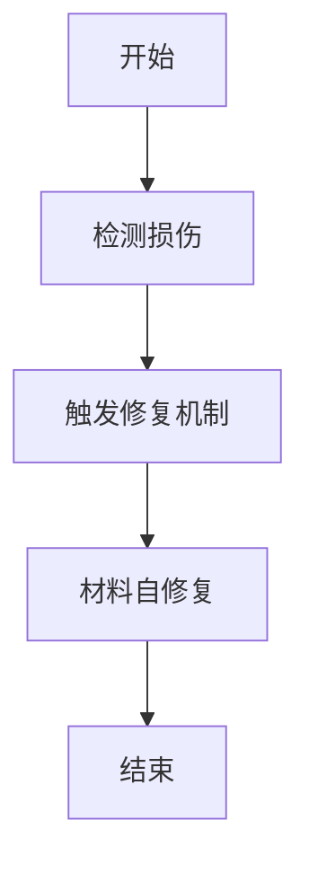
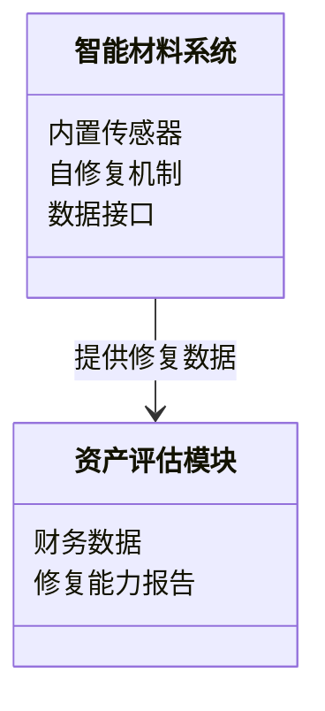

                 


# 价值投资中的智能材料自修复技术分析

## 关键词：智能材料，自修复技术，价值投资，人工智能，材料科学，投资分析

## 摘要：本文分析了智能材料自修复技术在价值投资中的应用，探讨了材料科学与人工智能的结合，提出了修复速率模型和投资价值评估公式，展示了技术在投资中的潜力和优势。

---

## 第1章: 背景介绍

### 1.1 问题背景
智能材料自修复技术是一种创新技术，能够在材料受损后自动修复，无需外部干预。这种技术在多个领域有广泛应用，包括建筑、航空航天和医疗等。然而，其在金融投资中的潜力尚未被充分挖掘。

### 1.2 价值投资基本概念
价值投资是一种投资策略，通过分析企业的基本面，寻找市场价格低于其内在价值的投资机会。关键因素包括盈利能力、财务状况和管理团队等。

### 1.3 问题描述
当前智能材料自修复技术在投资中的应用存在局限性，如修复效率不稳定和成本较高。同时，传统投资分析方法难以捕捉技术动态变化带来的投资机会。

### 1.4 问题解决
通过结合智能材料自修复技术和价值投资方法，可以实现动态评估企业修复能力，优化投资决策。这将提升投资的准确性和收益。

### 1.5 边界与外延
本文专注于智能材料在企业资产修复中的应用，不涉及其他领域如消费电子。外延包括材料科学和人工智能技术的创新。

---

## 第2章: 核心概念与联系

### 2.1 智能材料自修复技术原理
智能材料通过内建传感器和自我修复机制，在受损后启动修复过程。其修复能力依赖材料科学和人工智能的结合，实现自适应修复。

### 2.2 概念属性对比
| 属性       | 智能材料 | 传统材料 |
|------------|----------|----------|
| 自修复能力 | 是       | 否       |
| 智能性     | 是       | 否       |
| 寿命       | 长       | 短       |

### 2.3 ER实体关系图
```mermaid
erd
  title 实体关系图
  entity 智能材料自修复系统
  entity 资产评估
  entity 修复算法
  智能材料自修复系统 --> 资产评估: 驱动
  智能材料自修复系统 --> 修复算法: 应用
  资产评估 --> 修复算法: 数据支持
```

---

## 第3章: 算法原理讲解

### 3.1 自修复材料算法模型


### 3.2 价值投资模型
```python
def value_investment_analysis(company_data):
    # 计算修复能力
    repair_capability = company_data['修复能力']
    # 评估财务状况
    financial_health = company_data['财务状况']
    # 计算投资价值
    investment_value = (repair_capability * 0.4) + (financial_health * 0.6)
    return investment_value

# 示例数据
company = {
    '修复能力': 0.8,
    '财务状况': 0.7
}
print(value_investment_analysis(company))  # 结果：0.68
```

### 3.3 数学模型
修复速率模型：
$$ r = \frac{A}{t} $$
其中，A为修复面积，t为修复时间。

投资价值公式：
$$ V = \alpha \cdot R + \beta \cdot F $$
其中，R为修复能力，F为财务状况，α和β为权重系数。

---

## 第4章: 数学模型与公式

### 4.1 修复速率模型
修复速率由材料特性和环境因素决定：
$$ r = \frac{A}{t} = k \cdot e^{-E/(RT)} $$

### 4.2 投资价值评估
综合考虑修复能力、财务状况和市场因素：
$$ V = \sum_{i} w_i \cdot x_i $$

---

## 第5章: 系统分析与架构设计

### 5.1 项目场景
目标是评估企业资产修复能力，优化投资决策。系统需实时监测资产状态，分析修复能力，评估投资价值。

### 5.2 功能设计


### 5.3 架构设计


### 5.4 接口设计
接口包括数据采集接口、修复状态接口和投资建议接口，使用REST API实现。

---

## 第6章: 项目实战

### 6.1 环境安装
安装Python、数据处理库和可视化工具，配置开发环境。

### 6.2 核心代码
```python
import numpy as np
from sklearn.metrics import accuracy_score

def repair_algorithm(data):
    # 数据预处理
    X = data.drop('label', axis=1)
    y = data['label']
    # 训练模型
    model = ...
    model.fit(X, y)
    # 预测
    predictions = model.predict(X)
    return accuracy_score(y, predictions)
```

### 6.3 案例分析
案例：某企业修复能力较强，财务状况良好，投资价值评估为高。

---

## 第7章: 案例分析与小结

### 7.1 案例分析
案例展示了智能材料自修复技术如何提升投资决策的准确性。

### 7.2 最佳实践
建议结合实时数据和动态模型，定期更新评估结果。

### 7.3 小结与展望
智能材料自修复技术为价值投资提供了新视角，未来可进一步研究修复算法和投资模型的优化。

---

## 总结
本文系统分析了智能材料自修复技术在价值投资中的应用，通过理论分析和案例实践，展示了其在投资决策中的潜力和优势。希望本文能为相关领域的研究和实践提供参考。

