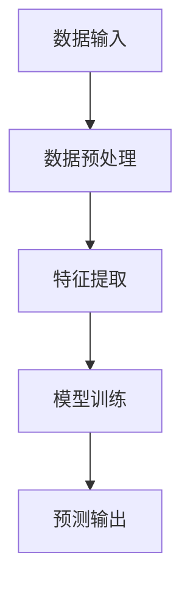
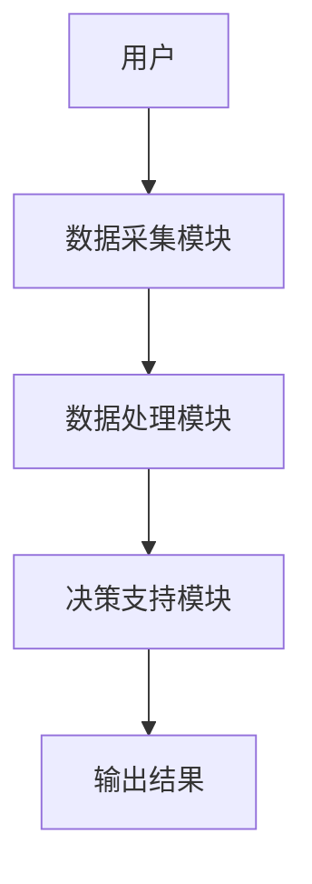
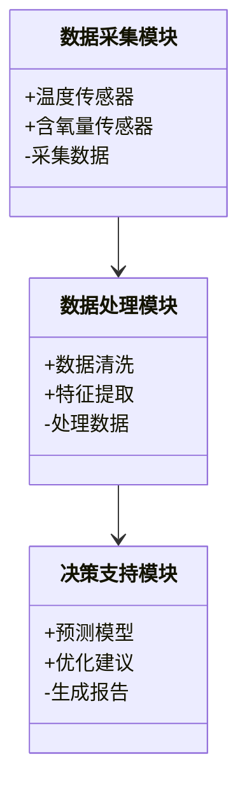
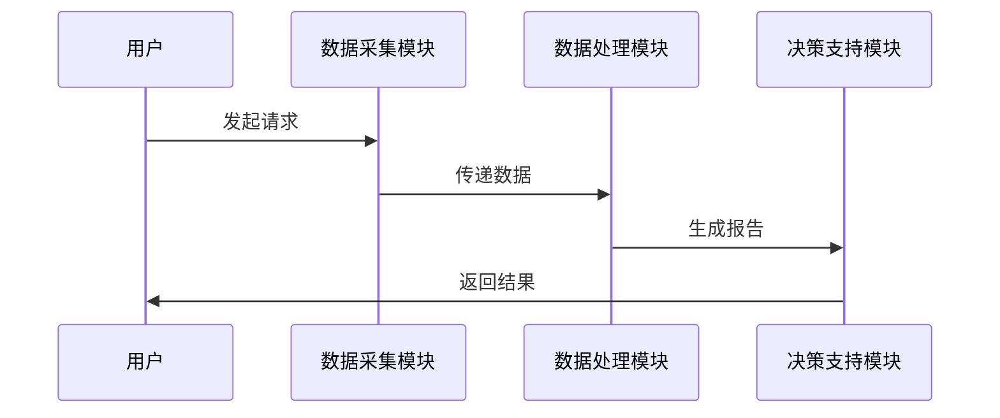

                 


# 价值投资中的智能海洋养殖系统分析

## 关键词
价值投资、智能海洋养殖系统、数据分析、人工智能、投资策略、系统架构、养殖优化

## 摘要
随着全球对可持续食品生产的需求增加，智能海洋养殖系统成为价值投资的新热点。本文分析了智能技术在海洋养殖中的应用，探讨了如何通过价值投资优化养殖系统，提升投资回报。文章从背景、核心概念、算法、系统架构到项目实战，详细阐述了智能海洋养殖系统的各个层面，并提出了实际投资建议。

---

# 第1章 价值投资与智能海洋养殖系统概述

## 1.1 价值投资的基本概念
### 1.1.1 价值投资的定义与核心理念
价值投资是一种投资策略，通过分析资产的内在价值，寻找市场低估的投资机会。其核心理念是购买低于其内在价值的资产，长期持有，等待市场重新评估。

### 1.1.2 价值投资在现代金融中的地位
价值投资是金融学的重要组成部分，尤其在股票市场中广泛应用，强调基本面分析和长期投资。

### 1.1.3 价值投资与传统投资方式的对比
| 投资方式 | 价值投资 | 传统投机 |
|----------|-----------|-----------|
| 标的 | 公司内在价值 | 市场波动 |
| 方法 | 基本面分析 | 技术分析 |
| 时间 | 长期 | 短期 |

---

## 1.2 智能海洋养殖系统的定义与特点
### 1.2.1 海洋养殖的基本概念
海洋养殖指在海洋或类似环境中，通过人工干预，培育和收获水生生物的活动。

### 1.2.2 智能化养殖的定义与技术特征
智能海洋养殖系统利用物联网、人工智能和大数据技术，实现养殖环境的实时监测和优化管理。

### 1.2.3 智能海洋养殖系统的应用场景
- **环境监控**：实时监测水质、温度、光照等参数。
- **智能决策**：基于数据优化饲料投喂、病害防治等。
- **预测分析**：预测产量波动，优化供应链。

---

## 1.3 价值投资与智能海洋养殖系统的结合
### 1.3.1 价值投资在海洋养殖中的应用背景
传统海洋养殖业面临效率低下、资源浪费和环境污染等问题，价值投资可以发现具有潜力的企业。

### 1.3.2 智能化技术对海洋养殖的影响
智能化技术提升了养殖效率和产品质量，降低了成本和风险。

### 1.3.3 价值投资与智能养殖系统的相互作用
通过智能系统分析数据，价值投资者能更准确地评估养殖企业的内在价值。

---

## 1.4 本章小结
本章介绍了价值投资和智能海洋养殖系统的定义、特点及结合方式，为后续分析奠定了基础。

---

# 第2章 智能海洋养殖系统的背景与现状

## 2.1 海洋养殖业的发展历程
### 2.1.1 海洋养殖的历史演变
从传统的粗放式养殖到现代的智能化养殖，海洋养殖业经历了技术革新。

### 2.1.2 当前海洋养殖业的规模与特点
全球海洋养殖业规模庞大，但效率和可持续性仍需提升。

---

## 2.2 智能化技术在海洋养殖中的应用现状
### 2.2.1 数据采集与分析技术
利用传感器和大数据分析，实时监控养殖环境。

### 2.2.2 自动化养殖设备的应用
自动化设备如自动投喂系统和环境调控设备提升了养殖效率。

### 2.2.3 智能决策系统的现状
基于机器学习的预测模型帮助养殖户优化决策。

---

## 2.3 价值投资在海洋养殖中的应用现状
### 2.3.1 传统价值投资的局限性
传统方法难以准确评估智能化养殖企业的价值。

### 2.3.2 智能化技术对价值投资的影响
技术进步提供了更准确的数据支持，使价值评估更加科学。

### 2.3.3 当前价值投资与智能养殖结合的案例
部分企业已开始利用智能系统优化养殖流程，提升投资回报。

---

## 2.4 本章小结
本章分析了智能技术在海洋养殖中的应用现状及其对价值投资的影响，指出现有案例的成功经验。

---

# 第3章 价值投资中的智能海洋养殖系统分析框架

## 3.1 智能海洋养殖系统的分析维度
### 3.1.1 系统的经济价值分析
评估养殖系统的成本效益和盈利能力。

### 3.1.2 系统的技术可行性分析
分析系统的技术成熟度和可扩展性。

### 3.1.3 系统的市场竞争力分析
考察市场需求和竞争环境。

---

## 3.2 价值投资中的关键指标分析
### 3.2.1 海洋养殖的成本结构分析
包括设备、人力、饲料等成本。

### 3.2.2 系统的收益预测模型
基于历史数据建立收益预测模型。

### 3.2.3 系统的风险评估指标
如市场风险、技术风险等。

---

## 3.3 智能海洋养殖系统的优化策略
### 3.3.1 技术创新对系统优化的影响
推动技术创新以降低运营成本。

### 3.3.2 市场需求对系统优化的驱动
根据市场需求调整养殖规模和品种。

### 3.3.3 系统的成本控制策略
优化资源配置，降低不必要的开支。

---

## 3.4 本章小结
本章构建了分析框架，为价值投资者提供了系统化的分析工具。

---

# 第4章 智能海洋养殖系统的算法原理与实现

## 4.1 数据采集与预处理
### 4.1.1 数据采集的实现方式
使用传感器实时采集水质、温度等数据。

### 4.1.2 数据清洗与特征提取
去除噪声数据，提取关键特征。

### 4.1.3 数据存储与管理
使用数据库或云平台存储数据。

---

## 4.2 算法实现
### 4.2.1 算法选择
使用线性回归或随机森林模型进行预测。

### 4.2.2 算法流程


### 4.2.3 Python代码实现
```python
import pandas as pd
from sklearn.model import LinearRegression

# 数据加载与预处理
data = pd.read_csv('aquaculture.csv')
X = data[['温度', '含氧量']]
y = data['产量']

# 模型训练
model = LinearRegression()
model.fit(X, y)

# 预测
预测值 = model.predict(X)
```

### 4.2.4 数学公式
模型的预测公式：
$$ y = \beta_0 + \beta_1 x_1 + \beta_2 x_2 + \epsilon $$

---

## 4.3 算法优化
### 4.3.1 参数调整
优化模型参数以提高预测精度。

### 4.3.2 模型评估
使用均方误差（MSE）和R²评分评估模型性能。

---

## 4.4 本章小结
本章详细介绍了智能海洋养殖系统中的算法实现，展示了如何通过数据驱动优化投资决策。

---

# 第5章 智能海洋养殖系统的系统架构与设计

## 5.1 系统功能设计
### 5.1.1 数据采集模块
负责收集养殖环境数据。

### 5.1.2 数据处理模块
对数据进行清洗和分析。

### 5.1.3 决策支持模块
提供投资建议和优化方案。

---

## 5.2 系统架构设计


### 5.2.1 系统架构图


---

## 5.3 系统接口设计
### 5.3.1 API接口
提供RESTful API供其他系统调用。

### 5.3.2 数据交互流程


---

## 5.4 本章小结
本章从系统架构的角度，详细设计了智能海洋养殖系统的功能模块和交互流程。

---

# 第6章 价值投资中的智能海洋养殖系统项目实战

## 6.1 环境安装与配置
### 6.1.1 安装Python和相关库
安装Python、Pandas、Scikit-learn等工具。

### 6.1.2 数据库搭建
使用MySQL或MongoDB存储数据。

---

## 6.2 系统核心实现
### 6.2.1 数据采集模块实现
编写代码采集水质数据。

```python
import serial
import time

ser = serial.Serial('COM3', 9600)
while True:
    data = ser.readline().decode()
    print(data)
    time.sleep(1)
```

### 6.2.2 数据分析模块实现
使用机器学习模型进行预测。

```python
from sklearn.linear_model import LinearRegression
import numpy as np

X = np.array([[20, 5], [22, 6], [21, 5.5]])
y = np.array([100, 120, 110])

model = LinearRegression()
model.fit(X, y)

预测值 = model.predict([[21, 5]])
print(预测值)
```

---

## 6.3 项目案例分析
### 6.3.1 案例背景
某海洋养殖企业引入智能系统后，产量提升了20%。

### 6.3.2 实际应用分析
通过数据分析，发现温度和含氧量是影响产量的主要因素。

---

## 6.4 本章小结
本章通过实际项目展示了智能海洋养殖系统的实现过程，验证了其在价值投资中的应用价值。

---

# 第7章 总结与展望

## 7.1 总结
智能海洋养殖系统为价值投资提供了新的机会，通过技术手段优化养殖流程，提升了投资回报。

## 7.2 展望
未来，随着人工智能和大数据技术的发展，智能海洋养殖系统将更加智能化和高效化。

---

## 7.3 投资建议
- 选择技术领先的企业进行投资。
- 关注政策支持和市场需求。
- 长期持有优质资产，耐心等待价值回归。

---

## 7.4 本章小结
本章总结了文章的主要内容，并展望了智能海洋养殖系统的未来发展方向。

---

## 最佳实践 tips
- 在进行价值投资时，要综合考虑企业的技术实力、市场前景和管理团队。
- 定期跟踪养殖系统的运行数据，及时调整投资策略。

---

通过以上章节的详细分析，本文为价值投资者提供了智能海洋养殖系统的分析框架和实践指导，帮助投资者在新兴领域中把握投资机会。

