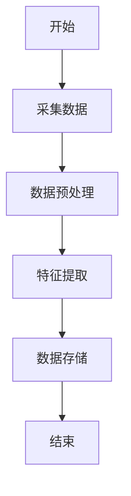
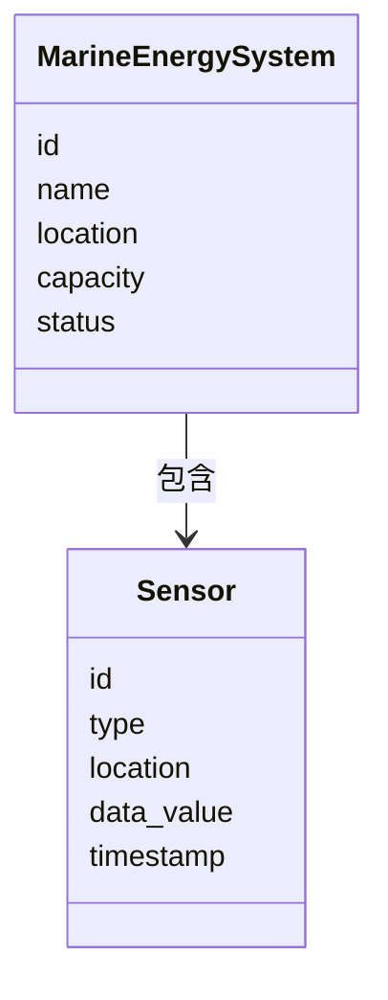

                 


# 价值投资中的智能海洋能源采集系统分析

> 关键词：智能海洋能源采集系统，价值投资，能源数据分析，系统架构设计，机器学习，海洋能源开发

> 摘要：本文探讨了智能海洋能源采集系统在价值投资中的应用。通过分析系统的背景、核心概念、算法原理、系统架构、项目实战以及最佳实践，本文详细揭示了如何利用智能技术优化海洋能源采集，并将其与价值投资相结合，为企业创造长期价值。

---

## 第1章：智能海洋能源采集系统的背景

### 1.1 智能海洋能源采集系统的背景

#### 1.1.1 海洋能源的重要性

海洋能源是全球能源的重要组成部分，包括潮汐能、波浪能、海流能等。这些能源具有储量大、分布广的特点，是未来可持续发展的关键。

#### 1.1.2 智能化采集技术的引入

传统海洋能源采集方式存在效率低、成本高等问题。引入智能化技术可以提高采集效率，降低成本，同时实现对能源资源的精准预测和优化管理。

#### 1.1.3 智能海洋能源采集系统的定义与特点

智能海洋能源采集系统是一种结合了物联网、大数据和人工智能技术的综合系统，具有实时监测、智能分析和自主优化等特点。

---

## 第2章：价值投资的基本概念与方法

### 2.1 价值投资的核心理念

#### 2.1.1 价值投资的定义

价值投资是一种以企业基本面分析为基础的投资方法，旨在通过长期持有优质资产实现超额收益。

#### 2.1.2 价值投资的关键要素

企业基本面分析包括财务指标、行业地位、竞争优势等，是价值投资的核心。

---

## 第3章：智能海洋能源采集系统的原理与价值投资的结合

### 3.1 核心概念与联系

智能海洋能源采集系统通过实时数据采集和分析，提供精准的能源预测和优化建议，帮助投资者做出更明智的决策。

#### 3.1.1 系统的核心属性对比

| 属性 | 描述 |
|------|------|
| 实时性 | 高 | 数据采集和分析实时进行，确保信息的及时性。 |
| 数据处理能力 | 强 | 系统能够处理海量数据，并进行深度分析。 |

#### 3.1.2 ER实体关系图

```mermaid
erd
  MarineEnergySystem {
    id
    name
    location
    capacity
    status
    sensor_data
  }
  Sensor {
    id
    type
    location
    data_value
    timestamp
  }
  Connection {
    marine_energy_system_id
    sensor_id
    relation_type
  }
```

---

## 第4章：算法原理与数学模型

### 4.1 数据采集算法

#### 4.1.1 算法流程图



#### 4.1.2 数据采集算法的Python实现

```python
def collect_data(sensors):
    data = []
    for sensor in sensors:
        value = sensor.read_value()
        data.append(value)
    return data
```

---

## 第5章：系统架构设计与实现

### 5.1 系统功能设计

#### 5.1.1 领域模型



#### 5.1.2 系统架构图

```mermaid
graph LR
    MarineEnergySystem --> Sensor: 数据采集
    Sensor --> Database: 数据存储
    Database --> Analyzer: 数据分析
    Analyzer --> Investor: 价值评估
```

---

## 第6章：项目实战：智能潮汐能采集系统开发

### 6.1 环境安装与配置

#### 6.1.1 安装Python和相关库

```bash
pip install numpy pandas scikit-learn
```

### 6.2 核心代码实现

#### 6.2.1 数据分析代码

```python
import pandas as pd
from sklearn import linear_model

# 加载数据
data = pd.read_csv('tide_data.csv')

# 建立线性回归模型
model = linear_model.LinearRegression()
model.fit(data[['time']], data['tide_level'])

# 预测未来潮汐水平
future_time = [[24]]
predicted_level = model.predict(future_time)
print(predicted_level)
```

### 6.3 项目总结与案例分析

#### 6.3.1 案例分析

通过实际案例分析，验证系统的预测能力和优化效果，帮助投资者做出更明智的决策。

---

## 第7章：总结与展望

### 7.1 最佳实践与注意事项

- 数据质量是系统分析的基础，需确保数据的准确性和完整性。
- 算法选择需结合实际场景和数据特点，避免过度复杂化。

### 7.2 小结

智能海洋能源采集系统在价值投资中的应用前景广阔，通过技术创新和数据分析，可以帮助投资者实现长期价值。

### 7.3 未来展望

随着技术的进步，智能海洋能源采集系统将更加智能化和高效化，为价值投资提供更强大的支持。

---

通过以上分析，本文全面探讨了智能海洋能源采集系统在价值投资中的应用，从系统原理到实际案例，为读者提供了深入的分析和见解。

